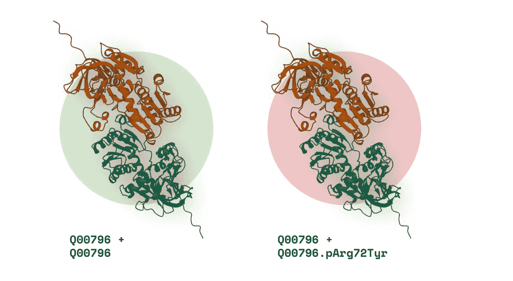
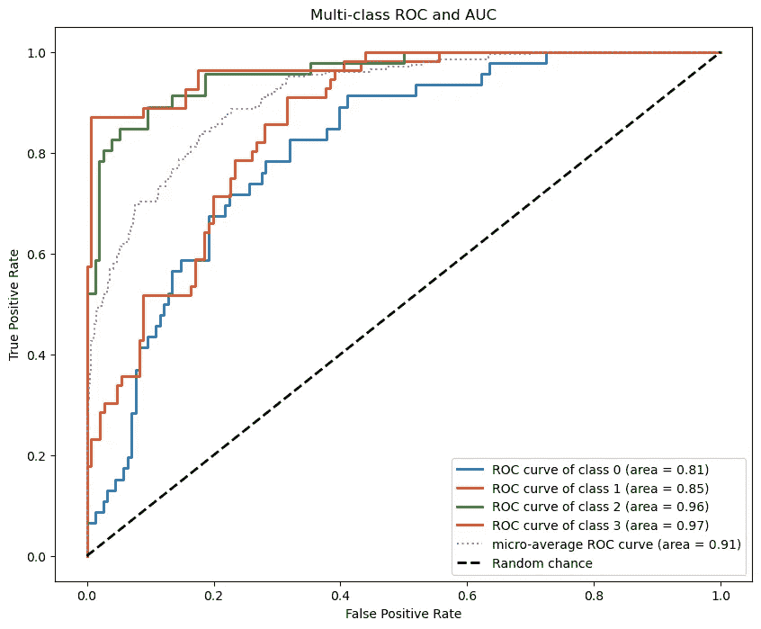

# 我是如何使用 AlphaFold 预测突变对蛋白质相互作用的影响

> 原文：[`towardsdatascience.com/protein-interactions-alphafold-04eeb8f56d79?source=collection_archive---------5-----------------------#2024-05-07`](https://towardsdatascience.com/protein-interactions-alphafold-04eeb8f56d79?source=collection_archive---------5-----------------------#2024-05-07)

## 使用 AlphaFold-Multimer、XGBoost 和 47,000 个 SLURM 任务，预测 PPI 结果，AUC 达到 91%

 [Murto Hilali](https://murto.medium.com/?source=post_page---byline--04eeb8f56d79--------------------------------)

·发表于[Towards Data Science](https://towardsdatascience.com/?source=post_page---byline--04eeb8f56d79--------------------------------) ·阅读时间：21 分钟·2024 年 5 月 7 日

--

作者提供

人类相互作用网络（所有蛋白质-蛋白质相互作用）的数量可能高达[60 万个相互作用](https://genomemedicine.biomedcentral.com/articles/10.1186/gm441)。

由于存在大量可能的蛋白质-蛋白质相互作用（PPI），预测致病突变如何影响相互作用网络看似是一项艰巨任务——但并不像你想象的那么不可能。

（尤其是当你给予滑铁卢大学的联合培养学生免费访问强大 GPU 集群的权限、世界级的导师指导，以及自由选择任何方法时）。

使用机器学习框架 XGBoost、前沿深度学习软件 AlphaFold-Multimer（AF-M）以及超过 47,000 个 SLURM 任务，**我构建了一个多分类器模型，能够预测错义突变对 PPI 的影响，AUC 达到了 91%。**

多分类 ROC 曲线和 AUC（作者提供）

在本文中，我将详细介绍：

+   **背景介绍：**研究问题及我们选择它的原因。

+   **数据采集与处理：**我们是如何以及为什么…
