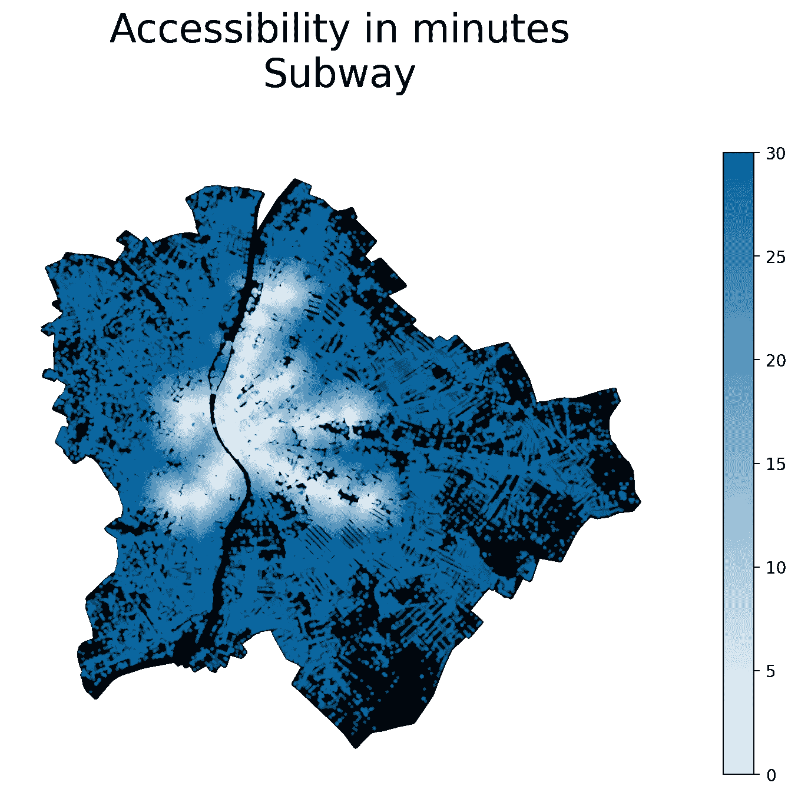

# Python 中的公共交通可达性

> 原文：[`towardsdatascience.com/public-transport-accessibility-in-python-dbdeee99f36f?source=collection_archive---------4-----------------------#2024-04-27`](https://towardsdatascience.com/public-transport-accessibility-in-python-dbdeee99f36f?source=collection_archive---------4-----------------------#2024-04-27)

## 在这篇文章中，我通过使用 GTFS 数据和基于 Python 的空间分析库，探讨了公共交通的可用性。

 [米兰·贾诺索夫](https://medium.com/@janosovm?source=post_page---byline--dbdeee99f36f--------------------------------)

·发布于[Towards Data Science](https://towardsdatascience.com/?source=post_page---byline--dbdeee99f36f--------------------------------) ·阅读时间：10 分钟·2024 年 4 月 27 日

--

可达的公共交通对任何宜居社区至关重要，应成为地方政府和城市规划者的重点。在本文中，我以布达佩斯为例，利用其公开的 GTFS（通用交通信息规范）数据，并链接到我之前在《Towards Data Science》上发布的各种教程工具，例如使用 GTFS 数据量化交通模式和城市可达性——如何及时到达除颤器。具体来说，在本教程中，我将基于步行到达城市中每个位置最近停靠点所需的时间，研究不同类型公共交通工具的可达性，例如地铁和电车。

在今天的城市规划中，使用这种精细化、数据驱动的分析方法对于确保公共交通的平等性和可达性，以及规划未来的绿色公共交通生态系统至关重要。

# 1\. 数据

对于本文，我从[Transitfeeds.com](https://transitfeeds.com/p/bkk/42)下载了公共交通数据，这是一个涵盖布达佩斯市的公共交通数据在线聚合网站…
