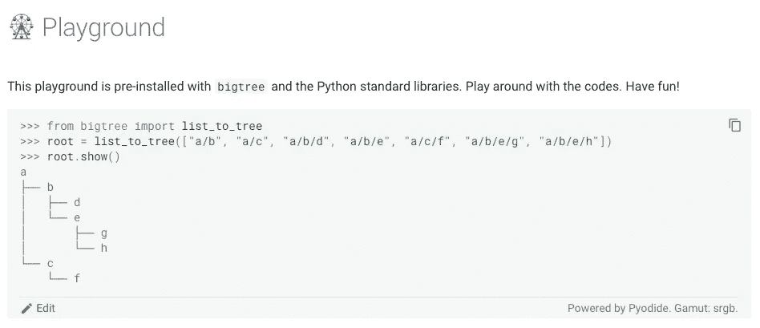

# MkDocs 中的 Python 代码游乐场

> 原文：[`towardsdatascience.com/python-code-playground-in-mkdocs-cc05eddceb63?source=collection_archive---------3-----------------------#2024-08-02`](https://towardsdatascience.com/python-code-playground-in-mkdocs-cc05eddceb63?source=collection_archive---------3-----------------------#2024-08-02)

## 让文档“活”起来

 [Kay Jan Wong](https://kayjanwong.medium.com/?source=post_page---byline--cc05eddceb63--------------------------------)

·发表于[数据科学之路](https://towardsdatascience.com/?source=post_page---byline--cc05eddceb63--------------------------------) ·阅读时间：5 分钟·2024 年 8 月 2 日

--

图 1：MkDocs 中的 Python 代码游乐场，见[我的文档](https://bigtree.readthedocs.io/en/stable/playground/) — 图片由作者提供

受实时编码游乐场的启发，在这些游乐场中，用户可以直接在网站上编写代码，而无需下载编程语言或软件。那么，如果能在 MkDocs 文档中实现，并且让你的 Python 包处于一种“*即插即用*”模式，岂不是非常酷吗？

> 文档至少应包括用户指南和技术指南，同时附带术语表和发布说明。但是，**文档如果能够让读者直接与代码互动**，就能真正“活”起来！

在浏览了大量信息后，我意识到，使用 JavaScript 搭建代码游乐场要容易得多，而我的 MkDocs 文档以及整个代码库都是用 Python 编写的。经过一番搜寻，我找到[这个论坛](https://github.com/squidfunk/mkdocs-material/discussions/3563)，它提供了我所需要的内容，但游乐场的实现与另一个 Python 包紧密耦合。我决定将其改造成一个**通用解决方案**，并将**逐步**详细讲解所需的内容以及可以调整的地方，帮助你完成适配。

> 注意：以下是[游乐场](https://bigtree.readthedocs.io/en/stable/playground/)和我的[代码库](https://github.com/kayjan/bigtree)的链接。更多有用的链接可以在本文最后的“相关链接”部分找到。

# 解决方案概述
