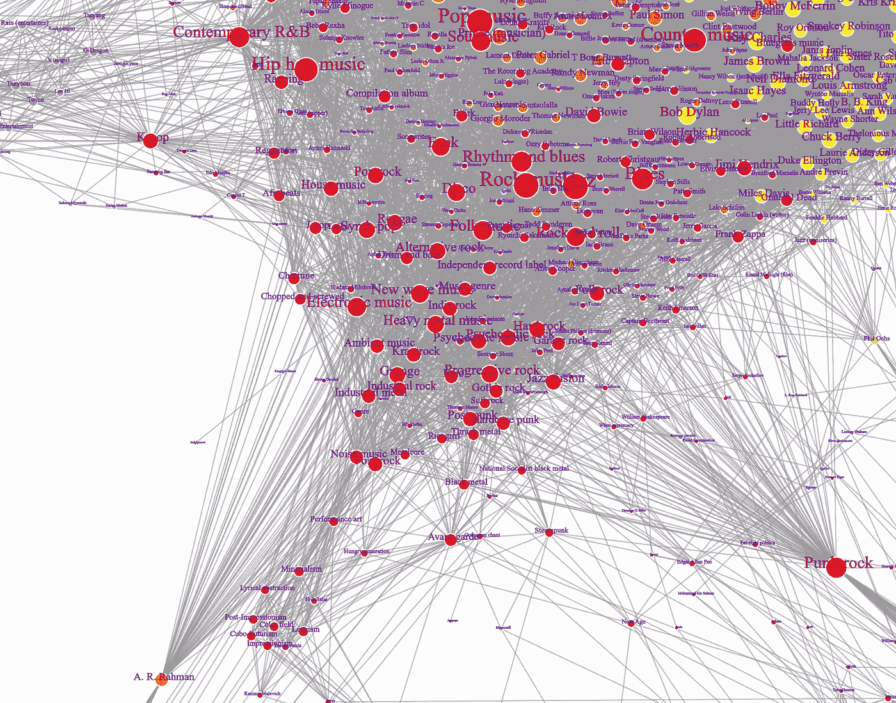

# Python 数据分析：我们了解现代艺术家的哪些信息？

> 原文：[`towardsdatascience.com/python-data-analysis-what-do-we-know-about-modern-artists-40f8a66f7235?source=collection_archive---------8-----------------------#2024-06-08`](https://towardsdatascience.com/python-data-analysis-what-do-we-know-about-modern-artists-40f8a66f7235?source=collection_archive---------8-----------------------#2024-06-08)

## 在媒体环境中利用维基百科、Python 和 NetworkX 寻找模式

 [Dmitrii Eliuseev](https://dmitryelj.medium.com/?source=post_page---byline--40f8a66f7235--------------------------------)

·发表于 [Towards Data Science](https://towardsdatascience.com/?source=post_page---byline--40f8a66f7235--------------------------------) ·13 分钟阅读·2024 年 6 月 8 日

--

图表可视化，图片来自作者

对于流行和当代文化，可能存在不同的看法；它不仅是日常生活的重要组成部分，也是一个数十亿美元的产业。成千上万的艺术家在不同的流派中创作新的作品——我们能在其中发现有趣的模式吗？确实可以，在本文中，我将展示如何提取、分析和可视化维基百科数据。

为什么选择维基百科？原因有几个。首先，它是一个开源的百科全书，得到了许多人的支持，艺术家越有影响力，越有可能有详细的关于他的文章。其次，几乎每个维基百科页面都有指向其他页面的超链接；这使得我们可以追踪一些肉眼难以发现的模式。例如，我们可以看到一群艺术家在特定的流派中表演，甚至创作关于某个特定主题的歌曲。

## 方法论

为了进行分析，我将实施几个步骤：

+   数据收集。我将使用一个开源的 [Wikipedia](https://github.com/goldsmith/Wikipedia) 库来完成这项工作。数据将保存为 [NetworkX](https://github.com/networkx/networkx) 图，其中每个节点代表一个维基百科页面，每条边...
