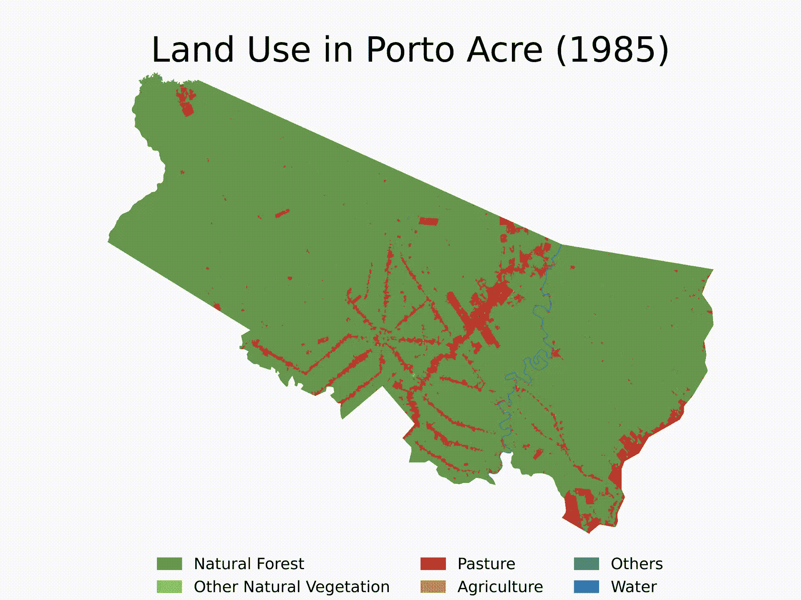
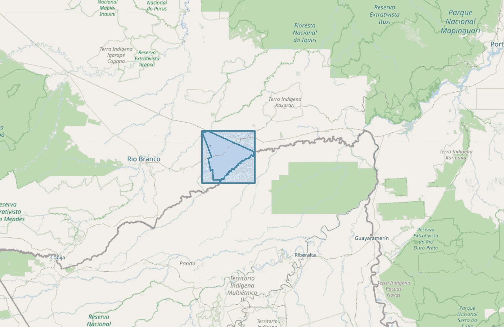
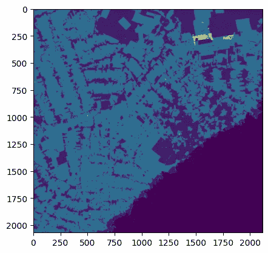
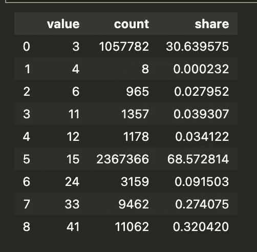
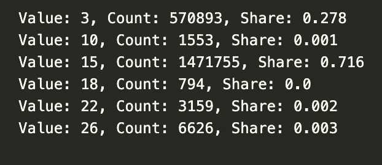
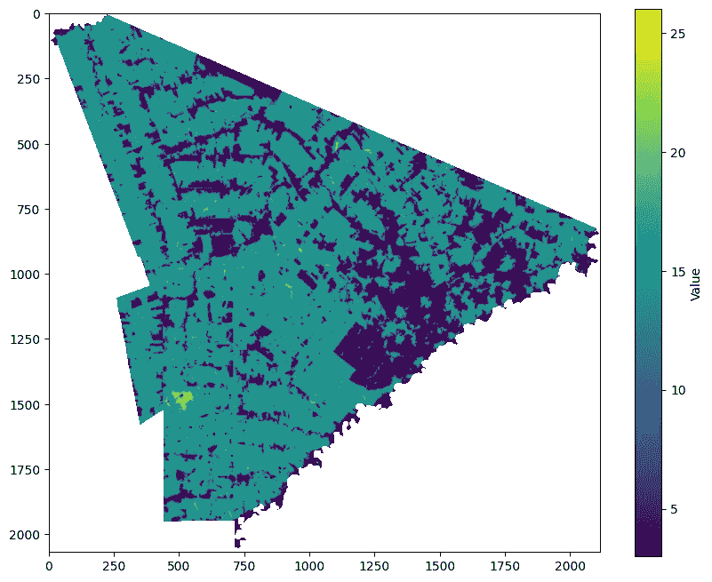
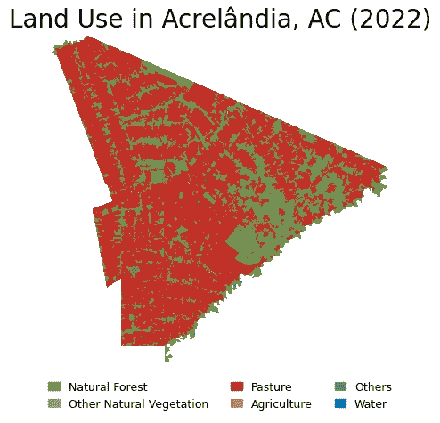

# Python + Google Earth Engine

> 原文：[`towardsdatascience.com/python-google-earth-engine-how-to-clean-mapbiomas-lulc-rasters-for-any-shapefile-in-brazil-05d13dcf2307?source=collection_archive---------6-----------------------#2024-07-10`](https://towardsdatascience.com/python-google-earth-engine-how-to-clean-mapbiomas-lulc-rasters-for-any-shapefile-in-brazil-05d13dcf2307?source=collection_archive---------6-----------------------#2024-07-10)

## 如何清理巴西任何形状文件的 MapBiomas LULC 光栅图像

[](https://medium.com/@HecVini?source=post_page---byline--05d13dcf2307--------------------------------)[](https://towardsdatascience.com/?source=post_page---byline--05d13dcf2307--------------------------------) [Vinícius Hector](https://medium.com/@HecVini?source=post_page---byline--05d13dcf2307--------------------------------)

·发布于 [Towards Data Science](https://towardsdatascience.com/?source=post_page---byline--05d13dcf2307--------------------------------) ·阅读时长 21 分钟·2024 年 7 月 10 日

--



图 1：巴西阿克里州波尔图阿克里市的土地利用与土地覆盖（1985–2022）。自制，使用 MapBiomas LULC 集合 8。

如果你曾经处理过巴西的土地利用数据，你一定接触过**MapBiomas**²。它们的遥感团队开发了一种 [算法](https://brasil.mapbiomas.org/en/visao-geral-da-metodologia/) 用于对巴西各地每个 30m x 30m 的地块进行土地利用分类（现在也涵盖了南美洲和印尼的大片地区）。九年后，他们提供了多种产品，包括 MapBiomas LCLU（我们将在这里探讨的）、MapBiomas Fire、MapBiomas Water、MapBiomas Irrigation、MapBiomas Infrastructure 等。

它们的最终产品以光栅格式提供。***但它们究竟是什么呢？***

光栅图像是每个像素包含特定位置信息的图像。这些图像通常保存为 .tif 文件，并用于收集地理参考数据。例如，在 MapBiomas LCLU 中，每个像素都有一个代码，告诉我们该地块的用途。

有多种方法可以访问和处理这些数据。在本教程中，我们将学习如何使用 **Google Earth Engine 的 Python API** 保存、清理和绘制 **MapBiomas 土地利用与土地覆盖（LULC）** 光栅图像。首先，我们将演示如何为一个特定位置和年份进行这一过程。然后，我们将构建能够以标准化方式处理多个位置和多个年份的函数。

这只是访问 MapBiomas 资源的一种方法 —— 其他方法可以在 [这里](https://brasil.mapbiomas.org/downloads/) 找到。如果你需要在有限的区域内处理几年的数据，这种方法特别有用，因为它避免了使用 Google Earth Engine 的 JavaScript 编辑器（尽管 MapBiomas 在那里有一个很棒的 [GEE 工具包](https://github.com/mapbiomas-brazil/user-toolkit)）。请注意，你将需要 Google Earth Engine 和 Google Drive 帐号。未来的文章中，我们将学习如何使用 .tif 文件下载并清理整个国家的 MapBiomas 数据。

本教程分为四个部分：

+   **(1) 项目设置：** 正确运行代码所需的条件。

+   **(2) 单一示例：** 我们将利用 GEE 的 Python API 存储和处理 2022 年 Acrelândia (AC) 的土地利用数据。选择这个城市作为示例是因为它位于所谓的 AMACRO 区域中，这是巴西新的森林砍伐前沿地区。

+   **(3) 绘制地图：** 在保存和清理原始数据后，我们将在一张分级图（choropleth map）上美观地绘制它。

+   **(4) 标准化函数：** 我们将构建通用函数来执行步骤 2 和 3，适用于任何地点和任何年份。然后，我们将使用循环依次运行算法，并查看自 1985 年以来在亚马逊 AMACRO 区域中，另一座城市 Porto Acre（AC）土地利用/覆盖变化的演变——这是另一个森林砍伐急剧上升的城市。

欢迎发表评论！如果你发现任何错误或有建议，请通过 电子邮件 或 [X](https://x.com/hec_vini) 联系我。希望这对你有所帮助！

## **# 1. 项目设置**

首先，我们需要加载库。确保所有库都已正确安装。此外，我使用的是 Python 3.12.3。

```py
## 1.1 Load libraries

# If you need to install any library, run below:
# pip install library1 library2 library3 ...

# Basic Libraries
import os  # For file operations
import gc  # For garbage collection, it avoids RAM memory issues
import numpy as np  # For dealing with matrices
import pandas as pd  # For dealing with dataframes
import janitor  # For data cleaning (mainly column names)
import numexpr  # For fast pd.query() manipulation
import inflection  # For string manipulation
import unidecode  # For string manipulation

# Geospatial Libraries
import geopandas as gpd  # For dealing with shapefiles
import pyogrio  # For fast .gpkg file manipulation
import ee  # For Google Earth Engine API
import contextily as ctx  # For basemaps
import folium  # For interactive maps

# Shapely Objects and Geometry Manipulation
from shapely.geometry import mapping, Polygon, Point, MultiPolygon, LineString  # For geometry manipulation

# Raster Data Manipulation and Visualization
import rasterio  # For raster manipulation
from rasterio.mask import mask  # For raster data manipulation
from rasterio.plot import show  # For raster data visualization

# Plotting and Visualization
import matplotlib.pyplot as plt  # For plotting and data visualization
from matplotlib.colors import ListedColormap, Normalize  # For color manipulation
import matplotlib.colors as colors  # For color manipulation
import matplotlib.patches as mpatches  # For creating patch objects
import matplotlib.cm as cm  # For colormaps

# Data Storage and Manipulation
import pyarrow  # For efficient data storage and manipulation

# Video Making
from moviepy.editor import ImageSequenceClip # For creating videos (section 4.7 only) - check this if you have issues: https://github.com/kkroening/ffmpeg-python
```

然后，确保你为这个项目创建了一个文件夹。所有资源和输出都会保存在那里。这个文件夹可以位于你的本地硬盘、基于云的存储解决方案中，或是在 Google Drive 上的某个特定文件夹中，用于保存通过 GEE API 检索的栅格数据。

运行代码时，确保将下面的地址更改为你的项目路径。Windows 用户请记得始终使用 \\ 而不是 /。

```py
# 1.2 Set working directory 
project_path = 'path_to_your_project_folder' # Where you will save all outcomes and resources must be in
os.chdir(project_path) # All resources on the project are relative to this path

# 1.3 Further settings
pd.set_option('compute.use_numexpr', True) # Use numexpr for fast pd.query() manipulation
```

最后，这个函数对于在 OpenStreetMap (OSM) 上绘制几何图形非常有用。它在处理未知的 shapefile 时尤为重要，以确保准确性并避免错误。

```py
## 1.4 Set function to plot geometries over an OSM 
def plot_geometries_on_osm(geometries, zoom_start=10):

    # Calculate the centroid of all geometries to center the map
    centroids = [geometry.centroid for geometry in geometries]
    avg_x = sum(centroid.x for centroid in centroids) / len(centroids)
    avg_y = sum(centroid.y for centroid in centroids) / len(centroids)

    # Create a folium map centered around the average centroid
    map = folium.Map(location=[avg_y, avg_x], zoom_start=zoom_start)

    # Add each geometry to the map
    for geometry in geometries:
        geojson = mapping(geometry) # Convert the geometry to GeoJSON
        folium.GeoJson(geojson).add_to(map)

    return map
```

## **# 2. 单一示例：Acrelândia (AC) 2022**

作为一个创建过程直觉的示例，我们将保存、清理并绘制 [Acrelândia (AC)](https://en.wikipedia.org/wiki/Acrelândia) 2022 年的土地利用图。这座城市位于 **AMACRO** 区域的中心（**亚**马逊州、**阿**克雷州和 **罗**赖马州的三州边界），这里的森林常常未被触及，但却正在快速被破坏。

在这一部分，我将逐步解释脚本，然后将过程标准化，以便在多个地点和多个年份中运行它。由于使用 API 保存大尺寸栅格可能是一个较慢的过程，我建议仅在需要处理少量或小区域、少数年份时使用。如果是大区域，保存到 Google Drive 可能需要几个小时，因此我建议下载整个国家的较重 LULC 文件，然后进行清理，就像我们将在未来的帖子中做的那样。

要运行代码，首先下载并保存 IBGE¹ 的 [巴西城市矢量文件](https://www.ibge.gov.br/en/geosciences/territorial-organization/territorial-meshes/2786-np-municipal-mesh/18890-municipal-mesh.html?lang=en-GB)（选择巴西 > 市）。记住，你可以使用巴西的任何矢量文件来执行此算法。

```py
## 2.1 Get the geometry of the area of interest (Acrelândia, AC)
brazilian_municipalities = gpd.read_file('municipios/file.shp', engine='pyogrio', use_arrow=True) # Read the shapefile - you can use any other shapefile here. Shapefiles must be in your project folder, as set in 1.2
brazilian_municipalities = brazilian_municipalities.clean_names() # Clean the column names (remove special characters, spaces, etc.)
brazilian_municipalities.crs = 'EPSG:4326' # Set the CRS to WGS84 (MapBiomas uses this CRS)
brazilian_municipalities
```

```py
## 2.2 Get geometry for Acrelândia, AC
city = brazilian_municipalities.query('nm_mun == "Acrelândia"') # Filter the geometry for Acrelândia, AC (can be any other city or set of cities)
city_geom = city.geometry.iloc[0] # Get the geometry of Acrelândia, AC
city_geom # See the geometry shape
```

一旦我们将要研究的矢量文件正确保存，我们将为其创建一个边界框，以裁剪 MapBiomas 完整的栅格。然后，我们将使用 GEE Python API 保存它。

```py
## 2.3 Set the bounding box (bbox) for the area of interest
bbox = city_geom.bounds # Get the bounding box of the geometry
bbox = Polygon([(bbox[0], bbox[1]), (bbox[0], bbox[3]), (bbox[2], bbox[3]), (bbox[2], bbox[1])]) # Convert the bounding box to a Polygon

bbox_xmin = bbox.bounds[0] # Get the minimum x coordinate of the bounding box
bbox_ymin = bbox.bounds[1] # Get the minimum y coordinate of the bounding box
bbox_xmax = bbox.bounds[2] # Get the maximum x coordinate of the bounding box
bbox_ymax = bbox.bounds[3] # Get the maximum y coordinate of the bounding box

bbox # See bbox around Acrelândia shape
```

```py
# Plot the bounding box and the geometry of Acrelandia over an OSM map
plot_geometries_on_osm([bbox, city_geom], zoom_start=10) 
```



图 2：Acrelândia，AC 及其周围的边界框绘制在 OSM 上。

现在，我们将访问 MapBiomas Google Earth Engine API。首先，我们需要使用 Google 账号[创建 GEE 云项目](https://dev.to/geedevs-nairobi/creating-an-earth-engine-cloud-project-4gja)。确保你的 Google Drive 账户有足够的空间。

接下来，我们需要认证 [GEE Python API](https://developers.google.com/earth-engine/guides/auth)（只需认证一次）。如果你是 VSCode 用户，请注意，令牌插入框会出现在 IDE 的右上角。

所有来自 MapBiomas LULC 集合的图像都可以在同一个资产中找到。请注意，你可以稍微修改这个脚本，以便与 [GEE 目录](https://developers.google.com/earth-engine/datasets)中的其他资产和其他 MapBiomas 集合作用。

```py
## 2.4 Acess MapBiomas Collection 8.0 using GEE API
# import ee - already imported at 1.1

ee.Authenticate() # Only for the first time 
ee.Initialize() # Run it every time you start a new session

# Define the MapBiomas Collection 8.0 asset ID - retrieved from https://brasil.mapbiomas.org/en/colecoes-mapbiomas/
mapbiomas_asset = 'projects/mapbiomas-workspace/public/collection8/mapbiomas_collection80_integration_v1'

asset_properties = ee.data.getAsset(mapbiomas_asset) # Check the asset's properties
asset_properties # See properties
```

在这里，每个波段代表给定年份的 LULC 数据。确保下面的代码写得正确。该代码选择所需年份的图像，然后裁剪出围绕感兴趣区域（ROI）——Acrelândia，AC 的原始栅格。

```py
## 2.5 Filter the collection for 2022 and crop the collection to a bbox around Acrelândia, AC
year = 2022
band_id = f'classification_{year}' # bands (or yearly rasters) are named as classification_1985, classification_1986, ..., classification_2022

mapbiomas_image = ee.Image(mapbiomas_asset) # Get the images of MapBiomas Collection 8.0 
mapbiomas2022 = mapbiomas_image.select(band_id) # Select the image for 2022

roi = ee.Geometry.Rectangle([bbox_xmin, bbox_ymin, bbox_xmax, bbox_ymax]) # Set the Region of Interest (ROI) to the bbox around Acrelândia, AC - set in 2.3
image_roi = mapbiomas2022.clip(roi) # Crop the image to the ROI
```

现在，我们将裁剪后的栅格保存到 Google Drive（在我的案例中，保存到 ‘tutorial_mapbiomas_gee’ 文件夹）。运行之前，请确保在 Google Drive 中创建了目标文件夹。

我尝试将其保存在本地，但看起来你需要将 GEE 栅格保存到 Google Drive（如果你知道如何在本地保存，请告诉我）。这是代码中最耗时的部分。对于较大的 ROI，这可能需要几个小时。请检查你的 GEE 任务管理器，查看栅格是否已正确加载到目标文件夹中。

```py
## 2.6 Export it to your Google Drive (ensure you have space there and that it is properly set up)

# Obs 1: Recall you need to authenticate the session, as it was done on 2.4
# Obs 2: Ensure you have enough space on Google Drive. Free version only gives 15 Gb of storage.

export_task = ee.batch.Export.image.toDrive(
    image=image_roi, # Image to export to Google Drive as a GeoTIFF 
    description='clipped_mapbiomas_collection8_acrelandia_ac_2022', # Task description
    folder='tutorial_mapbiomas_gee', # Change this to the folder in your Google Drive where you want to save the file
    fileNamePrefix='acrelandia_ac_2022', # File name (change it if you want to)
    region=roi.getInfo()['coordinates'], # Region to export the image
    scale=30,
    fileFormat='GeoTIFF'
)

# Start the export task
export_task.start()
```

## **# 3\. 绘制地图**

现在我们有了一个包含 2022 年 Acrelândia 周围边界框的 LULC 数据的栅格。这个文件已保存到下面的地址（在 Google Drive 上）。首先，让我们来看一下它的样子。

```py
## 3.1 Plot the orginal raster over a OSM 
file_path = 'path_of_exported_file_at_google_drive.tif' # Change this to the path of the exported file

# Plot data
with rasterio.open(file_path) as src:
    data = src.read(1)
    print(src.meta)
    print(src.crs)
    show(data)
```



图 3：围绕 ROI 的边界框裁剪的栅格。由作者制作，使用 MapBiomas LULC 集合 8。

在 MapBiomas LULC 第 8 版中，每个像素表示一种特定的土地利用类型，参见 [此列表](https://brasil.mapbiomas.org/wp-content/uploads/sites/4/2023/08/Legenda-Colecao-8-LEGEND-CODE.pdf)。例如，‘3’表示‘自然森林’，‘15’表示‘牧场’，‘0’表示‘无数据’（栅格中的像素不在巴西边界内）。

在绘制数据之前，我们将先探索我们所拥有的数据。

```py
## 3.2 See unique values 
unique_values = np.unique(data)
unique_values # Returns unique pixels values in the raster

# 0 = no data, parts of the image outside Brazil
```

```py
## 3.3 See the frequency of each class (except 0 - no data)
unique_values, counts = np.unique(data[data != 0], return_counts=True) # Get the unique values and their counts (except zero)
pixel_counts = pd.DataFrame({'value': unique_values, 'count': counts})
pixel_counts['share'] = (pixel_counts['count'] / pixel_counts['count'].sum())*100
pixel_counts 
```



图 4：ROI 周围边界框中的像素占比（不包括 0 = 无数据）。

到最后，我们正在处理一个大矩阵，其中的每个元素表示每个 30m x 30m 小块土地的使用情况。

```py
## 3.4 See the actual raster (a matrix in which each element represents a pixel value - land use code in this case)
data 
```

现在，我们需要组织我们的栅格数据。我们将不再按精确的土地使用类型对每个像素进行分类，而是进行更广泛的分类。我们将像素划分为**自然森林、自然非森林植被、水体、牧场、农业**和**其他**用途。具体来说，我们感兴趣的是跟踪自然森林转变为牧场的过程。为了实现这一目标，我们将根据下面的 `mapbiomas_categories` 字典重新分配像素值，该字典遵循 MapBiomas 的土地利用和土地覆盖（LULC）分类。

以下代码将栅格裁剪到 Acrelândia 的边界，并根据 `mapbiomas_categories` 字典重新分配像素。然后，它会将其保存为新的栅格文件，保存在 ‘reassigned_raster_path’ 中。请注意，旧的栅格文件已保存在 Google Drive 上（通过 GEE 的 API 下载后），而新的栅格文件将保存在项目文件夹中（在我的情况下，是我电脑上的 OneDrive 文件夹，如 1.2 节所设置）。从这里开始，我们将仅使用重新分配后的栅格数据来绘制图表。

**这是脚本的主要部分**。如果你对这里发生的事情有疑问（对 Acrelândia 进行裁剪，然后将像素重新分配到更广泛的类别），我建议你运行它并打印每一步的结果。

```py
mapbiomas_categories = {
    # Forest (= 3)
    1:3, 3:3, 4:3, 5:3, 6:3, 49:3, # That is, values 1, 3, 4, 5, 6, and 49 will be reassigned to 3 (Forest)
    # Other Non-Forest Natural Vegetation (= 10)
    10:10, 11:10, 12:10, 32:10, 29:10, 50:10, 13:10, # That is, values 10, 11, 12, 32, 29, 50, and 13 will be reassigned to 10 (Other Non-Forest Natural Vegetation)
    # Pasture (= 15)
    15:15, 
    # Agriculture (= 18)
    18:18, 19:18, 39:18, 20:18, 40:18, 62:18, 41:18, 36:18, 46:18, 47:18, 35:18, 48:18, 21:18, 14:18, 9:18, # That is, values 18, 19, 39, 20, 40, 62, 41, 36, 46, 47, 35, 48, 21, 14, and 9 will be reassigned to 18 (Agriculture)
    # Water ( = 26)
    26:26, 33:26, 31:26, # That is, values 26, 33, and 31 will be reassigned to 26 (Water)
    # Other (= 22)
    22:22, 23:22, 24:22, 30:22, 25:22, 27:22, # That is, values 22, 23, 24, 30, 25, and 27 will be reassigned to 22 (Other)
    # No data (= 255)
    0:255 # That is, values 0 will be reassigned to 255 (No data)
}
```

```py
## 3.5 Reassing pixels values to the MapBiomas custom general categories and crop it to Acrelandia, AC limits
original_raster_path = 'path_to_your_google_drive/tutorial_mapbiomas_gee/acrelandia_ac_2022.tif' 
reassigned_raster_path = 'path_to_reassigned_raster_at_project_folder' # Somewhere in the project folder set at 1.2

with rasterio.open(original_raster_path) as src:
    raster_array = src.read(1)
    out_meta = src.meta.copy() # Get metadata from the original raster

    # 3.5.1\. Crop (or mask) the raster to the geometry of city_geom (in this case, Acrelandia, AC) and thus remove pixels outside the city limits (will be assigned to no data = 255)
    out_image, out_transform = rasterio.mask.mask(src, [city_geom], crop=True) 
    out_meta.update({
        "height": out_image.shape[1],
        "width": out_image.shape[2],
        "transform": out_transform
    }) # Update metadata to the new raster
    raster_array = out_image[0] # Get the masked raster

    modified_raster = np.zeros_like(raster_array) # Base raster full of zeros to be modified

    # 3.5.2\. Reassign each pixel based on the mapbiomas_categories dictionary
    for original_value, new_value in mapbiomas_categories.items():
        mask = (raster_array == original_value) # Create a boolean mask for the original value (True = Replace, False = Don't replace)
        modified_raster[mask] = new_value # Replace the original values with the new values, when needed (that is, when the mask is True)

    out_meta = src.meta.copy() # Get metadata from the original raster

out_meta.update(dtype=rasterio.uint8, count=1) # Update metadata to the new raster

with rasterio.open(reassigned_raster_path, 'w', **out_meta) as dst: # Write the modified raster to a new file at the reassigned_raster_path
    dst.write(modified_raster.astype(rasterio.uint8), 1)
```

```py
## 3.6 See the frequency of pixels in the reassigned raster
with rasterio.open(reassigned_raster_path) as src:
    raster_data = src.read(1)
    unique_values = np.unique(raster_data)
    total_non_zero = np.sum(raster_data != 255) # Count the total number of non-zero pixels

    for value in unique_values:
        if value != 255:  # Exclude no data (= 255)
            count = np.sum(raster_data == value) # Count the number of pixels with the value
            share = count / total_non_zero # Calculate the share of the value
            share = share.round(3) # Round to 3 decimal places
            print(f"Value: {value}, Count: {count}, Share: {share}") 
```



图 5：ROI 中的像素占比（不包括 255 = 无数据）。

现在，我们使用通用颜色绘制数据。我们稍后会对地图进行增强，但这只是第一次（或者第二次？）查看。注意，我特别将 255（= 无数据，位于 Acrelândia 边界外的像素）设置为白色，以便更好地进行可视化。

```py
## 3.7 Plot the reassigned raster with generic colors
with rasterio.open(reassigned_raster_path) as src:
    data = src.read(1) # Read the raster data
    unique_values = np.unique(data) # Get the unique values in the raster

    plt.figure(figsize=(10, 8)) # Set the figure size

    cmap = plt.cm.viridis  # Using Viridis colormap
    norm = Normalize(vmin=data.min(), vmax=26) # Normalize the data to the range of the colormap (max = 26, water)

    masked_data = np.ma.masked_where(data == 255, data) # Mask no data values (255)
    plt.imshow(masked_data, cmap=cmap, norm=norm) # Plot the data with the colormap

    plt.colorbar(label='Value') # Add a colorbar with the values

    plt.show()
```



图 6：ROI 中的 LULC。自制，使用 MapBiomas LULC 第 8 版。

现在是时候创建一个漂亮的地图了。我选择了 Matplotlib，因为我想要静态地图。如果你更喜欢交互式的分层地图，可以使用 [Plotly](https://plotly.com/python/choropleth-maps/)。

有关使用 Matplotlib 进行区域图绘制的更多详情，请查看[其文档](https://matplotlib.org/stable/users/index.html)、[GeoPandas 指南](https://geopandas.org/en/stable/docs/user_guide/mapping.html)，以及著名的 Yan Holtz 的[Python 图形库](https://python-graph-gallery.com)——我从中获得了很多 Python 数据可视化的灵感和工具。此外，关于美丽的配色方案，[coolors.co](https://coolors.co/)是一个极好的资源。

确保所有数据可视化库已正确加载，以便运行下面的代码。我也尝试过更改补丁的顺序，但我不知道如何做。*如果你知道怎么做，请告诉我。*

```py
## 3.8 Plot the reassigned raster with custom colors

# Define the colors for each class - notice you need to follow the same order as the values and must be numerically increasing or decreasing (still need to find out how to solve it)
values = [3, 10, 15, 18, 22, 26, 255] # Values to be colored
colors_list = ['#6a994e', '#a7c957', '#c32f27', '#dda15e', '#6c757d', '#0077b6','#FFFFFF'] # HEX codes of the colors used
labels = ['Natural Forest', 'Other Natural Vegetation', 'Pasture', 'Agriculture', 'Others', 'Water', 'No data'] # Labels displayed on the legend

cmap = colors.ListedColormap(colors_list) # Create a colormap (cmap) with the colors
bounds = values + [256] # Add a value to the end of the list to include the last color
norm = colors.BoundaryNorm(bounds, cmap.N) # Normalize the colormap to the values

img = plt.imshow(raster_data, interpolation='nearest', cmap=cmap, norm=norm) # Plot the data with the colormap

legend_patches = [mpatches.Patch(color=colors_list[i], label=labels[i]) for i in range(len(values)-1)] # Create the legend patches withou the last one (255 = no data)

# Create the legend
plt.legend(handles = legend_patches, # Add the legend patches
          bbox_to_anchor = (0.5, -0.02), # Place the legend below the plot
          loc = 'upper center', # Place the legend in the upper center
          ncol = 3, # Number of columns
          fontsize = 9, # Font size
          handlelength=1,# Length of the legend handles
          frameon=False) # Remove the frame around the legend

plt.axis('off') # Remove the axis
plt.title('Land Use in Acrelândia, AC (2022)', fontsize=20) # Add title

plt.savefig('figures/acrelandia_ac_2022.pdf', format='pdf', dpi=1800) # Save it as a PDF at the figures folder
plt.show()
```



图 7：ROI 区域内 LULC 的最终地图。自制，使用 MapBiomas LULC 第 8 版。

## **4\. 标准化函数**

现在我们已经构建了如何下载、保存、清理和绘制 MapBiomas LULC 栅格的直觉，是时候**概括这一过程**了。

在本节中，我们将定义函数，以自动化这些步骤，适用于任何形状和任何年份。然后，我们将在循环中执行这些函数，分析 1985 年至 2022 年间的特定城市——阿克雷州的波尔图·阿克雷市。最后，我们将制作一个视频，展示该地区在指定时间段内的 LULC（土地利用/土地覆盖）演变。

首先，保存一个围绕感兴趣区域（ROI）的边界框（bbox）。你只需要输入所需的几何形状并指定年份。此功能将把围绕 ROI 的 bbox 栅格保存到你的 Google Drive 中。

```py
## 4.1 For a generic geometry in any year, save a bbox around the geometry to Google Drive

def get_mapbiomas_lulc_raster(geom, geom_name, year, folder_in_google_drive):
    ee.Authenticate() # Only for the first time
    ee.Initialize() # Run it every time you start a new session

    my_geom = geom

    bbox = my_geom.bounds # Get the bounding box of the geometry
    bbox = Polygon([(bbox[0], bbox[1]), (bbox[0], bbox[3]), (bbox[2], bbox[3]), (bbox[2], bbox[1])]) # Convert the bounding box to a Polygon

    bbox_xmin = bbox.bounds[0] # Get the minimum x coordinate of the bounding box
    bbox_ymin = bbox.bounds[1] # Get the minimum y coordinate of the bounding box
    bbox_xmax = bbox.bounds[2] # Get the maximum x coordinate of the bounding box
    bbox_ymax = bbox.bounds[3] # Get the maximum y coordinate of the bounding box

    mapbiomas_asset = 'projects/mapbiomas-workspace/public/collection8/mapbiomas_collection80_integration_v1'
    band_id = f'classification_{year}'

    mapbiomas_image = ee.Image(mapbiomas_asset) # Get the images of MapBiomas Collection 8.0 
    mapbiomas_data = mapbiomas_image.select(band_id) # Select the image for 2022

    roi = ee.Geometry.Rectangle([bbox_xmin, bbox_ymin, bbox_xmax, bbox_ymax]) # Set the Region of Interest (ROI) to the bbox around the desired geometry
    image_roi = mapbiomas_data.clip(roi) # Crop the image to the ROI

    export_task = ee.batch.Export.image.toDrive(
        image=image_roi, # Image to export to Google Drive as a GeoTIFF
        description=f"save_bbox_around_{geom_name}_in_{year}", # Task description
        folder=folder_in_google_drive, # Change this to the folder in your Google Drive where you want to save the file
        fileNamePrefix=f"{geom_name}_{year}", # File name
        region=roi.getInfo()['coordinates'], # Region to export the image
        scale=30,
        fileFormat='GeoTIFF'
    )
    export_task.start()  # Notice that uploading those rasters to Google Drive may take a while, specially for large areas
```

```py
# Test it using Rio de Janeiro in 2022
folder_in_google_drive = 'tutorial_mapbiomas_gee'
rio_de_janeiro = brazilian_municipalities.query('nm_mun == "Rio de Janeiro"') 
rio_de_janeiro.crs = 'EPSG:4326' # Set the CRS to WGS84 (this project default one, change if needed)
rio_de_janeiro_geom = rio_de_janeiro.geometry.iloc[0] # Get the geometry of Rio de Janeiro, RJ

teste1 = get_mapbiomas_lulc_raster(rio_de_janeiro_geom, 'rio_de_janeiro', 2022, folder_in_google_drive)
```

其次，裁剪栅格，只保留几何形状内的像素，并将其保存为新的栅格。

我选择将其保存到 Google Drive，但你可以更改`reassigned_raster_path`将其保存到其他位置。如果更改了路径，请确保相应地更新代码的其余部分。

此外，你可以通过修改`mapbiomas_categories`字典来重新分配像素。左侧数字表示原始像素值，右侧数字表示重新分配后的（新）像素值。

```py
## 4.2 Crop the raster for the desired geometry
def crop_mapbiomas_lulc_raster(geom, geom_name, year, folder_in_google_drive):
    original_raster_path = f'path_to_your_google_drive/{folder_in_google_drive}/{geom_name}_{year}.tif'
    reassigned_raster_path = f'path_to_your_google_drive/{folder_in_google_drive}/cropped_{geom_name}_{year}.tif'

    my_geom = geom

    mapbiomas_categories = {
    # Forest (= 3)
    1:3, 3:3, 4:3, 5:3, 6:3, 49:3,
    # Other Non-Forest Natural Vegetation (= 10)
    10:10, 11:10, 12:10, 32:10, 29:10, 50:10, 13:10,
    # Pasture (= 15)
    15:15,
    # Agriculture (= 18)
    18:18, 19:18, 39:18, 20:18, 40:18, 62:18, 41:18, 36:18, 46:18, 47:18, 35:18, 48:18, 21:18, 14:18, 9:18,
    # Water ( = 26)
    26:26, 33:26, 31:26,
    # Other (= 22)
    22:22, 23:22, 24:22, 30:22, 25:22, 27:22,
    # No data (= 255)
    0:255
    } # You can change this to whatever categorization you want, but just remember to adapt the colors and labels in the plot

    with rasterio.open(original_raster_path) as src:
        raster_array = src.read(1)
        out_meta = src.meta.copy() # Get metadata from the original raster

        # Crop the raster to the geometry of my_geom and thus remove pixels outside the city limits (will be assigned to no data = 0)
        out_image, out_transform = rasterio.mask.mask(src, [my_geom], crop=True) 
        out_meta.update({
            "height": out_image.shape[1],
            "width": out_image.shape[2],
            "transform": out_transform
        }) # Update metadata to the new raster
        raster_array = out_image[0] # Get the masked raster

        modified_raster = np.zeros_like(raster_array) # Base raster full of zeros to be modified

        # Reassign each pixel based on the mapbiomas_categories dictionary
        for original_value, new_value in mapbiomas_categories.items():
            mask = (raster_array == original_value) # Create a boolean mask for the original value (True = Replace, False = Don't replace)
            modified_raster[mask] = new_value # Replace the original values with the new values, when needed (that is, when the mask is True)

        out_meta = src.meta.copy() # Get metadata from the original raster

        out_meta.update(dtype=rasterio.uint8, count=1) # Update metadata to the new raster

    with rasterio.open(reassigned_raster_path, 'w', **out_meta) as dst: # Write the modified raster to a new file at the reassigned_raster_path
        dst.write(modified_raster.astype(rasterio.uint8), 1)
```

```py
teste2 = crop_mapbiomas_lulc_raster(rio_de_janeiro_geom, 'rio_de_janeiro', 2022, folder_in_google_drive)
```

现在我们看到裁剪后的重新分配栅格中每个像素的频率。

```py
## 4.3 Plot the cropped raster
def pixel_freq_mapbiomas_lulc_raster(geom_name, year, folder_in_google_drive):
    reassigned_raster_path = f'path_to_your_google_drive/{folder_in_google_drive}/cropped_{geom_name}_{year}.tif'

    with rasterio.open(reassigned_raster_path) as src:
        raster_data = src.read(1)
        unique_values = np.unique(raster_data)
        total_non_zero = np.sum(raster_data != 255) # Count the total number of non-zero pixels

    for value in unique_values:
        if value != 255:  # Exclude no data (= 255)
            count = np.sum(raster_data == value) # Count the number of pixels with the value
            share = count / total_non_zero # Calculate the share of the value
            share = share.round(3)
            print(f"Value: {value}, Count: {count}, Share: {share}") 
```

```py
teste3 = pixel_freq_mapbiomas_lulc_raster('rio_de_janeiro', 2022, folder_in_google_drive)
```

最后，我们将其绘制到地图上。你可以更改下面的参数来调整颜色、标签、图例位置、字体大小等特征。此外，还有一个选项让你选择保存数据的格式（通常是 PDF 或 PNG）。PDF 较大并且能够保持分辨率，而 PNG 较轻但分辨率较低。

```py
## 4.4 Plot the cropped raster
def plot_mapbiomas_lulc_raster(geom_name, year, folder_in_google_drive,driver):
    reassigned_raster_path = f'/Users/vhpf/Library/CloudStorage/GoogleDrive-vh.pires03@gmail.com/My Drive/{folder_in_google_drive}/cropped_{geom_name}_{year}.tif'
    with rasterio.open(reassigned_raster_path) as src:
        raster_data = src.read(1)

    # Define the colors for each class - notice you need to follow the same order as the values
    values = [3, 10, 15, 18, 22, 26, 255] # Must be the same of the mapbiomas_categories dictionary
    colors_list = ['#6a994e', '#a7c957', '#c32f27', '#dda15e', '#6c757d', '#0077b6','#FFFFFF'] # Set your colors
    labels = ['Natural Forest', 'Other Natural Vegetation', 'Pasture', 'Agriculture', 'Others', 'Water', 'No data'] # Set your labels

    cmap = colors.ListedColormap(colors_list) # Create a colormap (cmap) with the colors
    bounds = values + [256] # Add a value to the end of the list to include the last color
    norm = colors.BoundaryNorm(bounds, cmap.N) # Normalize the colormap to the values

    img = plt.imshow(raster_data, interpolation='nearest', cmap=cmap, norm=norm) # Plot the data with the colormap

    legend_patches = [mpatches.Patch(color=colors_list[i], label=labels[i]) for i in range(len(values)-1)] # Create the legend patches without the last one (255 = no data)

    # Create the legend
    plt.legend(handles = legend_patches, # Add the legend patches
               bbox_to_anchor = (0.5, -0.02), # Place the legend below the plot
               loc = 'upper center', # Place the legend in the upper center
               ncol = 3, # Number of columns
               fontsize = 9, # Font size
               handlelength=1.5,# Length of the legend handles
               frameon=False) # Remove the frame around the legend

    plt.axis('off') # Remove the axis
    geom_name_title = inflection.titleize(geom_name)
    plt.title(f'Land Use in {geom_name_title} ({year})', fontsize=20) # Add title

    saving_path = f'figures/{geom_name}_{year}.{driver}'

    plt.savefig(saving_path, format=driver, dpi=1800) # Save it as a .pdf or .png at the figures folder of your project
    plt.show()
```

```py
teste4 = plot_mapbiomas_lulc_raster('rio_de_janeiro', 2022, folder_in_google_drive, 'png')
```

最后，这是一个示例，展示如何使用函数并创建循环，以获取自 1985 年以来波尔图·阿克雷（AC）市的 LULC 演变。那是 AMACRO 地区另一个森林砍伐率飙升的城市。

```py
## 4.5 Do it in just one function - recall to save rasters (4.1) before
def clean_mapbiomas_lulc_raster(geom, geom_name, year, folder_in_google_drive,driver):
    crop_mapbiomas_lulc_raster(geom, geom_name, year, folder_in_google_drive)
    plot_mapbiomas_lulc_raster(geom_name, year, folder_in_google_drive,driver)
    print(f"MapBiomas LULC raster for {geom_name} in {year} cropped and plotted!")
```

```py
## 4.6 Run it for multiple geometries for multiple years

### 4.6.1 First, save rasters for multiple geometries and years
cities_list = ['Porto Acre'] # Cities to be analyzed - check whether there are two cities in Brazil with the same name
years = range(1985,2023) # Years to be analyzed (first year in MapBiomas LULC == 1985)

brazilian_municipalities = gpd.read_file('municipios/file.shp', engine='pyogrio', use_arrow=True) # Read the shapefile - you can use any other shapefile here
brazilian_municipalities = brazilian_municipalities.clean_names()
brazilian_municipalities.crs = 'EPSG:4326' # Set the CRS to WGS84 (this project default one, change if needed)
selected_cities = brazilian_municipalities.query('nm_mun in @cities_list') # Filter the geometry for the selected cities
selected_cities = selected_cities.reset_index(drop=True) # Reset the index

cities_ufs = [] # Create list to append the full names of the cities with their UF (state abbreviation, in portuguese)
nrows = len(selected_cities)
for i in range(nrows):
    city = selected_cities.iloc[i]
    city_name = city['nm_mun']
    city_uf = city['sigla_uf']
    cities_ufs.append(f"{city_name} - {city_uf}")
```

```py
folder_in_google_drive = 'tutorial_mapbiomas_gee' # Folder in Google Drive to save the rasters
for city in cities_list:
    for year in years:
        city_geom = selected_cities.query(f'nm_mun == "{city}"').geometry.iloc[0] # Get the geometry of the city
        geom_name = unidecode.unidecode(city) # Remove latin-1 characters from the city name - GEE doesn`t allow them
        get_mapbiomas_lulc_raster(city_geom, geom_name, year, folder_in_google_drive) # Run the function for each city and year
```

```py
### 4.6.2 Second, crop and plot the rasters for multiple geometries and years - Make sure you have enough space in your Google Drive and all rasters are there
for city in cities_list:
    for year in years:
        city_geom = selected_cities.query(f'nm_mun == "{city}"').geometry.iloc[0]
        geom_name = unidecode.unidecode(city)
        clean_mapbiomas_lulc_raster(city_geom, geom_name, year, folder_in_google_drive,'png') # Run the function for each city and year
        gc.collect()
```

我们将通过创建一个短视频来展示该市在过去四十年中的森林砍伐演变来完成本教程。请注意，你可以将分析扩展到多个城市，并选择特定的年份进行分析。根据需要，自由定制算法。

```py
## 4.7 Make a clip with LULC evolution
img_folder = 'figures/porto_acre_lulc' # I created a folder to save the images of the LULC evolution for Porto Acre inside project_path/figures
img_files = sorted([os.path.join(img_folder, f) for f in os.listdir(img_folder) if f.endswith('.png')]) # Gets all the images in the folder that  end with .png - make sure you only have the desired images in the folder

clip = ImageSequenceClip(img_files, fps=2)  # 2 FPS, 0.5 second between frames
output_file = 'figures/clips/porto_acre_lulc.mp4' # Save clip at the clips folder
clip.write_videofile(output_file, codec='libx264') # It takes a while to create the video (3m30s in my pc)
```


图 8：1985 年至 2022 年间波尔图·阿克雷（AC）的 LULC 变化。自制，使用 MapBiomas LULC 第 8 次数据集。

我希望本教程能为你在使用 MapBiomas LULC 数据时节省大量时间。记住，你可以扩展此分析以覆盖多个区域，并根据需要选择特定年份。随时根据你的具体需求自定义算法！

## **参考文献**

[1] MapBiomas 项目 — 巴西年度土地利用与土地覆盖图的第 8 次数据集，访问日期：2024 年 7 月 10 日，链接：[`brasil.mapbiomas.org/en/#`](https://brasil.mapbiomas.org/en/#)

[2] 巴西地理与统计研究所（IBGE）。(2024)。土地网格 [数据集]。检索自[`www.ibge.gov.br/geociencias/organizacao-do-territorio/malhas-territoriais/15774-malhas.html?=&t=acesso-ao-produto`](https://www.ibge.gov.br/geociencias/organizacao-do-territorio/malhas-territoriais/15774-malhas.html?=&t=acesso-ao-produto)，访问日期：2024 年 7 月 10 日。
