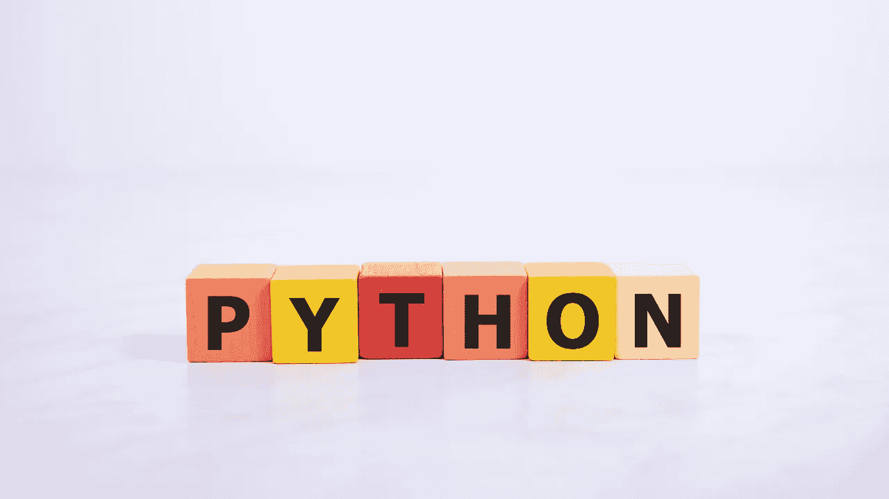

# Python AI 学习快速入门指南

> 原文：[`towardsdatascience.com/python-quickstart-for-people-learning-ai-58a1b76df0f4?source=collection_archive---------0-----------------------#2024-09-08`](https://towardsdatascience.com/python-quickstart-for-people-learning-ai-58a1b76df0f4?source=collection_archive---------0-----------------------#2024-09-08)

## 初学者友好的指南

 [Shaw Talebi](https://shawhin.medium.com/?source=post_page---byline--58a1b76df0f4--------------------------------)

·发表于[Towards Data Science](https://towardsdatascience.com/?source=post_page---byline--58a1b76df0f4--------------------------------) ·12 分钟阅读·2024 年 9 月 8 日

--

图片来自 Canva。

Python 已成为 AI 和数据科学的事实标准编程语言。尽管存在无代码解决方案，但学习编程仍然是构建完全定制化 AI 项目和产品的关键。在本文中，我将分享一个 Python 开发 AI 的初学者快速入门指南。我将讲解基础内容，并随后提供一个具体的代码示例。

**Python**是一种编程语言，即**一种给计算机下达精确指令以执行我们无法或不愿意做的事情**的方式[1]。

当**自动化一个没有现成解决方案的独特任务**时，这非常方便。例如，如果我想自动化编写和发送个性化的会议跟进邮件，我可以编写一个 Python 脚本来完成这项任务。

使用像 ChatGPT 这样的工具，人们很容易想象一个未来，在这个未来中，用户可以用简单的英语描述*任何*定制任务，计算机便会自动执行。然而，目前并没有这样的消费级产品。直到此类产品问世之前，学习（至少一点）Python 仍然具有巨大的价值。
