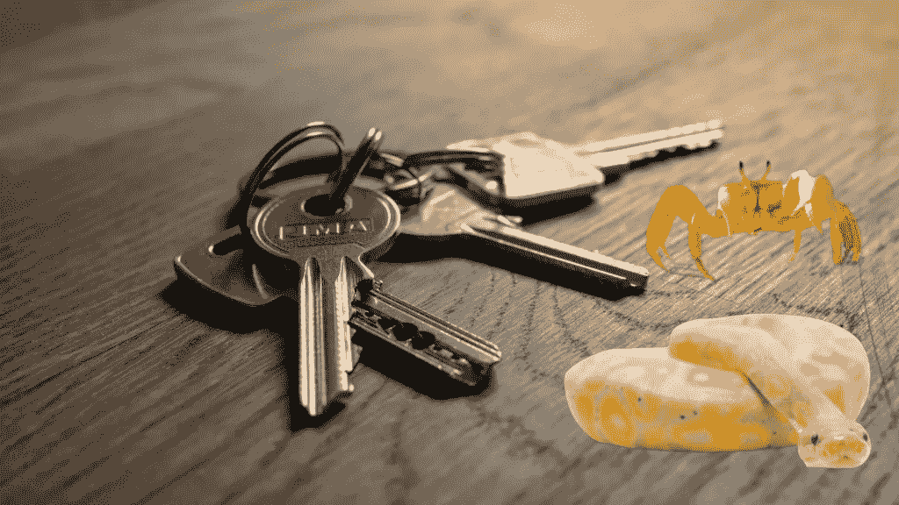

# Python 到 Rust：发现为什么枚举是必用特性

> 原文：[`towardsdatascience.com/python-to-rust-discover-why-enums-are-a-must-use-feature-6c53725b34a6?source=collection_archive---------3-----------------------#2024-01-10`](https://towardsdatascience.com/python-to-rust-discover-why-enums-are-a-must-use-feature-6c53725b34a6?source=collection_archive---------3-----------------------#2024-01-10)

## 从 Python 专家到 Rust 新手——一位数据科学家的过渡故事

 [Dennis Bakhuis](https://dennisbakhuis.medium.com/?source=post_page---byline--6c53725b34a6--------------------------------)

·发布于 [Towards Data Science](https://towardsdatascience.com/?source=post_page---byline--6c53725b34a6--------------------------------) ·阅读时长 10 分钟·2024 年 1 月 10 日

--

图 1：键就像枚举：互斥的。([键](https://unsplash.com/photos/a-bunch-of-keys-sitting-on-top-of-a-wooden-table-PxiAc1aElFQ); [蛇](https://unsplash.com/photos/brown-and-beige-snake-on-white-surface-NzFA2VhY5gg); [螃蟹](https://unsplash.com/photos/a-crab-on-a-beach-with-the-ocean-in-the-background-fP6SwlERs0k); 图片由作者创作)

作为一名长期的🐍 Python 爱好者，我的编程历程大多集中在这一优雅且强大的语言领域。Python 因其可读性和多功能性而闻名，成为我在解开数据科学奥秘时的得力工具。然而，每个经验丰富的程序员都知道，探索是成长的关键。为了追求这种成长，我最近翻开了[《Rust 书籍》](https://doc.rust-lang.org/book/title-page.html)，开始了一段探索既安全又高效语言的旅程。

> 探索一门新语言不仅是学习新的语法；更是拥抱一种全新的编程哲学。

我最新的冒险不仅仅是为我的语言库增加另一门语言。这是为了理解不同语言如何解决常见的编程问题。🦀 Rust 以其简洁和高效著称，提供了许多引人入胜的概念，我在之前的文章中已经涉及了一些：

> [Python 到 Rust：拆解三个重大障碍](https://medium.com/towards-data-science/python-to-rust-breaking-down-3-big-obstacles-094eb99e331d)
> 
> [从 Python 到 Rust：你必须了解的虚拟环境知识](https://medium.com/towards-data-science/python-to-rust-everything-you-must-know-about-virtual-environments-c1cd0e529835)
