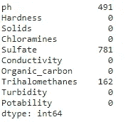
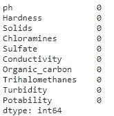
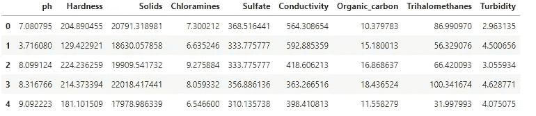
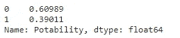
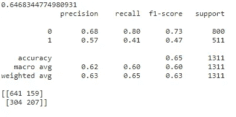
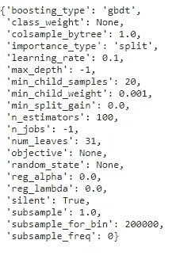
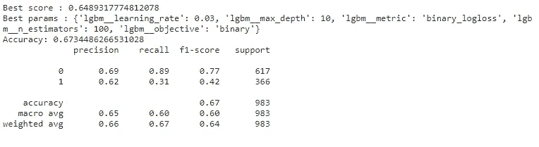

# Python 水质 — 基线分类模型

> 原文：[`towardsdatascience.com/python-water-quality-baseline-classification-model-bb5584226a82?source=collection_archive---------10-----------------------#2024-01-08`](https://towardsdatascience.com/python-water-quality-baseline-classification-model-bb5584226a82?source=collection_archive---------10-----------------------#2024-01-08)

## 评估在使用参考基线模型估算水质时的特征重要性

[](https://jamesmcneill06.medium.com/?source=post_page---byline--bb5584226a82--------------------------------)[](https://towardsdatascience.com/?source=post_page---byline--bb5584226a82--------------------------------) [James McNeill](https://jamesmcneill06.medium.com/?source=post_page---byline--bb5584226a82--------------------------------)

·发布于 [Towards Data Science](https://towardsdatascience.com/?source=post_page---byline--bb5584226a82--------------------------------) ·11 分钟阅读 ·2024 年 1 月 8 日

--


图片由 [Unseen Studio](https://unsplash.com/@craftedbygc?utm_source=medium&utm_medium=referral) 提供，上传至 [Unsplash](https://unsplash.com/?utm_source=medium&utm_medium=referral)

理解可以用来分类水质的因素可能是一个挑战。掌握不同地区的专业知识可以为水流动的最佳方式提供本地见解。如果没有足够的时间来全面审查这些细节，就减少了从错误中学习并惠及他人的可能性。通过收集影响水质的特征数据集，可以采取量化的方法。量化后，用户可以运用计算机科学技术来获得基于数据的洞察。本文旨在应用一个基线机器学习分类模型，帮助突出关键特征。通过使用未见过的数据，通常称为测试数据，来生成模型预测结果，从而验证模型的表现。

关于输入数据集的初步探索性数据分析的更多细节，请参考本文末尾分享的“Python 水质 EDA 与饮用性分析”文章。

# 数据集

本文分析使用的水质数据集来源于 Kaggle¹。

[](https://www.kaggle.com/datasets/adityakadiwal/water-potability?source=post_page-----bb5584226a82--------------------------------) [## 水质

### 饮用水的可饮用性

[www.kaggle.com](https://www.kaggle.com/datasets/adityakadiwal/water-potability?source=post_page-----bb5584226a82--------------------------------)

使用 Jupyter notebook 实例并配合 Python 代码进行处理。

```py
import sys
print(sys.version) # displays the version of python installed
```

运行上述脚本后，输出将显示使用的是 Python 3.7.10 版本。为了能够复制接下来的结果，用户应确保其工作环境中已安装 Python 3。

```py
# import libraries
import numpy as np
import pandas as pd
import seaborn as sns
import matplotlib.pyplot as plt
import os
```

要开始执行这些步骤，需要几个 Python 库。上面显示的每个库都包含一系列方法、函数和输出，这些方法、函数和输出已被开发用于辅助数据分析。对于用户来说，这两组库是基于彼此构建的，即一个作为基础库用于生成其他输出。Pandas 是基于 NumPy 构建的，用于进行数据分析。Seaborn 则是基于 matplotlib 构建的，用于辅助数据可视化。

开始使用 Pandas 进行数据分析的常见初始步骤是导入 CSV 文件。下面显示的代码引用了包含该文件的文件夹以供查看。

```py
# Import the dataset for review as a DataFrame
df = pd.read_csv("../input/water-potability/water_potability.csv")
```

## 为建模进行数据预处理

在开始构建分类模型之前，我们需要理解和预处理数据。如前所述，EDA（探索性数据分析）已经在上一篇文章中进行了评估。通过已获得的知识，可以创建一个数据预处理管道。创建数据管道有多种好处。首先，在样本数据上经过测试的步骤可用于自动化处理未来的迭代。其次，它允许其他用户快速开始使用更清洁版本的数据集，而无需重新审查相同的初步步骤。最后，数据管道可以被其他用户复制或分叉，新的添加项可以在不影响初始管道的情况下进行。

在机器学习建模中，分析的主要目标是拥有一个强大的数据管道，包含数据预处理，以便其他用户能够测试不同的机器学习算法。Matt Harrison 所著的《Effective Pandas》一书展示了如何通过链式方法提高代码的可读性。我们将展示两种旨在处理类似任务的方法。读者可以选择任何一种方法进行操作。

一个常见的数据预处理步骤是检查缺失的数据值。这些值最终如何影响模型，直到测试阶段才会知道。建议保留原始数据变量，并开发一个新变量以便后续比较。以下步骤中我们将跳过这一环节，旨在更新原始数据变量。

首先，我们需要检查与每个变量相关的缺失值的数量。

```py
# Understand missing values per variable within DataFrame
(
    df
    .isnull().sum()
)
```



输出 1.1 DataFrame 中每列的缺失值

输出结果突出了三个具有缺失值的变量。然而，总缺失值存在较大差异。硫酸盐变量的缺失比例最高，而其他变量的缺失比例较低。当缺失值比例较高时，应用调整方法时需要小心。如果采用了去除缺失值本身特征的方法，最终的结果可能会给出与预期不符的估计。拥有领域专家的知识可以帮助更好地理解不同的选择。

方法 #1

```py
# Apply mean value to the missing values
df['ph'].fillna(df['ph'].mean(), inplace=True)
df['Sulfate'].fillna(df['Sulfate'].mean(), inplace=True)
df['Trihalomethanes'].fillna(df['Trihalomethanes'].mean(), inplace=True)
df.isnull().sum()
```

使用所有非缺失值的均值提供了一个良好的初步近似。多个变量需要更新，并且方法中的关键字（KW）参数 `fillna` 可用于内联更新。包含关键字 `inplace` 将该方法应用于输入的 DataFrame `df`，无需创建副本。

方法 #2

```py
# Make updates with chaining method, allows for use of comments to update the columns.
# A new dataframe variable (df_1) can be assigned this output
df1 = (
    df
#     .isnull().sum()
    .assign(ph=lambda df_:df_.ph.fillna(df_.ph.mean()),
            Sulfate=lambda df_:df_.Sulfate.fillna(df_.Sulfate.mean()),
            Trihalomethanes=lambda df_:df_.Trihalomethanes.fillna(df_.Trihalomethanes.mean())
           )
)

# Confirm that the columns have been updated
df1.isnull().sum()
```

第二种方法是使用链式方法来执行变量更新。仍然应用均值调整。使用带有单行 lambda 函数的赋值方法可以提高可读性。另一个重要的方面是，之前的行可以被（取消）注释。如果需要对前后处理进行检查，只需在代码中取消注释并注释掉相应行即可。下面的输出突出了所有缺失值已经被更新。



输出 1.2 后处理更新，解决缺失值问题，显示没有缺失值

在预处理完成后，我们现在可以将 DataFrame 分为依赖变量（目标或 `y`）和独立变量（`X`）。

```py
# Separate into X and y variables
X, y = df1.drop(['Potability'], axis=1), df1['Potability'].values

# Show that only independent variables have been retained
X.head()
```

Python 允许在公式的同一行内产生多个变量。通过在公式两边的变量之间添加逗号，Python 会解释为正在创建两个新变量。



输出 1.3 DataFrame 的前 5 行只显示独立变量

使用 `head` 方法显示了前 5 行。一个 numpy 数组变量包含了 `y` 的二元值。

## 分类模型 — 基准线

开发机器学习模型时常用的 Python 库是 scikit-learn。该库提供了大量的技术帮助模型开发。多年的开发成果使得这个库已经成熟，并且不断进步。

在构建分类模型时，许多用户会直接使用最新的机器学习技术开始开发。然而，一个更好的方法是首先开发一个基准模型。它可以作为参考点，任何低于该基准线的模型估计都显示了效果较差的技术。在尝试调整模型的超参数之前，可以先得到一个良好的初步近似。超参数是可以调整的关键字（KW）变量，目的是提升机器学习模型的表现。

Scikit-learn 包含一个虚拟分类器算法，它可以提供一个基准模型。通过模型输出，可以将其与更复杂的分类器进行比较。

```py
# Dummy classifier - create a baseline accuracy score
from sklearn.dummy import DummyClassifier

# Define the reference model
dummy_clf = DummyClassifier(strategy='most_frequent')

# Fit the model
dummy_clf.fit(X, y)

# Predict the model
dummy_clf.predict(X)

# Evaluate the model
score = dummy_clf.score(X, y)
print(score)

# Print statement displayed value
0.6098901098901099
```

上述模型步骤创建了一个分类器模型，然后可以将其拟合到输入数据中。使用 predict 方法生成目标（y）的预测。最后，评分将显示模型的准确性。

由于虚拟分类器应用了最频繁的值，我们实际上是在预测目标值为 0。需要注意的是，应用此方法可以为未来的预测提供良好的背景。

```py
# Review the dependent variable frequency and percentage
(
    df1
    .Potability
#     .value_counts()
    .value_counts(normalize=True) # display frequencies as a percentage
)
```

为了验证预测值 0.60989 的输出，我们可以对目标变量进行 value_counts。下面的输出显示，与得分预测一致的百分比结果。



输出 1.4 显示二分类目标变量的百分比部分

因此，如果任何未来的分类模型得出较低的估计分数，我们应该将其排除，因为它没有产生更好的结果。

## 分类模型 — 复杂方法

现在让我们尝试构建一个更复杂的模型来理解机器学习（ML）挑战。我们将通过梯度提升模型（GBM）来寻求提高性能。GBM 是一种基于树的模型，允许构建多个树。在每棵树中，输入数据会被评估，以了解模型特征如何预测目标变量。在这个练习中，我们将使用轻量级 GBM 分类器。未来的开发中可以使用 XGBoost（极端梯度提升）等替代方法。

```py
# Lets try a Light GBM
from lightgbm import LGBMClassifier

# ML Preprocessing
from sklearn.model_selection import train_test_split
from sklearn.preprocessing import StandardScaler
from sklearn.pipeline import Pipeline

# Hyperparameter tuning
from sklearn.model_selection import GridSearchCV

# ML Performance metrics
from sklearn.metrics import classification_report
from sklearn.metrics import confusion_matrix
```

对于上面的 ML 模型，展示了常见的库导入。每个部分展示了在模型构建和测试过程中使用的相关步骤。预处理旨在确保可以构建一个步骤管道，以促进未来的开发。

```py
# Split into training and test set
X_train, X_test, y_train, y_test = train_test_split(X, y, test_size = 0.4, random_state=2, stratify=y)

# Instantiate the LGBM
lgbm = LGBMClassifier()

# Fit the classifier to the training data
lgbm.fit(X_train, y_train)

# Perform prediction
y_pred = lgbm.predict(X_test)

# Print the accuracy
print(lgbm.score(X_test, y_test))

print(classification_report(y_test, y_pred))
print(confusion_matrix(y_test, y_pred))
```

首先，我们需要将输入数据拆分为训练集和测试集。这样拆分可以减少过拟合数据的机会。目标是创建一个在未见数据上表现最佳的模型，即模型如何在实际数据中使用。使用测试数据评估训练模型在未见值上的表现，旨在展示改进的空间。包括关键字参数 stratify 确保目标变量的分布在训练和测试数据中保持一致。应用此步骤旨在确保底层变量分布的特征不会丢失。模型预测应该与数据中观察到的情况一致。

将分类器应用于变量 lgbm，使得用户可以使用 Python 对象的所有方法（函数）和属性（数据）。遵循标准步骤来训练模型并对测试数据进行评分。

以下显示的结果突出了相对于基准模型模型性能的提升。应用于测试数据后，提供了预测效果良好的保证。准确性通过评分方法生成，显示了所有可能结果中正确预测的总数。

使用分类报告突出显示最感兴趣的分类度量。精准度显示了相对于所有正类预测（真正和假正）的真正正类值预测得有多好。过多的假正值会导致 Type 1 错误，即错误地将实例分类为正类，例如医学筛查产生误诊。召回率评估相对于所有实际正类（真正和假负）的真正正类值。如果假负值过多，会导致 Type II 错误，即错误地将实例分类为负类，例如欺诈检测可能导致经济损失。



输出 1.5 提供准确性和分类度量的细节

在使用机器学习算法时，包含一组默认的关键参数值，以生成基准结果。优化这些初始参数将生成更好的模型预测。

```py
# Lets understand the baseline params
lgbm.get_params()
```

使用 lgbm 变量的 get_params 方法将显示如下所示的输出。有关每个变量含义的更多细节，用户可以在线查阅文档。



输出 1.6 默认关键字参数值

机器学习模型开发中的下一个重要步骤是审查超参数空间的潜在值。通过在相关选项空间中执行超参数调优，可以有效地生成改进的预测。

```py
# Setup the pipeline
steps = [('scaler', StandardScaler()),
         ('lgbm', LGBMClassifier())]

pipeline = Pipeline(steps)

# Specify the hyperparameter space
parameters = {
    'lgbm__learning_rate':[0.03, 0.05, 0.1],
    'lgbm__objective':['binary'],
    'lgbm__metric':['binary_logloss'],
    'lgbm__max_depth':[10],
    'lgbm__n_estimators':[100, 200, 300]
}

# Create train and test sets
X_train, X_test, y_train, y_test = train_test_split(X, y, test_size=0.3, random_state=42)

# Instantiate the GridSearchCV object
cv = GridSearchCV(pipeline, parameters, cv=3)

# Fit to the training set
cv.fit(X_train, y_train)

# Predict the labels of the test set
y_pred = cv.predict(X_test)
```

引入一个管道，按比例缩放数值变量以对齐相似的尺度，将减少具有较大数值范围的变量主导的潜力。管道中包含了两步，首先生成经过缩放的独立变量，然后应用 LGBM 分类器。以这种格式编写代码有助于其他用户理解预处理步骤。根据所需步骤的复杂性，管道可以包含更多步骤。

已生成一个参数字典，以便测试超参数输入的组合。包括引用 lgbm 模型的变量，并使用双下划线将让 Python 识别 lgbm 变量需要调整。

gridsearchCV 方法将审查输入参数的每种组合，以生成所有组合的模型。通过包含 CV（交叉验证）参数，它将执行三次交叉验证程序。每次验证运行将选择一个不同的样本来训练模型。目的是确保模型不会过拟合仅在一个样本中展示的独特方面。

```py
# Display best score and params
print(f'Best score : {cv.best_score_}')
print(f'Best params : {cv.best_params_}')

# Compute and print metrics
print("Accuracy: {}".format(cv.score(X_test, y_test)))
print(classification_report(y_test, y_pred))
```

一旦处理完成，可以查看 lgbm 的最佳得分和超参数。由于我们仅审查了少数潜在的超参数，用户可以使用更为粗暴的手动方法来确定最佳模型。然而，网格搜索的真正好处在于可以包含一个更大的超参数输入空间。



输出 1.7 LGBM 分类器超参数调优结果

在选择了 lgbm 的最佳参数后，我们可以看到模型准确性的提高。正是这个参数选择可以在有新数据时应用，以进行未来的预测。

进一步提高模型性能的步骤可能包括通过相关分析审查自变量之间的关系。同时，也可以评估是否需要对变量进行更精细的预处理，处理缺失值。

## 结论

在本文中，我们审查了如何通过包含基准机器学习模型来帮助评估模型的预测效果。使用模型准确性指标将决定替代方法是否带来了改进。通过这种数据驱动的方法，而不是盲目评估模型表现，我们还回顾了如何通过管道步骤和超参数调整来提高机器学习模型的性能。

非常感谢您的阅读！如果您有任何评论，我也非常欢迎。

**你可以通过** [**LinkedIn**](https://www.linkedin.com/in/james-mc-neill-180a9057/) **与我联系，进行有关数据的友好交流。我还分享了以下故事：**

[Python 水质 EDA 和可饮用性分析](https://towardsdatascience.com/python-water-quality-eda-and-potability-analysis-ebc1cf553081?source=post_page-----bb5584226a82--------------------------------)

### 理解数据分析与可视化技术

[Python 水质 EDA 和可饮用性分析](https://towardsdatascience.com/python-water-quality-eda-and-potability-analysis-ebc1cf553081?source=post_page-----bb5584226a82--------------------------------) 

### 开始进入自然语言处理领域

[深度解析 SQL 窗口函数](https://towardsdatascience.com/deep-dive-into-sql-window-functions-bdcb29b05853?source=post_page-----bb5584226a82--------------------------------) 

### SQL 窗口函数在一组表格行上执行计算，以简化数据分析。

[入门 Python 中的 NLP](https://towardsdatascience.com/getting-started-with-nlp-in-python-6a14d0bf4cfe?source=post_page-----bb5584226a82--------------------------------) 

[1] : 来自[Kaggle 数据集水质](https://www.kaggle.com/datasets/adityakadiwal/water-potability)的数据，许可协议为[`creativecommons.org/publicdomain/zero/1.0/`](https://creativecommons.org/publicdomain/zero/1.0/)
