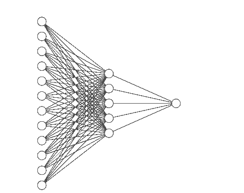

# PyTorch 入门 — 进入非线性函数

> 原文：[`towardsdatascience.com/pytorch-introduction-enter-nonlinear-functions-4dd893845592?source=collection_archive---------7-----------------------#2024-01-12`](https://towardsdatascience.com/pytorch-introduction-enter-nonlinear-functions-4dd893845592?source=collection_archive---------7-----------------------#2024-01-12)

## 继续 PyTorch 系列，在本篇文章中，我们将学习非线性如何帮助解决神经网络中的复杂问题。

[](https://ivopbernardo.medium.com/?source=post_page---byline--4dd893845592--------------------------------)[](https://towardsdatascience.com/?source=post_page---byline--4dd893845592--------------------------------) [Ivo Bernardo](https://ivopbernardo.medium.com/?source=post_page---byline--4dd893845592--------------------------------)

·发表于[Towards Data Science](https://towardsdatascience.com/?source=post_page---byline--4dd893845592--------------------------------) ·阅读时长 8 分钟·2024 年 1 月 12 日

--


神经网络是能够解决复杂问题的强大架构 — 由 AI 生成的图像

在 PyTorch 入门系列的上一篇博客中，我们讨论了张量对象介绍以及如何使用 PyTorch 构建简单线性模型。该系列的前两篇博客是一个更大目标的起点，我们希望从更深的层次理解深度学习（双关语）。为了实现这一目标，我们正在使用机器学习领域最著名的库之一——PyTorch。

在构建我们的简单线性模型时，我们已经理解到 PyTorch 能够解决简单的回归问题——但如果它只能解决这些问题，它就不配被称为深度学习库了，对吧？在这篇博客中，我们将深入探讨神经网络的复杂性，了解如何通过引入激活函数的概念来实现处理非线性模式的神经网络，进而解决复杂问题。

本博客（及系列）在结构上大致借鉴了[`www.learnpytorch.io/`](https://www.learnpytorch.io/)，这是一个学习 PyTorch 的优秀资源，强烈推荐你去看看！

简而言之，在这篇博客中，我们将：

+   了解 PyTorch 中的激活函数是如何工作的。

+   探索我们如何利用神经网络解决非线性问题。

开始吧！

# 设置我们的数据

在这篇博文中，我们将使用[Kaggle](https://www.kaggle.com/datasets/andrewmvd/heart-failure-clinical-data/data)提供的心脏衰竭预测数据集。该数据集包含来自 299 名心脏衰竭患者的数据，并指定了他们健康状态的不同变量。目标是预测患者是否死亡（名为 DEATH_EVENT 的列），并了解是否有任何信号（例如患者的年龄、贫血水平、射血分数或其他健康数据）可以预测死亡结果。

让我们首先使用`pandas`加载数据：

```py
import pandas as pd
heart_failure_data = pd.read_csv('heart_failure_clinical_records_dataset.csv')
```

让我们看看数据框（DataFrame）的`head`：

```py
heart_failure_data.head(10)
```


heart_failure_data 的前几行 — 图源：作者

我们的目标是预测数据框最后一列的`DEATH_EVENT`二进制列：


heart_failure_data 的前几行，附加列 — 图源：作者

首先，让我们使用`StandardScaler`对数据进行标准化——虽然在距离算法中标准化不如重要，但标准化数据对于提升我们在训练过程中使用的梯度下降算法将极为有用。我们希望对除了最后一列（目标列）之外的所有列进行缩放：

```py
from sklearn.preprocessing import StandardScaler

scaler = StandardScaler()
heart_failure_data_std = scaler.fit_transform(heart_failure_data.iloc[:,:-1])
```

现在，我们可以执行一个简单的训练-测试拆分。我们将使用`sklearn`来完成这项工作，并将 20%的数据集用于测试目的：

```py
X_train, X_test, y_train, y_test = train_test_split(
    heart_failure_data_std, heart_failure_data.DEATH_EVENT, test_size = 0.2, random_state=10
)
```

我们还需要将数据转换为`torch.tensor`：

```py
X_train = torch.from_numpy(X_train).type(torch.float)
X_test = torch.from_numpy(X_test).type(torch.float)
y_train = torch.from_numpy(y_train.values).type(torch.float)
y_test = torch.from_numpy(y_test.values).type(torch.float)
```

数据准备好了，现在是时候训练我们的神经网络了！

# 训练一个基本的线性神经网络

数据准备好后，到了训练我们的第一个神经网络的时刻。我们将使用与上篇系列博文中相似的架构，使用一个线性版本的神经网络来处理线性模式：

```py
from torch import nn

class LinearModel(nn.Module):
    def __init__(self):
        super().__init__()
        self.layer_1 = nn.Linear(in_features=12, out_features=5)
        self.layer_2 = nn.Linear(in_features=5, out_features=1)

    def forward(self, x):
        return self.layer_2(self.layer_1(x))
```

这个神经网络使用`pytorch`中的`nn.Linear`模块来创建一个具有 1 个深度层（一个输入层，一个深度层和一个输出层）的神经网络。

虽然我们可以创建自己的类继承自`nn.Module`，但我们也可以使用（更优雅的方式）`nn.Sequential`构造函数来实现相同的功能：

```py
model_0 = nn.Sequential(
 nn.Linear(in_features=12, out_features=5),
 nn.Linear(in_features=5, out_features=1)
)
```



model_0 神经网络架构 — 图源：作者

酷！我们的神经网络包含一个具有 5 个神经元的单一内部层（这一点可以通过第一层的`out_features=5`看出）。

这个内部层从每个输入神经元接收相同数量的连接。第一层的`in_features`中的 12 反映了特征的数量，而第二层的`out_features`中的 1 则反映了输出（一个范围从 0 到 1 的单一值）。

为了训练我们的神经网络，我们将定义一个损失函数和一个优化器。我们将使用`BCEWithLogitsLoss`（[PyTorch 2.1 文档](https://pytorch.org/docs/stable/generated/torch.nn.BCEWithLogitsLoss.html)）作为损失函数（适用于分类问题的二元交叉熵的 PyTorch 实现），并使用随机梯度下降作为优化器（使用`torch.optim.SGD`）。

```py
# Binary Cross entropy
loss_fn = nn.BCEWithLogitsLoss()

# Stochastic Gradient Descent for Optimizer
optimizer = torch.optim.SGD(params=model_0.parameters(), 
 lr=0.01)
```

最后，由于我还想计算每个训练轮次的准确率，我们将设计一个函数来计算准确率：

```py
def compute_accuracy(y_true, y_pred):
    tp_tn = torch.eq(y_true, y_pred).sum().item()
    acc = (tp_tn / len(y_pred)) * 100 
    return acc
```

是时候训练我们的模型了！让我们训练模型 1000 个轮次，看看一个简单的线性网络如何处理这些数据：

```py
torch.manual_seed(42)

epochs = 1000

train_acc_ev = []
test_acc_ev = []

# Build training and evaluation loop
for epoch in range(epochs):

    model_0.train()

    y_logits = model_0(X_train).squeeze()

    loss = loss_fn(y_logits,
                   y_train) 
    # Calculating accuracy using predicted logists
    acc = compute_accuracy(y_true=y_train, 
                      y_pred=torch.round(torch.sigmoid(y_logits))) 

    train_acc_ev.append(acc)

    # Training steps
    optimizer.zero_grad()
    loss.backward()
    optimizer.step()
    model_0.eval()

    # Inference mode for prediction on the test data
    with torch.inference_mode():

        test_logits = model_0(X_test).squeeze() 
        test_loss = loss_fn(test_logits,
                            y_test)
        test_acc = compute_accuracy(y_true=y_test,
                               y_pred=torch.round(torch.sigmoid(test_logits)))
        test_acc_ev.append(test_acc)

    # Print out accuracy and loss every 100 epochs
    if epoch % 100 == 0:
        print(f"Epoch: {epoch}, Loss: {loss:.5f}, Accuracy: {acc:.2f}% | Test loss: {test_loss:.5f}, Test acc: {test_acc:.2f}%")
```

不幸的是，我们刚刚构建的神经网络还不足以解决这个问题。让我们看看训练和测试准确率的变化：


训练和测试准确率随训练轮次的变化 — 图片来自作者

*(我选择绘制准确率而非损失，因为在这个问题中准确率更容易解读)*

有趣的是，我们的神经网络并未能显著提高测试集的准确率。

通过之前博客中获得的知识，我们可以尝试为神经网络添加更多层和神经元。让我们试试看，看看结果如何：

```py
deeper_model = nn.Sequential(
 nn.Linear(in_features=12, out_features=20),
 nn.Linear(in_features=20, out_features=20),
 nn.Linear(in_features=20, out_features=1)
)
```


deeper_model 神经网络架构 — 图片来自作者

尽管我们的更深层模型在增加了额外层和更多神经元后变得更加复杂，但这并没有转化为网络性能的提升：


更深层模型的训练和测试准确率随训练轮次的变化 — 图片来自作者

尽管我们的模型更复杂，但这并没有为我们的分类问题带来更多准确性。

为了能够获得更好的性能，我们需要解锁神经网络的一个新特性 — 激活函数！

# 进入非线性！

如果单纯通过扩展模型的宽度和深度没有带来显著的改进，那么一定还有其他方法可以改善神经网络的性能，对吧？

这就是激活函数可以发挥作用的地方！在我们的例子中，我们将回到一个更简单的模型，但这次会加入一些变化：

```py
model_non_linear = nn.Sequential(
 nn.Linear(in_features=12, out_features=5),
 nn.ReLU(),
 nn.Linear(in_features=5, out_features=1)
)
```

这个模型与第一个模型有什么不同？不同之处在于我们在神经网络中加入了一个新的模块 — `nn.ReLU`。 [修正线性单元](https://en.wikipedia.org/wiki/Rectifier_(neural_networks)) 是一种激活函数，它将改变神经网络中每个权重的计算：


ReLU 示例 — 图片来自作者

每个通过我们神经网络权重的值都会根据这个函数进行计算。如果特征的值与权重相乘后是负数，值将被设为 0，否则假定计算值为其本身。仅仅这一小的改变就为神经网络架构增添了很大的能力——在`torch`中，我们可以使用不同的激活函数，如`nn.ReLU`、`nn.Tanh`或`nn.ELU`。想了解所有激活函数的概览，请查看这个[链接](https://pytorch.org/docs/stable/nn.html#non-linear-activations-other)。

我们的神经网络架构目前包含一个小小的变化：


神经网络架构 — ReLU — 图像来源：作者

通过在神经网络中做出这个小小的变化，来自第一层的每个值（由`nn.Linear(in_features=12, out_features=5)`表示）都必须经过“ReLU”测试。

让我们看看将这个架构应用到数据上的影响：


非线性模型的训练和测试准确度随 epoch 变化 — 图像来源：作者

很棒！尽管我们看到在 800 个 epoch 之后性能有所下降，但这个模型并没有像之前的模型那样出现过拟合。请记住，我们的数据集非常小，因此我们的结果有可能只是随机性带来的更好表现。尽管如此，将激活函数添加到`torch`模型中确实在性能、训练和泛化能力方面有着巨大的影响，尤其是在你有大量数据进行训练时。

现在你已经了解了非线性激活函数的强大功能，接下来了解以下内容也很重要：

+   你可以将激活函数添加到神经网络的每一层。

+   不同的激活函数对你的性能和训练过程有[不同的影响](https://www.v7labs.com/blog/neural-networks-activation-functions)。

+   `torch`优雅地让你可以通过利用`nn`模块，在层与层之间添加激活函数。

# 结论

感谢你抽出时间阅读这篇文章！在这篇博客中，我们探讨了如何将激活函数应用到`torch`神经网络架构中。**我们还理解了另一个重要概念，那就是更大、更宽的网络并不意味着更好的性能。**

激活函数帮助我们解决通过更复杂架构才能解决的问题（再说一遍，更复杂并不等于更大或更宽）。它们有助于提高泛化能力，帮助我们更快地收敛解决方案，是神经网络模型的主要特性之一。

由于它们在各种神经模型中被广泛使用，`torch`通过其在`nn.Sequential`模块中的不同函数实现，给我们提供了很大的帮助！

希望你喜欢这篇文章，下一篇 PyTorch 文章见！你可以查看第一篇 PyTorch 博客文章 这里 和 这里。我还推荐你访问 [PyTorch 零基础到精通课程](https://www.learnpytorch.io/01_pytorch_workflow/)，这是一个令人惊叹的免费资源，启发了这篇文章的写作方法。

此外，我很高兴能在我新创建的 YouTube 频道——[数据之旅](https://www.youtube.com/@TheDataJourney42)上见到你，在那里我将添加有关数据科学和机器学习的内容。

*[本博客文章中使用的数据集属于创作共用许可协议* [*https://bmcmedinformdecismak.biomedcentral.com/articles/10.1186/s12911-020-1023-5#Sec2*](https://bmcmedinformdecismak.biomedcentral.com/articles/10.1186/s12911-020-1023-5#Sec2)*]*
