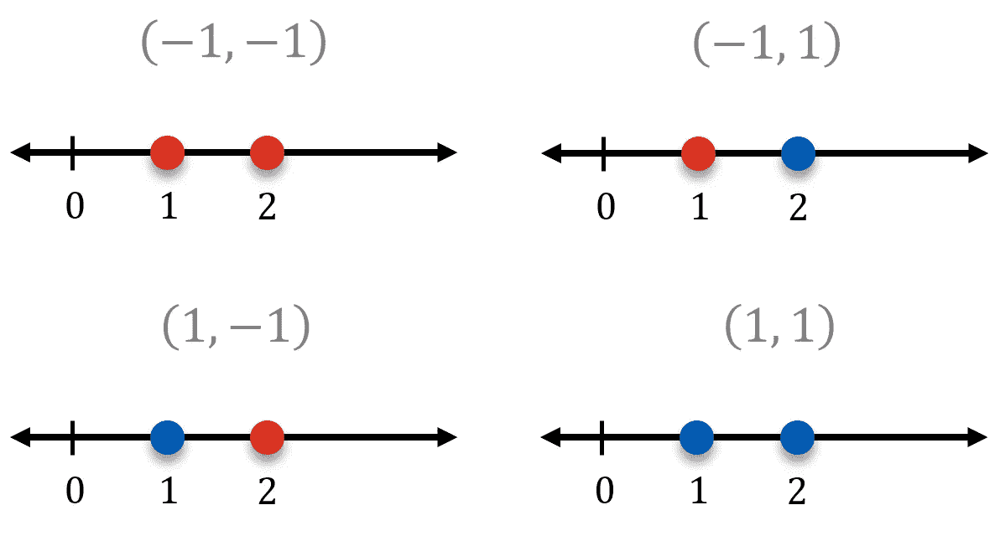
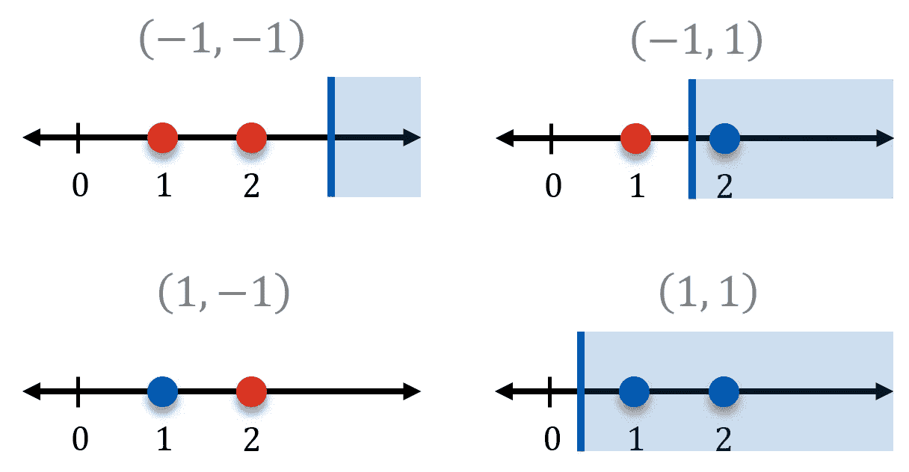
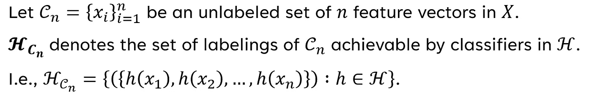
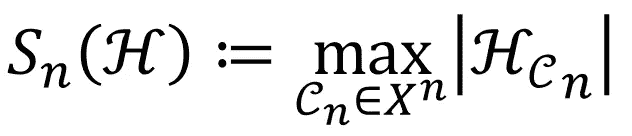
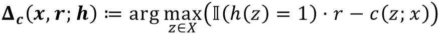
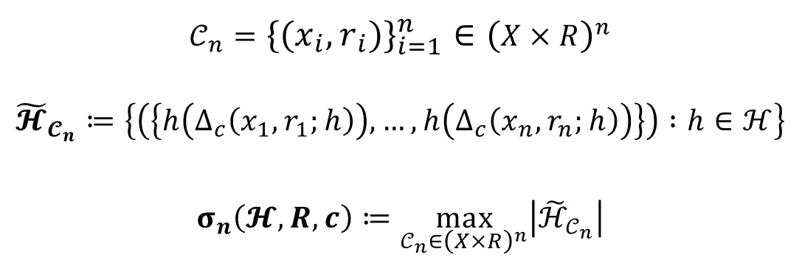

# 量化战略分类问题的复杂性和可学习性

> 原文：[`towardsdatascience.com/quantifying-the-complexity-and-learnability-of-strategic-classification-problems-fd04cbfdd4b9?source=collection_archive---------8-----------------------#2024-04-12`](https://towardsdatascience.com/quantifying-the-complexity-and-learnability-of-strategic-classification-problems-fd04cbfdd4b9?source=collection_archive---------8-----------------------#2024-04-12)

## 将 VC 维度的概念推广到战略设置中，可以帮助我们理解一个问题是否可学习

 [Jonathan Yahav](https://jhyahav.medium.com/?source=post_page---byline--fd04cbfdd4b9--------------------------------)

·发布于[Towards Data Science](https://towardsdatascience.com/?source=post_page---byline--fd04cbfdd4b9--------------------------------) ·阅读时长 8 分钟·2024 年 4 月 12 日

--

图片由作者使用 DALL-E 3 生成。

在本系列的第一篇文章，我们正式定义了***战略分类问题***，记作 Sᴛʀᴀᴄ⟨*H*, *R*, *c*⟩***，***它是经典二元分类的一个推广。我们基于论文[***PAC-Learning for Strategic Classification***](https://arxiv.org/abs/2012.03310)（Sundaram, Vullikanti, Xu, & Yao, 2021）来进行此定义。在过程中，我们探讨了为什么在分类时需要考虑理性主体的不同偏好，以及如何在某些假设条件下做到这一点。我们将在很大程度上依赖前一篇文章中介绍的概念，因此如果你还没阅读过，强烈建议你先阅读它。

 ## 将 PAC 学习扩展到战略分类设置

### 博弈论与机器学习基础概念交汇的案例研究

towardsdatascience.com

我们将从我们停下的地方继续，**以 Sᴛʀᴀᴄ⟨*H*, *R*, *c*⟩ 的定义为起点，来引入有用的战略 VC 维度（SVC）概念。** 一旦我们弄清楚了 SVC，接下来我所称的*战略学习的基本定理*将自然而然地跟随其后。

尽管有帮助，**对扩展系数、经典 VC 维度以及[统计学习基本定理](https://www.cs.princeton.edu/courses/archive/spring16/cos511/lec17.pdf)的先前了解** **并不是跟得上本系列内容的必要条件。** 然而，它们每个都比我在本系列中所能涉及的内容要深奥得多，更不用说在一篇文章中涵盖了。对于感兴趣的读者，建议阅读[Andrew Rothman](https://medium.com/u/4688574fc42a?source=post_page---user_mention--fd04cbfdd4b9--------------------------------)关于（经典）扩展系数和 VC 维度的精彩且非常详尽的文章。

 [## 统计学习理论 第五部分：扩展系数

### 利用无限函数类的 ML 估计器的一致性、速率和泛化界限证明……

anr248.medium.com](https://anr248.medium.com/statistical-learning-theory-part-5-shattering-coefficient-9fbce2bd98c2?source=post_page-----fd04cbfdd4b9--------------------------------)  [## 统计学习理论 第六部分：Vapnik–Chervonenkis（VC）维度

### 利用无限函数类的 ML 估计器的一致性、速率和泛化界限证明……

[anr248.medium.com](https://anr248.medium.com/statistical-learning-theory-part-6-vapnik-chervonenkis-vc-dimension-47848a38b6e7?source=post_page-----fd04cbfdd4b9--------------------------------)

正如我们将看到的，**战略扩展系数和 SVC 是它们经典（即非战略）对应物的自然推广。** 因此，我们将首先简要介绍这些对应物，然后解释如何将它们修改以适应战略环境。

## 可实现标记的计数：经典扩展系数

口头定义扩展系数乍一看似乎是直接的：

> *给定一个假设类* H*，* ***它的第 n*ᵗʰ 扩展系数，记作* Sₙ*(*H*),*** *表示分类器在* H *中能够对* n *个特征向量的样本进行标记的最大数量。*

那么，什么是“*标记*”？什么才算是“*可实现的*”？回答这些问题将帮助我们为更正式的定义打下基础。

在二分类的背景下，对特征向量样本的**标注**仅仅是将集合 { -1, 1 } 中的值分配给这些向量的任意一种方式。作为一个非常简单的例子，考虑两个一维特征向量（即数轴上的点），*x*₁ = 1 和 *x*₂ = 2。

样本 *x*₁ = 1, *x*₂ = 2 的四种可能标注的可视化。红色点为负类，蓝色点为正类。图像由作者提供。

可能的标注是我们可以为每个特征向量独立分配分类值的任意组合。我们可以将每个标注表示为一个向量，其中第一个和第二个坐标分别表示分配给 *x*₁ 和 *x*₂ 的值。因此，可能的标注集合为 { (-1, -1), (-1, 1), (1, -1), (1, 1) }。请注意，大小为 2 的样本会产生 2² = 4 种可能的标注——我们将很快看到这如何推广到任意大小的样本。

我们说**一个标注是由假设类 *H* *可实现的***，如果存在一个分类器 *h* ∈ *H*，该分类器能得到该标注。继续我们的简单示例，假设我们仅限于形式为 *x* ≥ *k*, k∈ ℝ 的分类器，即一维阈值分类器，任何位于阈值右侧的点都会被正类化。标注 (1, -1) 是无法通过此假设类实现的。由于 *x*₂ 大于 *x*₁，任何将 *x*₁ 分类为正类的阈值也必定将 *x*₂ 分类为正类。因此，可实现的标注集合为 { (-1, -1), (-1, 1), (1, 1) }。

一维阈值分类器的示例，可以用来实现除一个外的所有可能的标注样本 *x*₁ = 1, *x*₂ = 2。图像由作者提供。

理解了基本术语后，我们可以开始发展一些符号来正式表达我们开始时所提到的口头定义中的元素。

我们保持将标注表示为向量，就像在我们的简单示例中一样，每个坐标代表分配给相应特征向量的分类值。**总共有 2*ⁿ* 种可能的标注：**每个特征向量都有两种可能的选择，我们可以将标注看作是 *n* 个此类选择的集合，每个选择都独立于其他选择。**如果假设类 *H* 能够实现样本 𝒞*ₙ* 的所有可能标注，**即，如果 𝒞*ₙ* 的 *可实现* 标注的数量等于 2*ⁿ*，**我们说 *H* “打破”了 𝒞*ₙ*。**

最后，使用上面的符号，我们得出更严格的 *Sₙ*(*H*) 定义：

结合我们对打破的解释，***Sₙ*(*H*) 等于 2*ⁿ* 意味着存在一个大小为 *n* 的样本被 *H* 打破。**

## 估计假设类的表达能力：经典 VC 维度

**Vapnik–Chervonenkis (VC) 维度是衡量假设类表达能力的一种方式。** 它基于我们刚刚定义的破碎概念，并在帮助我们确定哪些假设类是 PAC 可学习的、哪些不是方面起着重要作用。

让我们从直观地定义经典的 VC 维度开始：

> *给定一个假设类* H，*其 VC 维度，记作 VCdim(*H*), 被定义为存在一个大小为* n *的样本，其中* n *是最大的自然数，使得该样本被* H* ***破碎***。*

使用 *Sₙ*(*H*) 使我们能够更加简洁和清晰地表达这一点：

> *VCdim(*H*)* = *max{* n *∈ ℕ :* Sₙ*(*H*) = 2*ⁿ *}*

然而，这一定义并不精确。请注意，对于破碎系数等于 2*ⁿ* 的数字集合可能是无限的。（因此，VCdim(*H*) = ∞ 是有可能的。）如果是这种情况，集合就没有明确的最大值。我们通过取上确界来解决这个问题：

> ***VCdim(*H*)* = *sup{* n *∈ ℕ :* Sₙ*(*H*) = 2*ⁿ *}***

这个严格而简洁的定义将是我们接下来使用的定义。

## 向混合中加入偏好：战略性破碎系数

将我们刚刚讨论的经典概念推广到战略性设置中是相当简单的。只需通过重新定义破碎系数为我们在上一篇文章中定义的数据点最佳响应，几乎就能完成所有工作。

> *给定一个假设类* H，*一个偏好集合* R，*和一个成本函数* c，* ***Sᴛʀᴀᴄ⟨*H*,* R*,* c⟩的第*n*次破碎系数，记作 σ*ₙ*(*H, R, c*),*** *表示* ***由* H* 中的分类器在一组* n *个可能被操控的特征向量上所能实现的最大标注数，即* n *个数据点最佳响应。***

提醒一下，这是我们定义数据点最佳响应的方式：

我们可以调整在讨论经典破碎系数时使用的符号，以进一步形式化这一点：

主要的区别在于样本中的每个 *x* 必须有一个对应的 *r*。除此之外，在经典情况下，将数据点最佳响应置于 x 处就可以顺利工作。

**作为一个简单的理性检查，让我们考虑如果 *R* = { 0 } 会发生什么。** 实际的奖励项 𝕀(*h*(*z*) = 1) ⋅ *r* 在所有数据点上都将为 0。**因此，最大化效用就等同于最小化成本**。最简单的减少数据点成本的方式就是：**永远不要操控其特征向量。**

**Δ(*x*, *r*; *h*) 最终总是仅仅是 *x*，** 这将我们牢牢地置于经典分类的领域内。 **因此，σ*ₙ*(*H*, { 0 }, *c*) *= Sₙ*(*H*) 对所有 *H, c* 都成立。** 这一点与我们观察到的无偏偏好类（由 *R* = { 0 } 表示）等同于经典二分类的观点是一致的。

## 具有偏好性的表达能力：战略 VC 维度（SVC）

在定义了*n*ᵗʰ战略碎片系数后，**我们只需将标准 VC 维度定义中的*Sₙ*(*H*)替换为σ*ₙ*(*H*, *R*, *c*)。**

> ***SVC(*H, R, c*)* = *sup{* n *∈ ℕ : σ*ₙ*(*H, R, c*) = 2*ⁿ *}***

基于我们上述考虑的例子，我们发现 SVC(*H*, { 0 }, *c*) = VCdim(*H*) 对任何 *H*, *c* 都成立。实际上，**SVC 与 VCdim 的关系就像战略碎片系数与其标准版本的关系一样：**两者都是非战略概念的优雅推广。

## 从 SVC 到战略 PAC 可学习性：战略学习的基本定理

**我们现在可以使用 SVC 来陈述战略学习的基本定理，** 该定理将战略分类问题的复杂性与其（无关的）PAC 可学习性相关联。

> ***一个战略分类实例 Sᴛʀᴀᴄ⟨*H*,* R*,* c*⟩是无关 PAC 可学习的，当且仅当 SVC(*H, R, c*)是有限的。*** *战略无关 PAC 学习的* [*样本复杂度*](https://en.wikipedia.org/wiki/Sample_complexity) *是* **m*(*δ*,* ε*) ≤* Cε *⁻² ⋅* *(SVC(*H, R, c*) + log⁡(1/*δ*))****，其中*C*是常数。**

我们不会详细阐述这一点如何被证明。只需说它归结为一个巧妙的简化，转化为（有充分文献记载的）[*统计*学习的基本定理](https://www.cs.princeton.edu/courses/archive/spring16/cos511/lec17.pdf)，该定理本质上是该定理的非战略版本。如果你对数学有兴趣并且想了解证明的细节，可以在[论文的附录 B](https://arxiv.org/pdf/2012.03310.pdf#page=12)中找到相关内容。

**这个定理基本上完成了我们将经典 PAC 学习推广到战略分类环境的工作。** 它表明，我们定义的 SVC 不仅在我们的脑海中是合理的；它实际上作为 VCdim 的一个推广在最关键的地方是有效的。凭借基本定理的支持，我们完全可以像分析任何传统的二分类问题一样分析战略分类问题。在我看来，能够判断一个战略问题是否可以理论上学习，实在是非常了不起！

## 结论

我们首先介绍了**标准化的碎片系数和 VC 维度，** 这两个概念是 PAC 学习（以及统计学习基本定理）的核心。接着，我们利用*数据点最佳反应*来**将上述概念推广，使其适用于我们的战略设置。**我们定义了**战略 VC 维度（SVC）**并展示了当面对公正偏好类时，它会退化为标准的 VC 维度。最后，**我们通过战略学习基本定理展示了 SVC 如何与战略 PAC 可学习性相关。**

**在本系列的最后一篇文章中，我们将基于我在这里介绍的概念，深入剖析论文中我最喜欢的证明，**我认为这是战略分类和 SVC 应用的一个美丽例证。

# 参考文献

[1] R. Sundaram, A. Vullikanti, H. Xu, F. Yao. [PAC-学习与战略分类](https://arxiv.org/abs/2012.03310) (2021)，国际机器学习会议。
