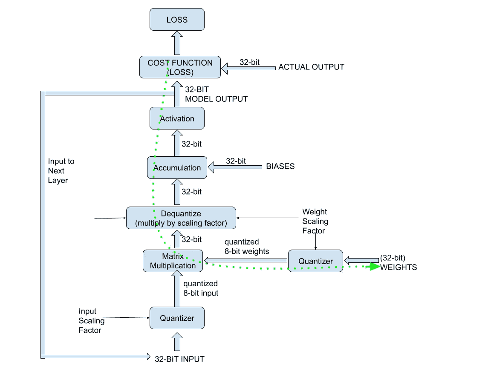

# 量化神经网络模型

> 原文：[`towardsdatascience.com/quantizing-neural-network-models-8ce49332f1d3?source=collection_archive---------7-----------------------#2024-09-07`](https://towardsdatascience.com/quantizing-neural-network-models-8ce49332f1d3?source=collection_archive---------7-----------------------#2024-09-07)

## 理解后训练量化、量化感知训练和直通估算器

 [Arun Nanda](https://medium.com/@arunnanda?source=post_page---byline--8ce49332f1d3--------------------------------)

·发表于[Towards Data Science](https://towardsdatascience.com/?source=post_page---byline--8ce49332f1d3--------------------------------) ·10 分钟阅读·2024 年 9 月 7 日

--

图片由作者制作

大型 AI 模型资源消耗巨大。这使得它们的使用成本很高，训练成本也非常昂贵。因此，当前一个活跃的研究领域是如何在保持精度的同时减小这些模型的规模。量化已成为实现这一目标的最有前景的方法之一。

前一篇文章，*量化 AI 模型的权重*通过数值示例展示了量化的算术运算。它还讨论了不同类型和层次的量化。本文讨论了下一个逻辑步骤——如何从标准模型开始获得一个量化模型。

广泛来说，量化模型有两种方法：

+   使用高精度权重训练模型，并对训练好的模型的权重进行量化。这就是后训练量化（PTQ）。

+   从一个量化模型开始，并在训练过程中考虑量化。这叫做量化感知训练（QAT）。

由于量化涉及将高精度的 32 位浮点权重替换为 8 位、4 位甚至二进制权重，因此不可避免地会导致模型精度的损失。因此，挑战在于如何量化模型，同时尽量减少精度的下降。

由于这是一个不断发展的领域，研究人员和开发者经常采用新的创新方法。本文讨论了两种广泛的技术：

+   量化训练模型——后训练量化（PTQ）

+   训练量化模型——量化感知训练（QAT）

# 量化训练模型——后训练量化（PTQ）

通常，AI 模型使用 32 位浮动点权重进行训练。目前已经有大量的预训练模型库。这些已训练好的模型可以被量化为较低的精度。在量化完已训练好的模型后，可以选择使用额外的数据对模型进行微调，使用小数据集校准模型的参数，或直接使用量化后的模型。这被称为训练后量化（PTQ）。

PTQ 大致可以分为两类：

+   只量化权重

+   同时量化权重和激活值

## 仅量化权重

在这种方法中，激活值保持高精度。只有经过训练的模型的权重会被量化。权重可以在不同的粒度级别进行量化（如按层、按张量等）。文章[*不同的量化方法*](https://medium.com/@arunnanda/different-approaches-to-quantization-e3fac905bd5a)解释了粒度级别。

在量化完权重后，通常还会有一些额外步骤，如跨层均衡。在神经网络中，不同层和通道的权重通常具有非常不同的范围（W_max 和 W_min）。当这些权重使用相同的量化参数进行量化时，可能会导致信息丢失。为了解决这个问题，通常会修改权重，使得不同的层具有相似的权重范围。修改方式确保激活层（权重输入的层）的输出不受影响。这种技术被称为跨层均衡。它利用了激活函数的尺度等变性属性。Nagel 等人在他们的论文[*无数据量化通过权重均衡和偏置修正*](https://arxiv.org/pdf/1906.04721)中详细讨论了跨层均衡（第四部分）。

## 权重和激活量化

除了像以前一样量化权重外，为了提高精度，一些方法还量化了激活值。激活值比权重对量化的敏感度要低。经验表明，激活值可以量化到 8 位，同时几乎保持与 32 位相同的精度。然而，当激活值被量化时，需要使用额外的训练数据来校准激活值的量化范围。

## PTQ 的优缺点

优势在于训练过程保持不变，模型不需要重新训练。因此，量化后的模型更快。也有许多训练好的 32 位模型可以选择。你可以从一个已训练的模型开始，将该模型的权重（即已训练模型的权重）量化为任何精度——例如 16 位、8 位，甚至 1 位。

缺点是准确性损失。训练过程是基于高精度权重来优化模型性能的。因此，当权重被量化为较低精度时，模型不再针对新的量化权重集进行优化。因此，其推理性能会受到影响。尽管应用了各种量化和优化技术，量化模型的表现仍不如高精度模型。通常还会观察到，PTQ 模型在训练数据集上表现良好，但在新的未见过的数据上却无法保持相同的性能。

为了应对 PTQ 的缺点，许多开发者更倾向于训练量化后的模型，有时甚至是从零开始训练。

# 训练量化模型 — 量化感知训练（QAT）

PTQ 的替代方法是训练量化模型。为了训练一个具有低精度权重的模型，必须修改训练过程，以适应模型大部分现在已经量化的事实。这就是量化感知训练（QAT）。有两种方法可以实现这一点：

+   对未训练的模型进行量化并从零开始训练

+   对已训练的模型进行量化，然后重新训练量化后的模型。这通常被认为是一种混合方法。

在许多情况下，QAT 的起点并不是一个未训练的随机权重模型，而是一个预训练的模型。这种方法通常用于极端量化的情况。本文稍后讨论的 BinaryBERT 模型，在文章 [*极限量化：1 位 AI 模型*](https://medium.com/@arunnanda/extreme-quantization-1-bit-ai-models-07169ee29d96) 中应用了类似的方法。

## QAT 的优缺点

QAT 的优势在于模型的表现更好，因为推理过程使用的权重与训练过程中正向传播时使用的权重具有相同的精度。模型经过训练，能够在量化后的权重上表现良好。

缺点是，目前大多数模型使用的是更高精度的权重，需要重新训练。这是资源密集型的。是否能在实际使用中达到旧版高精度模型的性能仍待验证。同时，也有待验证量化模型是否能够成功扩展。

## QAT 的历史背景

QAT 作为一种实践，至少已经存在几年了。Courbariaux 等人在他们的[2015 年论文 *BinaryConnect: 使用二进制权重训练深度神经网络*](https://arxiv.org/pdf/1511.00363)中讨论了他们将计算机视觉神经网络量化为二进制权重的方法。他们在前向传播过程中量化权重，在反向传播过程中使用未量化的权重（第 2.3 节）。当时在 Google 的 Jacob 等人，在他们 2017 年发表的论文[《神经网络的量化与训练，用于高效的整数算术推理》](https://arxiv.org/pdf/1712.05877)（第三部分）中解释了 QAT 的理念。他们没有明确使用“量化感知训练”这一术语，而是称其为“模拟量化”。

## QAT 过程概述

以下步骤展示了基于前述文献的 QAT 过程中的重要部分。请注意，其他研究人员和开发者可能采用了这些步骤的变体，但整体原则保持不变。

+   在整个过程中保持未量化的权重副本。这个副本有时被称为潜在权重或阴影权重。

+   基于最新的阴影权重的量化版本运行前向传播（推理）。这模拟了量化模型的工作过程。前向传播中的步骤如下：

    - 在矩阵相乘之前，对权重和输入进行量化。

    - 对卷积的输出（矩阵乘法）进行反量化。

    - 将偏置（未量化）加到卷积的输出中。

    - 将累加结果通过激活函数得到输出。

    - 将模型的输出与预期输出进行比较，并计算模型的损失。

+   反向传播在全精度下进行。这允许模型参数进行微小的调整。要执行反向传播：

    - 以全精度计算梯度

    - 通过梯度下降更新所有权重和偏置的全精度副本

+   训练完成模型后，将最终量化的权重版本导出，用于推理。

QAT 有时被称为“伪量化”——这意味着模型训练使用的是未量化的权重，而量化的权重仅用于前向传播。未量化的权重（最新版本）在前向传播过程中被量化。

下面的流程图概述了 QAT 过程。虚线绿色箭头表示更新模型权重的反向传播路径。

由作者创建的图片

下一节解释了反向传播量化权重时的一些细节。

# 量化感知训练中的反向传播

在使用量化权重时，理解梯度计算的工作原理非常重要。当前向传播被修改以包含量化函数时，反向传播也必须相应修改，以包含该量化函数的梯度。为了回顾神经网络和反向传播的概念，请参考[*理解神经网络中的权重更新*](https://medium.com/@simon.palma/understanding-weight-update-in-neural-networks-a9f6e23ce984) by Simon Palma。

在一个常规神经网络中，给定输入 X、权重 W 和偏置 B，卷积累加操作的结果是：

在卷积上应用 sigmoid 激活函数后，得到模型的输出。表达式为：

成本 C 是期望输出与实际输出之间差异的函数。标准的反向传播过程使用链式法则估计成本函数 C 相对于权重的偏导数：

当涉及量化时，上述方程会更改，以反映量化权重：

请注意，公式中有一个额外的项——即量化权重相对于未量化权重的偏导数。仔细观察这个（最后的）偏导数。

## 量化权重的偏导数

量化函数可以简单地表示为：

在上面的表达式中，w 是原始（未量化、全精度）权重，s 是缩放因子。回顾一下[量化 AI 模型的权重](https://medium.com/@arunnanda/quantizing-the-weights-of-ai-models-39f489455194)（或者基本的数学知识），将浮点权重映射到二进制权重的函数图是一个阶跃函数，如下所示：

图像由作者提供

这是我们需要计算偏导数的函数。阶跃函数的导数要么为 0，要么是未定义的——在区间的边界处未定义，其他地方为 0。为了解决这个问题，通常使用“直通估计器（STE）”来处理反向传播。

## 直通估计器（STE）

Bengio 等人在他们 2013 年的论文中[*估计或传播通过随机神经元的梯度以进行条件计算*](https://arxiv.org/abs/1308.3432)提出了 STE 的概念。Huh 等人在他们 2023 年的论文[*理顺直通估计器：克服向量量化网络中的优化挑战*](https://arxiv.org/abs/2305.08842)中，解释了 STE 在使用链式法则对损失函数求导中的应用（第二部分，第 7 个方程）。

STE 假设相对于未量化权重的梯度本质上等于相对于量化权重的梯度。换句话说，它假设在 Clip 函数的区间内，

因此，成本函数 C 对未量化权重的导数假设与基于量化权重的导数相等。

因此，成本的梯度表示为：

这就是直通估计器（STE）如何在反向传递中使用量化权重进行梯度计算的方式。在估算梯度后，下一个迭代的权重像往常一样更新（下式中的 alpha 表示学习率）：

上述的 Clip 函数确保更新后的（未量化）权重保持在边界 W_min 和 W_max 之内。

# 结论

量化神经网络模型使它们能够在较小的服务器甚至边缘设备上运行。量化模型有两种广泛的方法，每种方法都有其优缺点：

+   后训练量化 (PTQ)：从高精度训练模型开始，将其量化（后训练量化）为低精度。

+   量化感知训练 (QAT)：在训练模型的前向传递过程中应用量化，以便优化考虑量化推理。

本文讨论了这两种方法，但重点关注 QAT，尤其是对于现代的 1 位量化大语言模型，如 [BitNet](https://medium.com/@arunnanda/understanding-1-bit-large-language-models-a33cc6acabb3) 和 [BitNet b1.58](https://medium.com/@arunnanda/understanding-1-58-bit-large-language-models-88373010974a)。自 2021 年起，[NVIDIA 的 TensorRT 已包含一个量化工具包，用于执行 QAT 和量化推理，支持 8 位模型权重](https://developer.nvidia.com/blog/achieving-fp32-accuracy-for-int8-inference-using-quantization-aware-training-with-tensorrt/)。有关量化神经网络原理的更深入讨论，请参阅 Krishnamoorthi 2018 年的白皮书 [*Quantizing deep convolutional networks for efficient inference*](https://arxiv.org/pdf/1806.08342)。

量化涵盖了一系列可以应用于不同精度级别、网络中不同粒度以及训练过程中不同方式的技术。下一篇文章，[*量化的不同方法*](https://medium.com/@arunnanda/different-approaches-to-quantization-e3fac905bd5a)，讨论了这些多样化的方法，这些方法应用于现代实现，如[BinaryBERT](https://medium.com/@arunnanda/extreme-quantization-1-bit-ai-models-07169ee29d96)、[BitNet](https://medium.com/@arunnanda/understanding-1-bit-large-language-models-a33cc6acabb3)和[BitNet b1.58](https://medium.com/@arunnanda/understanding-1-58-bit-large-language-models-88373010974a)。
