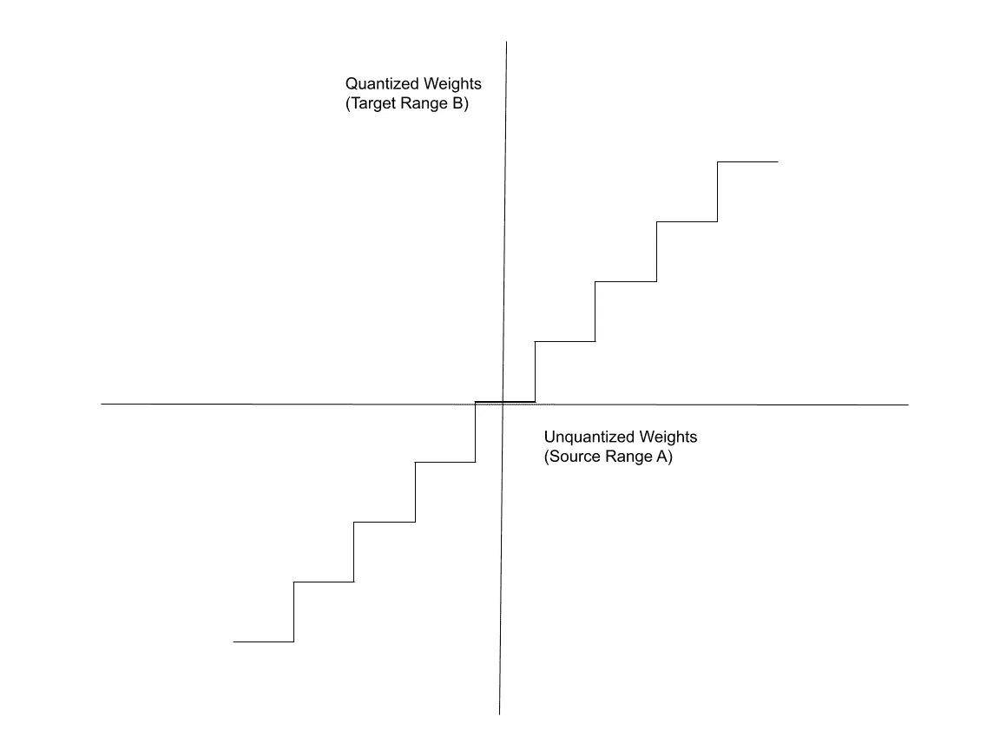
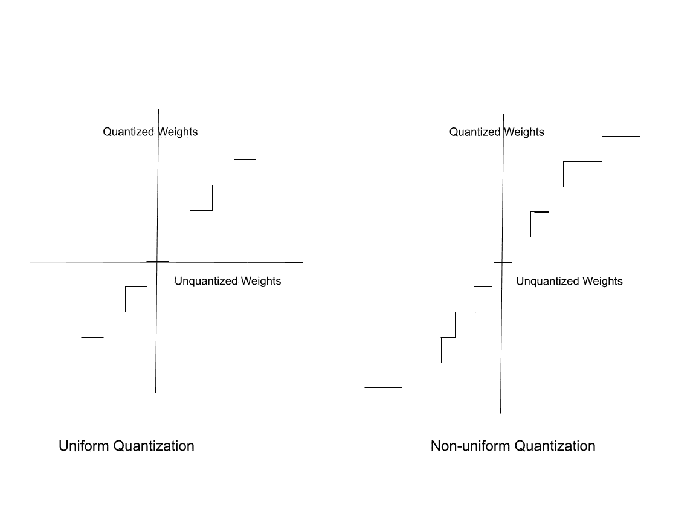

# 人工智能模型权重的量化

> 原文：[`towardsdatascience.com/quantizing-the-weights-of-ai-models-39f489455194?source=collection_archive---------6-----------------------#2024-09-07`](https://towardsdatascience.com/quantizing-the-weights-of-ai-models-39f489455194?source=collection_archive---------6-----------------------#2024-09-07)

## 将高精度浮点权重转换为低精度整数权重

 [Arun Nanda](https://medium.com/@arunnanda?source=post_page---byline--39f489455194--------------------------------)

·发布于 [Towards Data Science](https://towardsdatascience.com/?source=post_page---byline--39f489455194--------------------------------) ·12 分钟阅读·2024 年 9 月 7 日

--

图片由作者创作

为了使人工智能模型更具经济性和可获取性，许多开发人员和研究人员正致力于让模型变得更小，但同样强大。在本系列的前一篇文章中，[ *减少人工智能模型的大小*](https://medium.com/@arunnanda/reducing-the-size-of-ai-models-4ab4cfe5887a) 对量化作为一种成功的技术进行了基本介绍，用于减少人工智能模型的大小。在深入了解人工智能模型的量化之前，了解量化操作的原理是很有必要的。

本文是系列文章的第二篇，介绍了量化运算的实际操作。文章从数字范围缩放的简单例子开始，逐步讲解了包括裁剪、舍入和不同类型缩放因子的例子。

计算机系统中表示实数的方式有很多种，例如 32 位浮点数、8 位整数等。不管采用哪种表示方式，计算机只能在有限的范围内表示数字，并且精度是有限的。32 位浮点数（使用[IEEE 754 32 位二进制](https://en.wikipedia.org/wiki/IEEE_754)系统）范围从 -3.4 * 10³⁸ 到 +3.4 * 10³⁸。该格式中可以编码的最小正数约为 1 * 10^-38。而有符号的 8 位整数范围是从 -128 到 +127。

传统上，模型权重以 32 位浮点数表示（在许多大型模型中，采用 16 位浮点数）。当量化为 8 位整数时（例如），量化函数将 32 位浮点数的整个范围映射到 -128 到 +127 之间的整数。

# 数字范围的缩放

考虑一个基础的例子：你需要将整数范围 A 中的数字从-1000 到 1000 映射到整数范围 B 中的数字，从-10 到+10。直观上，范围 A 中的数字 500 映射到范围 B 中的数字 5。以下步骤展示了如何通过公式进行此操作：

+   要将一个数字从一个范围转换到另一个范围，你需要乘以合适的缩放因子。范围 A 中的数字 500 可以在范围 B 中表示如下：

> 500 * 缩放因子 = 范围 B 中 500 的表示 = 5

+   要计算缩放因子，需要将目标范围的最大值和最小值之间的差与原始范围的差进行比值计算：

+   要映射数字 500，需要将其乘以缩放因子：

> 500 * (1/100) = 5

+   基于上述公式，尝试映射数字 510：

> 510 * (1/100) = 5.1

+   由于范围 B 只包含整数，因此在上述公式中加入四舍五入函数：

> 四舍五入 ( 510 * (1/100) ) = 5

+   类似地，范围 A 中从 500 到 550 的所有数字都会映射到范围 B 中的数字 5。基于此，请注意映射函数类似于一个阶梯函数，且每一步都是均匀的。

图片由作者创建

图中的 X 轴表示源范围 A（未量化权重），Y 轴表示目标范围 B（量化权重）。

# 简单的整数量化

作为一个更实际的例子，考虑一个浮动范围- W 到+ W，你希望将其量化为带符号的 N 位整数。带符号 N 位整数的范围是-2^(N-1)到+2^(N-1)-1。但为了简化说明，假设范围从-2^(N-1)到+2^(N-1)。例如，带符号的 8 位整数的范围是-16 到+15，但这里我们假设范围是从-16 到+16。这个范围围绕 0 对称，这种技术称为对称范围映射。

+   缩放因子 s 为：

+   量化后的数字是未量化数字与缩放因子的乘积。为了量化为整数，我们需要将这个乘积四舍五入到最接近的整数：

为了去除目标范围围绕 0 对称的假设，你还需要考虑零点偏移量，具体如下一节所述。

# 零点量化

在之前的例子中使用的数字范围是-2^(N-1)到+2^(N-1)，它是围绕 0 对称的。而范围-2^(N-1)到+2^(N-1)-1，由 N 位整数表示，并不是对称的。

当量化数字范围不是对称时，你会向权重和缩放因子的乘积中添加一个修正项，称为零点偏移量。这个偏移量会使得范围有效地围绕零对称。反过来，偏移量表示在未量化范围内数字 0 的量化值。以下步骤展示了如何计算零点偏移量 z。

+   带偏移量的量化关系表达为：

+   将原始区间和量化区间的极值点进行映射。在这个上下文中，W_min 和 W_max 指的是原始未量化范围内的最小值和最大值。

+   解这些线性方程来求解缩放因子 s，我们得到：

+   类似地，我们可以通过缩放因子 s 来表示偏移量 z，公式如下：

+   在上述关系中代入 s：

+   由于我们是从浮动数转换为整数，因此偏移量也需要是整数。对上述表达式进行四舍五入：

## 零点的含义

在上述讨论中，偏移量值被称为零点偏移量。之所以称其为零点，是因为它是浮点权重 0 的量化值。

当 W = 0 时，在

你得到：

这篇文章[*零点量化：我们如何得到这些公式*](https://medium.com/@luis.vasquez.work.log/zero-point-quantization-how-do-we-get-those-formulas-4155b51a60d6)由 Luis Vasquez 撰写，讨论了零点量化的多个示例和说明性图片。

# 反量化

获取原始浮点值近似值的函数被称为反量化函数。它实际上是原始量化关系的反函数：

理想情况下，反量化后的权重应等于原始权重。但由于量化函数中的四舍五入操作，实际上并非如此。因此，反量化过程中会涉及信息的损失。

# 提高量化精度

上述方法的最大缺点是精度损失。Bhandare 等人于 2019 年在题为[*高效的 8 位量化变换器神经机器翻译模型*](https://arxiv.org/pdf/1906.00532)的论文中首次对 Transformer 模型进行了量化。他们展示了如前所述的简单量化方法会导致精度的损失。在梯度下降法，或者说任何优化算法中，权重在每次迭代中仅会发生轻微的变化。因此，量化方法必须能够捕捉到权重的微小变化。

## 裁剪范围

量化区间有固定且有限的整数范围。而未量化的浮动点数有着非常广泛的范围。为了提高精度，缩小（裁剪）浮动点区间的范围是有帮助的。

已观察到，神经网络中的权重遵循一种统计分布，例如正态高斯分布。这意味着，大多数权重落在一个较窄的区间内，例如在 W_max 和 W_min 之间。超过 W_max 和 W_min 的部分，只有少数异常值。

在以下描述中，权重被裁剪，W_max 和 W_min 指的是裁剪范围内权重的最大值和最小值。

将浮动点权重的范围限制在此区间内意味着：

+   落在分布尾部的权重被裁剪——高于 W_max 的权重被裁剪到 W_max。小于 W_min 的权重被裁剪到 W_min。W_min 和 W_max 之间的范围就是裁剪范围。

+   由于浮动点权重的范围缩小了，较小的未量化范围映射到相同的量化范围。因此，量化范围现在可以更好地反映未量化权重值的微小变化。

上一节中展示的量化公式经过修改，包含了裁剪操作：

裁剪范围是可定制的。你可以选择这个区间的宽窄。如果裁剪过于激进，可能会丢失对模型精度有贡献的权重。因此，这是一种权衡——将裁剪区间设得过窄可以提高区间内权重量化的精度，但由于那些被视为异常值并被裁剪掉的权重信息丢失，也会降低模型的准确性。

## 确定裁剪参数

许多研究人员注意到，模型权重的统计分布对模型的性能有显著影响。因此，量化权重时必须以保持这些统计特性为前提。使用统计方法，例如 Kullback-Leibler 散度，可以衡量量化和未量化分布之间权重分布的相似性。

W_max 和 W_min 的最优裁剪值是通过反复尝试不同值并测量量化权重和未量化权重的直方图之间的差异来选择的。这被称为量化的校准。其他方法包括最小化量化权重与全精度权重之间的均方误差。

## 不同的缩放因子

有多种方法可以将浮动点数转换为低精度整数。关于什么是正确的缩放因子，并没有硬性规定。研究人员尝试了多种方法。一般的指导方针是选择一个缩放因子，使得未量化和量化的分布具有相似的统计特性。

**MinMax 量化**

前面章节中的示例通过 W_max 和 W_min 的差值（即集合中的最大权重和最小权重）来缩放每个权重。这称为最小最大值量化。

这是最常见的量化方法之一。

**绝对最大值量化**

也可以通过最大权重的绝对值来缩放权重：

Wang 等人在其 2023 年发表的论文《[BitNet: 扩展 1 位 Transformer 以适应大型语言模型](https://arxiv.org/pdf/2310.11453)》中，使用绝对最大值量化来构建 1 位的 BitNet Transformer 架构。BitNet 架构将在本系列后续内容中进行解释，参见[《*理解 1 位大型语言模型*》](https://medium.com/@arunnanda/understanding-1-bit-large-language-models-a33cc6acabb3)。

**绝对均值量化**

另一种方法是将缩放因子设置为所有未量化权重的绝对值的平均值：

Ma 等人在 2024 年发表的论文《[1 位 LLM 时代：所有大型语言模型都在 1.58 位](https://arxiv.org/pdf/2402.17764)》中，使用绝对均值量化来构建 1.58 位的 BitNet 变体。欲了解更多关于 1.58 位语言模型的信息，请参阅[《*理解 1.58 位大型语言模型*》](https://medium.com/@arunnanda/understanding-1-58-bit-large-language-models-88373010974a)。

## 量化粒度

可以使用相同的量化尺度来量化模型中的所有权重。然而，为了更好的准确性，通常会分别对每个张量、通道和层进行标定和估算范围与量化公式。文章[《*量化的不同方法*》](https://medium.com/@arunnanda/different-approaches-to-quantization-e3fac905bd5a)讨论了应用量化的粒度级别。

# 极端量化

传统的量化方法将模型权重的精度降低到 16 位或 8 位整数。极端量化指的是将权重量化为 1 位或 2 位整数。将权重量化为 1 位整数（{0, 1}）称为二值化。将浮动点权重二值化的简单方法是将正权重映射为+1，负权重映射为-1：

同样，也可以将权重量化为三元制（{-1, 0, +1}）：

在上述系统中，Delta 是一个阈值。在简化方法中，可以按以下方式量化为三元制：

+   将未量化的权重归一化到-1 到+1 之间

+   将权重大于-0.5 的权重量化为-1

+   将权重大于-0.5 且小于+0.5 的权重量化为 0

+   将权重大于 0.5 的权重量化为+1。

直接应用二值化和三值化量化会导致较差的结果。如前所述，量化过程必须保留模型权重分布的统计特性。在实践中，常常在应用量化之前调整原始权重的范围，并尝试不同的缩放因子。

在本系列的后续文章中，[*理解 1 位大语言模型*](https://medium.com/@arunnanda/understanding-1-bit-large-language-models-a33cc6acabb3)和[*理解 1.58 位语言模型*](https://medium.com/@arunnanda/understanding-1-58-bit-large-language-models-88373010974a)讨论了权重的二值化和三值化的实际例子。2017 年由 Zhu 等人撰写的论文[*训练三值量化*](https://arxiv.org/pdf/1612.01064)和刘等人于 2023 年发布的关于三值量化的调查论文[2023 survey paper on ternary quantization](https://arxiv.org/pdf/2303.01505)深入探讨了三值量化的细节。

二值化的前提是，尽管这个过程（二值化）似乎导致了信息丢失，但使用大量的权重弥补了这种损失。二值化权重的统计分布与未量化权重的分布相似。因此，即使使用二进制权重，深度神经网络仍然能够展示良好的性能。

# 非均匀量化

目前讨论的量化方法将未量化权重的范围均匀映射到量化后的权重。之所以称之为“均匀”，是因为映射区间是等距离的。为了澄清，当你将范围-1000 到+1000 映射到范围-10 到+10 时：

+   从-1000 到-951 之间的所有数字都映射到-10

+   从-950 到-851 的区间映射到-9

+   从-850 到-751 的区间映射到-8

+   依此类推……

这些区间也被称为区间。

均匀量化的缺点在于，它没有考虑到权重本身的统计分布。它在权重均匀分布于 W_max 和 W_min 之间时效果最佳。浮动点权重的范围可以被视为划分为均匀的区间，每个区间映射到一个量化后的权重。

实际上，浮动点权重并不是均匀分布的。有些区间包含大量未量化的权重，而其他区间则非常少。非均匀量化旨在通过一种方式创建这些区间，使得权重密度较高的区间映射到更大的量化权重区间。

表示权重的非均匀分布有不同的方法，比如 K-means 聚类。然而，这些方法目前在实践中并未得到应用，因为它们实现的计算复杂度较高。大多数实际的量化系统基于均匀量化。

在下图的假设图表中，右侧图表显示了未量化的权重在范围边缘的分布密度较低，而在范围中间的密度较高。因此，量化后的区间在边缘较大，在中间则较为紧凑。

图片由作者制作

# 激活值与偏置的量化

激活值的量化方式与权重类似，但使用了不同的比例尺。在某些情况下，激活值的量化精度高于权重。在像[BinaryBERT](https://medium.com/@arunnanda/extreme-quantization-1-bit-ai-models-07169ee29d96)和[1 位 Transformer——BitNet](https://medium.com/@arunnanda/understanding-1-bit-large-language-models-a33cc6acabb3)这样的模型中，权重被量化为二进制，而激活值则保持 8 位精度。

偏置项并不总是进行量化。由于偏置项仅进行简单的加法运算（与矩阵乘法不同），因此量化偏置项的计算优势并不显著。此外，偏置项的数量远少于权重项的数量。

# 结论

本文通过（带有数值示例）解释了几种常用的浮动点模型权重量化方法。这里讨论的数学关系构成了[1 位权重量化](https://medium.com/@arunnanda/understanding-1-bit-large-language-models-a33cc6acabb3)和[1.58 位权重量化](https://medium.com/@arunnanda/understanding-1-58-bit-large-language-models-88373010974a)的基础——这些话题将在本系列后续文章中讨论。

若要了解更多关于量化的数学原理，请参阅[Weng 在 2023 年的调查论文](https://arxiv.org/pdf/2112.06126)。Lei Mao 的[*神经网络量化*](https://leimao.github.io/article/Neural-Networks-Quantization/)一文更详细地解释了量化神经网络中涉及的数学关系，包括非线性激活函数，如 ReLU。文中还提供了实现量化的代码示例。本系列的下一篇文章，[*神经网络模型的量化*](https://medium.com/@arunnanda/quantizing-neural-network-models-8ce49332f1d3)，介绍了神经网络模型量化的高层次过程。
