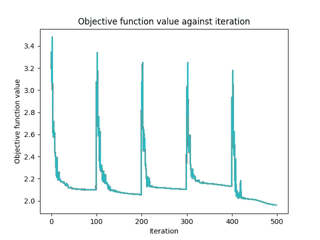

# 使用 Python 进行量子机器学习：核方法与神经网络

> 原文：[`towardsdatascience.com/quantum-machine-learning-with-python-kernel-methods-and-neural-networks-d60738aa99e1?source=collection_archive---------3-----------------------#2024-03-12`](https://towardsdatascience.com/quantum-machine-learning-with-python-kernel-methods-and-neural-networks-d60738aa99e1?source=collection_archive---------3-----------------------#2024-03-12)

[](https://xaviervasques.medium.com/?source=post_page---byline--d60738aa99e1--------------------------------)[](https://towardsdatascience.com/?source=post_page---byline--d60738aa99e1--------------------------------) [Xavier Vasques](https://xaviervasques.medium.com/?source=post_page---byline--d60738aa99e1--------------------------------)

·发表于 [Towards Data Science](https://towardsdatascience.com/?source=post_page---byline--d60738aa99e1--------------------------------) ·15 分钟阅读·2024 年 3 月 12 日

--


由 Annamária Borsos 拍摄（经许可使用）

# 介绍

量子机器学习（QML）代表了量子计算和机器学习技术的一个迷人融合。随着量子计算在数学和复杂结构数据处理方面的潜力，QML 有可能革新药物发现、金融等多个领域。本博客深入探讨了量子神经网络（QNNs）和量子核技术的创新领域，通过实际的 Python 示例展示了它们的独特能力。博客中不会详细介绍数学概念。如需了解更多信息，请随时阅读我最新的书籍《*机器学习理论与应用：在经典与量子机器上的 Python 实战用例*》，Wiley，2024 年。

量子核方法引入了一种量子增强的数据处理方式。通过将经典数据映射到量子特征空间，这些方法利用量子力学的叠加和纠缠特性来执行分类或回归任务。使用量子核估计器和量子变分分类器的示例展示了这些概念的实际应用。量子神经网络（QNNs）利用量子态进行计算，提供了一种全新的神经网络架构方法。Qiskit 框架支持量子核方法和 QNN 的实现，使得探索量子算法在学习和模式识别中的效率成为可能。

通过结合 Python 代码示例，本博客旨在为读者提供全面的 QML 代码示例，帮助他们探索其有前景的应用和所面临的挑战。通过这些示例，读者可以开始实践并理解量子计算在机器学习中的变革潜力以及未来的激动人心的可能性。

# 首先，安装 qiskit

我们将使用开源 SDK Qiskit ([`qiskit.org`](https://qiskit.org/))，它允许与量子计算机进行交互。Qiskit 支持 Python 3.6 及更高版本。

在我们的环境中，我们可以使用 pip 安装 Qiskit：

```py
pip install qiskit
```

我们也可以使用 pip 安装 qiskit-machine-learning：

```py
pip install qiskit-machine-learning
```

文档可以在 GitHub 上找到：[`github.com/Qiskit/qiskit-machine-learning/`](https://github.com/Qiskit/qiskit-machine-learning/)。

为了运行我们的代码，我们可以使用模拟器或实际硬件，尽管我强烈推荐使用硬件，或推动模拟器的极限以促进该领域的研究。在学习 Qiskit 文档时，您将遇到 Qiskit Runtime 原语的相关内容，这些原语是 qiskit.primitives 模块中 Sampler 和 Estimator 接口的实现。这些接口通过最小的代码修改，便于原语实现的无缝互换。Qiskit Runtime 的初始版本包含两个基本原语：

+   Sampler（采样器）：这个原语基于输入电路生成准概率。

+   Estimator（估计器）：这个原语计算由输入电路和可观察量导出的期望值。

有关更全面的见解，详细信息可以在以下资源中找到：[`qiskit.org/ecosystem/ibm-runtime/tutorials/how-to-getting-started-with-sampler.html.`](https://qiskit.org/ecosystem/ibm-runtime/tutorials/how-to-getting-started-with-sampler.html.)

# 量子核方法

探索用于监督式机器学习的量子方法是一个新颖的研究方向。经典机器学习广泛利用核方法，其中支持向量机（SVM）分类方法因其广泛应用而脱颖而出。

支持向量机（SVM），因其在二分类中的作用而著名，近年来越来越多地应用于多分类问题。二分类 SVM 的核心是通过构造一个超平面，将 n 维数据点线性地分成两组，目的是寻找到一个最佳的边界，使数据能够清晰地被分类到各自的类别中。这个超平面可以有效地在原始特征空间或转换后的高维核空间中选择，选取标准是能够最大化类之间的分隔，这涉及一个优化问题，即最大化边距，边距定义为从最近的数据点到超平面两侧的距离。这导致了最大边距分类器的形成。边界上的关键数据点被称为支持向量，而边距则是通常没有数据点的区域。如果一个最优超平面离数据点过近，表示边距狭窄，则会削弱模型的预测鲁棒性和泛化能力。

为了解决多分类 SVM 的挑战，引入了类似全对策略（all-pair strategy）的方法，该方法对每一对类别进行二分类。除了简单的线性分类外，还可以通过核技巧实现非线性分类。这一技术通过核函数将输入映射到一个更广阔的高维特征空间，从而促进了在输入空间中无法线性分隔的数据的分离。核函数本质上是在一个可能非常庞大的欧几里得空间中执行内积运算，这个空间被称为特征空间。非线性 SVM 的目标是通过使用合适的映射将数据映射到一个更高维度，从而实现数据的分离。选择合适的特征映射对于那些不能仅通过线性方法解决的数据至关重要。在这一点上，量子技术可以发挥作用。量子核方法将经典核策略与量子创新相结合，为机器学习开辟了新的途径。早期的量子核方法主要集中在通过量子特征映射将数据点编码为内积或希尔伯特空间中的幅度。实现特征映射的量子电路的复杂度与数据集的大小呈线性或对数线性增长。

# 带有 ZZFeatureMaps 的量子核

在这个第一个例子中，我们将使用带有线性纠缠的 ZZFeatureMap，我们将数据编码步骤重复两次，并使用主成分分析进行特征降维。当然，你可以使用其他特征降维、数据重新缩放或特征选择技术来提高模型的准确性。我们将使用乳腺癌数据集，你可以在这里找到：[`github.com/xaviervasques/hephaistos/blob/main/data/datasets/breastcancer.csv`](https://github.com/xaviervasques/hephaistos/blob/main/data/datasets/breastcancer.csv)

让我们描述一下下面 Python 脚本的步骤。此 Python 脚本演示了将量子计算技术与传统机器学习相结合以分类乳腺癌数据的应用。它代表了一种混合方法，在经典机器学习工作流中使用量子增强特征。目标是根据从乳腺肿块特征提取的一组特征来预测乳腺癌的诊断结果（良性或恶性）。  

进行量子核机器学习的方式与我们作为数据科学家做的经典机器学习非常相似。我们导入必要的库（Pandas、NumPy、scikit-learn）和用于量子计算和核估计的 Qiskit，加载数据，预处理数据并将数据分为特征（X）和目标标签（y）。一个具体的步骤是量子特征映射。该脚本使用 Qiskit 中的 ZZFeatureMap 设置量子特征图，并配置特征维度、重复次数和纠缠类型等参数。量子特征图对于将经典数据转换为量子态至关重要，从而实现量子计算原理在数据分析中的应用。接着，量子核的设置包含基于保真度的方法来配置量子核。它作为一种新的方法，用于计算数据点在由量子态定义的特征空间中的相似性，并有可能捕捉复杂的模式。最后一步回到经典机器学习流程，通过标准化缩放数据、使用主成分分析进行降维，并使用支持向量分类器（SVC）进行分类，SVC 利用量子核进行分类。我们使用 5 折交叉验证来评估模型。  

让我们开始编写代码。  

```py
# Import necessary libraries for data manipulation, machine learning, and quantum computing
import pandas as pd
import numpy as np
from sklearn.model_selection import train_test_split
from sklearn.preprocessing import LabelEncoder

# Load the dataset using pandas, specifying the file location and delimiter
breastcancer = './breastcancer.csv'
df = pd.read_csv(breastcancer, delimiter=';')

# Remove the 'id' column as it is not useful for prediction, to simplify the dataset
df = df.drop(["id"], axis=1)

# Separate the dataset into features (X) and target label (y)
y = df['diagnosis']  # Target label: diagnosis
X = df.drop('diagnosis', axis=1)  # Features: all other columns

# Convert the diagnosis string labels into numeric values to be used by machine learning models
label_encoder = LabelEncoder()
y = label_encoder.fit_transform(y)

# Quantum computing sections start here
# Set parameters for the quantum feature map
feature_dimension = 2  # Number of features used in the quantum feature map
reps = 2  # Number of repetitions of the feature map circuit
entanglement = 'linear'  # Type of entanglement in the quantum circuit

# Import quantum feature mapping utilities from Qiskit
from qiskit.circuit.library import ZZFeatureMap
qfm = ZZFeatureMap(feature_dimension=feature_dimension, reps=reps, entanglement=entanglement)

# Set up a local simulator for quantum computation
from qiskit.primitives import Sampler
sampler = Sampler()

# Configure quantum kernel using ZZFeatureMap and a fidelity-based quantum kernel
from qiskit.algorithms.state_fidelities import ComputeUncompute
from qiskit_machine_learning.kernels import FidelityQuantumKernel
fidelity = ComputeUncompute(sampler=sampler)
quantum_zz = FidelityQuantumKernel(fidelity=fidelity, feature_map=qfm)

# Create a machine learning pipeline integrating standard scaler, PCA for dimensionality reduction,
# and a Support Vector Classifier using the quantum kernel
from sklearn.pipeline import make_pipeline
from sklearn.preprocessing import StandardScaler
from sklearn.decomposition import PCA
from sklearn.svm import SVC
pipeline = make_pipeline(StandardScaler(), PCA(n_components=2), SVC(kernel=quantum_zz.evaluate))

# Evaluate the model using cross-validation to assess its performance
from sklearn.model_selection import cross_val_score
cv = cross_val_score(pipeline, X, y, cv=5, n_jobs=1)  # n_jobs=1 specifies that the computation will use 1 CPU
mean_score = np.mean(cv)  # Calculate the mean of the cross-validation scores

# Print the mean cross-validation score to evaluate the model's performance
print(mean_score)
```

我们将获得一个平均分验证得分为 0.63。

这段代码在本地模拟器上执行。要在真实硬件上运行，请替换以下几行：  

```py
# Set up a local simulator for quantum computation
from qiskit.primitives import Sampler
sampler = Sampler()
```

by  

```py
# Import necessary classes from qiskit_ibm_runtime for accessing IBM Quantum services
from qiskit_ibm_runtime import QiskitRuntimeService, Sampler

# Initialize the QiskitRuntimeService with your IBM Quantum credentials
# 'channel', 'token', and 'instance' are placeholders for your actual IBM Quantum account details
service = QiskitRuntimeService(channel='YOUR CHANNEL', token='YOUR TOKEN FROM IBM QUANTUM', instance='YOUR INSTANCE')

# Specify the backend you wish to use. This could be a simulator or an actual quantum computer available through IBM Quantum
# 'quantum_backend' should be replaced with the name of the quantum backend you wish to use
backend = service.backend('quantum_backend')

# Import the Options class to customize the execution of quantum programs
from qiskit_ibm_runtime import Options
options = Options()  # Create an instance of Options

# Set the resilience level. Level 1 typically implies some level of error mitigation or resilience against errors
options.resilience_level = 1

# Set the number of shots, which is the number of times the quantum circuit will be executed to gather statistics
# More shots can lead to more accurate results but take longer to execute
options.execution.shots = 1024

# Set the optimization level for compiling the quantum circuit
# Higher optimization levels attempt to reduce the circuit's complexity, which can improve execution but may take longer to compile
options.optimization_level = 3

# Initialize the Sampler, which is used to run quantum circuits and obtain samples from their measurement outcomes
# The Sampler is configured with the specified backend and options
sampler = Sampler(session=backend, options=options)
```

# 量子核训练  

本部分将探索量子核对齐（QKA）方法，用于二分类任务。QKA 通过迭代调整参数化的量子核，以适应数据集，旨在支持向量机（SVM）中实现尽可能大的间隔。有关 QKA 的更多细节，请参考名为《适用于具有群结构数据的协变量子核》的预印本。下面的 Python 脚本是一个综合示例，展示了如何将传统机器学习技术与量子计算相结合，以提高乳腺癌诊断分类的预测准确性。它使用乳腺癌特征数据集来预测诊断结果（良性或恶性）。  

该机器学习管道与使用 ZZFeatureMaps 部分中的量子核类似。不同之处在于，我们将构建一个自定义量子电路，将旋转层与 ZZFeatureMap 结合，以准备数据的量子态表示。量子核估计步骤利用 Qiskit 原语和算法，通过量子核训练（QKT）和优化器来优化量子核的参数。

让我们开始编码。  

```py
# Import necessary libraries for data manipulation, machine learning, and quantum computing
import pandas as pd
import numpy as np
from sklearn.model_selection import train_test_split
from sklearn.preprocessing import LabelEncoder

# Load the dataset using pandas, specifying the file location and delimiter
breastcancer = './breastcancer.csv'
df = pd.read_csv(breastcancer, delimiter=';')

# Remove the 'id' column as it is not useful for prediction, to simplify the dataset
df = df.drop(["id"], axis=1)

# Reduce the dataframe size by sampling 1/3 of the data
df = df.sample(frac=1/3, random_state=1)  # random_state for reproducibility

# Separate the dataset into features (X) and target label (y)
y = df['diagnosis']  # Target label: diagnosis
X = df.drop('diagnosis', axis=1)  # Features: all other columns

# Convert the diagnosis string labels into numeric values to be used by machine learning models
label_encoder = LabelEncoder()
y = label_encoder.fit_transform(y)

# Quantum computing sections start here
# Set parameters for the quantum feature map
feature_dimension = 2  # Number of features used in the quantum feature map
reps = 2  # Number of repetitions of the feature map circuit
entanglement = 'linear'  # Type of entanglement in the quantum circuit

# Define a custom rotational layer for the quantum feature map
from qiskit import QuantumCircuit
from qiskit.circuit import ParameterVector
training_params = ParameterVector("θ", 1)
fm0 = QuantumCircuit(feature_dimension)
for qubit in range(feature_dimension):
    fm0.ry(training_params[0], qubit)

# Use ZZFeatureMap to represent input data
from qiskit.circuit.library import ZZFeatureMap
fm1 = ZZFeatureMap(feature_dimension=feature_dimension, reps=reps, entanglement=entanglement)

# Compose the custom rotational layer with the ZZFeatureMap to create the feature map
fm = fm0.compose(fm1)

# Initialize the Sampler, a Qiskit primitive for sampling from quantum circuits
from qiskit.primitives import Sampler
sampler = Sampler()

# Set up the ComputeUncompute fidelity object for quantum kernel estimation
from qiskit.algorithms.state_fidelities import ComputeUncompute
from qiskit_machine_learning.kernels import TrainableFidelityQuantumKernel
fidelity = ComputeUncompute(sampler=sampler)

# Instantiate the quantum kernel with the feature map and training parameters
quant_kernel = TrainableFidelityQuantumKernel(fidelity=fidelity, feature_map=fm, training_parameters=training_params)

# Callback class for tracking optimization progress
class QKTCallback:
    # Callback wrapper class
    def __init__(self):
        self._data = [[] for i in range(5)]

    def callback(self, x0, x1=None, x2=None, x3=None, x4=None):
        #Capture callback data for analysis
        for i, x in enumerate([x0, x1, x2, x3, x4]):
            self._data[i].append(x)

    def get_callback_data(self):
        #Get captured callback data
        return self._data

    def clear_callback_data(self):
        #Clear captured callback data
        self._data = [[] for i in range(5)]

# Setup and instantiate the optimizer for the quantum kernel
from qiskit.algorithms.optimizers import SPSA
cb_qkt = QKTCallback()
spsa_opt = SPSA(maxiter=10, callback=cb_qkt.callback, learning_rate=0.01, perturbation=0.05)

# Quantum Kernel Trainer (QKT) for optimizing the kernel parameters
from qiskit_machine_learning.kernels.algorithms import QuantumKernelTrainer
qkt = QuantumKernelTrainer(
    quantum_kernel=quant_kernel, loss="svc_loss", optimizer=spsa_opt, initial_point=[np.pi / 2]
)

# Reduce dimensionality of the data using PCA
from sklearn.decomposition import PCA
pca = PCA(n_components=2)
X_ = pca.fit_transform(X)

# Train the quantum kernel with the reduced dataset
qka_results = qkt.fit(X_, y)
optimized_kernel = qka_results.quantum_kernel

# Use the quantum-enhanced kernel in a Quantum Support Vector Classifier (QSVC)
from qiskit_machine_learning.algorithms import QSVC
from sklearn.pipeline import make_pipeline
from sklearn.preprocessing import StandardScaler
qsvc = QSVC(quantum_kernel=optimized_kernel)
pipeline = make_pipeline(StandardScaler(), PCA(n_components=2), qsvc)

# Evaluate the performance of the model using cross-validation
from sklearn.model_selection import cross_val_score
cv = cross_val_score(pipeline, X, y, cv=5, n_jobs=1)
mean_score = np.mean(cv)

# Print the mean cross-validation score
print(mean_score)
```

我们将获得以下输出：0.6526315789473685  

正如您所观察到的，尽管我们通过对数据进行采样，仅保留三分之一的数据并将 SPSA 的最大迭代次数设置为 10，但 QKT 和使用像 ZZFeatureMap 这样的预定义特征映射的量子核在执行时间上仍然存在差异。QKT 不仅涉及量子核的使用，还涉及量子特征映射或量子核本身参数的优化，以提高模型性能。这个优化过程需要对参数进行迭代调整，每次迭代都需要运行量子计算来评估当前参数集的性能。这种迭代特性显著增加了计算时间。而使用像 ZZFeatureMap 这样的预定义量子核时，特征映射是固定的，不涉及量子参数的迭代优化。量子计算是用来评估数据点之间的核，但没有调整和优化量子电路参数的额外开销。这种方法更为直接，所需的量子计算较少，因此更快。QKT 中的每个优化步骤都需要评估当前量子核的模型性能，这取决于该步骤中的量子特征映射参数。这意味着需要多次评估核矩阵，每次评估都需要大量的量子计算。  

# **量子神经网络**  

下面的 Python 脚本将量子神经网络（QNNs）集成到机器学习管道中。在这个脚本中，我们需要配置量子特征映射和量子电路结构（ansatz），通过将特征映射和量子电路结构附加到基础量子电路上来构建量子电路（此设置对创建处理输入数据的量子神经网络至关重要），并使用为二分类设计的量子电路创建 QNN。在回到经典机器学习管道之前，包括数据重缩放、数据降维和模型评估，我们采用了一个量子分类器，该分类器将 QNN 与经典优化算法（COBYLA）集成以进行训练。定义了一个回调函数来可视化优化过程，跟踪目标函数值在各个迭代过程中的变化。  

让我们开始编码。  

```py
# Importing essential libraries for handling data, machine learning, and integrating quantum computing
import pandas as pd
import numpy as np
from sklearn.model_selection import train_test_split
from sklearn.preprocessing import LabelEncoder
import matplotlib.pyplot as plt  # For data visualization

# Load and prepare the dataset
breastcancer = './breastcancer.csv'
df = pd.read_csv(breastcancer, delimiter=';')  # Load dataset from CSV file
df = df.drop(["id"], axis=1)  # Remove the 'id' column as it's not necessary for analysis

# Splitting the data into features (X) and the target variable (y)
y = df['diagnosis']  # Target variable: diagnosis result
X = df.drop('diagnosis', axis=1)  # Feature matrix: all data except the diagnosis

# Encoding string labels in 'y' into numerical form for machine learning models
label_encoder = LabelEncoder()
y = label_encoder.fit_transform(y)  # Transform labels to numeric

# Quantum feature map and circuit configuration
feature_dimension = 2  # Dimensionality for the feature map (matches PCA reduction later)
reps = 2  # Number of repetitions of the ansatz circuit for depth
entanglement = 'linear'  # Type of qubit entanglement in the circuit

# Initialize an array to store evaluations of the objective function during optimization
objective_func_vals = []

# Define a callback function for visualization of the optimization process
def callback_graph(weights, obj_func_eval):
    """Updates and saves a plot of the objective function value after each iteration."""
    objective_func_vals.append(obj_func_eval)
    plt.title("Objective function value against iteration")
    plt.xlabel("Iteration")
    plt.ylabel("Objective function value")
    plt.plot(range(len(objective_func_vals)), objective_func_vals)
    plt.savefig('Objective_function_value_against_iteration.png')  # Save plot to file

# Example function not directly used in the main workflow, demonstrating a utility function
def parity(x):
    """Example function to calculate parity of an integer."""
    return "{:b}".format(x).count("1") % 2

# Initializing the quantum sampler from Qiskit
from qiskit.primitives import Sampler
sampler = Sampler()  # Used for sampling from quantum circuits

# Constructing the quantum feature map and ansatz for the quantum circuit
from qiskit.circuit.library import ZZFeatureMap, RealAmplitudes
feature_map = ZZFeatureMap(feature_dimension)
ansatz = RealAmplitudes(feature_dimension, reps=reps)  # Quantum circuit ansatz

# Composing the quantum circuit with the feature map and ansatz
from qiskit import QuantumCircuit
qc = QuantumCircuit(feature_dimension)
qc.append(feature_map, range(feature_dimension))  # Apply feature map to circuit
qc.append(ansatz, range(feature_dimension))  # Apply ansatz to circuit
qc.decompose().draw()  # Draw and decompose circuit for visualization

# Creating a Quantum Neural Network (QNN) using the configured quantum circuit
from qiskit_machine_learning.neural_networks import SamplerQNN
sampler_qnn = SamplerQNN(
    circuit=qc,
    input_params=feature_map.parameters,
    weight_params=ansatz.parameters,
    output_shape=2,  # For binary classification
    sampler=sampler
)

# Configuring the quantum classifier with the COBYLA optimizer
from qiskit.algorithms.optimizers import COBYLA
from qiskit_machine_learning.algorithms.classifiers import NeuralNetworkClassifier
sampler_classifier = NeuralNetworkClassifier(
    neural_network=sampler_qnn, optimizer=COBYLA(maxiter=100), callback=callback_graph)

# Setting up K-Fold Cross Validation to assess model performance
from sklearn.model_selection import KFold
k_fold = KFold(n_splits=5)  # 5-fold cross-validation
score = np.zeros(5)  # Array to store scores for each fold
i = 0  # Index counter for scores array
for indices_train, indices_test in k_fold.split(X):
    X_train, X_test = X.iloc[indices_train], X.iloc[indices_test]
    y_train, y_test = y[indices_train], y[indices_test]

    # Applying PCA to reduce the dimensionality of the dataset to match the quantum feature map
    from sklearn.decomposition import PCA
    pca = PCA(n_components=2)  # Reduce to 2 dimensions for the quantum circuit
    X_train = pca.fit_transform(X_train)  # Transform training set
    X_test = pca.fit_transform(X_test)  # Transform test set

    # Training the quantum classifier with the training set
    sampler_classifier.fit(X_train, y_train)

    # Evaluating the classifier's performance on the test set
    score[i] = sampler_classifier.score(X_test, y_test)  # Store score for this fold
    i += 1  # Increment index for next score

# Calculating and displaying the results of cross-validation
import math
print("Cross-validation scores:", score)
cross_mean = np.mean(score)  # Mean of cross-validation scores
cross_var = np.var(score)  # Variance of scores
cross_std = math.sqrt(cross_var)  # Standard deviation of scores

print("Mean cross-validation score:", cross_mean)
print("Standard deviation of cross-validation scores:", cross_std)
```

我们获得了以下结果：  

交叉验证得分：[0.34210526 0.4122807 0.42982456 0.21929825 0.50442478]  

交叉验证的平均得分：0.3815867101381773

交叉验证分数的标准差：0.09618163326986424



正如我们所看到的，在这个特定数据集上，QNN 并没有提供非常好的分类分数。

# 结论

本博客的目的是让大家更容易开始使用量子机器学习。量子机器学习是量子计算与机器学习交叉领域中的一个新兴领域，具有潜力通过利用量子力学的固有优势来革新我们处理和分析庞大数据集的方式。正如我们在《*使用量子核算法进行量子机器学习在多类神经元 M 型分类中的应用*》一文中所展示的那样，这篇文章已发表于《自然科学报告》，优化量子机器学习模型（包括量子神经网络，QNN）的一项关键内容涉及预处理技术，如特征重缩放、特征提取和特征选择。

这些技术不仅在经典机器学习中至关重要，而且在量子计算框架内应用时也能带来显著的好处，提升量子机器学习算法的性能和效率。在量子领域，特征提取技术如主成分分析（PCA）可以通过量子增强来降低数据的维度，同时保留大部分重要信息。这种维度的减少对于量子机器学习（QML）模型至关重要，因为目前的量子硬件上可用的量子比特数量有限。

量子特征提取能够有效地将高维数据映射到较低维的量子空间，使得量子模型能够以更少的资源处理复杂的数据集。选择最相关的特征也是优化量子电路复杂度和资源分配的一种方式。在量子机器学习中，特征选择有助于识别和利用最具信息量的特征，减少对大量量子资源的需求。

这一过程不仅简化了量子模型，还通过将计算努力集中在对模型预测准确性贡献最大的特征上，提升了模型的性能。

**来源**

[*机器学习理论与应用：在经典和量子计算机上使用 Python 的实践案例,* Wiley, 2024](https://www.amazon.fr/Machine-Learning-Theory-Applications-Hands-ebook/dp/B0CS8MMSB4/ref=sr_1_2?__mk_fr_FR=%C3%85M%C3%85%C5%BD%C3%95%C3%91&crid=1SIBDYLGUX7XR&dib=eyJ2IjoiMSJ9.IV7g17el89GNQznK4WE3TFa0RaOwsRf3n53jTAydpJXjqj4juibAmhXCmZv4JjLLjmbjY0nFBPuzH_p0TYDq_8QTq6SXsh_o3U9b6VT2U_FD5takpiI6ctH05JelH-XQ2mItrIX02LcvRu2jHDE6RDe20qR9DNLG5lY5gi93vbYlPY2ahKtCH5imnzLE4jgLSuU81s5qAaRPPD13MwhwPofgaJ9FqbYbtxrHFAKjPfE.VdY_00svNarbBN4C07OopzZlgOZEVb3AIKSlz_hDA2Y&dib_tag=se&keywords=xavier+vasques&qid=1710253907&sprefix=xavier+vasques%2Caps%2C104&sr=8-2)

*Vasques, X., Paik, H. & Cif, L. 使用量子核算法在多类神经元 M 型分类中的量子机器学习应用。Sci Rep 13, 11541 (2023).* [*https://doi.org/10.1038/s41598-023-38558-z*](https://doi.org/10.1038/s41598-023-38558-z)

本数据集使用的是创意共享署名 4.0 国际版（CC BY 4.0）许可证。
