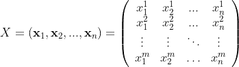
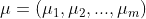
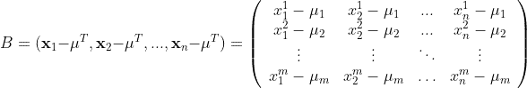
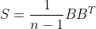

# 量子力学与 PCA 相遇：一种（不）意外的融合

> 原文：[`towardsdatascience.com/quantum-mechanics-meets-pca-an-un-expected-convergence-5e04bcb16376?source=collection_archive---------1-----------------------#2024-05-22`](https://towardsdatascience.com/quantum-mechanics-meets-pca-an-un-expected-convergence-5e04bcb16376?source=collection_archive---------1-----------------------#2024-05-22)

## 量子态与 PCA 组件的联系

 [Rodrigo Silva](https://medium.com/@rodrigopesilva?source=post_page---byline--5e04bcb16376--------------------------------)

·发布于[Towards Data Science](https://towardsdatascience.com/?source=post_page---byline--5e04bcb16376--------------------------------) ·阅读时长 8 分钟·2024 年 5 月 22 日

--

图片由[动态王](https://unsplash.com/@dynamicwang)提供，来自[Unsplash](https://unsplash.com/?utm_source=medium&utm_medium=referral)

数学的最伟大礼物之一就是它奇特的能力，能够像我们的创造力一样广泛。这个广泛性的重要后果是，我们可以使用相同的工具集为截然不同的主题创建形式化方法。当我们这么做时，一个副作用是，某些不同领域之间会出现一些意想不到的类比。为了说明我所说的，我将通过这篇文章说服你，主成分分析（PCA）坐标中的主值和量子系统的能量是相同（数学上的）东西。

# PCA 的线性代数

对于不熟悉主成分分析（PCA）的人，我将简要介绍它的基本概念。PCA 的主要思想是，基于你的数据，获得一组新的坐标系，这样当我们的原始数据被重写到这个新的坐标系中时，坐标轴将指向方差最大的方向。

假设你有一组*n*数据样本（我将从现在开始称它们为*个体*），其中每个个体包含*m*个特征。例如，如果我询问 10 个不同人的体重、身高和工资，那么*n=10*，*m=3*。在这个例子中，我们预计体重和身高之间有某种关系，但这些变量和工资之间没有关系，至少从原理上讲是没有的。PCA 将帮助我们更好地可视化这些关系。为了让我们理解这种情况是如何发生的以及为什么会发生，我将逐步讲解 PCA 算法的每个步骤。

为了开始正式的推导，每个个体将由向量**x**表示，其中该向量的每个分量是一个特征。这意味着我们将有 *n* 个向量，它们存在于 *m* 维空间中。我们的数据集可以看作一个大的矩阵 *X*，*m* x *n*，其中我们本质上将个体并排放置（即每个个体用列向量表示）：

有了这些前提，我们可以正式开始 PCA 算法。

## 数据中心化

数据中心化意味着以某种方式平移数据点，使其分布在坐标系的原点周围。为了实现这一点，我们计算每个特征的均值，并将其从数据点中减去。我们可以将每个特征的均值表示为向量**µ**：

其中 *µ_i* 是对第 *i* 个特征求得的均值。通过数据中心化，我们得到一个新的矩阵 *B*，表示为：

这个矩阵 *B* 表示我们围绕原点中心化的数据集。注意，由于我将均值向量定义为行矩阵，因此在计算 *B* 时需要使用其*转置*（其中每个个体用列矩阵表示），但这只是一个小细节。

## 计算协方差矩阵

我们可以通过将矩阵 *B* 和其转置 *B^T* 相乘来计算协方差矩阵 *S*，如下所示：

前面的 1*/(n-*1*)*因子只是为了使定义与统计学定义一致。可以很容易地证明，上述矩阵的元素 *S_ij* 是特征 *i* 与特征 *j* 的协方差，其对角线元素 *S_ii* 是 *i* 维特征的方差。

## 找到协方差矩阵的特征值和特征向量

我将列出三个关于我们到目前为止构建的协方差矩阵 *S* 的重要线性代数事实（我将在这里不进行证明）：

1.  矩阵 *S* 是对称的：关于对角线的镜像条目是相等的（即 *S_ij = S_ji*）；

1.  矩阵 *S* 是正交对角化的：存在一组数字（λ_1, λ_2, …, λ_m）称为*特征值*，以及一组向量（**v_**1, **v_**2 …, **v_**m）称为*特征向量*，使得，当 *S* 使用特征向量作为基底表示时，它具有对角形式，且对角线元素是其特征值；

1.  矩阵 *S* 只有实数的非负特征值。

在主成分分析（PCA）公式中，协方差矩阵的特征向量称为主成分，特征值称为主值。

初看起来，这似乎只是对一个数据集进行一系列数学运算。但我会给你提供最后一个线性代数的事实，今天的数学部分就到这里：

4\. 矩阵的迹（即对角线元素的总和）与矩阵所表示的基底无关。

这意味着，如果矩阵*S*中对角线元素的和是数据集的总方差，那么矩阵*S*的*特征值*的和也应该是数据集的总方差。我们将这个总方差称为*L*。

牢记这一机制，我们可以按降序排列特征值（λ_1，λ_2，…，λ_m）：λ_1 > λ_2 > … > λ_m，使得λ_1/*L* > λ_2/*L* > … > λ_m/*L*。我们使用数据集的总方差作为重要性度量来对特征值进行排序。第一个主成分**v_1**指向方差最大的方向，因为它的特征值λ_1 占据了总方差的最大贡献。

这就是 PCA 的核心概念。那么…量子力学呢？

# 量子力学的线性代数

也许量子力学中对我们讨论最重要的一个方面是它的一个公设：

> 量子系统的状态用向量表示（通常称为态向量），这些向量存在于一个向量空间中，这个空间称为希尔伯特空间。

当我写到这里时，我注意到我发现这个公设非常自然，因为我每天都见到它，并且已经习惯了。但它有点荒谬，所以请花时间消化一下。请记住，*态*是我们在物理学中使用的一个通用术语，指的是“某个事物在某一时刻的配置”。

这个公设意味着，当我们将物理系统表示为一个向量时，线性代数中的所有规则都适用，因此不会感到惊讶的是，PCA（也依赖于线性代数）和量子力学之间会有一些联系。

由于物理学是研究物理系统如何变化的科学，我们应该能够在量子力学的形式主义中表示*变化*。要*改变*一个向量，我们必须对其应用某种操作，使用一个被称为（毫不奇怪的）算符的数学实体。一类特别重要的算符是线性算符；事实上，它们非常重要，以至于我们通常省略“线性”这个词，因为在讨论算符时，通常默认它们是线性算符。因此，如果你想在酒吧桌上给人留下深刻印象，尽管说出这个爆炸性的事实：

> 在量子力学中，一切都围绕着（态）向量和（线性）算符展开。

## 量子力学中的测量

如果在量子力学的背景下，向量表示物理状态，那么算符表示什么呢？嗯，它们表示物理*测量*。例如，如果我想测量一个量子粒子的位置，在量子力学中，它是通过对与粒子关联的态向量应用位置算符来建模的。同样，如果我想测量一个量子粒子的能量，我必须对其应用能量算符。将量子力学和 PCA 联系起来的关键是记住，当你选择一个基底时，线性算符可以表示为一个矩阵。

表示我们量子系统的一种非常常见的基是由能量算符的特征向量构成的基。在这个基中，能量算符矩阵是对角的，且其对角线上的项是系统在不同能量（本征）态下的能量。这些能量值的总和对应于能量算符的迹，如果你停下来仔细思考，显然这个总和在基变换下不会改变，正如本文早些时候所说的那样。如果它发生了变化，那就意味着应该有可能通过改变组件的表示方式来改变系统的能量，这显然是荒谬的。你在实验室中的测量仪器并不关心你是使用基 A 还是基 B 来表示你的系统：如果你测量的是能量，那你测量的就是能量，仅此而已。

# 能量与主成分分析（PCA）

综上所述，对 PCA 分解的主值的一个很好的解释是，它们对应于你系统的“能量”。当你按降序排列主值（和主成分）时，你实际上是优先考虑了那些携带你系统最大“能量”的“状态”。

这种解释可能比试图解释诸如方差之类的统计量更具洞察力。我相信我们对能量有更好的直觉，因为它是一个基础的物理概念。

# 结论

“这一切其实是显而易见的。”这是我最亲爱的朋友[罗德里戈·达·莫塔](https://medium.com/@rodrigodamottacc)对你刚刚阅读的文章做出的挑衅。

当我写这样的文章时，我会尽量考虑到读者只有最基本的背景知识。这一练习使我得出结论：只要具备正确的背景，几乎任何事情都可以变得显而易见。罗德里戈和我都是物理学家，同时也恰好是数据科学家，所以量子力学和主成分分析（PCA）之间的关系对我们来说一定是相当显而易见的*。

写这样的文章让我更坚信我们应该接触所有种类的知识，因为只有在那个时候，才会有有趣的联系出现。思考并创造物理理解的那个人脑，正是创造生物学、历史和电影理解的那个脑。如果语言的可能性和我们大脑的连接是有限的，那么无论是否有意识地，我们最终会将一个领域的概念回收并应用到另一个领域，这就创造了跨领域的共享结构。

作为科学家，我们应该利用这一点。

# 参考文献

[1] PCA 的线性代数：[`www.math.union.edu/~jaureguj/PCA.pdf`](https://www.math.union.edu/~jaureguj/PCA.pdf)

[2] 量子力学的公设：[`web.mit.edu/8.05/handouts/jaffe1.pdf`](https://web.mit.edu/8.05/handouts/jaffe1.pdf)
