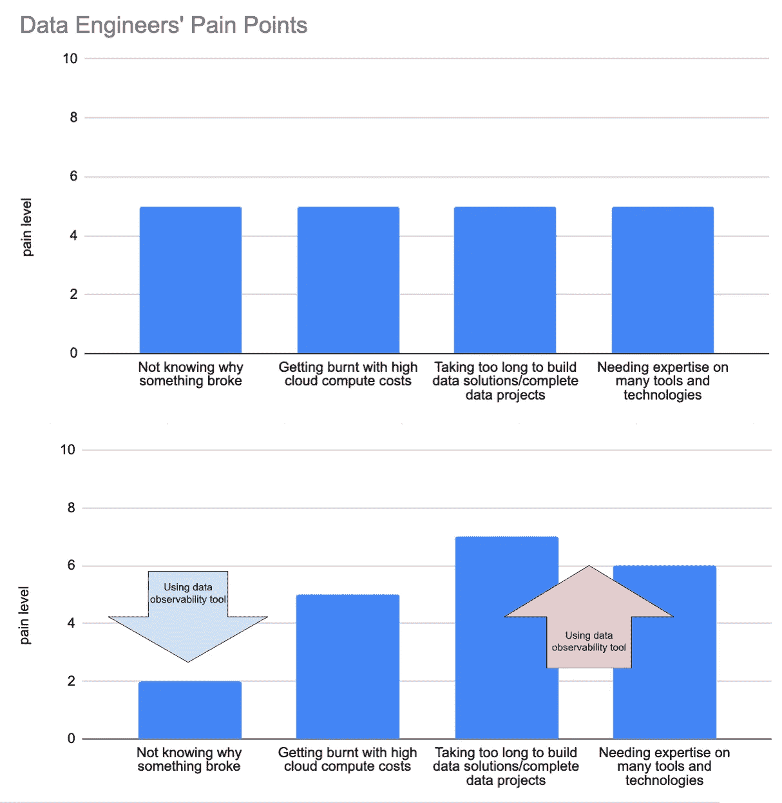

# 数据工程中的激进简化

> 原文：[`towardsdatascience.com/radical-simplicity-in-data-engineering-86ec3d2bd71c?source=collection_archive---------4-----------------------#2024-07-26`](https://towardsdatascience.com/radical-simplicity-in-data-engineering-86ec3d2bd71c?source=collection_archive---------4-----------------------#2024-07-26)

## 向软件工程师学习，发现“差的就是更好的”思维方式的乐趣

 [Cai Parry-Jones](https://medium.com/@caiparryjones96?source=post_page---byline--86ec3d2bd71c--------------------------------)

·发布于 [Towards Data Science](https://towardsdatascience.com/?source=post_page---byline--86ec3d2bd71c--------------------------------) ·6 分钟阅读·2024 年 7 月 26 日

--

来源：[unsplash.com](https://unsplash.com/)

最近，我有幸与许多数据工程师和数据架构师交流了他们在企业中遇到的数据问题。我一次又一次听到的主要痛点包括：

+   不知道为什么某些东西坏了

+   遇到高昂的云计算成本

+   构建数据解决方案/完成数据项目的时间过长

+   需要精通许多工具和技术

这些问题并不新鲜。我自己遇到过，你也许也遇到过。然而，我们似乎无法找到一种能从长远解决所有这些问题的方案。你可能会心想，“第一个问题可以用{插入数据可观测性工具}来解决”，或者“第二个问题只需要一个更严格的数据治理计划”。这些解决方案的问题在于，它们增加了额外的复杂性，这使得最后两个痛点变得更加严重。痛苦的总和保持不变，只是四个痛点之间的分布不同。

作者使用 [Google Sheets](https://workspace.google.com/intl/en_uk/products/sheets/) 创建

本文旨在提出一种相反的解决问题方式：激进简化。

## **总结**

+   软件工程师们在拥抱简化方面取得了巨大的成功。

+   过度工程化和追求完美可能会导致臃肿、开发缓慢的数据系统，并且给企业带来高昂的成本。

+   数据团队应考虑为了简化和加速，牺牲一些功能。

## **从那些软件工程师那里学到的一课**

1989 年，计算机科学家[理查德·P·加布里埃尔](https://en.wikipedia.org/wiki/Richard_P._Gabriel)写了一篇相对著名的文章，标题是《‘Worse Is Better’》。我不会深入讲解，如果你感兴趣，可以在[这里](https://dreamsongs.com/WorseIsBetter.html)阅读文章，但文章的核心信息是：软件质量不一定随着功能的增加而提升。换句话说，有时你可以为了简洁性牺牲完整性，最终因为简化而获得一个本质上“更好”的产品。

对于 1950/60 年代的计算机先驱们来说，这个想法是非常陌生的。那个时代的理念是：计算机系统必须纯粹，只有在考虑了所有可能的情境下，它才能称为纯粹。这很可能是因为当时大多数领先的计算机科学家都是学术界人士，他们非常希望将计算机科学视为一门严谨的学科。

当时计算机领域的领先机构麻省理工学院（MIT）的学者们开始着手开发下一代计算机操作系统，名为[Multics](https://en.wikipedia.org/wiki/Multics)。经过近十年的开发和数百万美元的投资，MIT 的团队发布了他们的新系统。毫无疑问，这是当时最先进的操作系统，然而由于计算要求高，安装非常困难，而且由于代码库庞大，功能更新缓慢。因此，它仅在少数几所大学和行业中获得应用。

在 Multics 开发的同时，支持 Multics 开发的小组对于系统日益增长的要求感到沮丧。他们最终决定脱离这个项目。凭借这些经验，他们开始着手创建自己的操作系统，这个操作系统有着根本性的哲学转变：

> 设计必须简单，无论是实现还是界面。实现的简单性比界面的简单性更为重要。简洁性是设计中最重要的考虑因素。
> 
> — 理查德·P·加布里埃尔

在 Multics 发布五年后，这个脱离小组发布了他们的操作系统[Unix](https://en.wikipedia.org/wiki/History_of_Unix)。它缓慢而稳步地获得了认可，到 1990 年代，Unix 成为了计算机的首选操作系统，[全球前 500 强超级计算机中超过 90%](https://en.wikipedia.org/wiki/Usage_share_of_operating_systems#Supercomputers)使用了 Unix。直到今天，Unix 仍然被广泛使用，最著名的是作为 macOS 的底层系统。

显然，除了简洁性之外，还有其他因素促成了 Unix 的成功。但其轻量级设计是该系统至今依然极为宝贵的资产。这一切的实现，归功于设计师们愿意牺牲一些功能性。数据行业不应害怕以同样的方式思考。

## **回到 21 世纪的数据**

回想我自己的经历，我参与的大多数大数据工程项目的哲学与 Multics 项目类似。例如，有一个项目，我们需要自动化地标准化从所有客户处获取的原始数据。我们决定通过数据仓库使用 dbt 来完成，因为这样我们就可以全面查看数据的血缘关系，从最原始的文件一直到标准化的单一表格版本及之后的内容。问题是，第一阶段的转换非常手动，必须将每个原始客户文件单独加载到仓库中，然后 dbt 为每个客户的文件创建清理模型。这导致需要生成数百个 dbt 模型，所有模型本质上使用相同的逻辑。dbt 变得过于臃肿，以至于在 dbt 文档网站上加载数据血缘图表需要几分钟时间，而我们的 GitHub Actions 进行 CI（[持续集成](https://docs.github.com/en/actions/automating-builds-and-tests/about-continuous-integration)）每次拉取请求都需要超过一个小时才能完成。

如果领导层允许我们在数据仓库之外进行第一层转换，使用 AWS Lambda 和 Python，这个问题本可以相对简单地解决。但没有，这样的话，dbt 生成的数据血缘图就不能做到 100%的完整性。仅此而已。这就是不大幅简化项目的唯一理由。就像从 Multics 项目中脱离出来的小组一样，我在项目中途离开了，因为在一个显然可以更简单的项目上工作实在太令人沮丧了。当我写这些时，我发现他们仍然在继续做这个项目。

## 那么，激进简化到底是什么呢？

数据工程中的激进简化并不是一种框架或数据栈工具集，而是一种心态。这是一种哲学，优先考虑简单、直接的解决方案，而不是复杂的、包罗万象的系统。

这种哲学的关键原则包括：

1.  极简主义：专注于提供最大价值的核心功能，而不是试图满足每一个可能的场景或需求。

1.  接受权衡：愿意在简化、速度和维护方便性上牺牲一定的完整性或完美性。

1.  实用主义胜过理想主义：优先考虑能够高效解决实际业务问题的可行解决方案，而不是追求理论上完美但过于复杂的系统。

1.  减少认知负担：设计易于理解、实施和维护的系统和流程，从而减少在多个工具和技术中的专业知识要求。

1.  成本效益：拥抱更简单的解决方案，这些解决方案通常需要更少的计算资源和人力资本，从而降低整体成本。

1.  敏捷性与适应性：创建更容易修改和发展的系统，以应对业务需求的变化，而不是僵化的、过度设计的解决方案。

1.  专注于结果：强调最终成果和业务价值，而不是陷入数据处理过程的复杂细节中。

这种思维方式可能与现代数据工程解决方案中的增加更多工具、流程和层级相矛盾。因此，你应该做好准备为自己的立场辩护。在提出替代、更简单的解决方案之前，要深入理解当前的问题。我想起了这句名言：

> 要把事情做得简单，需要付出大量的努力，真正理解潜在的挑战并提出优雅的解决方案。[...] 这不仅仅是简约主义或去除杂乱，它涉及深入挖掘复杂性的深度。要做到真正的简单，你必须深入其中。[...] 你必须深刻理解产品的本质，才能去除那些非必要的部分。
> 
> — 史蒂夫·乔布斯

旁注：要注意，采纳极简主义并不意味着忽视新工具和先进技术。事实上，我目前在数据仓库方面最喜欢的解决方案之一是使用一个名为[duckDB](https://duckdb.org/)的开源数据库。看看吧，它相当酷。

## **结论**

软件工程历史中的教训为今天的数据领域提供了宝贵的见解。通过拥抱极简主义，数据团队可以解决许多困扰现代数据解决方案的痛点。

不要害怕在数据团队中倡导极简主义。如果你发现有机会精简和简化，成为变革的催化剂。通往简化的道路并不容易，但潜在的回报可能是巨大的。
