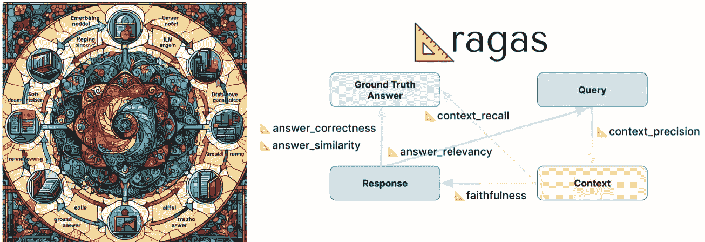
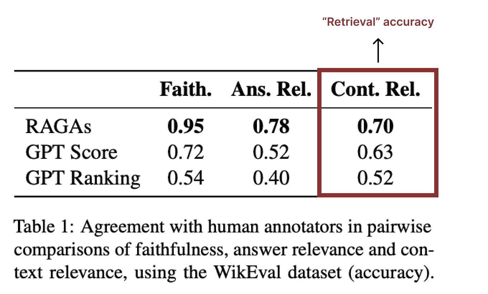

# RAG 评估使用 Ragas

> 原文：[`towardsdatascience.com/rag-evaluation-using-ragas-4645a4c6c477?source=collection_archive---------5-----------------------#2024-03-21`](https://towardsdatascience.com/rag-evaluation-using-ragas-4645a4c6c477?source=collection_archive---------5-----------------------#2024-03-21)

## 最佳实践：使用 Milvus 向量数据库的 RAG，第一部分

 [Christy Bergman](https://medium.com/@christybergman?source=post_page---byline--4645a4c6c477--------------------------------)

·发表于[Towards Data Science](https://towardsdatascience.com/?source=post_page---byline--4645a4c6c477--------------------------------) ·7 分钟阅读·2024 年 3 月 21 日

--

左图：由[Microsoft Designer](https://designer.microsoft.com/image-creator)于 2024 年 3 月 18 日绘制，提示词为“从文档开始，最后以 LLM 回答结束的检索增强生成组件，呈现为彩色玻璃窗”。右图：作者绘制的 RAG 评估图。

**检索**，作为生成式 AI 系统的基石，仍然是一个挑战。**检索增强生成，简称 RAG**，是一种构建 AI 驱动的聊天机器人的方法。这些机器人根据 AI 模型（即 LLM）已经训练的数据，并通过通常使用近似最近邻（ANN）向量搜索检索到的自有数据片段，来回答问题。

来自[WikiEval](https://huggingface.co/datasets/explodinggradients/WikiEval)等来源的评估数据表明，自然语言检索的准确性非常低。这意味着，在部署 GenAI 系统之前，您可能需要进行实验以调整 RAG 参数。**然而，在进行 RAG 实验之前，您需要一种方法来评估哪些实验获得了最佳结果！**

图片来源：[`arxiv.org/abs/2309.15217`](https://arxiv.org/abs/2309.15217)

# RAG 评估

**使用大型语言模型（LLMs）** [**作为评判者**](https://arxiv.org/pdf/2306.05685.pdf) **在现代 RAG 评估中越来越受到重视。** 这种方法利用强大的语言模型，如 OpenAI 的 GPT-4，来评估 RAG 系统中各个组件的质量。LLMs 通过评估响应的相关性、准确性、遵循指令的程度以及整体质量来充当评判者…
