# Rainbow：深度 Q 网络的多彩进化 🌈

> 原文：[`towardsdatascience.com/rainbow-the-colorful-evolution-of-deep-q-networks-37e662ab99b2?source=collection_archive---------8-----------------------#2024-07-12`](https://towardsdatascience.com/rainbow-the-colorful-evolution-of-deep-q-networks-37e662ab99b2?source=collection_archive---------8-----------------------#2024-07-12)

## 组装 DQN Megazord 所需的所有内容，使用 JAX。

 [Ryan Pégoud](https://medium.com/@ryanpegoud?source=post_page---byline--37e662ab99b2--------------------------------)

·发布于[Towards Data Science](https://towardsdatascience.com/?source=post_page---byline--37e662ab99b2--------------------------------) ·阅读时长 17 分钟·2024 年 7 月 12 日

--

“Rainbow Megazord”，Dall-E 3

2013 年，*Mnih 等人*提出的深度 Q 网络（DQN）[1]标志着深度强化学习的首次突破，在三款 Atari 游戏中超越了专家级人类玩家。多年来，DQN 的多个变种陆续发布，每个变种都在改进原始算法的特定弱点。

2017 年，*Hessel 等人* [2]通过结合 DQN 的 6 种强大变种，创造出了被称为 DQN Megazord 的 Rainbow。

在这篇文章中，我们将逐一解析构成 Rainbow 的各个组成部分，并回顾它们在[**Stoix 库中的 JAX 实现**](https://github.com/EdanToledo/Stoix)。

# DQN

Rainbow 的基本构建块是 DQN，它是 Q-learning 的扩展，使用带有参数**θ**的神经网络来逼近 Q 函数（即动作-价值函数）。具体来说，DQN 使用卷积层从图像中提取特征，并通过线性层生成 Q 值的标量估计。

在训练过程中，网络由**θ**参数化，称为*“在线网络”*，用于选择动作，而*“目标网络”*由**θ-**参数化，是在线网络的延迟副本，用于提供稳定的目标。这样，目标就不依赖于正在更新的参数。

此外，DQN 使用回放缓冲区***D***来采样过去的转移（观察、奖励和完成标志元组），并在固定的时间间隔内进行训练。

在每次迭代***i***中，DQN 采样一次转移***j***并根据以下损失函数进行梯度更新：

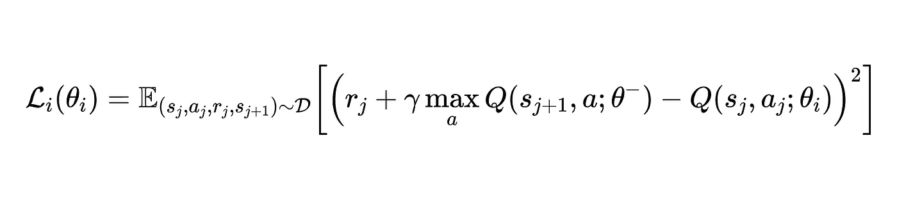

DQN 损失函数，除非另有说明，否则所有图像均由作者制作

这个损失旨在最小化平方时序差分（TD）误差的期望值。

请注意，DQN 是一个**非策略**算法，因为它在遵循不同的行为策略（如 epsilon 贪心策略）的同时，学习由**最大 Q 值**项定义的最优策略。

这是 DQN 算法的详细内容：

DQN 算法

## DQN 实践

如上所述，我们将引用 Stoix 库中的代码片段来说明 DQN 和 Rainbow 的核心部分（*部分代码已稍作编辑或注释，便于教学*）。

让我们从神经网络开始：Stoix 让我们将模型架构拆解为预处理器和后处理器，分别称为**躯干**和**头部**。在 DQN 的情况下，躯干将是一个多层感知器（MLP）或卷积神经网络（CNN），头部则是一个 epsilon 贪心策略，两者都实现为 [**Flax**](https://flax.readthedocs.io/en/latest/index.html) 模块：

一个 Q 网络，定义为 Stoix 中的 CNN 躯干和 epsilon 贪心策略

此外，DQN 使用以下损失（*请注意 Stoix 遵循* [***Rlax***](https://github.com/google-deepmind/rlax)*命名约定，因此 tm1 相当于上述公式中的时间步 t，而 t 则指时间步 t+1*）：

DQN 中使用的 Q-learning 损失

## Rainbow 蓝图

现在我们已经为 DQN 打下了基础，我们将更详细地回顾算法的各个部分，同时识别潜在的弱点以及 Rainbow 如何解决这些问题。

具体而言，我们将涵盖：

+   双重 DQN 和过高估计偏差

+   对抗 DQN 和状态值 / 优势预测

+   分布式 DQN 和回报分布

+   多步学习

+   噪声 DQN 和灵活的探索策略

+   优先经验回放与学习潜力

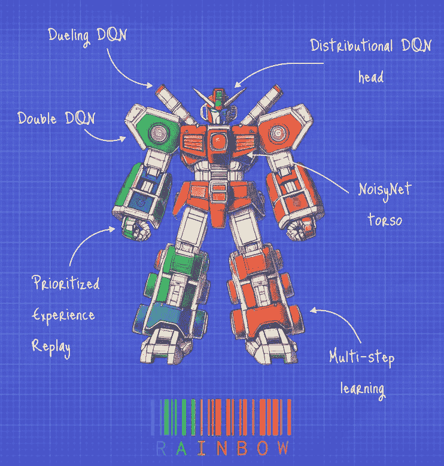

Rainbow 蓝图，Dall-E 3

# 双重 DQN

+   **来源：** [*Deep Reinforcement Learning with Double Q-learning*](http://arxiv.org/abs/1509.06461)[3]

+   **改进：** 降低过高估计偏差

## 过高估计偏差

原始 DQN 使用的损失函数存在一个问题，这个问题来自 Q 目标。记住，我们将目标定义为：

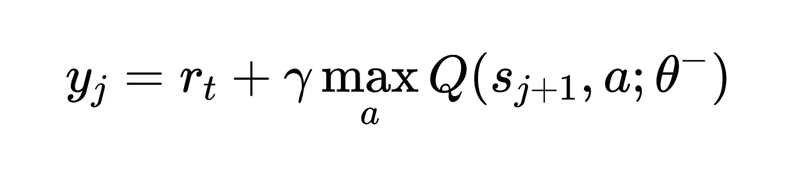

DQN 损失中的目标

这个目标可能会导致**过高估计偏差**。实际上，由于 DQN 使用引导（从估计中学习估计），最大值项可能会选择过高估计的值来更新 Q 函数，导致 Q 值的过高估计。

例如，考虑以下图示：

+   网络预测的 Q 值用蓝色表示。

+   真实的 Q 值用紫色表示。

+   预测值和真实值之间的差距通过红色箭头表示。

在这种情况下，由于较大的预测误差，动作 0 的预测 Q 值最高。因此，将使用这个值来构建目标。

然而，具有最高真实价值的动作是动作 2。此图示展示了目标中的最大项如何偏向 **较大的正估计误差**，从而引发过度估计偏差。

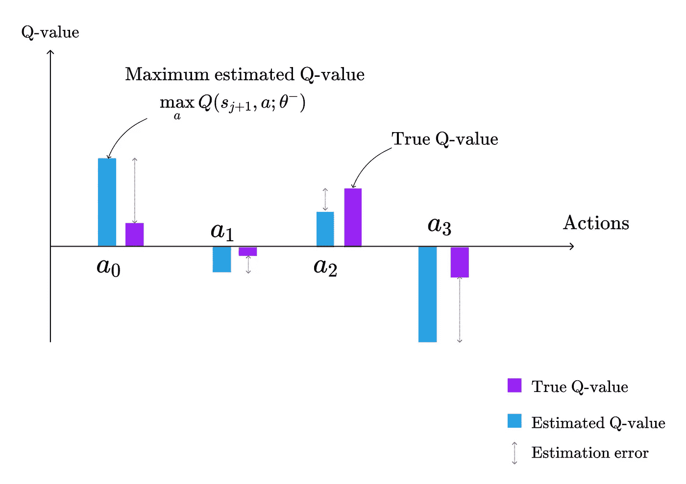

过度估计偏差的示意图。

## 解耦动作选择与评估

为了解决这个问题，*Hasselt 等人*（2015）[3] 提出了一个新的目标，其中动作由在线网络选择，而其值由目标网络估算：

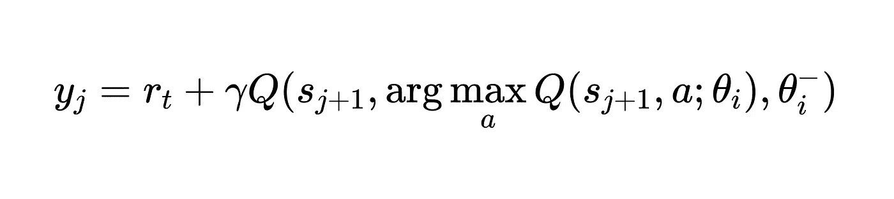

Double DQN 目标

通过解耦动作选择和评估，估计偏差显著减少，从而导致更好的价值估计和性能提升。

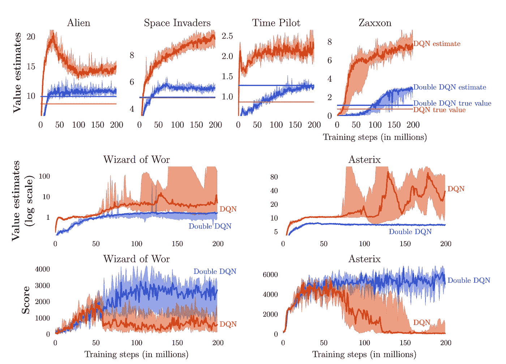

Double DQN 提供了稳定且准确的价值估计，带来了性能的提升。来源：Hasselt 等人（2015），图 3

## 实践中的 Double DQN

正如预期的那样，实现 Double DQN 只需要修改损失函数：

# 对抗 DQN

+   **来源:** [*对抗网络架构用于深度强化学习*](http://arxiv.org/abs/1511.06581)

+   **改进:** 价值与优势计算的分离

## 状态值、Q 值和优势

在强化学习中，我们使用多个函数来估计给定状态、动作或从给定状态开始的一系列动作的价值：

+   **状态值 V(s):** 状态值对应于在给定状态 **s** 中开始并随后遵循策略 **π** 时的期望回报。

+   **Q 值 Q(s, a):** 类似地，Q 值对应于在给定状态 **s** 中开始，采取动作 **a** 并随后遵循策略 **π** 时的期望回报。

+   **优势 A(s, a):** 优势定义为在给定状态 **s** 下，动作 **a** 的 Q 值与状态值之间的差异。它表示了在当前状态下，动作 **a** 的固有价值。

以下图尝试表示这些价值函数之间的差异（*请注意，状态值是根据策略 **π** 下采取每个动作的概率加权的*）。

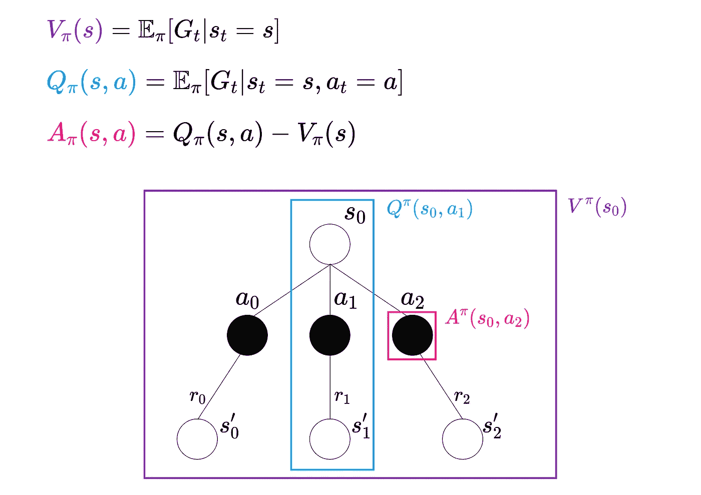

在备份图中可视化状态值（紫色）、状态-动作值（Q 函数，蓝色）和优势（粉色）。

通常，DQN 直接估计 Q 值，使用前馈神经网络。这意味着 DQN 必须独立地为每个状态下的每个动作学习 Q 值。

## 对抗架构

由 *Wang 等人*（2016）[4] 提出的对抗 DQN 使用一个具有两个独立计算流的神经网络：

+   **状态值流** 用于预测给定状态的标量值。

+   **优势流** 用于预测给定状态下每个动作的优势。

这种解耦使得**独立估计**状态值和优势成为可能，这带来了若干好处。例如，网络可以在不需要定期更新动作值的情况下学习状态值。此外，它还能更好地泛化到熟悉状态下未见过的动作。

这些改进导致了更稳定和更快速的收敛，特别是在具有许多相似价值动作的环境中。

实际上，决斗网络使用一个**共同表示**（即一个共享的线性或卷积层），由**θ**参数化，然后分为两个流，每个流由具有**α**和**β**参数的线性层组成。状态值流输出一个标量值，而优势流为每个可用的动作返回一个标量值。

将两个流的输出相加，使我们能够重建每个动作的 Q 值，即**Q(s, a) = V(s) + A(s, a)**。

一个重要的细节是，优势通常会减去平均值。实际上，优势需要**零均值**，否则将无法将 Q 分解为 V 和 A，从而使问题变得不明确。在这个约束下，**V**表示状态的价值，而**A**表示每个动作相对于该状态下平均动作的好坏程度。

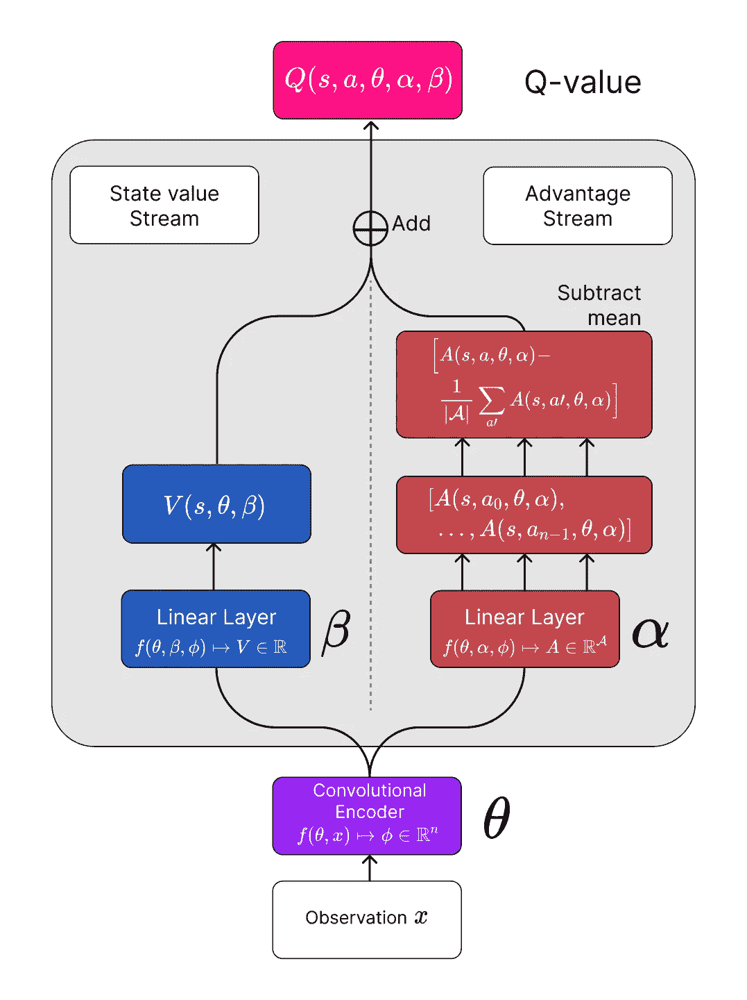

决斗网络示意图

## 实际应用中的决斗网络

这是 Stoix 实现的 Q 网络：

# 分布式 DQN

+   **来源：** [关于强化学习的分布式视角](http://arxiv.org/abs/1707.06887)[5]

+   **改进：** 更丰富的价值估计

## 回报分布

大多数强化学习系统建模的是回报的期望值，然而，越来越多的文献从分布式的角度研究强化学习。在这种设定下，目标变为建模**回报分布**，这使我们能够考虑平均值以外的其他统计量。

2017 年，*Bellemare 等人*[5]发布了 DQN 的分布式版本 C51，预测每个动作的回报分布，在 Atari 基准测试中达到了新的最先进的性能。

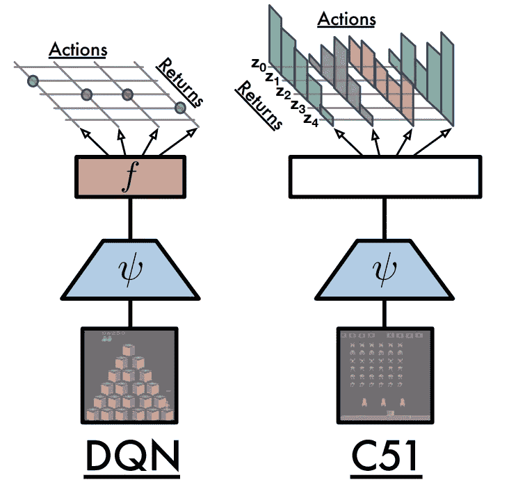

DQN 与 C51 的比较示意图。来源 [5']

让我们回顾一下 C51 背后的理论。

在传统的强化学习中，我们使用**Bellman 方程**来评估策略，这使我们能够以递归形式定义 Q 函数。或者，我们可以使用分布式版本的 Bellman 方程，它考虑了回报中的随机性：

Bellman 方程的标准版和分布式版

这里，**ρ**是转移函数。

这些函数之间的主要区别在于**Q** **是一个数值**，它是对随机变量期望值的总和。相比之下，**Z 是一个随机变量**，它是对奖励分布和未来回报的折扣分布的总和。

以下插图有助于可视化如何从分布贝尔曼方程推导**Z**：

+   考虑在给定时间步长下回报分布**Z**以及转移操作符**Pπ**。**PπZ**是未来回报**Z(s’，a’)**的分布。

+   将此乘以折扣因子**γ**会使分布向 0 收缩（因为**γ**小于 1）。

+   添加奖励分布会将之前的分布平移一个固定的量（*注意，图中假设奖励为常数以简化计算。实际上，添加奖励分布会使分布发生平移，同时也会修改折扣回报*）。

+   最后，使用 L2 投影操作符**Φ**将分布投影到离散支持上。

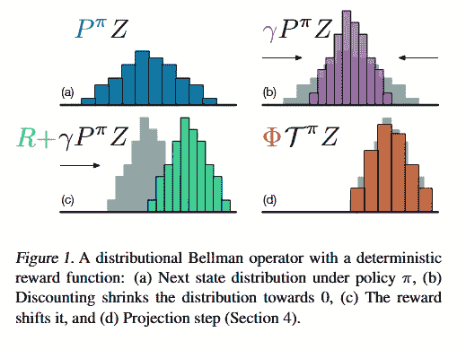

分布贝尔曼方程的插图。来源：[5]

这个固定的支持是一个由***N***个原子组成的向量，在一个固定区间内按恒定间隔分隔：

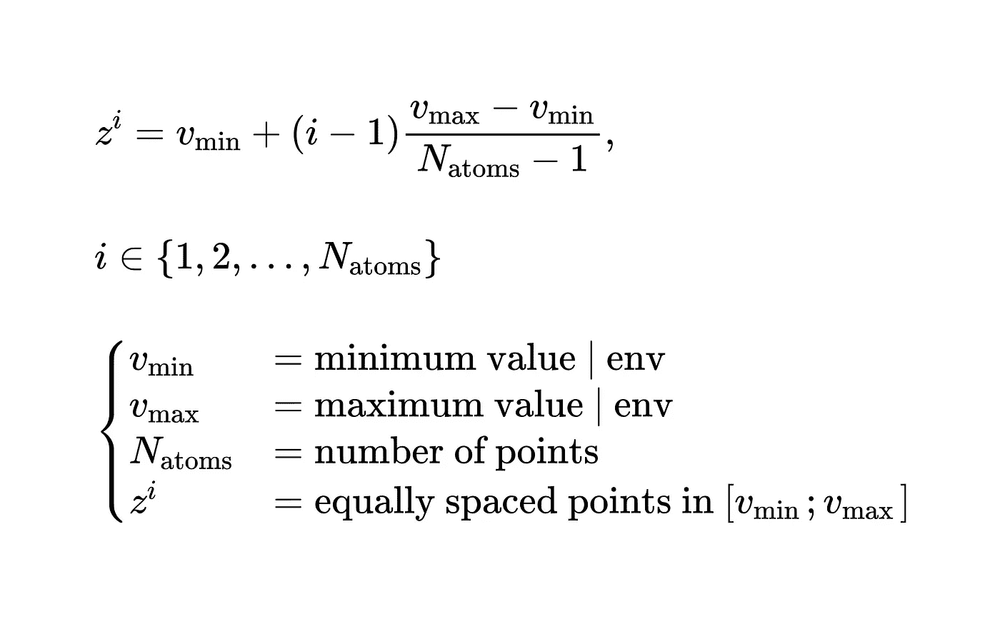

离散支持**z**的定义

在推理时，Q 网络返回一个在该支持上定义的近似分布**dt**，每个原子***i***上的概率质量**pθ(st, at)**满足：

预测回报分布

目标是更新**θ**，使得分布尽可能接近真实的回报分布。为了学习概率质量，目标分布是通过**贝尔曼最优性方程的分布式变种**来构建的：

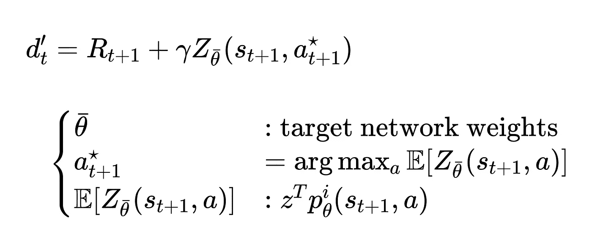

目标回报分布

为了能够比较我们神经网络预测的分布与目标分布，我们需要将目标分布离散化，并将其投影到相同的支持**z**上。

为此，我们使用 L2 投影（*将投影到* ***z*** *上，使得原始分布和投影分布之间的差异在 L2 范数下最小化*）：

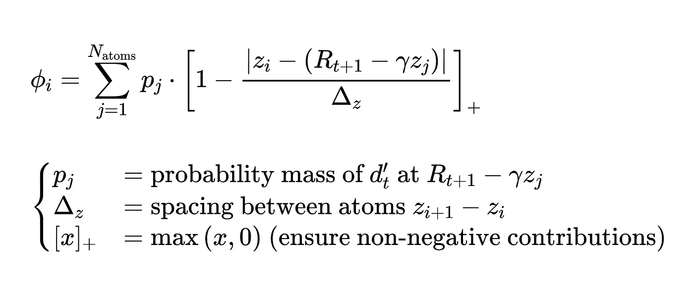

目标分布的 L2 投影

最后，我们需要定义一个损失函数，最小化两个分布之间的差异。由于我们处理的是分布，不能像之前那样直接从目标中减去预测值。

相反，我们最小化**dt**和**d’t**之间的 Kullback-Leibler 散度（在实践中，这通常作为交叉熵损失来实现）：

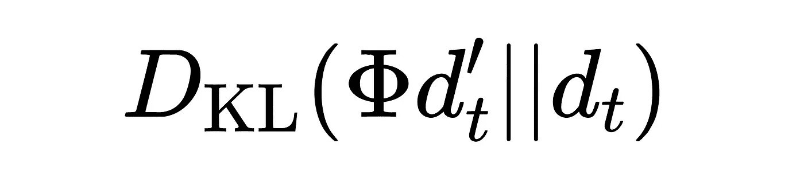

预测回报分布和投影目标分布之间的 KL 散度

*要了解更全面的分布式 DQN 描述，可以参考 Massimiliano Tomassoli 的文章[8]以及 Pascal Poupart 关于该主题的视频[11]。*

## 实践中的 C51

Stoix 中 C51 的关键组件是分布头和类别损失，默认情况下使用前述的双 Q 学习。选择将 C51 网络定义为一个头部，使我们能够根据使用案例互换使用 MLP 或 CNN 作为主体。

# Noisy DQN

+   **来源：** [噪声网络用于探索](http://arxiv.org/abs/1706.10295)[6]

+   **改进：** 可学习的、状态依赖的探索机制

## 神经网络的噪声参数化

与许多离策略算法一样，DQN 依赖于**ε-贪婪策略**作为其主要的探索机制。因此，该算法大部分时间会根据 Q 值进行贪婪选择，并以预定义的概率选择随机动作。

*Fortunato et al.*[6]提出了 NoisyNets 作为一种更灵活的替代方案。NoisyNets 是神经网络，其权重和偏置由**高斯噪声的参数化函数**扰动。类似于ε-贪婪策略，这种噪声通过向智能体的动作选择中注入随机性，从而鼓励探索。

然而，这个噪声由**学习到的参数**进行缩放和偏移，允许噪声的水平在每个状态下动态调整。通过这种方式，探索和利用之间的平衡在训练过程中能够*动态*优化。最终，网络可能学会忽略噪声，但会在**状态空间的不同部分**以**不同的速度**实现这一点，从而导致更灵活的探索。

一个由噪声参数向量参数化的网络定义如下：

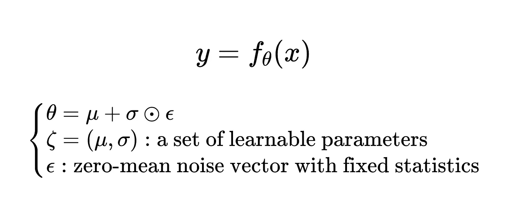

由噪声参数化的神经网络

因此，一个线性层**y = wx + b**变为：

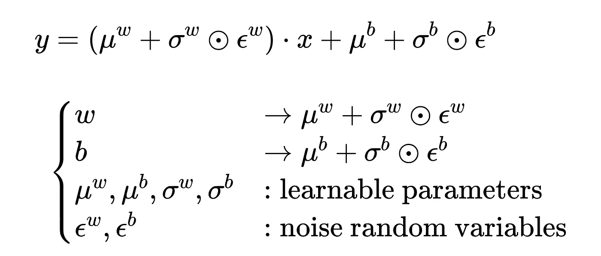

噪声线性层

为了提高性能，噪声在推理时使用**因式分解高斯噪声**生成。对于一个具有**M**个输入和**N**个输出的线性层，生成一个形状为（**M x N**）的噪声矩阵，该矩阵是两个大小分别为**M**和**N**的噪声向量的组合。此方法将所需的随机变量数量从**M x N**减少到**M + N**。

噪声矩阵被定义为噪声向量的外积，每个向量由函数**f**缩放：

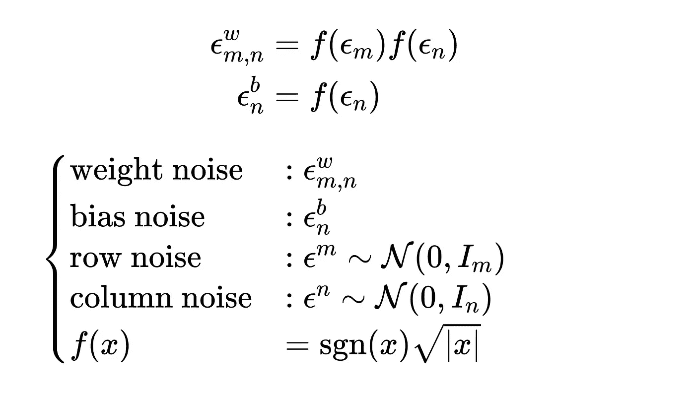

使用因式分解高斯噪声生成噪声

## 改进的探索

由噪声网络引发的改进探索使得包括 DQN、对战 DQN 和 A3C 等广泛的算法能够受益于较低额外参数的情况下获得更好的性能。

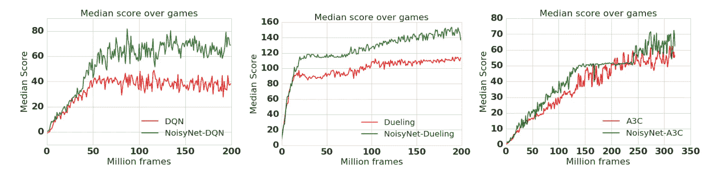

NoisyNets 提高了几种算法在 Atari 基准测试上的表现。来源：[6]

## 实践中的 Noisy DQN

在 Stoix 中，我们实现了一个噪声层，如下所示：

*注：Rainbow 中的所有线性层都已替换为其噪声等价物（有关更多细节，请参见* ***“组合 Rainbow”*** *部分）。*

# 优先经验回放

**来源：** 优先经验回放[7]

**改进**：优先选择具有更高学习潜力的经验

## 估算学习潜力

在执行环境步骤后，普通的 DQN 会从重放缓冲区均匀地采样一批经验（也称为*转换*），并在这批经验上执行一次梯度下降步骤。尽管这种方法能够产生令人满意的结果，但某些特定的经验从学习角度来看可能比其他经验更有价值。因此，我们可以通过更频繁地采样这些经验来加速训练过程。

这正是*Schual 等人*在 2016 年发布的优先经验回放（PER）论文中探讨的理念[7]。然而，主要的问题仍然是：如何近似地估算一个转换的**预期学习潜力**？

> 一个理想化的标准是，RL 智能体在当前状态下可以从一个转换中学到多少（预期的学习进展）。虽然这个度量不可直接访问，但一个合理的代理是转换的 TD 错误 δ 的大小，它表示转换有多么“出乎意料”或意外：具体来说，值与下一步自举估计之间的差距有多大（Andre 等人，1998）。
> 
> 优先经验回放，Schual 等人（2016）

提醒一下，TD 错误定义如下：

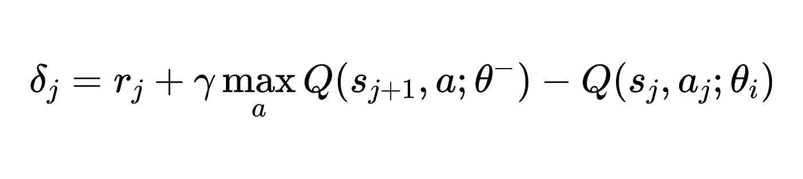

时间差错

这个指标是特定转换学习潜力的一个合理估计，因为较高的 TD 错误表示预测结果与实际结果之间的差异较大，这意味着智能体从更新其信念中会受益。

然而，值得注意的是，替代的优先级度量仍在研究中。例如，*Lahire 等人*（2022）认为，最优的采样方案是根据每个样本的梯度范数进行分布的[9]。

每个样本的梯度范数

然而，既然 Rainbow 使用的是这个度量，我们就继续使用 TD 错误。

## 推导采样概率

一旦我们选择了优先级标准，就可以根据这个标准推导出每个转换的采样概率。在优先经验回放中，展示了两种替代方案：

+   **按比例**：在这种方式下，重放一个转换的概率等于相关 TD 错误的绝对值。为了防止转换在其错误为零时不再被重新访问，添加了一个小的正常数。

+   **基于排名**：在这种模式下，转换根据其绝对 TD 错误按降序排列，并根据其排名定义其概率。这种方式被认为更加稳健，因为它对异常值不敏感。

采样概率然后会被归一化，并升至**α**的幂，α是一个超参数，决定优先级的程度（**α=0**是均匀的情况）。

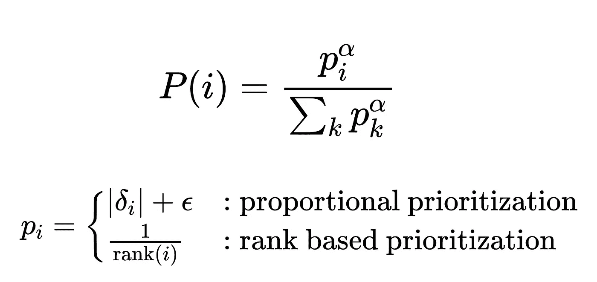

优先级模式和概率归一化

## 重要性采样和偏差退火

在强化学习中，预期回报值的估计依赖于更新与期望（即均匀分布）相同的分布假设。然而，PER 引入了偏差，因为我们现在是根据 TD 误差来抽样经验。

为了纠正这种偏差，我们使用**重要性抽样**，这是一种用于*从不同分布中抽样时估计分布特性*的统计方法。重要性抽样会重新加权样本，使得估计结果保持无偏且准确。

通常，修正权重定义为两个概率的比率：

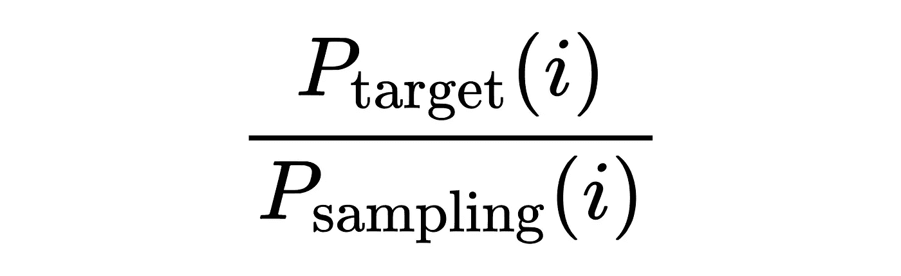

重要性抽样比率

在这种情况下，目标分布是均匀分布，其中每个过渡的被抽样概率为 1/**N**，**N**是重放缓冲区的大小。

因此，在优先经验回放（PER）上下文中的重要性抽样系数定义为：

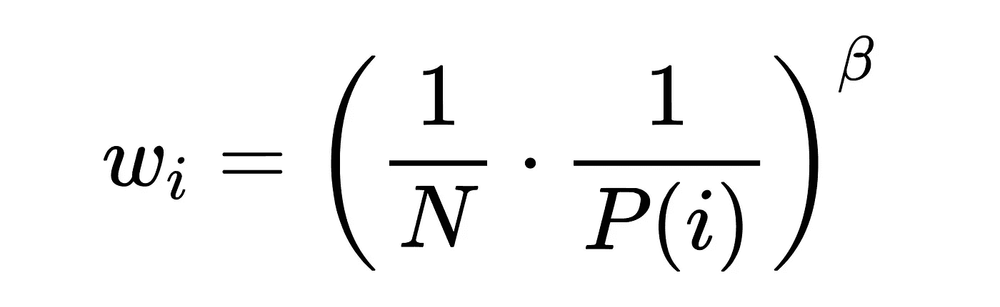

在 PER 中使用的重要性抽样权重

**β**是一个调整偏差修正量的系数（当**β=1**时，偏差完全被修正）。最后，为了稳定性，权重会进行归一化：

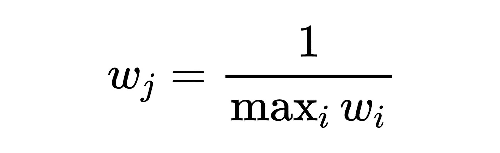

重要性抽样权重的归一化

总结一下，这是优先经验回放的完整算法（更新和训练步骤与 DQN 相同）：

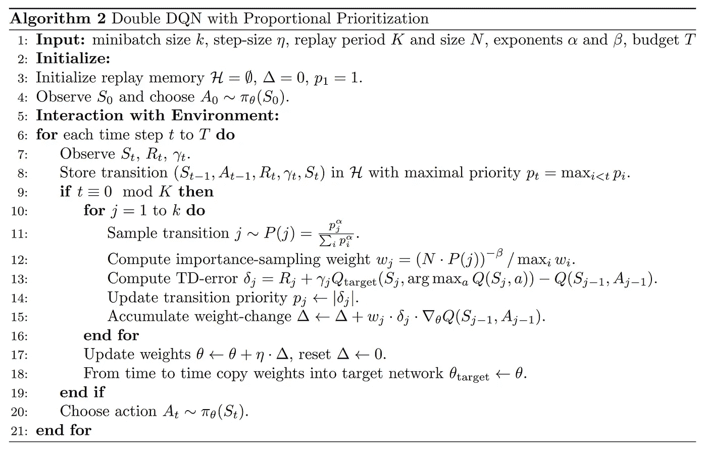

优先经验回放算法

## 使用 PER 提高了收敛速度

以下图表突出了 PER 的性能优势。事实上，基于比例和排名的优先机制使得 DQN 在 Atari 基准测试上能够大约两倍的速度达到相同的基线性能。

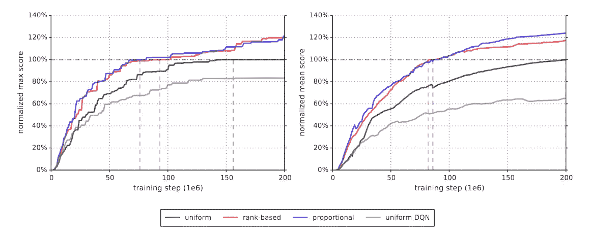

在 57 个 Atari 游戏中的最大和平均得分的归一化（以 Double DQN 性能为标准）。来源：[7]

## 实践中的优先经验回放

Stoix 无缝集成了[Flashbax](https://github.com/instadeepai/flashbax)库，提供多种重放缓冲区。以下是用于实例化重放缓冲区、计算基于 TD 误差的抽样概率并更新缓冲区优先级的相关代码片段：

# 多步学习

+   **来源**：[强化学习：导论，第七章](https://web.stanford.edu/class/psych209/Readings/SuttonBartoIPRLBook2ndEd.pdf)

+   **改进**：增强的奖励信号和样本效率，减少的方差

多步学习是对传统的一步时间差学习的改进，它使我们在构建目标时可以考虑**n**步的回报。例如，我们不再仅仅考虑下一时间步的奖励，而是考虑 n 步截断的奖励（见下面的公式）。这个过程有几个优点，其中之一是：

+   **即时反馈：**考虑更长的时间跨度允许代理更快地学习状态-动作对的价值，特别是在奖励延迟且特定动作可能不会立即带来回报的环境中。

+   **样本效率：**每次更新中的多步学习结合了多个时间步的信息，使每个样本更加有价值。这提高了样本效率，意味着代理可以从更少的经验中学到更多。

+   **平衡偏差与方差：**多步方法在偏差和方差之间提供了一种权衡。一步方法偏差小但方差大，而多步方法偏差大但方差小。通过调节步数，可以找到最适合给定环境的平衡。

Rainbow 中使用的多步分布式损失定义如下：

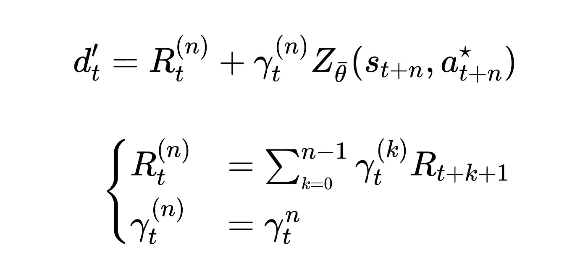

多步目标回报分布

在实践中，使用 n 步回报意味着我们需要对代码进行一些调整：

+   我们现在采样的是**n**个经验的轨迹，而不是单个经验。

+   奖励被 n 步折扣回报替代

+   如果任何**n**个 done 标志为 True，则 done 标志被设置为 True。

+   下一状态**s(t+1)**被轨迹的最后一个观察值**s(t+n)**替代

## 实践中的多步学习

最后，我们可以重新使用 C51 中使用的类别损失函数，配合这些更新后的输入：

# 组装 Rainbow

恭喜你走到了这一步！我们现在更好地理解了构成 Rainbow 的所有关键部分。以下是 Rainbow 代理的总结：

+   **神经网络架构：**

    — **躯干：**卷积神经网络（CNN）或多层感知器（MLP）基础，用于为头部网络创建嵌入。

    — **头部：**结合了 Dueling DQN 和 C51。价值流输出原子上的状态价值分布，而优势流输出动作和原子上的优势分布。这些流被汇总，Q 值作为原子值及其相应概率的加权和进行计算。使用 epsilon-greedy 策略选择一个动作。

    — **噪声层：**所有线性层被噪声等效层替代，以帮助探索。

+   **损失函数：**使用分布式损失来建模 n 步回报，目标通过双 Q 学习计算得出。

+   **回放缓冲区：**采用基于 TD 误差的优先机制，以提高学习效率。

以下是用于 Rainbow 头部的网络：

## 性能与消融实验

为了总结这篇文章，让我们更深入地看看 Rainbow 在 Atari 基准测试中的表现以及消融研究。

下图将 Rainbow 与我们研究过的其他 DQN 基准进行比较。测量的指标是中位数人类标准化分数。换句话说，Atari 游戏中人类的中位数表现被设定为 100%，这使得我们可以快速发现达到人类水平的算法。

三个 DQN 基准在 2 亿帧后达到了这个水平：

+   **分布式 DQN**

+   **决斗 DQN**

+   **优先级双重 DQN**

有趣的是，Rainbow 在仅 44 百万帧后就达到了相同的水平，使其**大约比最好的基准效率高 5 倍**。在训练结束时，它超过了**200%**的中位数人类归一化得分。

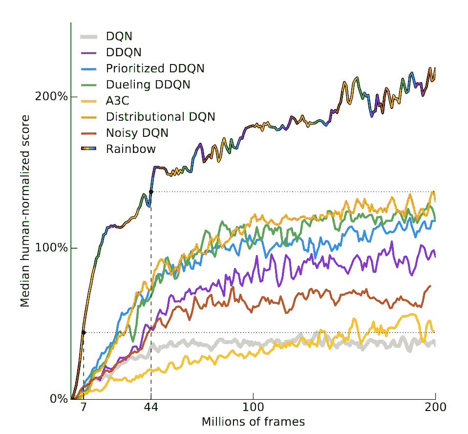

在 57 款 Atari 游戏中的中位数人类归一化表现。每一行代表一个 DQN 基准。来源：[2]

这第二个图表示去除实验，展示了没有 Rainbow 某个组件时的表现。这些结果让我们可以做出以下几项观察：

+   Rainbow 的三个最重要的组成部分是分布式头、使用多步学习和优先级重放缓冲区。

+   噪声层对整体表现有显著贡献。使用标准层和 epsilon 贪婪策略不能让智能体在 2 亿帧内达到 200%的得分。

+   尽管它们各自取得了强大的表现，但在 Rainbow 的背景下，决斗结构和双重 Q 学习仅提供了微小的改进。

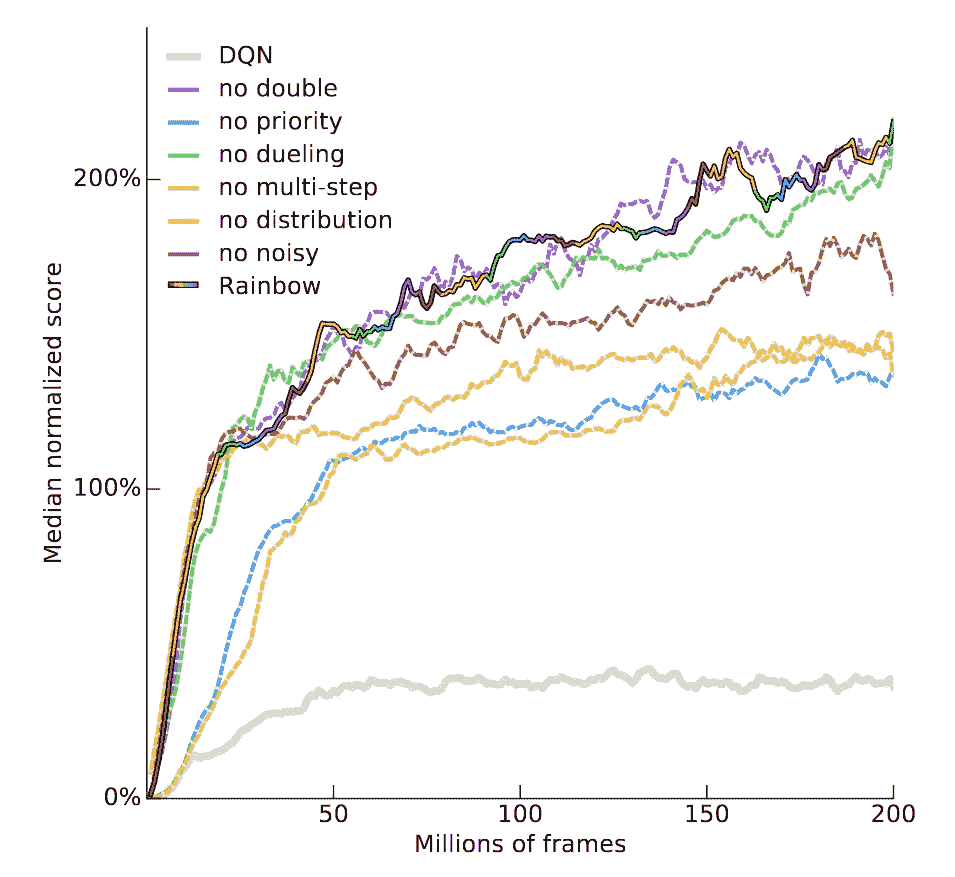

在 57 款 Atari 游戏中的中位数人类归一化表现。每一行代表 Rainbow 的去除实验。来源：[2]

非常感谢你阅读本文，希望它能为你提供有关 Rainbow 及其组件的全面介绍。我强烈建议你阅读[**Stoix 实现的 Rainbow**](https://github.com/EdanToledo/Stoix/blob/main/stoix/systems/q_learning/ff_rainbow.py)，以便更详细地了解训练过程和 Rainbow 架构。

下次见👋

# 参考书目

[1] Mnih, V., Kavukcuoglu, K., Silver, D., Graves, A., Antonoglou, I., Wierstra, D., & Riedmiller, M. (2013). [***通过深度强化学习玩 Atari***](http://arxiv.org/abs/1312.5602)，arXiv。

[2] Hessel, M., Modayil, J., van Hasselt, H., Schaul, T., Ostrovski, G., Dabney, W., Horgan, D., Piot, B., Azar, M., & Silver, D. (2017). [***Rainbow：结合深度强化学习中的改进***](http://arxiv.org/abs/1710.02298)，arXiv。

[3] van Hasselt, H., Guez, A., & Silver, D. (2015). [***使用双重 Q 学习的深度强化学习***](http://arxiv.org/abs/1509.06461)，arXiv。

[4] Wang, Z., Schaul, T., Hessel, M., van Hasselt, H., Lanctot, M., & de Freitas, N. (2016). [***深度强化学习的决斗网络架构***](http://arxiv.org/abs/1511.06581) (No. arXiv:1511.06581)，arXiv。

[5] Bellemare, M. G., Dabney, W., & Munos, R. (2017). [***强化学习的分布式视角***](http://arxiv.org/abs/1707.06887)，arXiv。

[5'] Dabney, W., Ostrovski, G., Silver, D., & Munos, R. (2018). [***用于分布式强化学习的隐式分位网络***](http://arxiv.org/abs/1806.06923)，arXiv。

[[6]](http://arxiv.org/abs/1806.06923](http://arxiv.org/abs/1806.06923)[6]) Fortunato, M., Azar, M. G., Piot, B., Menick, J., Osband, I., Graves, A., Mnih, V., Munos, R., Hassabis, D., Pietquin, O., Blundell, C., & Legg, S. (2019). [***探索的噪声网络***](http://arxiv.org/abs/1706.10295), arXiv.

[7] Schaul, T., Quan, J., Antonoglou, I., & Silver, D. (2016). [***优先经验回放***](http://arxiv.org/abs/1511.05952)***,*** arXiv

## 额外资源

[8] Massimiliano Tomassoli, [***分布式强化学习：分布式强化学习的直观解释***](https://mtomassoli.github.io/2017/12/08/distributional_rl/)

[9] Lahire, T., Geist, M., & Rachelson, E. (2022). [***大批量经验回放***](http://arxiv.org/abs/2110.01528), arXiv.

[10] Sutton, R. S., & Barto, A. G. (1998). ***强化学习：导论***。

[11] Pascal Poupart, [***CS885 模块 5：分布式强化学习***](https://youtu.be/r-Yk6-jagDU?si=9lqQHHNaQz8Uiclw)***,*** YouTube
