# 实时 Twitch 聊天情感分析与 Apache Flink

> 原文：[`towardsdatascience.com/real-time-twitch-chat-sentiment-analysis-with-apache-flink-e165ac1a8dcf?source=collection_archive---------5-----------------------#2024-03-27`](https://towardsdatascience.com/real-time-twitch-chat-sentiment-analysis-with-apache-flink-e165ac1a8dcf?source=collection_archive---------5-----------------------#2024-03-27)

## 学习如何通过实时情感分析与 Apache Flink 赋能创作者，解读观众情绪，调整内容以提高观众满意度

[](https://vojay.medium.com/?source=post_page---byline--e165ac1a8dcf--------------------------------)[](https://towardsdatascience.com/?source=post_page---byline--e165ac1a8dcf--------------------------------) [Volker Janz](https://vojay.medium.com/?source=post_page---byline--e165ac1a8dcf--------------------------------)

·发表于 [Towards Data Science](https://towardsdatascience.com/?source=post_page---byline--e165ac1a8dcf--------------------------------) ·22 分钟阅读·2024 年 3 月 27 日

--


由 [Joey kwok](https://unsplash.com/@spideyjoey?utm_source=medium&utm_medium=referral) 提供的照片，来源于 [Unsplash](https://unsplash.com/?utm_source=medium&utm_medium=referral)

> 🚀 让我们通过构建一个实时情感分析流应用程序，学习 Apache Flink 和情感分析，为 Twitch 聊天提供支持。

– 介绍与演示

– Apache Flink

– NLP 与情感分析

– 设置 Flink 项目

– 准备项目

−− IntelliJ 中的项目设置

−− 重命名并简化主类

−− pom.xml 项目设置

−− 运行配置

−− 本地 Flink Web UI

– 读取 Twitch 聊天

−− 添加 Twitch4J 依赖

−− 为 Twitch 聊天消息创建 POJO

−− 为 Flink 创建自定义 Twitch 源函数

−− 使用 source 函数

– Twitch 聊天情感分析

−− 添加 Stanford CoreNLP 依赖

−− 创建情感分析 map 函数

−− 使用 map 函数

– 结论

***免责声明***：在本文和演示中，我仅分析我自己的聊天消息，未存储数据或处理其他用户的消息。在将其用于其他目的之前，请咨询 Twitch 的[*服务条款*](https://www.twitch.tv/p/en/legal/terms-of-service/)和[*开发者服务协议*](https://www.twitch.tv/p/en/legal/developer-agreement/)，以及官方的[*Twitch API 文档*](https://dev.twitch.tv/docs/api/)。

# 介绍与演示

在这篇博客文章中，我将指导你如何使用[Apache Flink](https://flink.apache.org/)构建一个实时情感分析应用程序，用于分析 Twitch 聊天。该应用程序能够处理来自 Twitch 频道的实时消息，并判断聊天的整体情感。

该项目构建使用了以下环境：

+   **操作系统**：macOS Sonoma

+   **Java**：11

+   **Flink**：1.17.2

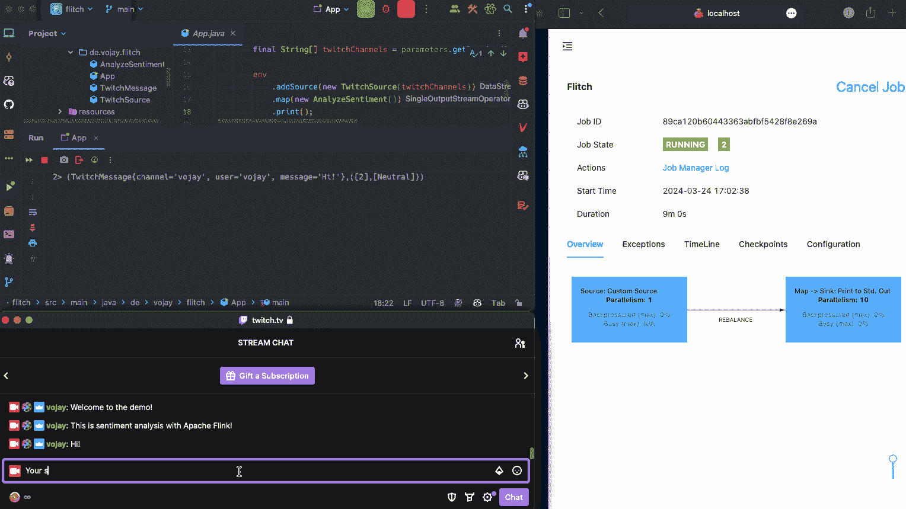

实时 Twitch 聊天情感分析与 Apache Flink（作者）

本文的基本思路是：为了在数据工程领域进一步提升自己，我们应该跟随自己的热情，通过实际项目来成长。

找到一个让你感兴趣并激励你的问题，并尝试解决它。

到这篇博客文章结束时，你将拥有一个可以实时跟踪 Twitch 聊天情感的工作应用程序。它可以用于一个或多个 Twitch 频道。你还将学习 [Apache Flink](https://flink.apache.org/) 和 Java 中的情感分析基础。

**你还可以在 Github 上找到最终结果** 🪄：[`github.com/vojay-dev/flitch`](https://github.com/vojay-dev/flitch)

# Apache Flink

数据流无处不在。几乎所有生成的数据本质上都是作为数据流生成的，即使我们通常处理的是批量数据。这些数据可以是 GPS 数据、应用程序或网站的交互跟踪、传感器数据或 Twitch 聊天中的消息。

> ***流处理意味着处理动态数据***

一个流处理应用程序通常由数据源、生成数据流、操作符用于处理数据和接收端组成。如今，有许多框架和服务可以用来实现流处理应用程序，并且概念上往往是类似的。其中之一是[Apache Flink](https://flink.apache.org/)。

[Apache Flink](https://flink.apache.org/) 不仅是一个框架，还是一个分布式处理引擎。它允许在**有状态**的计算中对**无界**和**有界**数据流进行创建和执行。**无界**数据流有一个明确的开始，但没有明确的结束，而**有界**数据流则有明确的开始和结束。这个概念可能听起来有点熟悉，因为这也可以被视为一个数据批次，只不过它是以流的形式呈现的。

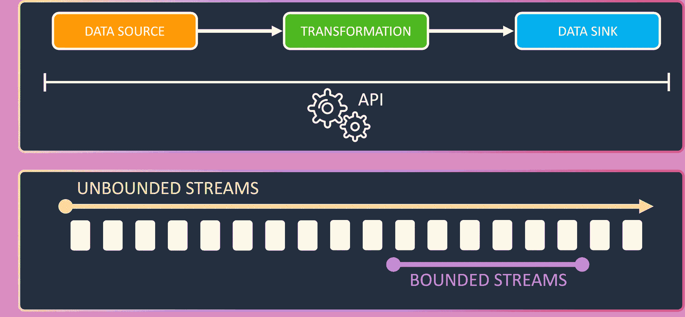

Flink 概念（作者）

Flink 提供了定义流应用程序的 API。通过这些 API，你可以控制数据源、数据转换和数据接收端。通过 SQL / Table API，你可以使用 SQL 定义流应用程序，这是一个非常棒的功能，但请记住，流 SQL 与批处理 SQL 行为不同，这可能要求你改变解决问题的方法。接下来，还有 DataStream API，可以用来通过预定义的函数组合你的流管道。它可以在 Python、Java 和 Scala 中使用。如果你需要完全控制事件、状态和时间，那么 ProcessFunction 层是你的最佳选择。

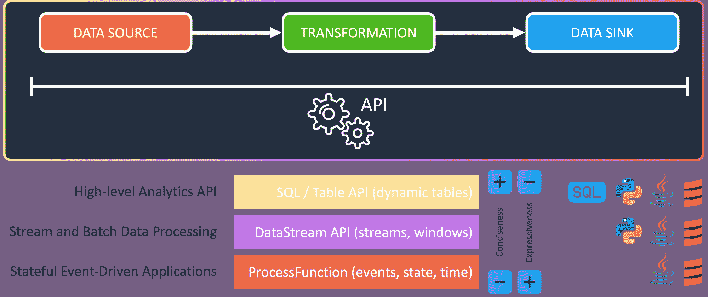

Flink API（作者）

对于这个用例，我们将在 Java 中使用 DataStream API 来定义一个自定义源，以便将 Twitch 聊天作为数据流读取。此外，我们还将定义一个自定义的 map 函数，它将每条 Twitch 消息作为输入，对其进行情感分析，并返回一个包含消息和分析结果的元组。最后，我们仅使用一个预定义的 sink 来打印结果。在这个特定的案例中，我们一次只查看一个事件，这被称为**无状态流处理**。请记住，Flink 的一个关键特性是能够跨多个事件记住信息，例如通过窗口函数的形式。这被称为**有状态流处理**。

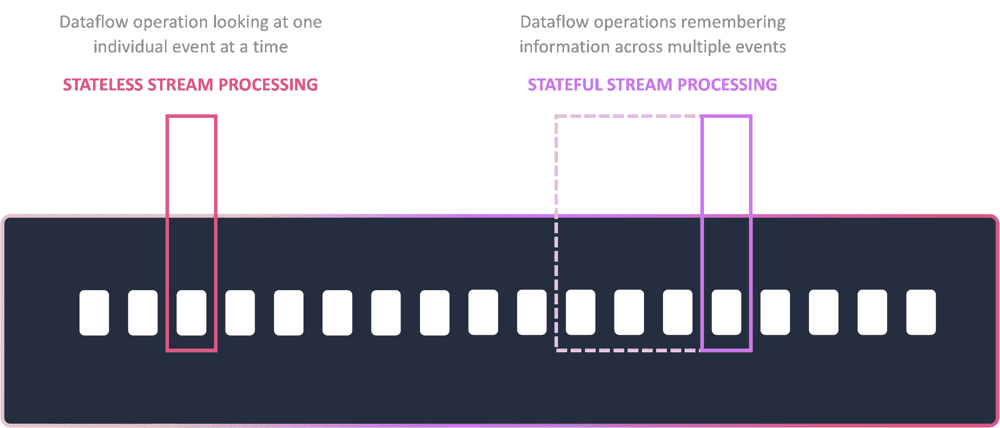

Flink 状态（作者）

如果你对更高级的 Flink 用例感兴趣，包括状态管理和其他高级技术（如广播状态模式），可以看看我在 2023 年欧洲大数据大会上的演讲：

📼 [使用 Kafka 和 Flink 实现游戏中的实时客户互动](https://www.youtube.com/watch?v=djikIGOm90U)

# NLP 和情感分析

想象一下，自然语言处理（NLP）就像是你电脑大脑的超级翻译器。它让计算机能够理解人类语言的细微差别，就像你能分辨出讽刺的“好工作”和真诚的“好工作”之间的不同。这不仅仅是简单的关键词匹配，而是深入探讨语法、句法和语义的复杂性。

你可能遇到的一些 NLP 应用包括：

+   **垃圾邮件过滤**：NLP 可以识别电子邮件中的可疑模式，帮助将合法邮件与垃圾邮件区分开来。

+   **机器翻译**：NLP 通过分析句子的结构和意义来帮助弥合语言鸿沟，确保翻译的准确性。

+   **语音助手**：Siri、Alexa 和 Google Assistant 都利用 NLP 来理解你的语音命令并智能回应。

NLP 的另一个应用是情感分析。可以把它想象成文本的情感指南针。它为一段文本分配一个情感分数（积极、消极或中性），帮助我们衡量文本背后的整体情感。

情感分析有两种主要方法：

+   **基于词典**：这种方法依赖于预先构建的字典，字典中包含具有预定义情感分数的单词。文本的情感分数是根据所识别单词的情感分数计算的。

+   **基于机器学习**：这种方法利用在大量标注情感的文本数据集上训练的机器学习算法。这些算法能够学习单词之间及其情感内涵的复杂关系，从而实现更细致的情感分析。

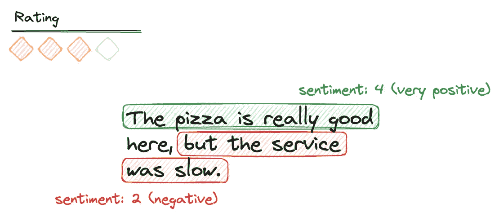

情感分析示例（作者）

这对于解读 Twitch 聊天中的氛围非常有用！

在我们的 Twitch 聊天示例中，我们可以使用情感分析来查看聊天是否充满了快乐，或者是否因为错过一局而情绪低落。这对于主播来说，可以帮助他们了解观众的实时反应，甚至根据反馈调整内容！它可以用于实时监控社区的情绪。

# 设置 Flink 项目

设置 Flink 项目的简单快捷方法是 Maven。Maven 是一个用于构建和管理主要是基于 Java 的项目的工具。Maven 能够帮助开发者处理项目构建的各个方面，并管理其依赖关系。

Maven 还包括一个名为 Archetype 的项目模板工具。使用 Archetype，你可以根据现有模板快速生成一个新项目。

所有类型的项目都有原型可供选择，从简单的 Java 项目（`maven-archetype-quickstart`）到框架特定的项目骨架，例如创建基于 Flink 的项目（`flink-quickstart-java`）。

我们将使用这个来创建演示应用程序：

```py
mvn archetype:generate \
-DarchetypeGroupId=org.apache.flink \
-DarchetypeArtifactId=flink-quickstart-java \
-DarchetypeVersion=1.17.2 \
-DgroupId=de.vojay \
-DartifactId=flitch \
-Dpackage=de.vojay.flitch \
-Dversion=0.1.0 \
-q
```

大多数参数是可选的，如果你不添加它们，CLI 工具会在创建项目时要求你输入相关细节。使用 `-q` 可以减少输出。执行上述命令后，我们将得到以下输出：

```py
Confirm properties configuration:
groupId: de.vojay
artifactId: flitch
version: 0.1.0
package: de.vojay.flitch
 Y: :
```

按 `enter` 确认，你将得到一个以 `artifactId` 命名的文件夹，里面包含生成的项目模板。

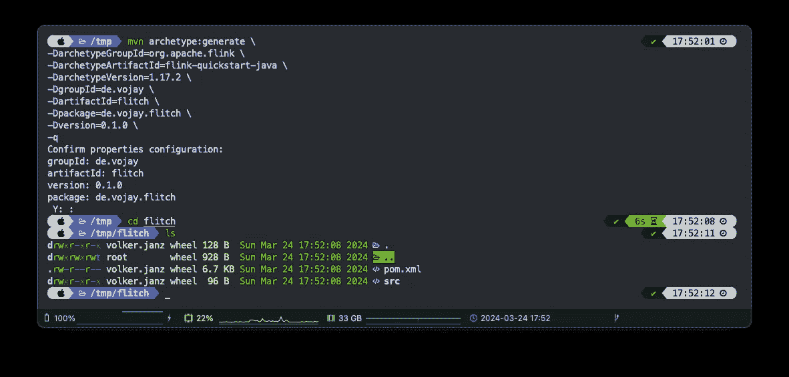

Flink 的 Maven 原型（由作者提供）

从这里，你可以使用你选择的 Java IDE。不过，我推荐使用 [IntelliJ](https://www.jetbrains.com/idea)。你可以免费使用 [IntelliJ IDEA Community Edition](https://www.jetbrains.com/idea/download)。

# 准备项目

在实际实现之前，我们将稍微准备一下生成的项目，以适应我们的用例。

# IntelliJ 中的项目设置

如果你使用的是 IntelliJ，现在需要调整模块和项目设置，确保我们使用的是正确的 Java 版本，并且设置了正确的语言级别。

在 IntelliJ 中打开项目后，点击 *File* → *Project Structure*。

在 *Project Structure* 窗口中，进入 *Project* 并确保使用 **Java 11 SDK**。

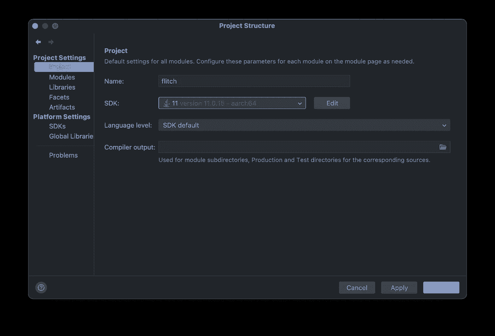

项目设置（由作者提供）

最后，进入 *Modules* 并将语言级别更改为 **11**。

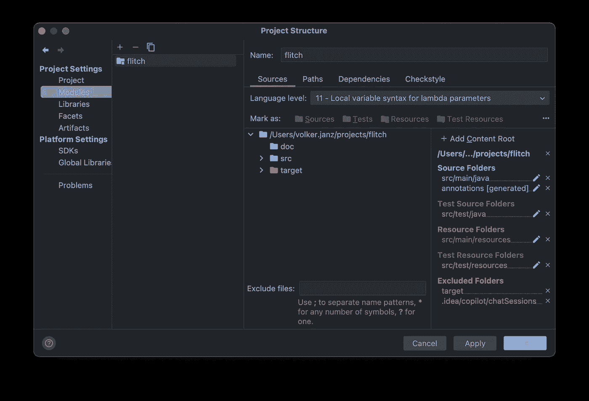

模块设置（由作者提供）

# 重命名并减少主类

将生成的类 `DataStreamJob` 简单地重命名为 `App`。


重命名类（由作者提供）

然后用以下内容替换代码：

```py
package de.vojay.flitch;

import org.apache.flink.streaming.api.environment.StreamExecutionEnvironment;

public class App {

 public static void main(String[] args) throws Exception {
  StreamExecutionEnvironment env = StreamExecutionEnvironment
   .getExecutionEnvironment();

  env.fromElements("Hello", "World").print();
  env.execute("Flitch");
 }

}
```

使用这个，我们创建一个执行环境，从一个包含两个元素（“Hello”和“World”）的有界流中读取数据，将元素打印到 STDOUT，并以“Flitch”作为名称执行应用程序。

**但现在，让我们先不启动应用程序，因为还需要做更多的调整。**

# `pom.xml` 项目设置

Maven 中的 `pom.xml` 文件是一个配置文件，作为项目的蓝图。它代表了“项目对象模型”（Project Object Model），并包含了项目的相关信息和配置，如项目依赖项、项目版本、构建插件和目标等。Maven 使用这个文件来理解项目结构、管理依赖项，并在构建过程中执行各种任务。

让我们更改以下几个方面，以便使用所需的 Java 版本，拥有一个合适的名称，并调整示例的主类。

**将目标 Java 版本设置为 11（LTS）：**

```py
<target.java.version>11</target.java.version>
```

**更改名称：**

```py
<name>Flitch - Flink Twitch Demo Project</name>
```

**更改主类：**

```py
<mainClass>de.vojay.flitch.App</mainClass>
```

# 运行配置

IntelliJ 中的运行配置是指定如何启动和调试项目的设置。它们允许你自定义主类、程序参数和环境变量等方面。你可以创建多个配置，轻松在不同的运行或调试场景之间切换，从而简化开发过程。

但在创建之前，我们先看看运行应用程序时会发生什么。所以，不再多说，让我们通过简单地点击播放按钮来启动主类 `App`。

**应用程序将失败，这是故意的。**

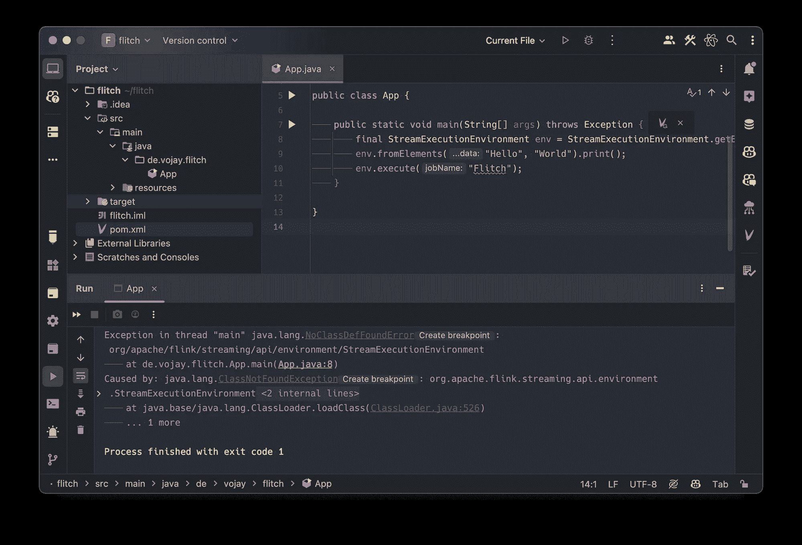

运行应用程序（作者）

它失败的原因是 `java.lang.NoClassDefFoundError`。这是因为我们在 `pom.xml` 中定义了依赖项，而在运行应用程序时，Java 的类路径中没有这些依赖项：

```py
<dependency>
 <groupId>org.apache.flink</groupId>
 <artifactId>flink-streaming-java</artifactId>
 <version>${flink.version}</version>
 <scope>provided</scope>
</dependency>
<dependency>
 <groupId>org.apache.flink</groupId>
 <artifactId>flink-clients</artifactId>
 <version>${flink.version}</version>
 <scope>provided</scope>
</dependency>
```

相关部分是 **范围**。在 Maven 中，依赖项的范围指定了依赖项相对于项目的可见性和生命周期。它决定了依赖项如何以及何时被包含到项目中，从而影响类路径和模块构建。

`provided` 范围意味着在执行或部署项目时，期望由 JDK 或运行时环境提供依赖项，因此不进行打包。

当在生产环境中使用 Flink 时，你会在某处（无论是本地还是云端）运行 Flink 集群。这个环境默认已经将所需的依赖项包含在类路径中，并且我们将应用程序 JAR 提交到这个生产集群。因此，我们不需要将这些依赖项与 JAR 一起打包。

然而，这也意味着当我们在本地运行应用程序时，这些依赖项不在类路径中。而由于我们使用的是纯 Java 环境，因此会出现 `java.lang.NoClassDefFoundError`。

这个问题有多种解决方案。我们可以在 Maven 中定义不同的构建配置文件（profile），为不同的环境设置不同的范围，以便在本地环境中使用不同的范围。

但由于我们使用的是 IntelliJ，也有一种方法可以通过运行配置来解决此问题。点击 *Run* → *Edit Configurations…*，然后点击 **+** 或 *Add new* 创建一个新的运行配置。在列表中选择“Application”并将其命名为“Flitch”。

确保选择 Java 11，并输入 `de.vojay.flitch.App` 作为主类。

为了解决`java.lang.NoClassDefFoundError`，我们现在需要启用选项*将“provided”范围的依赖项添加到类路径*。

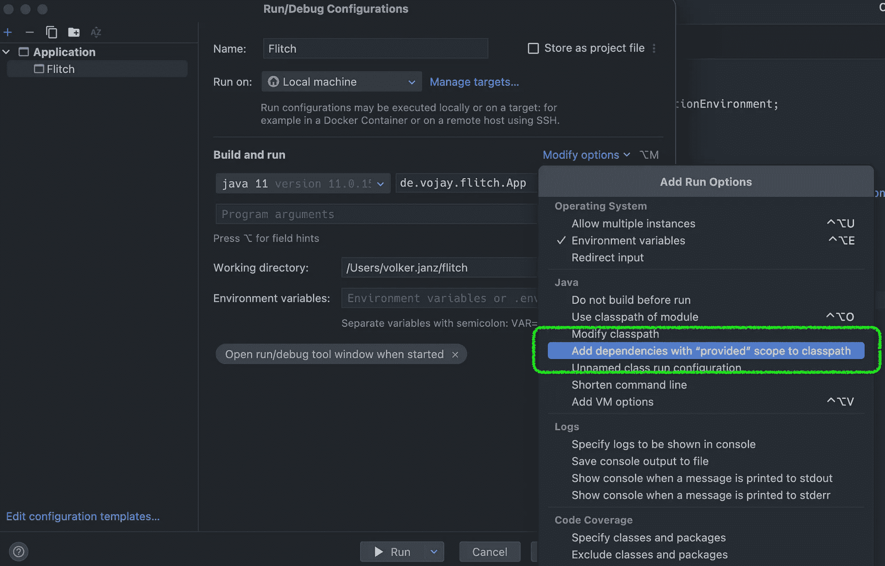

运行配置（作者）

你的运行配置已准备好，让我们点击“运行”并享受我们的第一个流应用程序。

它运行了🎉。该流应用程序将在处理完边界流之前一直运行。你还将在日志中找到你流中的两个元素的输出。

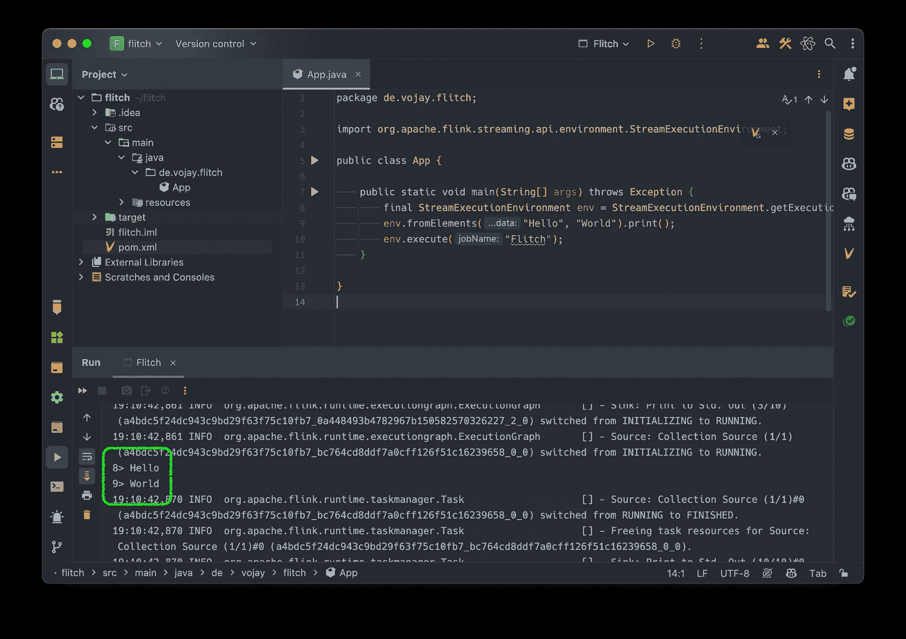

第一次成功运行（作者）

# 本地 Flink Web UI

在我们将注意力转向有趣的部分之前，还有一件事需要做。Flink Web UI 是一个用户友好的界面，允许开发人员和管理员监控和管理他们的 Apache Flink 应用程序。它提供了正在运行或已完成作业的实时概览，显示了吞吐量和延迟等度量指标，并提供了作业执行计划的详细洞察。基本上，它是一个方便的仪表盘，你可以在其中可视化 Flink 应用程序的性能和状态，使得调试、优化和管理流处理或批处理作业的过程变得更加简单和直观。

当你像本例中那样在本地运行 Flink 应用程序时，通常没有启用 Flink Web UI。然而，有一种方法可以在本地执行环境中也获得 Flink Web UI。我觉得这很有用，特别是在运行生产环境中的流应用程序之前，能够了解执行计划。

让我们从添加依赖项到`pom.xml`开始：

```py
<dependency>
 <groupId>org.apache.flink</groupId>
 <artifactId>flink-runtime-web</artifactId>
 <version>${flink.version}</version>
</dependency>
```

并稍微修改我们主类`App.java`中的代码：

```py
package de.vojay.flitch;

import org.apache.flink.configuration.Configuration;
import org.apache.flink.streaming.api.environment.StreamExecutionEnvironment;

public class App {

 public static void main(String[] args) throws Exception {
  StreamExecutionEnvironment env = StreamExecutionEnvironment
   .createLocalEnvironmentWithWebUI(new Configuration());

  env.fromSequence(1, Long.MAX_VALUE).print();
  env.execute("Flitch");
  env.close();
 }

}
```

现在，流应用程序将处理一系列数字，因此它不会立即完成。此外，使用`createLocalEnvironmentWithWebUI`，我们将在应用程序运行时通过端口`8081`在本地提供 Flink Web UI。

重新启动并在浏览器中打开[`localhost:8081/`](http://localhost:8081/)。除了各种度量指标，你还可以看到你的 Flink 应用程序的执行计划。

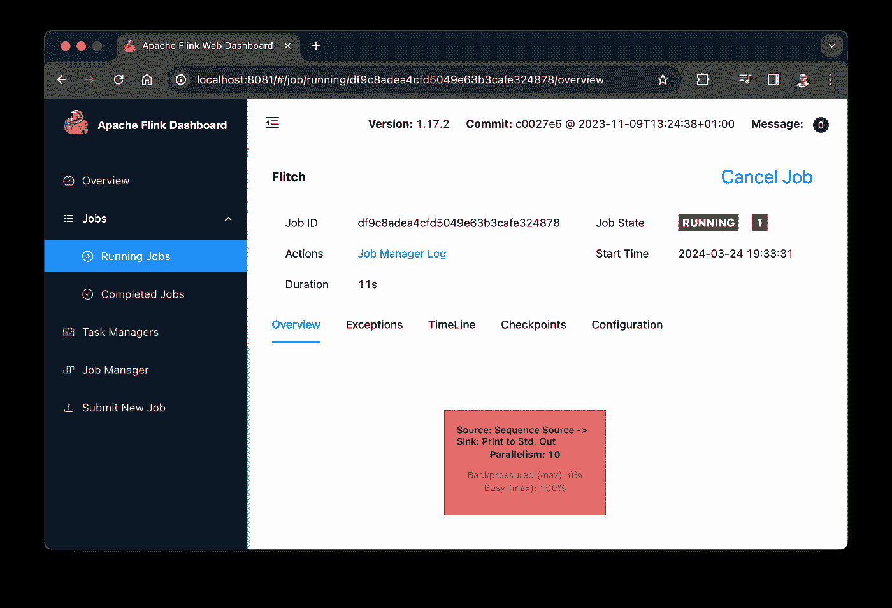

Flink Web UI（作者）

现在我们已经有了一个合适的本地设置，可以开始将我们的应用程序连接到 Twitch 并对聊天消息进行情感分析。

# 阅读 Twitch 聊天

[Twitch](https://www.twitch.tv/)，领先的游戏玩家直播平台，提供全面的 API 和一个与互联网中继聊天（IRC）协议深度集成的聊天功能。


图片来自[Caspar Camille Rubin](https://unsplash.com/@casparrubin?utm_source=medium&utm_medium=referral)于[Unsplash](https://unsplash.com/?utm_source=medium&utm_medium=referral)

Twitch API 的核心功能是允许应用程序与 Twitch 的数据进行交互。这包括获取关于直播、点播视频（VOD）、用户和游戏详情的信息。API 是 RESTful 的，意味着它遵循 Web 的架构风格，使用常见的 HTTP 请求非常简单。开发人员可以使用此 API 创建自定义体验，例如显示直播统计信息、搜索频道，甚至自动化流设置。

Twitch 聊天是 Twitch 体验的一个重要方面，它允许观众与主播和其他观众实时互动。在 Twitch 聊天的现代界面背后是互联网中继聊天（IRC）协议，自 80 年代末以来一直是在线通信的一个重要组成部分。对 IRC 的依赖使得通过自定义应用程序读取和与聊天互动时，拥有了广泛的可能性。

对于我们的目的，我们只需要读取聊天内容，而不需要自己发送消息。幸运的是，Twitch 允许匿名连接到聊天，以供只读应用场景使用。

为了减少实现工作量，我们将使用现有的库与 Twitch 进行交互：Twitch4J。Twitch4J 是一个现代 Java 库，旨在简化与 Twitch 特性（包括其 API、聊天（通过 IRC）、PubSub（实时通知）和 Webhooks）的集成。本质上，它是一个强大的工具包，供 Java 开发人员与 Twitch 服务进行交互，而无需直接管理像 HTTP 请求或 IRC 协议处理这样的低级细节。

# 添加 Twitch4J 依赖

第一步是将 Twitch4J 作为依赖添加到 `pom.xml` 中：

```py
<dependency>
 <groupId>com.github.twitch4j</groupId>
 <artifactId>twitch4j</artifactId>
 <version>1.19.0</version>
</dependency>
```

# 为 Twitch 聊天消息创建 POJO

我们希望有一个轻量级、可序列化的普通 Java 对象（POJO），用来在我们的应用中表示 Twitch 聊天消息。我们感兴趣的是消息发布的频道、用户以及消息内容本身。

创建一个新的类 `TwitchMessage`，并实现以下内容：

```py
package de.vojay.flitch;

public class TwitchMessage {

 private final String channel;
 private final String user;
 private final String message;

 public TwitchMessage(String channel, String user, String message) {
  this.channel = channel;
  this.user = user;
  this.message = message;
 }

 public String getChannel() {
  return channel;
 }

 public String getUser() {
  return user;
 }

 public String getMessage() {
  return message;
 }

 @Override
 public String toString() {
  StringBuffer sb = new StringBuffer("TwitchMessage{");
  sb.append("channel='").append(channel).append('\'');
  sb.append(", user='").append(user).append('\'');
  sb.append(", message='").append(message).append('\'');
  sb.append('}');
  return sb.toString();
 }

}
```

旁白：你不必自己编写像 `toString()` 这样的基本函数，你可以使用 IntelliJ 让它为你生成。只需点击 *代码* → *生成…* → `toString()` 即可得到上面的结果。

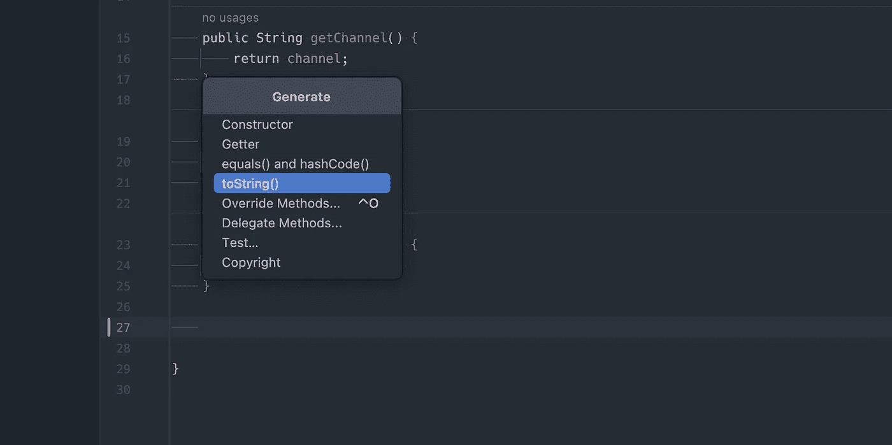

生成 toString（由作者提供）

# 为 Flink 创建自定义的 Twitch 源函数

我们现在将使用 Twitch4J 来为 Flink 实现一个自定义的 Twitch 源函数。该源函数将生成一个无界的数据流，在本例中是 Twitch 聊天消息。这也意味着，直到我们明确停止它，应用程序将不会终止。

Twitch 客户端可以这样构建：

```py
TwitchClientBuilder clientBuilder = TwitchClientBuilder.builder();
client = clientBuilder
 .withEnableChat(true)
 .build();

client.getChat().joinChannel("vojay");
```

在这个示例中，我们将获得一个 `client`，它加入名为 *vojay* 的 Twitch 频道。**是的，我曾经也是一位活跃的主播**。有趣的是：我在我的直播中教人们游戏开发和一般的软件开发。我还喜欢在直播中玩复古游戏 🎮。但那是另一个话题，让我们专注于这个项目 😉。

你还应该注意到，在上面的示例中没有进行身份验证。正如前面所说，由于我们只想读取聊天，因此不需要身份验证。实际上，我们只是匿名加入 IRC 聊天并读取消息。

由于我们希望每个源实例只与 Twitch 聊天建立一次连接，因此我们必须扩展抽象类 `RichSourceFunction`，以便能够重写 `open` 函数，允许在此处添加初始化代码。

```py
public class TwitchSource extends RichSourceFunction<TwitchMessage> {
 @Override
 public void open(Configuration configuration) {
  // ...
 }

 // ...
}
```

我们还使用 `TwitchMessage` POJO 作为通用参数，告诉 Flink 这个源会生成 `TwitchMessage` 类型的元素。

此外，我们希望能够在源函数的构造函数中传递一个我们想要监听的 Twitch 频道数组。

为了控制我们源函数的状态，我们使用一个名为 `running` 的 `boolean` 变量，并在 `open` 函数中将其设置为 `true`。

基于此，构造函数和 `open` 函数看起来如下：

```py
public class TwitchSource extends RichSourceFunction<TwitchMessage> {

 private final String[] twitchChannels;

 private TwitchClient client;
 private SimpleEventHandler eventHandler;
 private boolean running = true;

 public TwitchSource(String[] twitchChannels) {
  this.twitchChannels = twitchChannels;
 }

 @Override
 public void open(Configuration configuration) {
  client = TwitchClientBuilder
   .builder()
   .withEnableChat(true)
   .build();

  for(String channel : twitchChannels) {
   client.getChat().joinChannel(channel);
  }

  eventHandler = client
   .getEventManager()
   .getEventHandler(SimpleEventHandler.class);

  running = true;
 }

 // ...
```

这样，我们就拥有了所需的一切，可以消费消息并将其作为数据流进行进一步处理。

源函数的 `run` 函数是魔法发生的地方。在这里，我们生成数据，并通过给定的 `SourceContext`，我们可以发射数据。

Twitch4J 提供的 `SimpleEventHandler` 可以用来响应特定的消息。

每当我们接收到 `IRCMessageEvent` 类型的事件，也就是一条 Twitch 聊天消息时，我们就会生成我们的 POJO 实例，并通过上下文将其发射到流中。

为了确保我们的源函数不会终止，我们将添加一个带有人工延迟的循环，直到我们的 `boolean` 变量 `running` 被设置为 `false`。这将在 `cancel` 函数中完成，该函数在 Flink 环境关闭时被调用。

```py
 @Override
 public void run(SourceContext<TwitchMessage> ctx) throws InterruptedException {
  eventHandler.onEvent(IRCMessageEvent.class, event -> {
   String channel = event.getChannel().getName();
   EventUser eventUser = event.getUser();
   String user = eventUser == null ? "" : eventUser.getName();
   String message = event.getMessage().orElseGet(String::new);

   ctx.collect(new TwitchMessage(channel, user, message));
  });

  while(running) {
   Thread.sleep(100);
  }
 }

 @Override
 public void cancel() {
  client.close();
  running = false;
 }
```

将所有内容整合在一起，这是我们自定义的 Twitch 源函数在 Flink 中的完整实现 `TwitchSource.java`：

```py
package de.vojay.flitch;

import com.github.philippheuer.events4j.simple.SimpleEventHandler;
import com.github.twitch4j.TwitchClient;
import com.github.twitch4j.TwitchClientBuilder;
import com.github.twitch4j.chat.events.channel.IRCMessageEvent;
import com.github.twitch4j.common.events.domain.EventUser;
import org.apache.flink.configuration.Configuration;
import org.apache.flink.streaming.api.functions.source.RichSourceFunction;

public class TwitchSource extends RichSourceFunction<TwitchMessage> {

 private final String[] twitchChannels;

 private TwitchClient client;
 private SimpleEventHandler eventHandler;
 private boolean running = true;

 public TwitchSource(String[] twitchChannels) {
  this.twitchChannels = twitchChannels;
 }

 @Override
 public void open(Configuration configuration) {
  client = TwitchClientBuilder
   .builder()
   .withEnableChat(true)
   .build();

  for(String channel : twitchChannels) {
   client.getChat().joinChannel(channel);
  }

  eventHandler = client
   .getEventManager()
   .getEventHandler(SimpleEventHandler.class);

  running = true;
 }

 @Override
 public void run(SourceContext<TwitchMessage> ctx) throws InterruptedException {
  eventHandler.onEvent(IRCMessageEvent.class, event -> {
   String channel = event.getChannel().getName();
   EventUser eventUser = event.getUser();
   String user = eventUser == null ? "" : eventUser.getName();
   String message = event.getMessage().orElseGet(String::new);

   ctx.collect(new TwitchMessage(channel, user, message));
  });

  while(running) {
   Thread.sleep(100);
  }
 }

 @Override
 public void cancel() {
  client.close();
  running = false;
 }

}
```

# 使用源函数

使用这个自定义源函数，我们已经可以扩展 `App.java` 中的流处理管道，简单地打印每条写入聊天的消息：

```py
package de.vojay.flitch;

import org.apache.flink.configuration.Configuration;
import org.apache.flink.streaming.api.environment.StreamExecutionEnvironment;

public class App {

 public static void main(String[] args) throws Exception {
  StreamExecutionEnvironment env = StreamExecutionEnvironment
   .createLocalEnvironmentWithWebUI(new Configuration());

  TwitchSource twitchSource = new TwitchSource(new String[]{"vojay"});
  env.addSource(twitchSource)
   .print();

  env.execute("Flitch");
  env.close();
 }

}
```

使用 `addSource` 我们可以添加我们的源函数。元素随后将由流中的下一个步骤进行处理，该步骤是 `print()`。通过这个接收器，我们将再次将每个元素输出到 STDOUT。

现在运行应用程序并在[`twitch.tv/vojay`](https://www.twitch.tv/popout/vojay/chat)的聊天室中发送消息时，这些消息将由我们的流媒体应用程序处理并打印出来🎉。

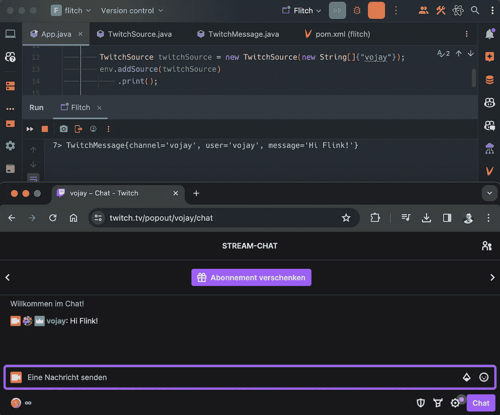

Flink 的 Twitch 源（作者提供）

# Twitch 聊天情感分析

现在我们可以将 Twitch 聊天作为数据流读取，是时候处理每条消息了。基本思路是：对于每条 Twitch 消息，我们检测消息中的各个句子，并计算每个句子的情感。输出将是像这样的结构：

```py
Tuple2<TwitchMessage, Tuple2<List<Integer>, List<String>>>
```

让我们来分解一下：结果包含 Twitch 聊天消息的原始 POJO，以及另一个包含 2 个元素的元组：

+   一个**情感分数列表**（`List<Integer>`），包含消息中每个句子的分数，范围从 0（非常负面）到 4（非常积极）。

+   一个**情感类别列表**（`List<String>`），包含消息中每个句子的可读类别，例如：中性或负面。


情感映射函数（作者提供）

# 添加 Stanford CoreNLP 依赖项

为了执行情感分析，我们将使用[CoreNLP 库](https://stanfordnlp.github.io/CoreNLP/)由[斯坦福 NLP 组](https://nlp.stanford.edu/)提供。也有像[Apache OpenNLP](https://opennlp.apache.org/)或[Deep Java Library](https://djl.ai/)这样的替代方案。在这个项目中，我们将专注于 CoreNLP，但也可以随意使用其他库创建替代版本，这也是学习更多相关内容的好方法。

CoreNLP 是一个全面的 Java NLP 工具，支持多种语言，包括阿拉伯语、中文、英语、法语、德语、匈牙利语、意大利语和西班牙语。它通过一个**管道系统**处理文本，提供语言学标注，如句子边界、词性、命名实体等，并生成**CoreDocuments**。这些文档包含所有的标注信息，可以轻松访问或导出。

在 CoreNLP 的上下文中，**管道**本质上是一系列用于分析文本的处理步骤。当你将原始文本输入到 CoreNLP 时，管道会将文本通过不同的**标注器**（*处理单元*）传递，每个标注器负责 NLP 的不同方面。这些标注器可能会识别句子边界、识别词性、检测命名实体、解析句子结构等，具体取决于你想要执行的任务。

在我们的案例中，我们将使用**句子标注**将 Twitch 消息拆分成句子，然后对每个句子使用**情感核心标注**以获取其情感。但首先，我们需要将所需的依赖项添加到我们项目的`pom.xml`中：

```py
<dependency>
 <groupId>edu.stanford.nlp</groupId>
 <artifactId>stanford-corenlp</artifactId>
 <version>4.5.6</version>
</dependency>
<dependency>
 <groupId>edu.stanford.nlp</groupId>
 <artifactId>stanford-corenlp</artifactId>
 <version>4.5.6</version>
 <classifier>models</classifier>
</dependency>
```

第一个依赖项代表库本身，而第二个依赖项将把所有相关的预训练模型拉取到你的本地`.m2`文件夹中。不要惊讶，第一次 Maven 解析依赖项时需要一些时间，因为它需要下载模型。

# 创建情感分析映射函数

对于 map 函数，我们将使用抽象类`RichMapFunction`作为基础，以便我们可以重写`open`函数，只在每个实例中初始化一次情感分析管道。在扩展`RichMapFunction`时，我们需要指定两个泛型，一个用于输入类型，另一个用于输出类型。输入将是一个 Twitch 消息的 POJO，即`TwitchMessage`，输出将是包含情感分数列表和类别列表的消息，正如之前所述。

让我们先创建一个名为 `AnalyzeSentiment` 的新类，并扩展 `RichMapFunction`：

```py
public class AnalyzeSentiment extends RichMapFunction<
 TwitchMessage,
 Tuple2<TwitchMessage, Tuple2<List<Integer>, List<String>>>
> {
 // ...
}
```

在初始化 Stanford CoreNLP 管道时，我们必须指定要在管道中使用的标注器类型，以便库仅加载所需的模型。这可以通过传递给 `StanfordCoreNLP` 构造函数的 `Properties` 对象来实现。以下是我们为这个用例初始化管道的方式：

```py
 @Override
 public void open(Configuration configuration) {
  Properties properties = new Properties();
  properties.setProperty(
   "annotators",
   "tokenize, ssplit, parse, sentiment"
  );

  pipeline = new StanfordCoreNLP(properties);
 }
```

为了使我们的 map 操作符更具可读性，我们将获取情感的核心逻辑提取到一个专用函数中。我们从通过管道处理消息开始：

```py
Annotation annotation = pipeline.process(message);
```

然后我们处理每个单独的句子：

```py
annotation.get(SentencesAnnotation.class).forEach(sentence -> {
```

获取句子的分数并将其添加到分数列表中：

```py
// sentiment score
Tree tree = sentence.get(SentimentAnnotatedTree.class);
scores.add(getPredictedClass(tree));
```

获取句子的类别并将其添加到类别列表中：

```py
// sentiment class
classes.add(sentence.get(SentimentClass.class));
```

这样，获取情感元组（包括分数和类别）的完整函数看起来是这样的：

```py
private Tuple2<List<Integer>, List<String>> getSentiment(String message) {
 List<Integer> scores = new ArrayList<>();
 List<String> classes = new ArrayList<>();

 if (message != null && !message.isEmpty()) {
  Annotation annotation = pipeline.process(message);

  annotation.get(SentencesAnnotation.class).forEach(sentence -> {
   // sentiment score
   Tree tree = sentence.get(SentimentAnnotatedTree.class);
   scores.add(getPredictedClass(tree));

   // sentiment class
   classes.add(sentence.get(SentimentClass.class));
  });
 }

 return new Tuple2<>(scores, classes);
}
```

map 函数本身只是调用这个函数，并将所有内容组合成一个元组，发送到流中。

把所有内容放在一起，这是我们自定义 map 函数 `AnalyzeSentiment.java` 的完整实现：

```py
package de.vojay.flitch;

import edu.stanford.nlp.ling.CoreAnnotations.SentencesAnnotation;
import edu.stanford.nlp.pipeline.Annotation;
import edu.stanford.nlp.pipeline.StanfordCoreNLP;
import edu.stanford.nlp.sentiment.SentimentCoreAnnotations.SentimentAnnotatedTree;
import edu.stanford.nlp.sentiment.SentimentCoreAnnotations.SentimentClass;
import edu.stanford.nlp.trees.Tree;
import org.apache.flink.api.common.functions.RichMapFunction;
import org.apache.flink.api.java.tuple.Tuple2;
import org.apache.flink.configuration.Configuration;

import java.util.ArrayList;
import java.util.List;
import java.util.Properties;

import static edu.stanford.nlp.neural.rnn.RNNCoreAnnotations.getPredictedClass;

public class AnalyzeSentiment extends RichMapFunction<
 TwitchMessage,
 Tuple2<TwitchMessage, Tuple2<List<Integer>, List<String>>>
> {

 private StanfordCoreNLP pipeline;

 @Override
 public void open(Configuration configuration) {
  Properties properties = new Properties();
  properties.setProperty(
   "annotators",
   "tokenize, ssplit, parse, sentiment"
  );

  pipeline = new StanfordCoreNLP(properties);
 }

 @Override
 public Tuple2<
  TwitchMessage,
  Tuple2<List<Integer>, List<String>>
 > map(TwitchMessage twitchMessage) {
  return new Tuple2<>(
   twitchMessage,
   getSentiment(twitchMessage.getMessage())
  );
 }

 private Tuple2<List<Integer>, List<String>> getSentiment(String message) {
  List<Integer> scores = new ArrayList<>();
  List<String> classes = new ArrayList<>();

  if (message != null && !message.isEmpty()) {
   Annotation annotation = pipeline.process(message);

   annotation.get(SentencesAnnotation.class).forEach(sentence -> {
    // sentiment score
    Tree tree = sentence
     .get(SentimentAnnotatedTree.class);
    scores.add(getPredictedClass(tree));

    // sentiment class
    classes.add(sentence.get(SentimentClass.class));
   });
  }

  return new Tuple2<>(scores, classes);
 }

}
```

# 使用 map 函数

我们现在拥有了实时情感分析流应用所需的所有元素 🚀。这意味着我们可以切换回我们的 `App` 类，在这里定义流应用的具体样子。

在这里，我们还将介绍 Apache Flink 的另一个有用特性，即 `ParameterTool`。这是一个通用的辅助类，允许以不同的方式对应用程序进行参数化。我们将使用它来添加程序参数 `--twitchChannels`，允许传递一个逗号分隔的 Twitch 频道列表，我们希望在 `TwitchSource` 中使用这些频道：

```py
ParameterTool parameters = ParameterTool.fromArgs(args);
String[] twitchChannels = parameters
 .getRequired("twitchChannels")
 .trim()
 .split(",");
```

我们还将在管道中包括我们新的 map 函数：

```py
.map(new AnalyzeSentiment())
```

这就是最终我们的 `App` 类的样子：

```py
package de.vojay.flitch;

import org.apache.flink.api.java.utils.ParameterTool;
import org.apache.flink.configuration.Configuration;
import org.apache.flink.streaming.api.environment.StreamExecutionEnvironment;

public class App {

 public static void main(String[] args) throws Exception {
  StreamExecutionEnvironment env = StreamExecutionEnvironment
   .createLocalEnvironmentWithWebUI(new Configuration());

  ParameterTool parameters = ParameterTool.fromArgs(args);
  String[] twitchChannels = parameters
   .getRequired("twitchChannels")
   .trim()
   .split(",");

  env
   .addSource(new TwitchSource(twitchChannels))
   .map(new AnalyzeSentiment())
   .print();

  env.execute("Flitch");
  env.close();
 }

}
```

在我们再次运行之前，我们需要通过添加新的 `--twitchChannels` 参数来调整我们的运行配置。如我们所标记的，**该参数是必需的**，否则应用程序将会失败。前往 *Run* → *Edit Configurations…* 并添加：

`--twitchChannels vojay,valorant`

作为程序参数。**你可以在这里使用任何 Twitch 频道，随时浏览 Twitch 查看更大的频道并观察发生的情况。**

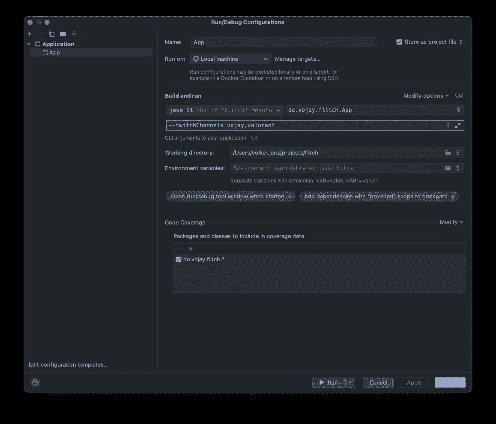

使用带有 twitchChannels 参数的运行配置（作者）

现在是时候再次运行你的流应用并享受整个过程了！


摄影：由 [Stanley Li](https://unsplash.com/@djravine?utm_source=medium&utm_medium=referral) 拍摄，来源：[Unsplash](https://unsplash.com/?utm_source=medium&utm_medium=referral)

# 结论

就这样！我们已经构建了一个实时情感分析应用，适用于 Twitch 聊天，使用的是 Apache Flink。现在你不仅可以看到聊天流，还能理解观众的情感脉动。这可能是更高级版本的基础。追踪整个直播过程中的情感，看看观众如何反应于重大操作或有趣时刻，并利用这些知识创造更具吸引力的内容。

以下是一些灵感，帮助你将这个原型转化为一个有价值的、可投入生产的项目：

⚙️ **调整模型**

使用专门针对社交媒体数据训练的模型（例如，[RoBERTa](https://huggingface.co/cardiffnlp/twitter-roberta-base-sentiment)），或者更好的方式是，直接用历史的 Twitch 聊天数据训练模型，来融入 Twitch 特有的交流元素，如特定的表情符号代码。

🧮 **应用窗口函数**

通过窗口函数扩展 Flink 管道，例如每分钟的滚动窗口，并计算每分钟的情感分数平均值。

📦 **持久化结果**

将结果流以每分钟聚合的形式持久化到 Kafka 或时间序列数据库（TSDB）中。

📊 **创建仪表盘**

在汇总数据上创建一个仪表盘，绘制每分钟的平均情感图表。

通过这些建议，你可以将结果与其他元数据结合起来，比如流媒体的实际分类/游戏类型或时间，以此来创建更复杂的推荐系统，帮助你了解哪些内容能带来积极的 Twitch 聊天体验。

所以下次当你观看你最喜欢的主播时，不妨留意一下后台运行的情感分析。它可能会揭示关于 Twitch 聊天这个充满激情的世界的一些有趣见解！

但这篇文章最重要的一点是：获取灵感，学习并启发他人。数据工程及相关领域最酷的地方在于：

> ***数据无处不在***

所以，总会有下一个有趣的问题等待你去探索，并可以用来学习，理想情况下将你的灵感与他人分享。


图片由[Alexander Sinn](https://unsplash.com/@swimstaralex?utm_source=medium&utm_medium=referral)提供，来自[Unsplash](https://unsplash.com/?utm_source=medium&utm_medium=referral)

享受这个过程，并在评论中告诉我你的体验 ✌️。
