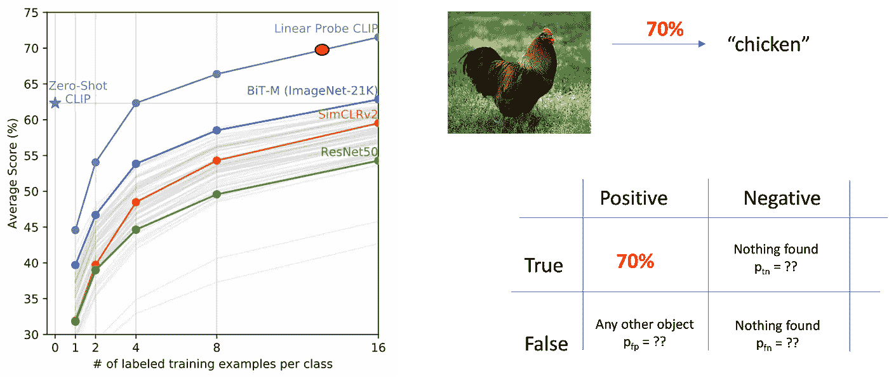

# 使用马尔可夫链推理不确定性

> 原文：[`towardsdatascience.com/reasoning-about-uncertainty-using-markov-chains-f18bd47207de?source=collection_archive---------3-----------------------#2024-02-26`](https://towardsdatascience.com/reasoning-about-uncertainty-using-markov-chains-f18bd47207de?source=collection_archive---------3-----------------------#2024-02-26)

## 解决“试错”问题的形式化方法

 [Nikolaus Correll](https://medium.com/@nikolaus.correll?source=post_page---byline--f18bd47207de--------------------------------)

·发表于 [Towards Data Science](https://towardsdatascience.com/?source=post_page---byline--f18bd47207de--------------------------------) ·10 分钟阅读·2024 年 2 月 26 日

--

以零-shot 的方式处理未见过的物体，使得机器学习模型在机器人应用中非常具有吸引力，[使得机器人能够进入之前未见过的环境，并在其中操控未知的物体](https://ok-robot.github.io/)。

*如果你不是 Medium 的订阅者，可以免费阅读这篇文章* [*点击这里*](https://medium.com/towards-data-science/reasoning-about-uncertainty-using-markov-chains-f18bd47207de?sk=5b07f239e82521a36d471090b78219f6)*.*

尽管与几年前的设想相比，它们在准确性方面令人难以置信，但不确定性不仅是长期存在的，还需要在决策过程中采用与传统机器学习不同的处理方式。

本文描述了处理我们称之为“试错”任务的最新研究成果，并解释了如何通过将系统建模为连续时间马尔可夫链（也叫马尔可夫跳跃过程）来推导出最优决策。

## 感知不确定性

左图： “CLIP”模型在准确提供图像标签方面的表现，显著超越了之前的研究。图片来自 [`arxiv.org/pdf/2103.00020.pdf`](https://arxiv.org/pdf/2103.00020.pdf)。右图：用一个数字总结模型的表现只是信息的一部分。一旦这些信息被用于决策，我们还需要理解模型失败的不同方式。图片：作者提供。

上面的图像展示了 CLIP 的零-shot 图像标签平均表现，CLIP 是 OpenAI 推出的一个开创性模型，作为 LLava 和 GPTv4 等大型多模态模型的基础。假设它能够以 70%的准确率为包含鸡的图像打上标签。虽然这是一个令人难以置信的表现，但在 30%的情况下，标签将会错误。
