# 从零开始重建 PyTorch（支持 GPU 和自动求导）

> 原文：[`towardsdatascience.com/recreating-pytorch-from-scratch-with-gpu-support-and-automatic-differentiation-8f565122a3cc?source=collection_archive---------0-----------------------#2024-05-14`](https://towardsdatascience.com/recreating-pytorch-from-scratch-with-gpu-support-and-automatic-differentiation-8f565122a3cc?source=collection_archive---------0-----------------------#2024-05-14)

## 基于 C/C++、CUDA 和 Python 构建你自己的深度学习框架，支持 GPU 并具有自动求导功能

[](https://medium.com/@lucasdelimanogueira?source=post_page---byline--8f565122a3cc--------------------------------)[](https://towardsdatascience.com/?source=post_page---byline--8f565122a3cc--------------------------------) [Lucas de Lima Nogueira](https://medium.com/@lucasdelimanogueira?source=post_page---byline--8f565122a3cc--------------------------------)

·发表于 [Towards Data Science](https://towardsdatascience.com/?source=post_page---byline--8f565122a3cc--------------------------------) ·阅读时长 24 分钟·2024 年 5 月 14 日

--

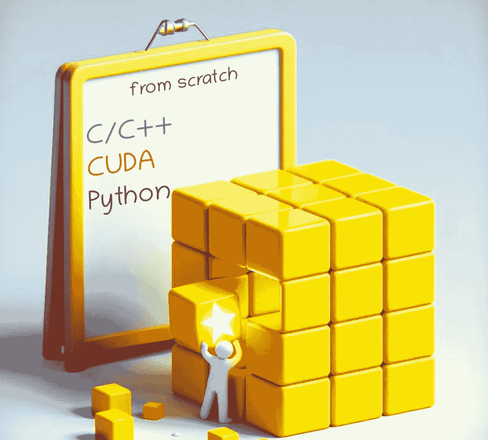

图片由作者与 AI 协作制作 ([`copilot.microsoft.com/images/create`](https://copilot.microsoft.com/images/create))

# 介绍

多年来，我一直在使用 PyTorch 构建和训练深度学习模型。尽管我已经学会了它的语法和规则，但一直有一个问题让我感到好奇：在这些操作过程中，内部发生了什么？这一切是如何工作的？

如果你已经读到这里，你可能有相同的问题。如果我问你如何在 PyTorch 中创建和训练一个模型，你可能会写出类似于下面的代码：

```py
import torch
import torch.nn as nn
import torch.optim as optim

class MyModel(nn.Module):
    def __init__(self):
        super(MyModel, self).__init__()
        self.fc1 = nn.Linear(1, 10)
        self.sigmoid = nn.Sigmoid()
        self.fc2 = nn.Linear(10, 1)

    def forward(self, x):
        out = self.fc1(x)
        out = self.sigmoid(out)
        out = self.fc2(out)

        return out

...

model = MyModel().to(device)
criterion = nn.MSELoss()
optimizer = optim.SGD(model.parameters(), lr=0.001)

for epoch in range(epochs):
    for x, y in ...

        x = x.to(device)
        y = y.to(device)

        outputs = model(x)
        loss = criterion(outputs, y)

        optimizer.zero_grad()
        loss.backward()
        optimizer.step()
```

但如果我问你，反向传播是如何工作的呢？或者，例如，当你重新塑形一个张量时，会发生什么？数据是否在内部重新排列？这一过程是如何发生的？为什么 PyTorch 如此高效？PyTorch 是如何处理 GPU 操作的？这些问题一直令我感到好奇，我想它们也会让你感兴趣。因此，为了更好地理解这些概念，最好的方法是什么呢？那就是从***零开始***构建你自己的张量库！而这正是你将在本文中学到的内容！

# #1 — 张量

要构建一个*张量库*，你首先需要了解的概念显然是：什么是张量？

你可能会直观地认为张量是一个数学概念，表示一个包含一些数字的 n 维数据结构。但在这里我们需要从计算的角度理解如何建模这个数据结构。我们可以把张量看作是由数据本身和一些元数据组成，这些元数据描述了张量的某些方面，如它的形状或它所存储的设备（即 CPU 内存、GPU 内存等）。

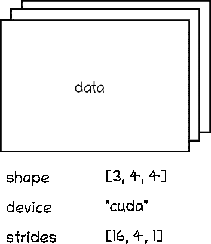

作者提供的图片

还有一个不太常见的元数据，可能你从未听说过，叫做 *步幅*。这个概念对于理解张量数据重排的内部原理非常重要，所以我们需要更详细地讨论一下。

想象一个形状为 [4, 8] 的二维张量，如下所示。

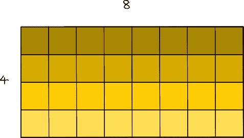

4x8 张量（作者提供的图片）

张量的数据（即浮点数）实际上是以一维数组的形式存储在内存中的：

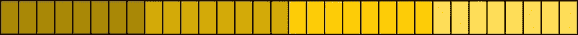

张量的一维数据数组（作者提供的图片）

因此，为了将这个一维数组表示为一个 N 维张量，我们使用步幅。基本的思想如下：

我们有一个 4 行 8 列的矩阵。考虑到它的所有元素都是按行在一维数组中组织的，如果我们想访问位置 [2, 3] 的值，我们需要遍历 2 行（每行 8 个元素），加上 3 个位置。用数学术语来说，我们需要在一维数组上遍历 3 + 2 * 8 个元素：

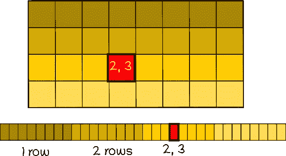

作者提供的图片

所以这个‘8’是第二维度的 *步幅*。在这种情况下，它表示了我需要在数组中遍历多少个元素才能“跳转”到第二维度的其他位置。

因此，对于访问形状为 [shape_0, shape_1] 的二维张量中的元素 [i, j]，我们基本上需要访问位置 j + i * shape_1 的元素。

现在，让我们想象一个三维张量：

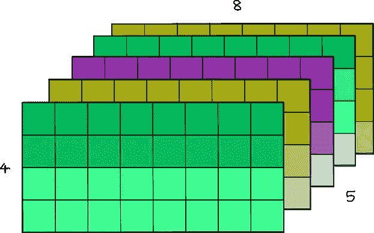

5x4x8 张量（作者提供的图片）

你可以把这个三维张量看作是矩阵的序列。例如，你可以把这个形状为 [5, 4, 8] 的张量看作是 5 个形状为 [4, 8] 的矩阵。

现在，为了访问位置 [1, 2, 7] 的元素，你需要遍历一个完整的形状为 [4, 8] 的矩阵，2 行形状为 [8] 和 7 列形状为 [1]。所以，你需要在一维数组上遍历 (1 * 4 * 8) + (2 * 8) + (7 * 1) 个位置。

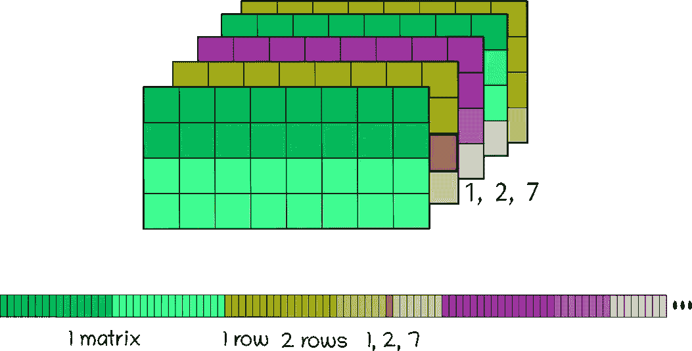

作者提供的图片

因此，要在一维数据数组上访问一个形状为 [shape_0, shape_1, shape_2] 的三维张量中的元素 [i][j][k]，你需要：

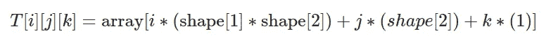

这个 shape_1 * shape_2 是第一维的 *步幅*，shape_2 是第二维的 *步幅*，1 是第三维的步幅。

然后，为了进行概括：

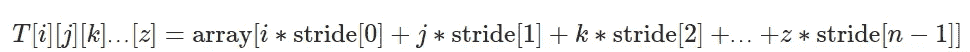

每个维度的*步幅*可以通过下一个维度张量形状的乘积来计算：

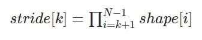

然后我们设置步幅[n-1] = 1。

在我们的形状为[5, 4, 8]的张量示例中，我们将得到步幅 = [4*8, 8, 1] = [32, 8, 1]

你可以自己测试：

```py
import torch

torch.rand([5, 4, 8]).stride()
#(32, 8, 1)
```

好的，但是为什么我们需要形状和步幅？除了访问存储为 1 维数组的 N 维张量的元素之外，这个概念可以非常容易地用来操作张量排列。

例如，要重塑一个张量，你只需要设置新形状并根据它计算新步幅！（因为新形状保证了相同数量的元素）

```py
import torch

t = torch.rand([5, 4, 8])

print(t.shape)
# [5, 4, 8]

print(t.stride())
# [32, 8, 1]

new_t = t.reshape([4, 5, 2, 2, 2])

print(new_t.shape)
# [4, 5, 2, 2, 2]

print(new_t.stride())
# [40, 8, 4, 2, 1]
```

在内部，张量仍然存储为相同的 1 维数组。重塑方法没有改变数组内元素的顺序！这很神奇，不是吗？😁

你可以自己验证，使用以下函数访问 PyTorch 的内部 1 维数组：

```py
import ctypes

def print_internal(t: torch.Tensor):
    print(
        torch.frombuffer(
            ctypes.string_at(t.data_ptr(), t.storage().nbytes()), dtype=t.dtype
        )
    )

print_internal(t)
# [0.0752, 0.5898, 0.3930, 0.9577, 0.2276, 0.9786, 0.1009, 0.138, ...

print_internal(new_t)
# [0.0752, 0.5898, 0.3930, 0.9577, 0.2276, 0.9786, 0.1009, 0.138, ...
```

或者例如，你想要转置两个轴。在内部，你只需要交换相应的步幅！

```py
t = torch.arange(0, 24).reshape(2, 3, 4)
print(t)
# [[[ 0,  1,  2,  3],
#   [ 4,  5,  6,  7],
#   [ 8,  9, 10, 11]],

#  [[12, 13, 14, 15],
#   [16, 17, 18, 19],
#   [20, 21, 22, 23]]]

print(t.shape)
# [2, 3, 4]

print(t.stride())
# [12, 4, 1]

new_t = t.transpose(0, 1)
print(new_t)
# [[[ 0,  1,  2,  3],
#   [12, 13, 14, 15]],

#  [[ 4,  5,  6,  7],
#   [16, 17, 18, 19]],

#  [[ 8,  9, 10, 11],
#   [20, 21, 22, 23]]]

print(new_t.shape)
# [3, 2, 4]

print(new_t.stride())
# [4, 12, 1]
```

如果你打印内部数组，两者都有相同的值：

```py
print_internal(t)
# [ 0,  1,  2,  3,  4,  5,  6,  7,  8,  9, 10, 11, 12, 13, 14, 15, 16, 17, 18, 19, 20, 21, 22, 23]

print_internal(new_t)
# [ 0,  1,  2,  3,  4,  5,  6,  7,  8,  9, 10, 11, 12, 13, 14, 15, 16, 17, 18, 19, 20, 21, 22, 23]
```

然而，`new_t`的步幅现在与我上面展示的方程不匹配。这是因为张量现在不再是连续的。这意味着虽然内部数组保持不变，但其在内存中的值的顺序与张量的实际顺序不匹配。

```py
t.is_contiguous()
# True

new_t.is_contiguous()
# False
```

这意味着按顺序访问非连续元素的效率较低（因为真实的张量元素在内存中不是按顺序排列的）。为了解决这个问题，我们可以这样做：

```py
new_t_contiguous = new_t.contiguous()

print(new_t_contiguous.is_contiguous())
# True
```

如果我们分析内部数组，现在其顺序与实际张量顺序匹配，这可以提供更好的内存访问效率：

```py
print(new_t)
# [[[ 0,  1,  2,  3],
#   [12, 13, 14, 15]],

#  [[ 4,  5,  6,  7],
#   [16, 17, 18, 19]],

#  [[ 8,  9, 10, 11],
#   [20, 21, 22, 23]]]

print_internal(new_t)
# [ 0,  1,  2,  3,  4,  5,  6,  7,  8,  9, 10, 11, 12, 13, 14, 15, 16, 17, 18, 19, 20, 21, 22, 23]

print_internal(new_t_contiguous)
# [ 0,  1,  2,  3, 12, 13, 14, 15,  4,  5,  6,  7, 16, 17, 18, 19,  8,  9, 10, 11, 20, 21, 22, 23]
```

现在我们理解了张量是如何建模的，让我们开始创建我们的库吧！

我将其称为*Norch*，代表着 NOT PyTorch，并且也暗指了我的姓氏，Nogueira 😁

首先要知道的是，尽管 PyTorch 是通过 Python 使用的，但在内部它运行的是 C/C++。因此，我们将首先创建我们的内部 C/C++函数。

我们可以首先定义张量作为一个结构体来存储其数据和元数据，并创建一个函数来实例化它：

```py
//norch/csrc/tensor.cpp

#include <stdio.h>
#include <stdlib.h>
#include <string.h>
#include <math.h>

typedef struct {
    float* data;
    int* strides;
    int* shape;
    int ndim;
    int size;
    char* device;
} Tensor;

Tensor* create_tensor(float* data, int* shape, int ndim) {

    Tensor* tensor = (Tensor*)malloc(sizeof(Tensor));
    if (tensor == NULL) {
        fprintf(stderr, "Memory allocation failed\n");
        exit(1);
    }
    tensor->data = data;
    tensor->shape = shape;
    tensor->ndim = ndim;

    tensor->size = 1;
    for (int i = 0; i < ndim; i++) {
        tensor->size *= shape[i];
    }

    tensor->strides = (int*)malloc(ndim * sizeof(int));
    if (tensor->strides == NULL) {
        fprintf(stderr, "Memory allocation failed\n");
        exit(1);
    }
    int stride = 1;
    for (int i = ndim - 1; i >= 0; i--) {
        tensor->strides[i] = stride;
        stride *= shape[i];
    }

    return tensor;
}
```

为了访问某个元素，我们可以利用之前学到的步幅：

```py
//norch/csrc/tensor.cpp

float get_item(Tensor* tensor, int* indices) {
    int index = 0;
    for (int i = 0; i < tensor->ndim; i++) {
        index += indices[i] * tensor->strides[i];
    }

    float result;
    result = tensor->data[index];

    return result;
}
```

现在，我们可以创建张量操作。我将展示一些示例，你可以在本文末尾链接的存储库中找到完整版本。

```py
//norch/csrc/cpu.cpp

void add_tensor_cpu(Tensor* tensor1, Tensor* tensor2, float* result_data) {

    for (int i = 0; i < tensor1->size; i++) {
        result_data[i] = tensor1->data[i] + tensor2->data[i];
    }
}

void sub_tensor_cpu(Tensor* tensor1, Tensor* tensor2, float* result_data) {

    for (int i = 0; i < tensor1->size; i++) {
        result_data[i] = tensor1->data[i] - tensor2->data[i];
    }
}

void elementwise_mul_tensor_cpu(Tensor* tensor1, Tensor* tensor2, float* result_data) {

    for (int i = 0; i < tensor1->size; i++) {
        result_data[i] = tensor1->data[i] * tensor2->data[i];
    }
}

void assign_tensor_cpu(Tensor* tensor, float* result_data) {

    for (int i = 0; i < tensor->size; i++) {
        result_data[i] = tensor->data[i];
    }
}

...
```

之后我们就能创建我们的其他调用这些操作的张量函数：

```py
//norch/csrc/tensor.cpp

Tensor* add_tensor(Tensor* tensor1, Tensor* tensor2) {
    if (tensor1->ndim != tensor2->ndim) {
        fprintf(stderr, "Tensors must have the same number of dimensions %d and %d for addition\n", tensor1->ndim, tensor2->ndim);
        exit(1);
    }

    int ndim = tensor1->ndim;
    int* shape = (int*)malloc(ndim * sizeof(int));
    if (shape == NULL) {
        fprintf(stderr, "Memory allocation failed\n");
        exit(1);
    }

    for (int i = 0; i < ndim; i++) {
        if (tensor1->shape[i] != tensor2->shape[i]) {
            fprintf(stderr, "Tensors must have the same shape %d and %d at index %d for addition\n", tensor1->shape[i], tensor2->shape[i], i);
            exit(1);
        }
        shape[i] = tensor1->shape[i];
    }        
    float* result_data = (float*)malloc(tensor1->size * sizeof(float));
    if (result_data == NULL) {
        fprintf(stderr, "Memory allocation failed\n");
        exit(1);
    }
    add_tensor_cpu(tensor1, tensor2, result_data);

    return create_tensor(result_data, shape, ndim, device);
}
```

如前所述，张量重塑不会修改内部数据数组：

```py
//norch/csrc/tensor.cpp

Tensor* reshape_tensor(Tensor* tensor, int* new_shape, int new_ndim) {

    int ndim = new_ndim;
    int* shape = (int*)malloc(ndim * sizeof(int));
    if (shape == NULL) {
        fprintf(stderr, "Memory allocation failed\n");
        exit(1);
    }

    for (int i = 0; i < ndim; i++) {
        shape[i] = new_shape[i];
    }

    // Calculate the total number of elements in the new shape
    int size = 1;
    for (int i = 0; i < new_ndim; i++) {
        size *= shape[i];
    }

    // Check if the total number of elements matches the current tensor's size
    if (size != tensor->size) {
        fprintf(stderr, "Cannot reshape tensor. Total number of elements in new shape does not match the current size of the tensor.\n");
        exit(1);
    }

    float* result_data = (float*)malloc(tensor->size * sizeof(float));
    if (result_data == NULL) {
        fprintf(stderr, "Memory allocation failed\n");
        exit(1);
    }
    assign_tensor_cpu(tensor, result_data);
    return create_tensor(result_data, shape, ndim, device);
}
```

虽然我们现在可以进行一些张量操作，但是没有人愿意使用 C/C++来运行它，对吧？让我们开始构建我们的 Python 包装器！

有很多选项可以使用 Python 运行 C/C++代码，比如*Pybind11*和*Cython*。在我们的例子中，我将使用*ctypes*。

*ctypes*的基本结构如下所示：

```py
//C code
#include <stdio.h>

float add_floats(float a, float b) {
    return a + b;
}
```

```py
# Compile
gcc -shared -o add_floats.so -fPIC add_floats.c
```

```py
# Python code
import ctypes

# Load the shared library
lib = ctypes.CDLL('./add_floats.so')

# Define the argument and return types for the function
lib.add_floats.argtypes = [ctypes.c_float, ctypes.c_float]
lib.add_floats.restype = ctypes.c_float

# Convert python float to c_float type 
a = ctypes.c_float(3.5)
b = ctypes.c_float(2.2)

# Call the C function
result = lib.add_floats(a, b)
print(result)
# 5.7
```

如你所见，这非常直观。在你编译 C/C++代码后，可以非常轻松地在 Python 中使用*ctypes*。你只需要定义函数的参数和返回值类型，并将变量转换为相应的 C 类型，再调用函数。对于更复杂的类型，如数组（浮动列表），你可以使用指针。

```py
data = [1.0, 2.0, 3.0]
data_ctype = (ctypes.c_float * len(data))(*data)

lib.some_array_func.argstypes = [ctypes.POINTER(ctypes.c_float)]

...

lib.some_array_func(data)
```

对于结构类型，我们可以创建我们自己的 C 类型：

```py
class CustomType(ctypes.Structure):
    _fields_ = [
        ('field1', ctypes.POINTER(ctypes.c_float)),
        ('field2', ctypes.POINTER(ctypes.c_int)),
        ('field3', ctypes.c_int),
    ]

# Can be used as ctypes.POINTER(CustomType)
```

在这段简短的解释之后，让我们为我们的张量 C/C++库构建 Python 包装器！

```py
# norch/tensor.py

import ctypes

class CTensor(ctypes.Structure):
    _fields_ = [
        ('data', ctypes.POINTER(ctypes.c_float)),
        ('strides', ctypes.POINTER(ctypes.c_int)),
        ('shape', ctypes.POINTER(ctypes.c_int)),
        ('ndim', ctypes.c_int),
        ('size', ctypes.c_int),
    ]

class Tensor:
    os.path.abspath(os.curdir)
    _C = ctypes.CDLL("COMPILED_LIB.so"))

    def __init__(self):

        data, shape = self.flatten(data)
        self.data_ctype = (ctypes.c_float * len(data))(*data)
        self.shape_ctype = (ctypes.c_int * len(shape))(*shape)
        self.ndim_ctype = ctypes.c_int(len(shape))

        self.shape = shape
        self.ndim = len(shape)

        Tensor._C.create_tensor.argtypes = [ctypes.POINTER(ctypes.c_float), ctypes.POINTER(ctypes.c_int), ctypes.c_int]
        Tensor._C.create_tensor.restype = ctypes.POINTER(CTensor)

        self.tensor = Tensor._C.create_tensor(
            self.data_ctype,
            self.shape_ctype,
            self.ndim_ctype,
        )

    def flatten(self, nested_list):
        """
        This method simply convert a list type tensor to a flatten tensor with its shape

        Example:

        Arguments:  
            nested_list: [[1, 2, 3], [-5, 2, 0]]
        Return:
            flat_data: [1, 2, 3, -5, 2, 0]
            shape: [2, 3]
        """
        def flatten_recursively(nested_list):
            flat_data = []
            shape = []
            if isinstance(nested_list, list):
                for sublist in nested_list:
                    inner_data, inner_shape = flatten_recursively(sublist)
                    flat_data.extend(inner_data)
                shape.append(len(nested_list))
                shape.extend(inner_shape)
            else:
                flat_data.append(nested_list)
            return flat_data, shape

        flat_data, shape = flatten_recursively(nested_list)
        return flat_data, shape 
```

现在我们包括了 Python 张量操作，以便调用 C/C++操作。

```py
# norch/tensor.py

def __getitem__(self, indices):
    """
    Access tensor by index tensor[i, j, k...]
    """

    if len(indices) != self.ndim:
        raise ValueError("Number of indices must match the number of dimensions")

    Tensor._C.get_item.argtypes = [ctypes.POINTER(CTensor), ctypes.POINTER(ctypes.c_int)]
    Tensor._C.get_item.restype = ctypes.c_float

    indices = (ctypes.c_int * len(indices))(*indices)
    value = Tensor._C.get_item(self.tensor, indices)  

    return value

def reshape(self, new_shape):
    """
    Reshape tensor
    result = tensor.reshape([1,2])
    """
    new_shape_ctype = (ctypes.c_int * len(new_shape))(*new_shape)
    new_ndim_ctype = ctypes.c_int(len(new_shape))

    Tensor._C.reshape_tensor.argtypes = [ctypes.POINTER(CTensor), ctypes.POINTER(ctypes.c_int), ctypes.c_int]
    Tensor._C.reshape_tensor.restype = ctypes.POINTER(CTensor)
    result_tensor_ptr = Tensor._C.reshape_tensor(self.tensor, new_shape_ctype, new_ndim_ctype)   

    result_data = Tensor()
    result_data.tensor = result_tensor_ptr
    result_data.shape = new_shape.copy()
    result_data.ndim = len(new_shape)
    result_data.device = self.device

    return result_data

def __add__(self, other):
    """
    Add tensors
    result = tensor1 + tensor2
    """

    if self.shape != other.shape:
        raise ValueError("Tensors must have the same shape for addition")

    Tensor._C.add_tensor.argtypes = [ctypes.POINTER(CTensor), ctypes.POINTER(CTensor)]
    Tensor._C.add_tensor.restype = ctypes.POINTER(CTensor)

    result_tensor_ptr = Tensor._C.add_tensor(self.tensor, other.tensor)

    result_data = Tensor()
    result_data.tensor = result_tensor_ptr
    result_data.shape = self.shape.copy()
    result_data.ndim = self.ndim
    result_data.device = self.device

    return result_data

# Include the other operations:
# __str__
# __sub__ (-)
# __mul__ (*)
# __matmul__ (@)
# __pow__ (**)
# __truediv__ (/)
# log
# ...
```

如果你已经看到这里，你现在可以运行代码并开始进行一些张量操作了！

```py
import norch

tensor1 = norch.Tensor([[1, 2, 3], [3, 2, 1]])
tensor2 = norch.Tensor([[3, 2, 1], [1, 2, 3]])

result = tensor1 + tensor2
print(result[0, 0])
# 4 
```

# #2 — GPU 支持

在创建了我们库的基本结构之后，现在我们将把它提升到一个新层次。众所周知，你可以调用`.to("cuda")`将数据发送到 GPU，并加快数学运算速度。我假设你对 CUDA 的基本工作原理有所了解，但如果不了解，你可以阅读我另外一篇文章：CUDA 教程. 我在这里等你。😊

…

对于急于了解的人，这里有一个简短的介绍：

基本上，到目前为止，我们的所有代码都在 CPU 内存上运行。虽然对于单一操作 CPU 速度更快，但 GPU 的优势在于它的并行化能力。CPU 设计旨在快速执行一系列操作（线程）（但它只能执行几十个），而 GPU 设计则旨在并行执行数百万个操作（通过牺牲单个线程的性能）。

因此，我们可以利用这一能力并行执行操作。例如，在一个百万大小的张量加法中，不必在循环内部依次添加每个索引的元素，使用 GPU 我们可以一次性并行地加和所有元素。为此，我们可以使用 CUDA，这是 NVIDIA 开发的一个平台，旨在让开发者将 GPU 支持集成到他们的软件应用中。

为了做到这一点，你可以使用 CUDA C/C++，这是一种基于 C/C++的简单接口，旨在运行特定的 GPU 操作（例如将数据从 CPU 内存复制到 GPU 内存）。

以下代码基本上使用了一些 CUDA C/C++函数，将数据从 CPU 复制到 GPU，并在总共 N 个 GPU 线程上并行运行 AddTwoArrays 函数（也叫做 kernel），每个线程负责加和数组中的不同元素。

```py
#include <stdio.h>

// CPU version for comparison
void AddTwoArrays_CPU(flaot A[], float B[], float C[]) {
    for (int i = 0; i < N; i++) {
        C[i] = A[i] + B[i];
    }
}

// Kernel definition
__global__ void AddTwoArrays_GPU(float A[], float B[], float C[]) {
    int i = threadIdx.x;
    C[i] = A[i] + B[i];
}

int main() {

    int N = 1000; // Size of the arrays
    float A[N], B[N], C[N]; // Arrays A, B, and C

    ...

    float *d_A, *d_B, *d_C; // Device pointers for arrays A, B, and C

    // Allocate memory on the device for arrays A, B, and C
    cudaMalloc((void **)&d_A, N * sizeof(float));
    cudaMalloc((void **)&d_B, N * sizeof(float));
    cudaMalloc((void **)&d_C, N * sizeof(float));

    // Copy arrays A and B from host to device
    cudaMemcpy(d_A, A, N * sizeof(float), cudaMemcpyHostToDevice);
    cudaMemcpy(d_B, B, N * sizeof(float), cudaMemcpyHostToDevice);

    // Kernel invocation with N threads
    AddTwoArrays_GPU<<<1, N>>>(d_A, d_B, d_C);

    // Copy vector C from device to host
    cudaMemcpy(C, d_C, N * sizeof(float), cudaMemcpyDeviceToHost);

}
```

如你所见，我们不是每次操作时加和每对元素，而是并行执行所有加法操作，从而省去了循环指令。

在这段简短的介绍之后，我们可以回到我们的张量库。

第一步是创建一个函数，将张量数据从 CPU 发送到 GPU，反之亦然。

```py
//norch/csrc/tensor.cpp

void to_device(Tensor* tensor, char* target_device) {
    if ((strcmp(target_device, "cuda") == 0) && (strcmp(tensor->device, "cpu") == 0)) {
        cpu_to_cuda(tensor);
    }

    else if ((strcmp(target_device, "cpu") == 0) && (strcmp(tensor->device, "cuda") == 0)) {
        cuda_to_cpu(tensor);
    }
}
```

```py
//norch/csrc/cuda.cu

__host__ void cpu_to_cuda(Tensor* tensor) {

    float* data_tmp;
    cudaMalloc((void **)&data_tmp, tensor->size * sizeof(float));
    cudaMemcpy(data_tmp, tensor->data, tensor->size * sizeof(float), cudaMemcpyHostToDevice);

    tensor->data = data_tmp;

    const char* device_str = "cuda";
    tensor->device = (char*)malloc(strlen(device_str) + 1);
    strcpy(tensor->device, device_str); 

    printf("Successfully sent tensor to: %s\n", tensor->device);
}

__host__ void cuda_to_cpu(Tensor* tensor) {
    float* data_tmp = (float*)malloc(tensor->size * sizeof(float));

    cudaMemcpy(data_tmp, tensor->data, tensor->size * sizeof(float), cudaMemcpyDeviceToHost);
    cudaFree(tensor->data);

    tensor->data = data_tmp;

    const char* device_str = "cpu";
    tensor->device = (char*)malloc(strlen(device_str) + 1);
    strcpy(tensor->device, device_str); 

    printf("Successfully sent tensor to: %s\n", tensor->device);
}
```

Python 包装器：

```py
# norch/tensor.py

def to(self, device):
    self.device = device
    self.device_ctype = self.device.encode('utf-8')

    Tensor._C.to_device.argtypes = [ctypes.POINTER(CTensor), ctypes.c_char_p]
    Tensor._C.to_device.restype = None
    Tensor._C.to_device(self.tensor, self.device_ctype)

    return self
```

然后，我们为所有的张量操作创建 GPU 版本。我将为加法和减法写出示例：

```py
//norch/csrc/cuda.cu

#define THREADS_PER_BLOCK 128

__global__ void add_tensor_cuda_kernel(float* data1, float* data2, float* result_data, int size) {

    int i = blockIdx.x * blockDim.x + threadIdx.x;
    if (i < size) {
        result_data[i] = data1[i] + data2[i];
    }
}

__host__ void add_tensor_cuda(Tensor* tensor1, Tensor* tensor2, float* result_data) {

    int number_of_blocks = (tensor1->size + THREADS_PER_BLOCK - 1) / THREADS_PER_BLOCK;
    add_tensor_cuda_kernel<<<number_of_blocks, THREADS_PER_BLOCK>>>(tensor1->data, tensor2->data, result_data, tensor1->size);

    cudaError_t error = cudaGetLastError();
    if (error != cudaSuccess) {
        printf("CUDA error: %s\n", cudaGetErrorString(error));
        exit(-1);
    }

    cudaDeviceSynchronize();
}

__global__ void sub_tensor_cuda_kernel(float* data1, float* data2, float* result_data, int size) {

    int i = blockIdx.x * blockDim.x + threadIdx.x;
    if (i < size) {
        result_data[i] = data1[i] - data2[i];
    }
}

__host__ void sub_tensor_cuda(Tensor* tensor1, Tensor* tensor2, float* result_data) {

    int number_of_blocks = (tensor1->size + THREADS_PER_BLOCK - 1) / THREADS_PER_BLOCK;
    sub_tensor_cuda_kernel<<<number_of_blocks, THREADS_PER_BLOCK>>>(tensor1->data, tensor2->data, result_data, tensor1->size);

    cudaError_t error = cudaGetLastError();
    if (error != cudaSuccess) {
        printf("CUDA error: %s\n", cudaGetErrorString(error));
        exit(-1);
    }

    cudaDeviceSynchronize();
}

... 
```

随后，我们在`tensor.cpp`上包含一个新的张量属性`char* device`，我们可以使用它来选择操作将在哪里运行（CPU 或 GPU）：

```py
//norch/csrc/tensor.cpp

Tensor* add_tensor(Tensor* tensor1, Tensor* tensor2) {
    if (tensor1->ndim != tensor2->ndim) {
        fprintf(stderr, "Tensors must have the same number of dimensions %d and %d for addition\n", tensor1->ndim, tensor2->ndim);
        exit(1);
    }

    if (strcmp(tensor1->device, tensor2->device) != 0) {
        fprintf(stderr, "Tensors must be on the same device: %s and %s\n", tensor1->device, tensor2->device);
        exit(1);
    }

    char* device = (char*)malloc(strlen(tensor1->device) + 1);
    if (device != NULL) {
        strcpy(device, tensor1->device);
    } else {
        fprintf(stderr, "Memory allocation failed\n");
        exit(-1);
    }
    int ndim = tensor1->ndim;
    int* shape = (int*)malloc(ndim * sizeof(int));
    if (shape == NULL) {
        fprintf(stderr, "Memory allocation failed\n");
        exit(1);
    }

    for (int i = 0; i < ndim; i++) {
        if (tensor1->shape[i] != tensor2->shape[i]) {
            fprintf(stderr, "Tensors must have the same shape %d and %d at index %d for addition\n", tensor1->shape[i], tensor2->shape[i], i);
            exit(1);
        }
        shape[i] = tensor1->shape[i];
    }        

    if (strcmp(tensor1->device, "cuda") == 0) {

        float* result_data;
        cudaMalloc((void **)&result_data, tensor1->size * sizeof(float));
        add_tensor_cuda(tensor1, tensor2, result_data);
        return create_tensor(result_data, shape, ndim, device);
    } 
    else {
        float* result_data = (float*)malloc(tensor1->size * sizeof(float));
        if (result_data == NULL) {
            fprintf(stderr, "Memory allocation failed\n");
            exit(1);
        }
        add_tensor_cpu(tensor1, tensor2, result_data);
        return create_tensor(result_data, shape, ndim, device);
    }     
}
```

现在我们的库支持 GPU！

```py
import norch

tensor1 = norch.Tensor([[1, 2, 3], [3, 2, 1]]).to("cuda")
tensor2 = norch.Tensor([[3, 2, 1], [1, 2, 3]]).to("cuda")

result = tensor1 + tensor2
```

# #3 — 自动微分（Autograd）

PyTorch 变得如此受欢迎的主要原因之一是其 Autograd 模块。这是一个核心组件，允许自动微分以计算梯度（对于使用梯度下降等优化算法训练模型至关重要）。通过调用单个方法`.backward()`，它计算出先前张量操作的所有梯度：

```py
x = torch.tensor([[1., 2, 3], [3., 2, 1]], requires_grad=True)
# [[1,  2,  3],
#  [3,  2., 1]]

y = torch.tensor([[3., 2, 1], [1., 2, 3]], requires_grad=True)
# [[3,  2, 1],
#  [1,  2, 3]]

L = ((x - y) ** 3).sum()

L.backward()

# You can access gradients of x and y
print(x.grad)
# [[12, 0, 12],
#  [12, 0, 12]]

print(y.grad)
# [[-12, 0, -12],
#  [-12, 0, -12]]

# In order to minimize z, you can use that for gradient descent:
# x = x - learning_rate * x.grad
# y = y - learning_rate * y.grad 
```

为了理解发生了什么，让我们尝试手动复制相同的过程：

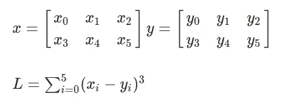

让我们首先计算：

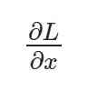

请注意*x*是一个矩阵，因此我们需要分别计算*L*对每个元素的导数。此外，*L*是所有元素的总和，但重要的是要记住，对于每个元素，其他元素不会影响其导数。因此，我们得到以下项：

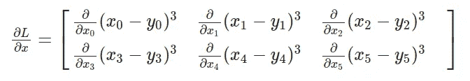

通过为每个项应用链式法则，我们区分外部函数并乘以内部函数的导数：

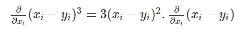

其中：

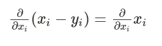

最后：

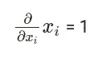

因此，我们有以下最终方程来计算*L*相对于*x*的导数：

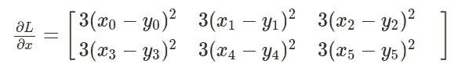

将值代入方程式：

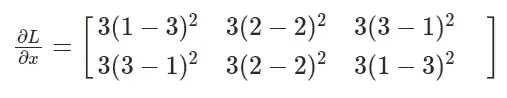

计算结果，我们得到与 PyTorch 获得的相同值：

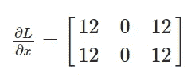

现在，让我们分析刚才做的事情：

基本上，我们按照保留顺序观察了所有涉及的操作：求和、3 的幂和减法。然后，我们应用链式法则，计算每个操作的导数，并递归地计算下一个操作的导数。因此，首先我们需要为不同的数学操作实现导数：

对于加法：

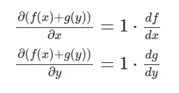

```py
# norch/autograd/functions.py

class AddBackward:
    def __init__(self, x, y):
        self.input = [x, y]

    def backward(self, gradient):
        return [gradient, gradient]
```

对于正弦：


```py
# norch/autograd/functions.py

class SinBackward:
    def __init__(self, x):
        self.input = [x]

    def backward(self, gradient):
        x = self.input[0]
        return [x.cos() * gradient]
```

对于余弦：

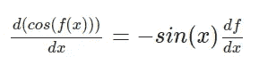

```py
# norch/autograd/functions.py

class CosBackward:
    def __init__(self, x):
        self.input = [x]

    def backward(self, gradient):
        x = self.input[0]
        return [- x.sin() * gradient]
```

对于逐元素乘法：

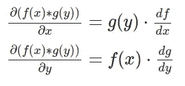

```py
# norch/autograd/functions.py

class ElementwiseMulBackward:
    def __init__(self, x, y):
        self.input = [x, y]

    def backward(self, gradient):
        x = self.input[0]
        y = self.input[1]
        return [y * gradient, x * gradient]
```

对于求和：

```py
# norch/autograd/functions.py

class SumBackward:
    def __init__(self, x):
        self.input = [x]

    def backward(self, gradient):
        # Since sum reduces a tensor to a scalar, gradient is broadcasted to match the original shape.
        return [float(gradient.tensor.contents.data[0]) * self.input[0].ones_like()] 
```

您可以在文章末尾访问 GitHub 存储库链接以探索其他操作。

现在我们对每个操作有了导数表达式，我们可以继续实现递归反向链规则。我们可以为我们的张量设置一个`requires_grad`参数，以指示我们要存储此张量的梯度。如果为真，我们将为每个张量操作存储梯度。例如：

```py
# norch/tensor.py

def __add__(self, other):

  if self.shape != other.shape:
      raise ValueError("Tensors must have the same shape for addition")

  Tensor._C.add_tensor.argtypes = [ctypes.POINTER(CTensor), ctypes.POINTER(CTensor)]
  Tensor._C.add_tensor.restype = ctypes.POINTER(CTensor)

  result_tensor_ptr = Tensor._C.add_tensor(self.tensor, other.tensor)

  result_data = Tensor()
  result_data.tensor = result_tensor_ptr
  result_data.shape = self.shape.copy()
  result_data.ndim = self.ndim
  result_data.device = self.device

  result_data.requires_grad = self.requires_grad or other.requires_grad
  if result_data.requires_grad:
      result_data.grad_fn = AddBackward(self, other)
```

然后，实现`.backward()`方法：

```py
# norch/tensor.py

def backward(self, gradient=None):
    if not self.requires_grad:
        return

    if gradient is None:
        if self.shape == [1]:
            gradient = Tensor([1]) # dx/dx = 1 case
        else:
            raise RuntimeError("Gradient argument must be specified for non-scalar tensors.")

    if self.grad is None:
        self.grad = gradient

    else:
        self.grad += gradient

    if self.grad_fn is not None: # not a leaf
        grads = self.grad_fn.backward(gradient) # call the operation backward
        for tensor, grad in zip(self.grad_fn.input, grads):
            if isinstance(tensor, Tensor):
                tensor.backward(grad) # recursively call the backward again for the gradient expression (chain rule)
```

最后，只需实现`.zero_grad()`将张量的梯度归零，`.detach()`将移除张量的自动梯度历史：

```py
# norch/tensor.py

def zero_grad(self):
    self.grad = None

def detach(self):
    self.grad = None
    self.grad_fn = None
```

恭喜！您刚刚创建了一个完整的张量库，支持 GPU 和自动微分！现在我们可以创建`nn`和`optim`模块，更轻松地训练一些深度学习模型。

# #4 — nn 和 optim 模块

`nn`是用于构建神经网络和深度学习模型的模块，而`optim`与优化算法相关，用于训练这些模型。为了重新创建它们，首先要实现一个 Parameter，它只是一个可训练的张量，具有相同的操作，但`requires_grad`始终设置为`True`，并采用一些随机初始化技术。

```py
# norch/nn/parameter.py

from norch.tensor import Tensor
from norch.utils import utils
import random

class Parameter(Tensor):
    """
    A parameter is a trainable tensor.
    """
    def __init__(self, shape):
        data = utils.generate_random_list(shape=shape)
        super().__init__(data, requires_grad=True)
```

```py
# norch/utisl/utils.py

def generate_random_list(shape):
    """
    Generate a list with random numbers and shape 'shape'
    [4, 2] --> [[rand1, rand2], [rand3, rand4], [rand5, rand6], [rand7, rand8]]
    """
    if len(shape) == 0:
        return []
    else:
        inner_shape = shape[1:]
        if len(inner_shape) == 0:
            return [random.uniform(-1, 1) for _ in range(shape[0])]
        else:
            return [generate_random_list(inner_shape) for _ in range(shape[0])]
```

通过使用参数，我们可以开始构建模块：

```py
# norch/nn/module.py

from .parameter import Parameter
from collections import OrderedDict
from abc import ABC
import inspect

class Module(ABC):
    """
    Abstract class for modules
    """
    def __init__(self):
        self._modules = OrderedDict()
        self._params = OrderedDict()
        self._grads = OrderedDict()
        self.training = True

    def forward(self, *inputs, **kwargs):
        raise NotImplementedError

    def __call__(self, *inputs, **kwargs):
        return self.forward(*inputs, **kwargs)

    def train(self):
        self.training = True
        for param in self.parameters():
            param.requires_grad = True

    def eval(self):
        self.training = False
        for param in self.parameters():
            param.requires_grad = False

    def parameters(self):
        for name, value in inspect.getmembers(self):
            if isinstance(value, Parameter):
                yield self, name, value
            elif isinstance(value, Module):
                yield from value.parameters()

    def modules(self):
        yield from self._modules.values()

    def gradients(self):
        for module in self.modules():
            yield module._grads

    def zero_grad(self):
        for _, _, parameter in self.parameters():
            parameter.zero_grad()

    def to(self, device):
        for _, _, parameter in self.parameters():
            parameter.to(device)

        return self

    def inner_repr(self):
        return ""

    def __repr__(self):
        string = f"{self.get_name()}("
        tab = "   "
        modules = self._modules
        if modules == {}:
            string += f'\n{tab}(parameters): {self.inner_repr()}'
        else:
            for key, module in modules.items():
                string += f"\n{tab}({key}): {module.get_name()}({module.inner_repr()})"
        return f'{string}\n)'

    def get_name(self):
        return self.__class__.__name__

    def __setattr__(self, key, value):
        self.__dict__[key] = value

        if isinstance(value, Module):
            self._modules[key] = value
        elif isinstance(value, Parameter):
            self._params[key] = value
```

例如，我们可以通过继承`nn.Module`来构建自定义模块，或者我们可以使用一些先前创建的模块，比如`linear`，它实现了***y*** *= W****x*** *+ b*的操作。

```py
# norch/nn/modules/linear.py

from ..module import Module
from ..parameter import Parameter

class Linear(Module):
    def __init__(self, input_dim, output_dim):
        super().__init__()
        self.input_dim = input_dim
        self.output_dim = output_dim
        self.weight = Parameter(shape=[self.output_dim, self.input_dim])
        self.bias = Parameter(shape=[self.output_dim, 1])

    def forward(self, x):
        z = self.weight @ x + self.bias
        return z

    def inner_repr(self):
        return f"input_dim={self.input_dim}, output_dim={self.output_dim}, " \
               f"bias={True if self.bias is not None else False}"
```

现在我们可以实现一些损失和激活函数。例如，均方误差损失和 sigmoid 函数：

```py
# norch/nn/loss.py

from .module import Module

class MSELoss(Module):
    def __init__(self):
      pass

    def forward(self, predictions, labels):
        assert labels.shape == predictions.shape, \
            "Labels and predictions shape does not match: {} and {}".format(labels.shape, predictions.shape)

        return ((predictions - labels) ** 2).sum() / predictions.numel

    def __call__(self, *inputs):
        return self.forward(*inputs)
```

```py
# norch/nn/activation.py

from .module import Module
import math

class Sigmoid(Module):
    def __init__(self):
        super().__init__()

    def forward(self, x):
        return 1.0 / (1.0 + (math.e) ** (-x)) 
```

最后，创建优化器。在我们的示例中，我将实现随机梯度下降算法：

```py
# norch/optim/optimizer.py

from abc import ABC
from norch.tensor import Tensor

class Optimizer(ABC):
    """
    Abstract class for optimizers
    """

    def __init__(self, parameters):
        if isinstance(parameters, Tensor):
            raise TypeError("parameters should be an iterable but got {}".format(type(parameters)))
        elif isinstance(parameters, dict):
            parameters = parameters.values()

        self.parameters = list(parameters)

    def step(self):
        raise NotImplementedError

    def zero_grad(self):
        for module, name, parameter in self.parameters:
            parameter.zero_grad()

class SGD(Optimizer):
    def __init__(self, parameters, lr=1e-1, momentum=0):
        super().__init__(parameters)
        self.lr = lr
        self.momentum = momentum
        self._cache = {'velocity': [p.zeros_like() for (_, _, p) in self.parameters]}

    def step(self):
        for i, (module, name, _) in enumerate(self.parameters):
            parameter = getattr(module, name)

            velocity = self._cache['velocity'][i]

            velocity = self.momentum * velocity - self.lr * parameter.grad

            updated_parameter = parameter + velocity

            setattr(module, name, updated_parameter)

            self._cache['velocity'][i] = velocity

            parameter.detach()
            velocity.detach()
```

就是这样！我们刚刚创建了自己的深度学习框架！🥳

让我们进行一些训练：

```py
import norch
import norch.nn as nn
import norch.optim as optim
import random
import math

random.seed(1)

class MyModel(nn.Module):
    def __init__(self):
        super(MyModel, self).__init__()
        self.fc1 = nn.Linear(1, 10)
        self.sigmoid = nn.Sigmoid()
        self.fc2 = nn.Linear(10, 1)

    def forward(self, x):
        out = self.fc1(x)
        out = self.sigmoid(out)
        out = self.fc2(out)

        return out

device = "cuda"
epochs = 10

model = MyModel().to(device)
criterion = nn.MSELoss()
optimizer = optim.SGD(model.parameters(), lr=0.001)
loss_list = []

x_values = [0\. ,  0.4,  0.8,  1.2,  1.6,  2\. ,  2.4,  2.8,  3.2,  3.6,  4\. ,
        4.4,  4.8,  5.2,  5.6,  6\. ,  6.4,  6.8,  7.2,  7.6,  8\. ,  8.4,
        8.8,  9.2,  9.6, 10\. , 10.4, 10.8, 11.2, 11.6, 12\. , 12.4, 12.8,
       13.2, 13.6, 14\. , 14.4, 14.8, 15.2, 15.6, 16\. , 16.4, 16.8, 17.2,
       17.6, 18\. , 18.4, 18.8, 19.2, 19.6, 20.]

y_true = []
for x in x_values:
    y_true.append(math.pow(math.sin(x), 2))

for epoch in range(epochs):
    for x, target in zip(x_values, y_true):
        x = norch.Tensor([[x]]).T
        target = norch.Tensor([[target]]).T

        x = x.to(device)
        target = target.to(device)

        outputs = model(x)
        loss = criterion(outputs, target)

        optimizer.zero_grad()
        loss.backward()
        optimizer.step()

    print(f'Epoch [{epoch + 1}/{epochs}], Loss: {loss[0]:.4f}')
    loss_list.append(loss[0])

# Epoch [1/10], Loss: 1.7035
# Epoch [2/10], Loss: 0.7193
# Epoch [3/10], Loss: 0.3068
# Epoch [4/10], Loss: 0.1742
# Epoch [5/10], Loss: 0.1342
# Epoch [6/10], Loss: 0.1232
# Epoch [7/10], Loss: 0.1220
# Epoch [8/10], Loss: 0.1241
# Epoch [9/10], Loss: 0.1270
# Epoch [10/10], Loss: 0.1297
```

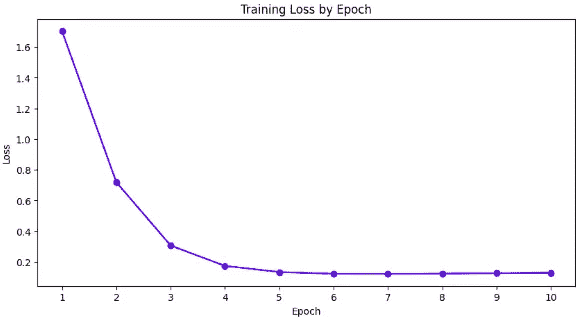

作者提供的图片

该模型已成功使用我们自定义的深度学习框架创建和训练！

您可以在[这里](https://github.com/lucasdelimanogueira/PyNorch)查看完整的代码。

# 结论

在本文中，我们介绍了张量的基本概念，它是如何建模的，以及更高级的主题，如 CUDA 和 Autograd。我们成功地创建了一个支持 GPU 和自动微分的深度学习框架。希望本文能帮助您简要了解 PyTorch 在幕后是如何工作的。

在未来的帖子中，我将尝试涵盖更高级的主题，如分布式训练（多节点/多 GPU）和内存管理。请在评论中告诉我您的想法或您希望我写下的内容！非常感谢您的阅读！😊

此外，请关注我的[LinkedIn 个人资料](https://www.linkedin.com/in/lucas-de-lima-nogueira/)，以获取最新文章更新！

# 参考资料

[PyNorch](https://github.com/lucasdelimanogueira/PyNorch) — 本项目的 GitHub 存储库。

[CUDA 教程](https://medium.com/towards-data-science/why-deep-learning-models-run-faster-on-gpus-a-brief-introduction-to-cuda-programming-035272906d66) — CUDA 工作原理简介。

[PyTorch](https://pytorch.org/docs/stable/index.html) — PyTorch 文档。

[MartinLwx 的博客](https://martinlwx.github.io/en/how-to-reprensent-a-tensor-or-ndarray/) — 关于步幅的教程。

[步幅教程](https://ajcr.net/stride-guide-part-1/) — 关于步幅的另一个教程。

[PyTorch 内部](http://blog.ezyang.com/2019/05/pytorch-internals/) — PyTorch 的结构指南。

[Nets](https://github.com/arthurdjn/nets) — 使用 NumPy 重建的 PyTorch。

[Autograd](https://www.youtube.com/watch?v=RxmBukb-Om4&t=935s) — Autograd 库的实时编码。
