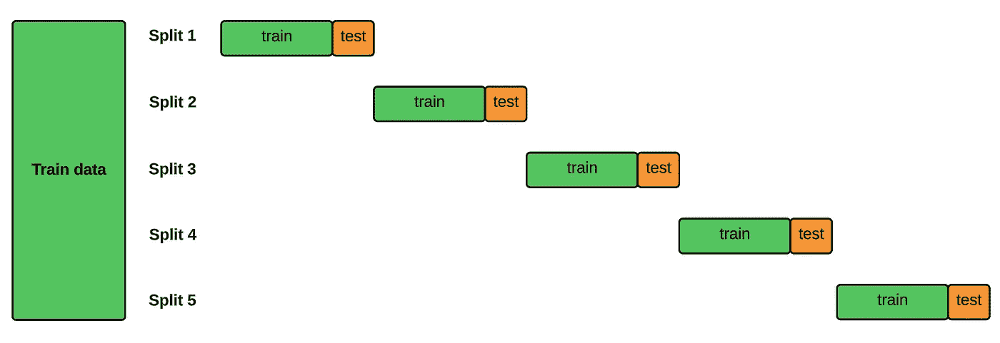

# 使用阻塞分割减少时间序列交叉验证中的偏差

> 原文：[`towardsdatascience.com/reduce-bias-in-time-series-cross-validation-with-blocked-split-4ecbfc88f5a4?source=collection_archive---------5-----------------------#2024-01-18`](https://towardsdatascience.com/reduce-bias-in-time-series-cross-validation-with-blocked-split-4ecbfc88f5a4?source=collection_archive---------5-----------------------#2024-01-18)

## 当 TimeSeriesSplit 发生过拟合时

 [Haden Pelletier](https://medium.com/@pelletierhaden?source=post_page---byline--4ecbfc88f5a4--------------------------------)

·发表于 [Towards Data Science](https://towardsdatascience.com/?source=post_page---byline--4ecbfc88f5a4--------------------------------) ·阅读时间 3 分钟 ·2024 年 1 月 18 日

--

在我上一篇 [文章](https://medium.com/towards-data-science/how-to-cross-validation-with-time-series-data-9802a06272c6) 中，我介绍了时间序列数据的交叉验证方法，并描述了**扩展窗口**方法，其中训练集逐渐增大，而验证集保持不变。

这是开始进行时间序列数据交叉验证的好方法。它引入了一个理念，即你不应该随意划分数据集，而应该始终确保验证集出现在训练集之后。

## 但是我们还需要考虑更多的因素。

扩展窗口方法逐步增加训练数据的大小。因此，除了第一次外，每次迭代都会包含前一次迭代的训练数据。

由于训练集不断增大，模型有可能会对训练数据集的模式过拟合，并报告出色的性能。但一旦你尝试在最终的保留测试集上进行预测，性能就不再与之前看到的一致。

**阻塞时间序列分割**提供了一种解决方案——它仍然保持数据的时间顺序，但训练/测试组合从不重叠。

阻塞时间序列分割。图片来源：作者
