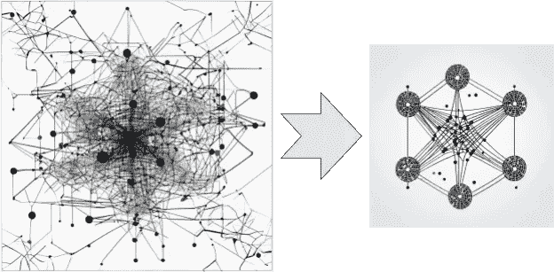
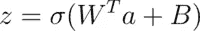
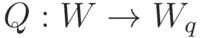

# 减小 AI 模型的尺寸

> 原文：[`towardsdatascience.com/reducing-the-size-of-ai-models-4ab4cfe5887a?source=collection_archive---------3-----------------------#2024-09-07`](https://towardsdatascience.com/reducing-the-size-of-ai-models-4ab4cfe5887a?source=collection_archive---------3-----------------------#2024-09-07)

## 在边缘设备上运行大型 AI 模型

 [Arun Nanda](https://medium.com/@arunnanda?source=post_page---byline--4ab4cfe5887a--------------------------------)

·发表于[Towards Data Science](https://towardsdatascience.com/?source=post_page---byline--4ab4cfe5887a--------------------------------) ·9 分钟阅读·2024 年 9 月 7 日

--

图片由 Pixlr 生成

AI 模型，尤其是大型语言模型（LLMs），需要大量 GPU 内存。例如，在[2024 年 7 月发布的 LLaMA 3.1 模型](https://ai.meta.com/blog/meta-llama-3-1/)中，[内存需求](https://huggingface.co/blog/llama31#how-much-memory-does-llama-31-need)如下：

+   8 亿参数的模型需要 16GB 内存，采用 16 位浮点数权重

+   更大的 4050 亿参数模型使用 16 位浮点数时需要 810GB 内存

在一个完整的机器学习模型中，权重表示为 32 位浮点数。现代模型有数百万到数十亿（甚至数百亿）个权重。训练和运行这样的大型模型非常耗费资源：

+   它需要大量计算（处理能力）。

+   它需要大量 GPU 内存。

+   它消耗大量能源，尤其是导致这种能源消耗的最大因素是：

    - 使用 32 位浮点数执行大量计算（矩阵乘法）

    - 数据传输 — 将模型数据从内存复制到处理单元。

高资源消耗有两个主要缺点：

+   **训练**：需要大量 GPU 资源的模型训练昂贵且缓慢。这限制了新的研究和开发只能由预算充足的团队进行。

+   **推理**：大型模型需要专用的（且昂贵的）硬件（专用 GPU 服务器）才能运行。它们不能在像普通笔记本电脑和手机这样的消费级设备上运行。

因此，最终用户和个人设备必须通过付费 API 服务来访问 AI 模型。这导致了消费者应用程序及其开发者都面临次优的用户体验：

+   它引入了由于网络访问和服务器负载带来的延迟。

+   它还介绍了开发 AI 软件时的预算限制。能够在消费者设备上本地运行 AI 模型，将有助于缓解这些问题。

因此，减少 AI 模型的大小是一个活跃的研究和开发领域。这是系列文章中的第一篇，讨论了减少模型大小的不同方法，特别是通过量化这一方法。这些文章基于对原始研究论文的学习。在整个系列中，你会找到参考论文 PDF 的链接。

+   本文为入门文章，概述了减少模型大小的不同方法。它将量化介绍为最具前景的方法，并且是当前研究的热点。

+   [*量化 AI 模型的权重*](https://medium.com/@arunnanda/quantizing-the-weights-of-ai-models-39f489455194)通过数值实例展示了量化的算术原理。

+   [*量化神经网络模型*](https://medium.com/@arunnanda/quantizing-neural-network-models-8ce49332f1d3)讨论了将量化应用于神经网络模型的架构和过程，包括基本的数学原理。特别是，它着重于如何训练模型，使其在推理时使用量化权重仍能表现良好。

+   [*量化的不同方法*](https://medium.com/@arunnanda/different-approaches-to-quantization-e3fac905bd5a)解释了不同类型的量化方法，如量化为不同精度、量化粒度、确定性与随机量化，以及在训练模型过程中使用的不同量化方法。

+   [*极限量化：1 位 AI 模型*](https://medium.com/@arunnanda/extreme-quantization-1-bit-ai-models-07169ee29d96)讲解了二进制量化的内容，涉及将模型权重从 32 位浮动数减少到二进制数字。它展示了二进制量化的数学原理，并总结了首次实施变换器模型（如 BERT）二进制量化的研究者所采用的方法。

+   [*理解 1 位大规模语言模型*](https://medium.com/@arunnanda/understanding-1-bit-large-language-models-a33cc6acabb3)介绍了将大规模语言模型（LLM）量化为使用 1 位（即二进制）权重（{-1, 1}）的最新研究成果。特别地，焦点放在了 BitNet 上，它是首次成功地重新设计变换器架构以使用 1 位权重的尝试。

+   [*理解 1.58 位语言模型*](https://medium.com/@arunnanda/understanding-1-58-bit-large-language-models-88373010974a)讨论了将神经网络模型，特别是 LLM，量化为使用三元权重（{-1, 0, +1}）的技术。这也被称为 1.58 位量化，已证明能够提供非常有前景的结果。2024 年上半年，关于这一主题的讨论在科技媒体中引起了广泛关注。之前文章中解释的背景有助于深入理解为什么以及如何将 LLM 量化为 1.58 位。

# 降低模型大小的方法

不依赖昂贵的硬件将使 AI 应用变得更加普及，并加速新模型的开发和应用。为了解决这一构建高性能且小型模型的挑战，已经提出并尝试了多种方法。

## 低秩分解

神经网络以高维张量的形式表示其权重。数学上，可以将一个高秩张量分解为一组低维张量，从而使计算更高效。这种方法被称为 [张量秩分解](https://en.wikipedia.org/wiki/Tensor_rank_decomposition)。例如，在计算机视觉模型中，权重通常是 4D 张量。

Lebedev 等人在他们 2014 年的论文 [*使用微调的 Cp 分解加速卷积神经网络*](https://arxiv.org/pdf/1412.6553) 中展示了使用一种常见的分解技术——典范多元分解（CP 分解），将具有 4D 权重张量的卷积（这种情况在计算机视觉模型中较为常见）简化为一系列使用较小的 2D 张量的卷积。[低秩自适应](https://arxiv.org/abs/2106.09685)（LoRA）是一种现代技术（提出于 2021 年），其原理基于类似的方法，并应用于大型语言模型。

## 剪枝

降低网络大小和复杂度的另一种方法是通过消除网络中的连接。在 1989 年的一篇名为 [Optimal Brain Damage](https://proceedings.neurips.cc/paper/1989/hash/6c9882bbac1c7093bd25041881277658-Abstract.html) 的论文中，Le Cun 等人提出了删除小幅度连接并重新训练模型的方法。通过反复应用，这种方法可以减少神经网络中一半或更多的权重。[Le Cun 的完整论文可以在其网站上查看](http://yann.lecun.com/exdb/publis/pdf/lecun-90b.pdf)，Le Cun 目前（截至 2024 年）是 Meta（Facebook）的首席 AI 科学家。

在大语言模型的背景下，剪枝尤其具有挑战性。SparseGPT 是由 Frantar 等人在 2023 年发表的论文 [*SparseGPT: 大型语言模型可以通过一次性修剪精确地减小*](https://arxiv.org/pdf/2301.00774) 中首次提出的一个著名剪枝方法，它成功地将大型语言模型的大小减少了一半，同时几乎不损失准确性。将大型语言模型的大小减少到原始的一小部分仍然不可行。Lei Mao 的文章 [剪枝与神经网络](https://leimao.github.io/article/Neural-Networks-Pruning/) 介绍了这一技术。

## 知识蒸馏

知识迁移是一种训练较小（学生）神经网络以复制较大且更复杂（教师）神经网络行为的方法。在许多情况下，学生网络是基于教师网络的最终预测层进行训练的。在其他方法中，学生网络还会基于教师网络的中间隐藏层进行训练。知识蒸馏在某些情况下取得了成功，但通常情况下，学生网络无法泛化到新的未见过的数据。它们往往过度拟合以在训练数据集内复制教师的行为。

## 量化

简而言之，量化涉及从一个具有 32 位或 16 位浮动点权重的模型开始，应用各种技术来降低权重的精度，至 8 位整数甚至二进制（1 位），而不牺牲模型准确性。低精度权重具有更低的内存和计算需求。

本文的其余部分，从下一节开始，以及本系列的其余部分，提供了对量化的深入理解。

## 混合

也可以按顺序应用不同的压缩技术。Han 等人在 2016 年发表的论文 [*通过剪枝、训练量化和霍夫曼编码压缩深度神经网络*](https://arxiv.org/pdf/1510.00149)*,* 中，应用了剪枝、量化和霍夫曼编码，成功地将 AlexNet 模型压缩了 35 倍，将模型大小从 240 MB 减少到 6.9 MB，且没有显著损失准确度。截至 2024 年 7 月，这种方法尚未在低位 LLM 上进行尝试。

# 量化基础

模型的“大小”主要由两个因素决定：

+   权重（或参数）数量

+   每个参数的大小（位数）。

已经确立，模型中的参数数量对其性能至关重要——因此，减少参数数量并不是一个可行的方法。因此，尝试减少每个权重的长度是一个更有前景的研究方向。

传统上，LLM（大型语言模型）使用 32 位权重进行训练。具有 32 位权重的模型通常被称为全尺寸模型。减少模型参数的长度（或精度）被称为量化。16 位和 8 位量化是常见的方式。更激进的方法包括量化到 4 位、2 位，甚至 1 位。要了解如何将高精度数字量化为低精度数字，请参考 [*量化 AI 模型的权重*](https://medium.com/@arunnanda/quantizing-the-weights-of-ai-models-39f489455194)，其中有关于量化模型权重的示例。

量化有助于减少内存需求并降低运行模型的计算成本。通常，模型的权重会被量化。除了量化权重外，还常常对激活进行量化。将浮动点权重映射到其低精度整数版本的函数称为量化器，或量化函数。

## 神经网络中的量化

简单来说，神经网络层应用的线性和非线性变换可以表示为：

在上面的表达式中：

+   z 表示非线性函数的输出，也称为激活值。

+   Sigma 是非线性激活函数，通常是 sigmoid 函数或 tanh 函数。

+   W 是该层的权重矩阵

+   a 是输入向量

+   B 是偏置向量

+   权重与输入的矩阵乘法被称为卷积。将偏置加到乘积矩阵上称为累加。

+   传递给 sigma（激活）函数的项被称为乘加（MAC）操作。

运行神经网络的计算负载大部分来自卷积操作——这涉及到大量浮点数的乘法。拥有大量权重的大型模型会有非常多的卷积操作。

通过使用低精度整数而不是浮点数进行乘法，可能会减少计算成本。在极端情况下，正如在[*理解 1.58 位语言模型*](https://medium.com/@arunnanda/understanding-1-58-bit-large-language-models-88373010974a)中讨论的那样，32 位权重可能通过三元数{-1, 0, +1}来表示，乘法操作将被更简单的加法和减法操作替代。这就是量化背后的直觉。

数字运算的计算成本与位数的平方成正比。正如[Siddegowda 等人在他们关于神经网络量化的论文](https://arxiv.org/pdf/2201.08442)（第 2.1 节）中研究的那样，使用 8 位整数代替 32 位浮点数会使能效提高 16 倍。当权重数量达到数十亿时，节省的成本非常可观。

量化函数将高精度（通常是 32 位浮点数的权重）映射到低精度整数权重。

模型通过训练所获得的“知识”由其权重的值表示。当这些权重被量化为低精度时，它们的部分信息也会丢失。量化的挑战在于如何在降低权重精度的同时保持模型的准确性。

一些量化技术有效的主要原因之一是，权重的相对值和权重的统计特性比它们的实际值更为重要。对于拥有数百万或数十亿个权重的大型模型来说，这一点尤其成立。后续关于量化的文章，如[量化 BERT 模型——BinaryBERT 和 BiBERT](https://medium.com/@arunnanda/extreme-quantization-1-bit-ai-models-07169ee29d96)、[BitNet——一种将变压器 LLM 量化为二进制权重的模型](https://medium.com/@arunnanda/understanding-1-bit-large-language-models-a33cc6acabb3)，以及[BitNet b1.58——将变压器量化为三元权重的模型](https://medium.com/@arunnanda/understanding-1-58-bit-large-language-models-88373010974a)，都展示了成功的量化技术应用。[*量化的视觉指南*](https://newsletter.maartengrootendorst.com/p/a-visual-guide-to-quantization)由 Maarten Grootendoorst 编写，包含了许多量化的插图和图示。

# 量化推理

推理是指使用 AI 模型生成预测，例如对图像的分类或对文本串的补全。当使用全精度模型时，整个数据流通过模型时采用 32 位浮点数表示。使用量化模型进行推理时，许多部分——但并非所有——的数据流采用较低精度表示。

偏置通常不进行量化，因为偏置项的数量远少于模型中的权重数量。因此，节省的成本不足以证明量化开销的合理性。累加器的输出采用高精度格式，激活函数的输出也采用更高精度的格式。

# 结论

本文讨论了减少 AI 模型规模的必要性，并对实现模型规模缩减的方法进行了高层次的概述。接着介绍了量化的基础知识，这是一种目前在缩减模型规模的同时，能够保持可接受的准确度水平的最成功方法。

本系列的目标是为您提供足够的背景知识，以便理解语言模型的极端量化，从[像 BERT 这样的简单模型](https://medium.com/@arunnanda/extreme-quantization-1-bit-ai-models-07169ee29d96)开始，最终[讨论 1 比特大型语言模型（LLMs）](https://medium.com/@arunnanda/understanding-1-bit-large-language-models-a33cc6acabb3)以及[近期关于 1.58 比特 LLMs 的研究成果](https://medium.com/@arunnanda/understanding-1-58-bit-large-language-models-88373010974a)。为此，本系列接下来的几篇文章将深入探讨不同的子话题，例如[量化背后的数学运算](https://medium.com/@arunnanda/quantizing-the-weights-of-ai-models-39f489455194)和[量化模型训练的过程](https://medium.com/@arunnanda/quantizing-neural-network-models-8ce49332f1d3)。需要理解的是，由于这是一个活跃的研究和开发领域，目前尚无统一的标准程序，不同的研究者采用创新的方法以获得更好的结果。
