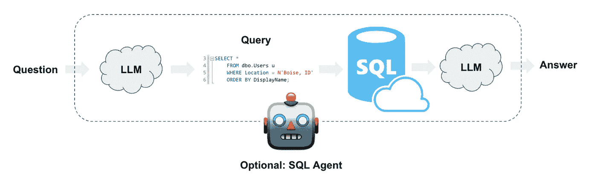
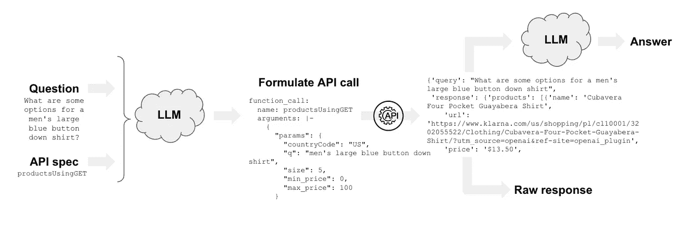
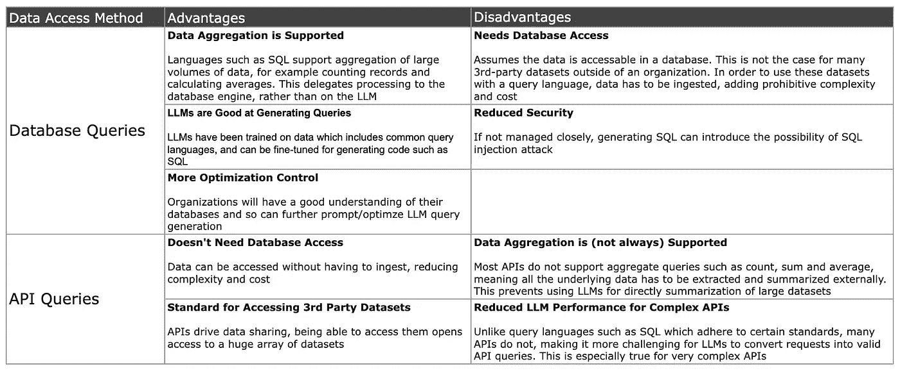
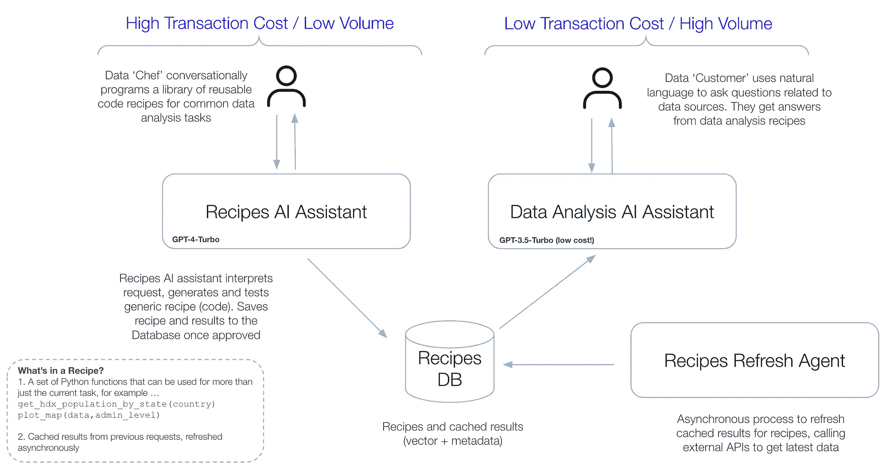

# 重构 LLM“与数据对话”：引入 LLM 辅助数据配方

> 原文：[`towardsdatascience.com/reframing-llm-chat-with-data-introducing-llm-assisted-data-recipes-f4096ac8c44b?source=collection_archive---------0-----------------------#2024-01-26`](https://towardsdatascience.com/reframing-llm-chat-with-data-introducing-llm-assisted-data-recipes-f4096ac8c44b?source=collection_archive---------0-----------------------#2024-01-26)

 [Matthew Harris](https://medium.com/@astrobagel?source=post_page---byline--f4096ac8c44b--------------------------------)

·发表于[Towards Data Science](https://towardsdatascience.com/?source=post_page---byline--f4096ac8c44b--------------------------------) ·阅读时长 11 分钟·2024 年 1 月 26 日

--

来源：DALL·E 3 提示词“数据大厨制作数据配方的油画”

*简而言之*

*在本文中，我们讨论了使用大型语言模型（LLM）进行“与数据对话”时的一些局限性，并提出了一种名为“数据配方”的方法论，在某些情况下可能作为替代方案。数据配方扩展了可重用代码片段的概念，包含数据并具有使用 LLM 进行编程对话的优势。这使得可以创建一个可重用的数据配方库——用于访问数据和生成洞察——为 LLM 生成的代码提供更多透明度，同时允许人工干预配方。来自配方的缓存结果——来自 SQL 查询或外部 API 调用——可以异步刷新以提高响应时间。提出的解决方案是 LLM 作为工具制造者（LATM）架构的变体，它将工作流分为两个流： (i) 用于创建配方的低交易量/高成本流；(ii) 用于最终用户使用配方的高交易量/低成本流。最后，通过拥有配方库和相关数据集成，可以创建一个“数据配方中心”，并有可能进行社区贡献。*

# 使用 LLM 进行对话数据分析

现在有一些非常巧妙的模式，允许人们用自然语言提问关于数据的问题，LLM 生成调用来获取数据，并总结输出给用户。通常被称为“[与数据对话](https://www.google.com/search?q=chat+with+data&oq=chat+with+data&gs_lcrp=EgZjaHJvbWUyCQgAEEUYORiABDIHCAEQABiABDIHCAIQABiABDIHCAMQABiABDIHCAQQABiABDIHCAUQABiABDIHCAYQABiABDIICAcQABgWGB4yCAgIEAAYFhgeMggICRAAGBYYHqgCALACAA&sourceid=chrome&ie=UTF-8)” 我曾经发布过一些文章来说明这一技术，例如使用 Open AI 助手来[帮助人们为气候变化做准备](https://medium.com/towards-data-science/preparing-for-climate-change-with-an-ai-assistant-cdceb5ce4426)。还有许多更先进的例子，它可以是降低技术壁垒，让人们从复杂数据中获得见解的一个令人惊叹的方式。

使用 LLM 从用户输入生成 SQL 查询并总结输出以提供答案的示例。来源：[Langchain SQL 代理](https://python.langchain.com/docs/use_cases/sql/)

使用 LLM 从用户输入生成 API 调用并总结输出以提供答案的示例。来源：[Langchain 与 API 交互](https://python.langchain.com/docs/use_cases/apis)

访问数据的方法通常分为以下几类……

1.  **生成数据库查询**：LLM 将自然语言转换为查询语言，如 SQL 或 Cypher

1.  **生成 API 查询**：LLM 将自然语言转换为用于调用 API 的文本

应用程序执行 LLM 提供的建议以获取数据，然后通常将结果传回给 LLM 进行总结。

# 获取数据可能是一个问题

这些技术现在已经存在，真是令人惊叹，但将它们转化为生产解决方案时，每种方法都有其优缺点……

LLM 可以生成执行数据库查询和调用外部 API 的文本，但每种方法都有其优缺点。

例如，生成 SQL 支持现代数据库查询语言能够实现的所有令人惊叹的功能，如对大量数据的聚合。然而，数据可能并不已经存在于 SQL 可用的数据库中。它可能需要先被摄取然后用 SQL 查询，但构建这样的管道可能既复杂又昂贵。

通过 API 直接访问数据意味着数据不必存在于数据库中，这为访问大量公开可用的数据集打开了巨大的世界，但也有一个陷阱。许多 API 不支持 SQL 支持的聚合查询，因此唯一的选择是提取低级数据，然后进行聚合。这增加了 LLM 应用程序的负担，并可能需要提取大量数据。

所以这两种技术都有局限性。

# **直接通过 LLM 传递数据无法扩展**

此外，当将 LLM 应用于数据分析时，另一个主要挑战很快就会出现。大多数解决方案，如[Open AI 助手](https://platform.openai.com/docs/assistants/overview)，可以生成供调用者执行的函数调用以提取数据，但输出[然后会传回 LLM](https://platform.openai.com/docs/assistants/tools/submitting-functions-outputs)。目前尚不清楚 OpenAI 内部具体发生了什么，但通过传递足够的数据就能导致令牌限制被突破，这表明 LLM 被用于处理提示中的原始数据。[许多模式](https://python.langchain.com/docs/use_cases/sql/)都做了类似的事情，将函数调用的输出传回 LLM。当然，这在现实世界中无法扩展，因为回答一个问题所需的数据量可能非常大。这很快就会变得昂贵，而且经常失败。

# LLM 代码生成可能会很慢、昂贵且不稳定

解决这个问题的一种方法是通过让 LLM 生成任务的代码来执行分析。例如，如果用户要求对数据集中的记录进行计数，可以让 LLM 生成一段 Python 代码来计算原始数据中的记录数，执行它，然后将该信息传回给用户。与将原始数据传递给 LLM 相比，这需要的令牌少得多。

已经相当明确，[LLM 在生成代码方面相当优秀](https://evalplus.github.io/leaderboard.html)。当然还不是完美的，但现在世界上很多地方都在使用像[GitHub Copilot](https://github.blog/2022-09-07-research-quantifying-github-copilots-impact-on-developer-productivity-and-happiness/)这样的工具进行软件开发。在 LLM 应用程序中，生成并执行代码作为解决任务的一部分，已经成为一种常见模式。[OpenAI 的代码解释器](https://platform.openai.com/docs/assistants/tools)以及像[autogen](https://microsoft.github.io/autogen/)和 Open AI 助手这样的框架更进一步，通过实现迭代过程，甚至能够调试生成的代码。此外，LLM 作为工具制造者（LATM）的概念已经确立（例如，[Cai 等人，2023](https://arxiv.org/abs/2305.17126)）。

但这里也存在一些挑战。

任何生成代码的 LLM 过程，特别是如果该过程需要通过一个迭代周期来调试代码，都可能迅速产生高昂的成本。这是因为生成高质量代码所需的最佳模型通常是最昂贵的，而调试代码需要在每个迭代步骤中记录之前的尝试历史，这会消耗大量令牌。根据所需的迭代次数，这个过程也相当缓慢，导致糟糕的用户体验。

正如我们许多人已经发现的那样，代码生成并不完美——至少目前是——并且偶尔会失败。代理可能会陷入代码调试的循环中，虽然生成的代码可能按预期运行，但由于存在错误，结果可能只是错误的。对于大多数应用程序，仍然需要人类参与其中。

# 记忆数据“事实”有局限性

通过实现某种记忆机制，可以提升代码生成的成本和性能，其中可以检索到来自先前相同请求的信息，消除重复调用 LLM 的需求。像[memgpt](https://memgpt.ai/)这样的解决方案与 autogen 等框架配合工作，提供了一种简洁的实现方式。

由此产生两个问题。首先，数据通常是易变的，任何基于数据的特定答案（即“事实”）可能会随时间改变。如果今天被问到“*哪些人道主义组织在阿富汗教育领域活跃？*”，下个月的答案可能会有所不同。可以应用各种记忆策略来忽略一段时间后的记忆，但最可靠的方法是重新获取信息。

另一个问题是，我们的应用程序可能已经为特定情况生成了答案，例如某个国家的人口。如果另一个用户问的是完全相同的问题，记忆会很好地工作，但如果他们询问的是不同的国家，那么就没什么用了。如果我们希望能够重用之前的 LLM 回答，保存“事实”只是故事的一半。

# 那我们该如何处理呢？

鉴于以上所有问题，我们需要解决以下关键问题：

+   我们需要一种适用于数据库和 API 的方法

+   我们希望能够支持使用 API 数据的聚合查询

+   我们希望避免使用 LLM 来总结数据，而是使用代码

+   我们希望通过使用记忆来节省成本和提高性能

+   记忆需要与数据源保持同步更新

+   记忆应该具有通用性，包含*技能*和事实

+   所有使用的代码都需要经过人工审查，以确保其准确性和安全性。

呼！这要求可不小啊。

# 引入 LLM 辅助的数据食谱

数据食谱架构：LLM 辅助生成可重用的食谱（技能），这些食谱可用于对话数据分析

这个想法是将工作流程分成两个流，以优化成本和稳定性，正如[LATM 架构](https://arxiv.org/pdf/2305.17126.pdf)所提出的那样，并对数据和特定于数据食谱的记忆进行一些附加增强...

**流 1：食谱助手**

本流使用 LLM 代理和更强大的模型，通过对话接口生成代码片段（配方）。LLM 通过提供关于数据源的信息 —— API 规范和数据库架构 —— 来指导，使得创建配方的人可以更轻松地通过对话编程新技能。重要的是，该过程实施了一个审核阶段，在生成的代码和结果被提交到内存之前，可以由人类验证并修改。为了最佳代码生成，本流使用更强大的模型和自主代理，导致每次请求的成本更高。然而，流量较少，因此成本得到了控制。

**流 2：数据分析助手**

本流被更广泛的终端用户群体使用，这些用户询问关于数据的问题。系统检查内存，查看请求是否已存在事实中，例如“*马里的人口是多少？*”。如果没有，它会检查配方，看看是否有技能可以得到答案，例如“*如何获取任何国家的人口*”。如果没有内存或技能，系统会将请求发送到配方助手队列，要求添加配方。理想情况下，系统可以在启动前预先填充配方，但配方库可以根据用户遥测数据随时间不断增长。请注意，终端用户流不会动态生成代码或查询，因此可以使用较不强大的 LLM，更加稳定、安全，并且成本较低。

**异步数据刷新**

为了提高终端用户的响应时间，在可行的情况下，配方会异步刷新。配方内存包含可以按照设定的时间表运行的代码。配方可以预先执行，以便提前填充系统，例如，在终端用户请求之前，检索所有国家的总人口。此外，需要对从 API 提取的大量数据进行聚合的情况，可以在非工作时间运行，从而在一定程度上缓解使用 API 数据的聚合查询限制。

**记忆层级 — 记住技能以及事实**

上述过程实现了一个记忆层级，用来保存“事实”，这些事实可以提升为更一般的“技能”。记忆检索提升为配方是通过语义搜索和 LLM 重排序与转换的组合实现的，例如通过提示 LLM 从特定意图和代码（例如“*马里的人口总数是多少？*”）生成一般意图和代码（例如“*获取任何国家的总人口*”）。

此外，通过自动将配方作为可用函数包含到代码生成的语言模型（LLM）中，其可重用工具包不断增长，使得新的配方更高效，并调用先前的配方，而不是从头生成所有代码。

# 数据配方的其他一些好处

通过捕获用户的数据分析请求并使这些请求在系统中高度可见，增加了透明度。LLM 生成的代码可以经过严格审查、优化和调整，且由此生成的答案是可以理解和可重复的。这有助于减少许多 LLM 应用面临的事实基础和幻觉问题。

这种架构的另一个有趣方面是，它捕捉了特定的数据分析需求及其用户请求的频率。这可以用于加大对更频繁使用的配方的投资，从而为最终用户带来好处。例如，如果生成一份人道主义响应情况报告的配方被频繁访问，那么该报告的配方代码可以主动进行改进。

# 数据配方中心

这种方法开启了一个由社区维护的数据配方库的可能性，跨多个领域——一个数据配方中心。类似于现有的代码片段网站，它将添加数据维度，并通过提供 LLM 辅助的对话式编程来帮助用户创作。配方可以获得声誉分数和其他社交平台反馈。

数据配方——通过 LLM 协助创建的带有数据的代码片段——可以由社区贡献到数据配方中心。图像来源：DALL·E 3

# 数据配方的局限性

和任何架构一样，它可能并不适用于所有情况。数据配方的一个重要目标是减少创建即时代码时所涉及的成本和风险，而是构建一个可重用的库，具有更多的透明度和人工干预。用户当然可以请求库中尚未支持的新内容。我们可以为这些请求建立一个处理队列，通过提供 LLM 辅助编程，预计开发时间将缩短，但最终用户会有所延迟。然而，在许多情况下，这是一种可接受的权衡，因为不希望放任 LLM 生成的未经审查的代码。

另一个需要考虑的因素是配方的异步刷新。根据所需数据量的不同，这可能会变得昂贵。此外，当源数据快速变化且用户需要快速获取这些信息时，这种刷新可能效果不佳。在这种情况下，配方会每次运行，而不是从内存中检索结果。

刷新机制应有助于数据聚合任务，其中数据来自 API，但仍然存在一个问题，即底层原始数据将作为配方的一部分进行处理。当然，这对于大规模数据量的处理效果不佳，但至少它是基于用户需求来限制数据摄取，而不是尝试摄取整个远程数据集。

最后，正如所有“与数据聊天”应用程序一样，它们的表现永远取决于它们可以访问的数据。如果所需的数据不存在或质量较差，那么感知性能将会很差。此外，数据集中常常存在不平等和偏见，因此在向用户展示洞见之前，进行数据审计非常重要。当然，这不仅仅是“数据食谱”特有的问题，而是将此类技术投入实际应用时面临的最大挑战之一。垃圾进，垃圾出！

# 结论

提议的架构旨在通过以下方式解决大语言模型“与数据聊天”所面临的一些挑战……

+   **透明** — 食谱高度可见，并且在推广之前由人工审核，从而减轻大语言模型幻觉和总结方面的问题。

+   **确定性** — 作为代码，它们每次都会产生相同的结果，不像大语言模型对数据的总结。

+   **高性能** — 实现一个能够捕捉不仅是事实而是技能的记忆系统，且能够异步刷新，从而提高响应速度。

+   **低成本** — 通过将工作流分为两个流，高流量的终端用户流可以使用成本较低的大语言模型。

+   **安全** — 主要的终端用户群体不会触发代码或查询的即时生成和执行，所有代码都经过人工评估，以确保安全性和准确性。

我将发布一系列后续博客文章，详细介绍“数据食谱”的技术实现，并在[DataKind](https://www.datakind.org/)进行用户测试。

# 参考文献

大语言模型作为工具制造者，[Cai et al, 2023](https://arxiv.org/abs/2305.17126)。

除非另有说明，所有图片均由作者提供。

*如果喜欢这篇文章，请点赞，如果你愿意关注我，我将非常高兴！你可以在[此处](https://medium.com/@astrobagel)找到更多文章*。
