# 物理中的强化学习：常微分方程和超参数调整

> 原文：[`towardsdatascience.com/reinforcement-learning-for-physics-odes-and-hyperparameter-tuning-2c0a29752a67?source=collection_archive---------6-----------------------#2024-10-17`](https://towardsdatascience.com/reinforcement-learning-for-physics-odes-and-hyperparameter-tuning-2c0a29752a67?source=collection_archive---------6-----------------------#2024-10-17)

## 使用 Gymnasium 控制常微分方程并优化算法的超参数

[](https://medium.com/@retter_42511?source=post_page---byline--2c0a29752a67--------------------------------)[](https://towardsdatascience.com/?source=post_page---byline--2c0a29752a67--------------------------------) [罗伯特·埃特](https://medium.com/@retter_42511?source=post_page---byline--2c0a29752a67--------------------------------)

·发表于 [Towards Data Science](https://towardsdatascience.com/?source=post_page---byline--2c0a29752a67--------------------------------) ·阅读时间：11 分钟·2024 年 10 月 17 日

--

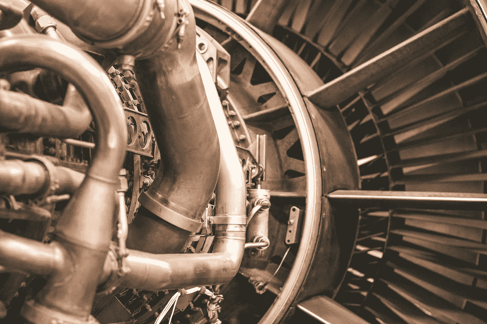

图片由 [布莱斯·库珀](https://unsplash.com/@brice_cooper18?utm_source=medium&utm_medium=referral) 拍摄，来源于 [Unsplash](https://unsplash.com/?utm_source=medium&utm_medium=referral)

如之前讨论的，强化学习（RL）为解决控制非线性物理系统的挑战提供了一个强大的新工具。非线性物理系统的特点是行为复杂，其中输入的微小变化可能导致输出的剧烈变化，或者大输入可能只带来微小的输出变化。解决方案可能会分裂，相同的条件可能会产生不同的输出，甚至可能具有“记忆”，以路径依赖的形式存在。我们介绍了两种将强化学习应用于非线性物理系统的不同方法：传统的基于神经网络的软演员评论家（SAC）方法和一种不常见的基于遗传算法的遗传编程（GP）方法。

简而言之，SAC 使用两个神经网络，一个用于学习环境的行为，一个用于确定最优策略。在模型训练过程中，网络不断更新，环境学习“批评者”网络帮助评估和改进决策“行动者”网络的策略。遗传编程（GP）基于生成一组“森林”随机数学方程，评估它们在环境中的表现，然后通过变异、组合或创建新的随机方程来提高表现。应用到 Gymnasium 的 [摆经典控制](https://gymnasium.farama.org/environments/classic_control/pendulum/) 环境，GP 方法显示出更快的收敛速度。现在我们扩展这项研究，(1) 引入更复杂的基于常微分方程的物理系统，(2) 探讨超参数调优对 SAC 和 GP 算法表现的影响。

## 处理常微分方程（ODE）

物理系统通常可以通过微分方程来建模，或是包含导数的方程。力，因此也包括牛顿定律，可以通过导数来表示，麦克斯韦方程也是如此，因此微分方程可以描述大多数物理问题。微分方程描述了一个系统如何根据当前状态变化，实际上定义了状态转换。微分方程系统可以写成矩阵/向量形式：

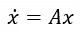

其中，x 是状态向量，A 是由物理动态决定的状态转换矩阵，x 点（或 dx/dt）是状态随时间变化的变化量。本质上，矩阵 A 对状态 x 进行作用，使其在时间上向前推进一个小步。这种表述通常用于线性方程（其中 A 的元素不包含任何状态向量），但也可以用于非线性方程，在这种情况下，A 的元素可能包含状态向量，这会导致上述复杂行为。这方程描述了一个环境或系统如何随时间发展，从特定的初始条件开始。在数学中，这些被称为初值问题，因为评估系统如何发展需要指定一个起始状态。

上述表达式描述了一类特殊的微分方程，常微分方程（ODE），其中所有导数都是一个变量的函数，通常是时间，但有时也可以是空间。点表示 dx/dt，即状态随时间增量变化的变化量。常微分方程（ODE）已被广泛研究，线性常微分方程系统有许多现成的解析解方法。解析解可以将解表示为变量的函数，使其在探索整个系统行为时更加灵活。非线性常微分方程的解法较少，但某些类别的系统仍然可以找到解析解。大多数情况下，非线性（以及某些线性）常微分方程最好通过仿真来求解，在这种方法中，解作为每个时间步的数值值被确定。

模拟是通过寻找微分方程的近似解来进行的，通常是通过[转化为代数方程](https://en.wikipedia.org/wiki/Finite_difference_method)，在一小段时间变化内，保持已知精度。然后，计算机可以通过许多小的时间变化步骤，展示系统的发展过程。有很多算法可以计算这个过程，例如 Matlab 的 ODE45 或 Python SciPy 的 solve_ivp 函数。这些算法接受一个 ODE 和一个起始点/初始条件，自动确定最佳步长，并在系统中推进到指定的结束时间。

如果我们能够对 ODE 系统应用正确的控制输入，我们通常可以将其驱动到期望的状态。如上次所讨论的，强化学习（RL）提供了一种确定非线性系统正确输入的方法。为了开发 RL，我们将再次使用健身环境，但这一次我们将基于自己的 ODE 创建一个自定义的健身环境。按照[Gymnasium 文档](https://gymnasium.farama.org/tutorials/gymnasium_basics/environment_creation/)，我们创建一个观察空间来覆盖我们的状态空间，并为控制空间创建一个动作空间。我们初始化/重置健身环境到状态空间中的一个任意点（但在这里我们必须小心，并非所有期望的最终状态[都能从任何初始状态到达](https://en.wikipedia.org/wiki/Controllability)某些系统）。在健身环境的步进函数中，我们在 ODE 的短时间范围内执行一步，使用 Python SciPy 的 solve_ivp 函数应用算法估算的输入。Solve_ivp 调用一个函数，解决我们正在处理的特定 ODE。代码可在[git](https://github.com/retter-berkeley/PhysicsGyms)上找到。init 和 reset 函数是直接的；init 为系统中的每个状态创建观察空间，reset 为这些变量在域内设置一个距离原点最小的随机起始点。在步进函数中，注意 solve_ivp 行，它调用实际的动态方程，在短时间步长内求解动态 ODE，传递应用的控制 K。

```py
#taken from https://www.gymlibrary.dev/content/environment_creation/
#create gym for Moore-Greitzer Model
#action space: continuous  +/- 10.0 float , maybe make scale to mu 
#observation space:  -30,30 x2 float for x,y,zand
#reward:  -1*(x²+y²+z²)¹/2 (try to drive to 0)

#Moore-Grietzer model:

from os import path
from typing import Optional

import numpy as np
import math

import scipy
from scipy.integrate import solve_ivp

import gymnasium as gym
from gymnasium import spaces
from gymnasium.envs.classic_control import utils
from gymnasium.error import DependencyNotInstalled
import dynamics  #local library containing formulas for solve_ivp
from dynamics import MGM

class MGMEnv(gym.Env):
    #no render modes
    def __init__(self, render_mode=None, size=30):

        self.observation_space =spaces.Box(low=-size+1, high=size-1, shape=(2,), dtype=float)

        self.action_space = spaces.Box(-10, 10, shape=(1,), dtype=float) 
        #need to update action to normal distribution

    def _get_obs(self):
        return self.state

    def reset(self, seed: Optional[int] = None, options=None):
        #need below to seed self.np_random
        super().reset(seed=seed)

        #start random x1, x2 origin
        np.random.seed(seed)
        x=np.random.uniform(-8.,8.)
        while (x>-2.5 and x<2.5):
            np.random.seed()
            x=np.random.uniform(-8.,8.)
        np.random.seed(seed)
        y=np.random.uniform(-8.,8.)
        while (y>-2.5 and y<2.5):
            np.random.seed()
            y=np.random.uniform(-8.,8.)
        self.state = np.array([x,y])
        observation = self._get_obs()

        return observation, {}

    def step(self,action):

        u=action.item()

        result=solve_ivp(MGM, (0, 0.05), self.state, args=[u])

        x1=result.y[0,-1]
        x2=result.y[1,-1]
        self.state=np.array([x1.item(),x2.item()])
        done=False
        observation=self._get_obs()
        info=x1

        reward = -math.sqrt(x1.item()**2)#+x2.item()**2)

        truncated = False #placeholder for future expnasion/limits if solution diverges
        info = x1

        return observation, reward, done, truncated, {}
```

以下是摩尔-格雷策模式（MGM）函数的动态特性。此实现基于 solve_ivp 文档。设置了限制以避免解发散；如果系统触及限制，奖励将较低，促使算法修正控制方法。基于此处讨论的模板创建 ODE 健身环境应该很简单：只需调整观测空间大小以匹配 ODE 系统的维度，并根据需要更新动态方程。

```py
def MGM(t, A, K):
    #non-linear approximation of surge/stall dynamics of a gas turbine engine per Moore-Greitzer model from
    #"Output-Feedbak Cotnrol on Nonlinear systems using Control Contraction Metrics and Convex Optimization"
    #by Machester and Slotine
    #2D system, x1 is mass flow, x2 is pressure increase
    x1, x2 = A
    if x1>20:  x1=20.
    elif x1<-20:  x1=-20.
    if x2>20:  x2=20.
    elif x2<-20:  x2=-20.
    dx1= -x2-1.5*x1**2-0.5*x1**3
    dx2=x1+K
    return np.array([dx1, dx2])
```

在这个例子中，我们使用的是基于 Moore-Greitzer 模型（MGM）的常微分方程，描述了燃气涡轮发动机的喘振-失速动态¹。这个方程描述了发动机质量流量与压力之间的耦合阻尼振荡。控制器的目标是通过控制发动机的压力，迅速将振荡衰减到 0。MGM“推动了非线性控制设计的重大进展”，使其成为 SAC 和 GP 方法的有趣测试案例。描述该方程的代码可以在[Github](https://github.com/retter-berkeley/PhysicsGyms/blob/main/dynamics/dynamics.py)上找到。此处还列出了另外三个非线性 ODE。Van Der Pol 振荡器是一个经典的非线性振荡系统，基于电子系统的动力学。Lorenz 吸引子是一个看似简单的常微分方程系统，可以产生混沌行为，或者结果对初始条件高度敏感，以至于在一个不受控制的系统中，任何极小的起始点差异都将导致状态迅速发生广泛分化。第三个是 Duriez/Brunton/Noack 提供的平均场 ODE 系统，描述了稳定与不稳定波的复杂相互作用发展，作为湍流流体流动的近似。

为了避免重复上一篇文章的分析，我们这里只展示结果，指出再次证明 GP 方法在较低的计算时间内，生成了比 SAC/神经网络方法更好的控制器。下面的图形展示了在不受控制系统下、GP 控制器下以及 SAC 控制器下的振荡情况。

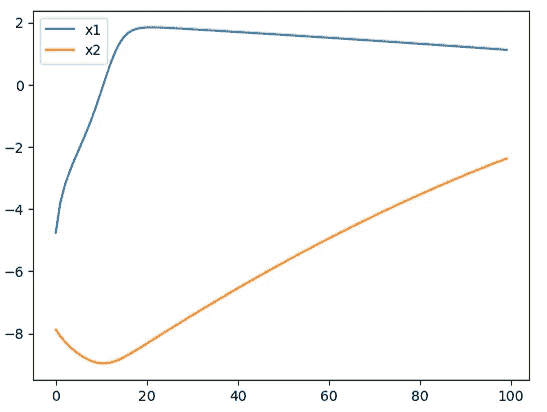

不受控制的动力学，由作者提供

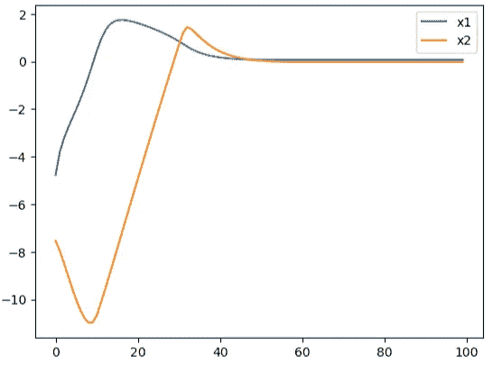

GP 控制器结果，由作者提供

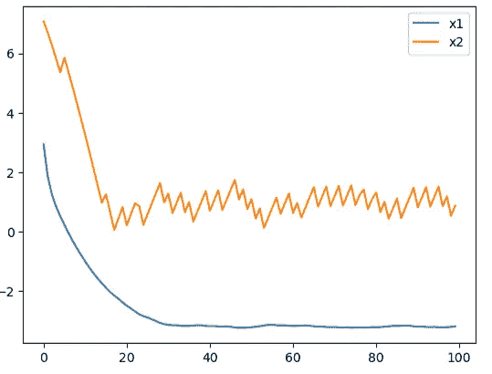

SAC 控制的动力学，由作者提供

两个算法都改善了不受控制的动力学。我们看到，虽然 SAC 控制器的反应更快（大约 20 个时间步长），但其准确性较低。GP 控制器的反应稍慢，但对两种状态都提供了平滑的行为。此外，正如之前所述，GP 在迭代次数上比 SAC 收敛得更快。

我们已经看到，体育馆可以轻松地适应用于在常微分方程（ODE）系统上训练强化学习（RL）算法，简要讨论了常微分方程在描述和探索物理动力学的 RL 控制方面的强大功能，并再次看到 GP 产生了更好的结果。然而，我们还没有尝试优化任何一个算法，而只是基本设置了算法参数，基本上是通过猜测来进行的。现在我们将通过扩展 MGM 研究来解决这一不足。

## Sagemaker 超参数调优与自定义模型

如前所述，GP 和 SAC 都有一组定义模型的超参数。这些参数在模型训练过程中是固定的，但可以通过调整来尝试提高模型性能（如准确性或收敛速度）。以下表格简要回顾了 GP 算法中使用的超参数：

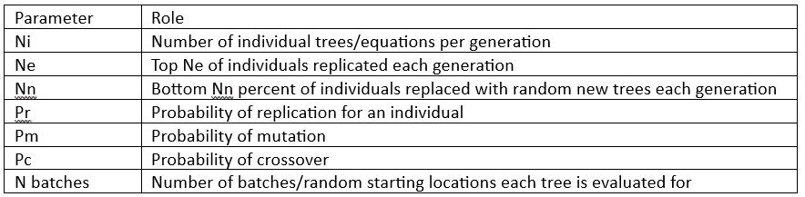

Ni、Ne、Nn、Pr、Pm、Pc 都影响探索与利用的平衡，即算法在尝试找到新的可能解决方案和优化已有最佳解决方案之间的时间分配。N 批次通过增加计算时间来换取更高的准确性和泛化能力。

这里实现的 SAC 有以下超参数：

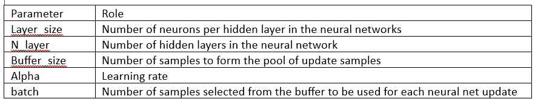

为了简化编码和调优超参数，已设定了一些基本规则。每个隐藏层将具有相同数量的神经元，且每个神经网络（包括演员和评论员）将具有相同的维度（输入层和输出层除外），并有相同的批次/缓冲区用于更新。此外，每个神经网络将使用相同的激活函数和优化器。这些参数，尤其是神经网络的形状/维度，虽然是有效的超参数，但为了简化代码复杂性和减少计算时间，这里不进行调优。

调优超参数的目标是确定哪些超参数能够在最小的计算成本下生成最准确的模型。然而，调优超参数需要对每一组超参数进行模型训练。即使是对于适量数量的超参数，如果我们希望测试这些参数的广泛值，探索整个超参数空间也可能会导致几何级数增长的测试矩阵。这个问题更加复杂，因为参数可能是耦合的（即一个参数的最优值可能会根据另一个参数的设置而变化）。有几种方法可以调优超参数。网格搜索会测试整个网格的每种组合，因此需要仔细选择要测试的参数及其值。随机搜索则从网格中随机选择参数。最后，也可以使用一些数学优化方法，如贝叶斯优化或其他机器学习算法。无论如何，最佳的方法需要仔细考虑（也许还需要超超参数优化……）。

AWS Sagemaker 提供了内置的超参数优化功能，适用于 Sagemaker 包含的或自定义的算法。Sagemaker 的调优选项包括随机、网格、贝叶斯优化或超带（该方法倾向于选择表现较好的超参数集，并且可以在表现较差的超参数集下提前停止）。要使用 Sagemaker 的超参数调优，我们必须将算法作为 Docker 容器提供给 Sagemaker，并将容器镜像和训练脚本传入超参数调优对象中。

由于 GP 和特定的 SAC 实现都没有使用现有的 SageMaker 算法或框架（这里使用的 SAC 基于 Jax 和 Haiku，而不是 tensorflow、pytorch 或 mxnet），我们需要创建自定义的 RL 框架。在探索了多个教程并经过多次试错之后，我成功地构建了能够正常工作的容器和用于超参数调优的训练脚本。过程中有几个难点；例如，我发现必须将训练文件压缩成 zip 文件，上传到 S3，然后在 S3 中传递该 zip 文件的路径，以便成功使用 SageMaker“估算器”ML 对象的超参数参数。用于 SageMaker 的 Dockerfile、容器文件、训练脚本和 Jupyter 笔记本可以在 Git 上找到，分别对应[SAC](https://github.com/retter-berkeley/DockerSAC)和[GP](https://github.com/retter-berkeley/DockerMLC)。部分使用的源代码链接可以在 Git 的笔记本中找到。

这种方法可以进一步优化；例如，app.py 文件可能不需要包含在容器中。此外，我将自定义的 ODE gymnasium 放在了“经典控制”gymnasium 中，并将其本地加载，以减少从头开始构建自己 gymnasium 的时间。

一旦容器正常工作，我大致按照[AWS 博客](https://aws.amazon.com/blogs/machine-learning/optimize-hyperparameters-with-amazon-sagemaker-automatic-model-tuning/)设置了超参数调优任务。为了使超参数在训练脚本中生效（GP 使用的是 app.py，SAC 使用的是 sacapp.py），我根据[SageMaker GitHub 示例](https://github.com/aws/amazon-sagemaker-examples/blob/0efd885ef2a5c04929d10c5272681f4ca17dac17/advanced_functionality/custom-training-containers/framework-container/notebook/source_dir/train.py)设置了一个 argparse 来处理这些参数。为了限制调优任务的运行次数（以及个人成本），我选择了一个有限的超参数集，专注于探索这个概念并评估调优效果。

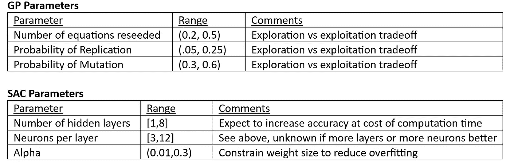

运行超参数调优任务非常快；结果如下所示：

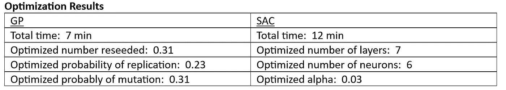

只有变异概率（Pm）在范围边界附近有一个最佳值。

SageMaker 的示例提供了[超参数可视化](https://github.com/aws-samples/amazon-sagemaker-amt-visualize)脚本，允许我们查看调优任务的进展。下面我们回顾 SAC 的调优过程（GP 的超参数调优结果为了简洁省略）。首先，我们看到不同调优任务的概览（方形表示任务提前停止，圆形表示任务已完成），并查看了奖励随时间的变化。

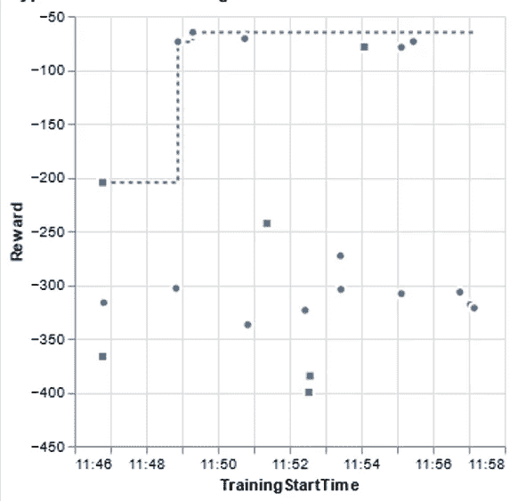

可视化还提供了按参数划分的性能细分，帮助我们深入了解不同参数对算法性能的影响。下面我们看看每个隐藏层的神经元数量，发现优化趋势集中在 8 左右。

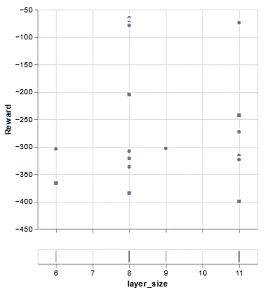

我们仅仅触及了常微分方程（ODE）和超参数的表面。具体而言，SAC 调优的探索仍然是初步的；神经网络设计本身就是一门科学（或者说艺术）。然而，本文希望能够为物理动态中的强化学习应用和优化提供一些见解和起点！

[1] Manchester, Ian R., 和 Jean-Jacques E. Slotine. “使用控制收缩度量和凸优化进行非线性系统的输出反馈控制。” 2014 年第 4 届澳大利亚控制会议（AUCC）（2014 年 11 月）。
