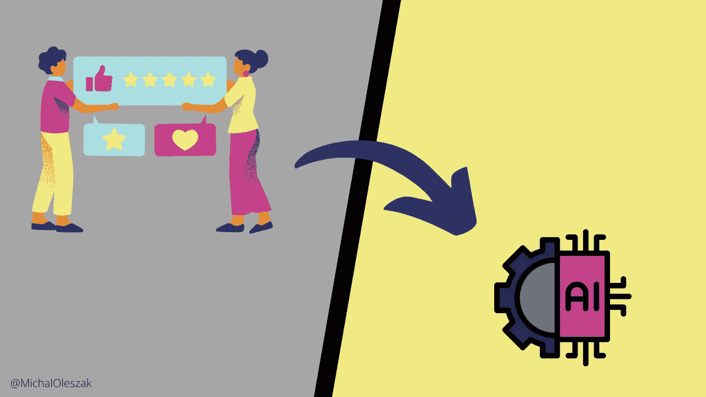

# 针对 LLM 的**人类反馈强化学习**（RLHF）

> 原文：[`towardsdatascience.com/reinforcement-learning-from-human-feedback-rlhf-for-llms-9cd1288c9a50?source=collection_archive---------7-----------------------#2024-09-23`](https://towardsdatascience.com/reinforcement-learning-from-human-feedback-rlhf-for-llms-9cd1288c9a50?source=collection_archive---------7-----------------------#2024-09-23)

## LLMs

## 大型语言模型背后的关键技术终极指南

 [Michał Oleszak](https://michaloleszak.medium.com/?source=post_page---byline--9cd1288c9a50--------------------------------)

·发表于 [Towards Data Science](https://towardsdatascience.com/?source=post_page---byline--9cd1288c9a50--------------------------------) ·14 分钟阅读·2024 年 9 月 23 日

--

**人类反馈强化学习**（RLHF）已被证明是解锁当今大型语言模型（LLMs）全部潜力的关键。或许没有比 OpenAI 的 GPT-3 模型更好的证据来证明这一点。该模型于 2020 年发布，但正是经过 RLHF 训练后的版本——被称为 ChatGPT——才一夜之间成名，吸引了数百万人的关注，并为对话型人工智能设立了新标准。

在 RLHF 出现之前，LLM 的训练过程通常包括一个预训练阶段，在此阶段模型学习语言的一般结构，以及一个微调阶段，在此阶段模型学习执行特定任务。通过将人类判断作为第三个训练阶段，RLHF 确保模型不仅能生成连贯且有用的输出，还能更紧密地与人类的价值观、偏好和期望对齐。它通过一个反馈循环实现这一点，在这个循环中，人类评估者对模型的输出进行评分或排名，然后用于调整模型的行为。

本文探讨了**RLHF**的复杂性。我们将研究其在语言建模中的重要性，详细分析其内部运作，并讨论...
