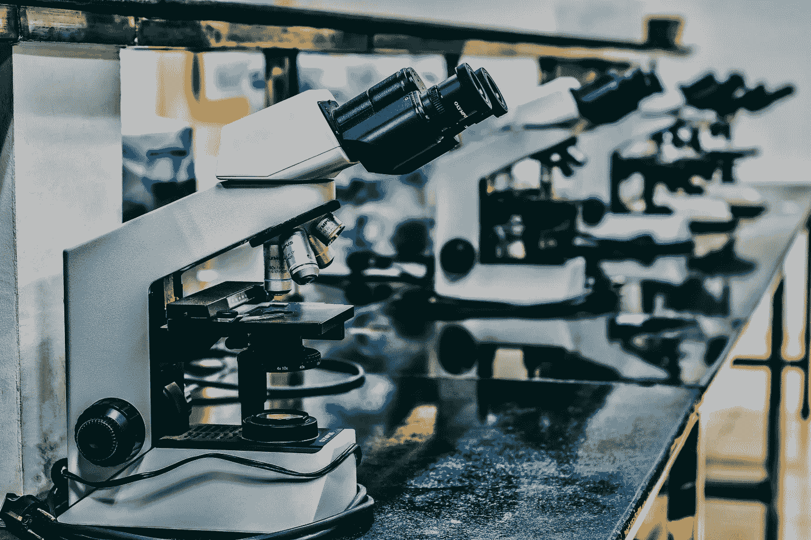
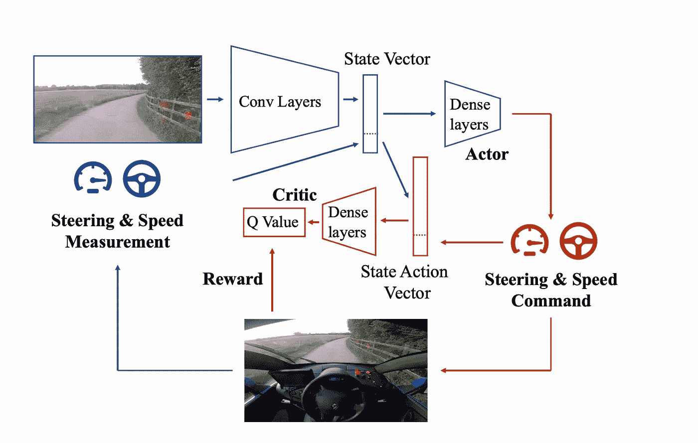
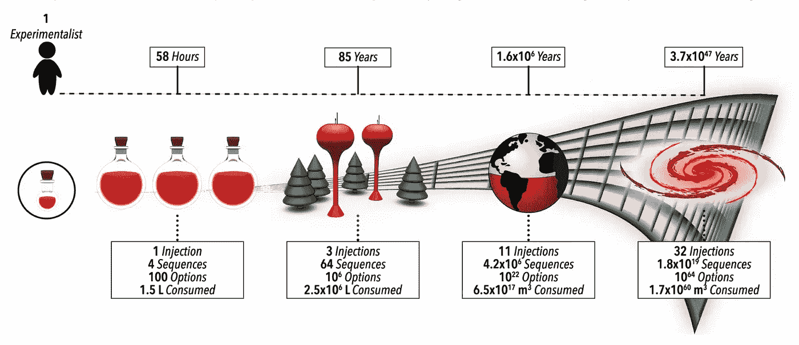
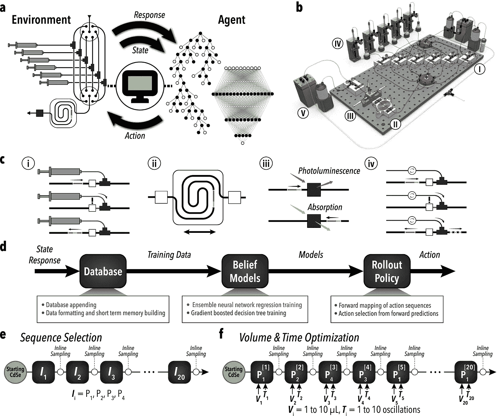

# 强化学习：从自动驾驶汽车到自动驾驶实验室

> 原文：[`towardsdatascience.com/reinforcement-learning-self-driving-cars-to-self-driving-labs-018f465d6bbc?source=collection_archive---------2-----------------------#2024-12-06`](https://towardsdatascience.com/reinforcement-learning-self-driving-cars-to-self-driving-labs-018f465d6bbc?source=collection_archive---------2-----------------------#2024-12-06)

## 理解生物领域中 AI 应用对于机器学习工程师的意义

 [Meghan Heintz](https://medium.com/@meghanheintz?source=post_page---byline--018f465d6bbc--------------------------------)

·发表于 [Towards Data Science](https://towardsdatascience.com/?source=post_page---byline--018f465d6bbc--------------------------------) ·9 分钟阅读·2024 年 12 月 6 日

--

图片来源：[Ousa Chea](https://unsplash.com/@cheaousa?utm_content=creditCopyText&utm_medium=referral&utm_source=unsplash) 在 [Unsplash](https://unsplash.com/photos/white-microscope-on-top-of-black-table-gKUC4TMhOiY?utm_content=creditCopyText&utm_medium=referral&utm_source=unsplash)

任何尝试教狗狗新把戏的人都知道强化学习的基本原理。我们可以通过不断奖励狗狗的服从行为并惩罚其不良行为来改变它的行为。在强化学习（RL）中，狗狗就是一个*智能体*，它在*环境*中进行探索，并根据可用的*动作*获得*奖励*或*惩罚*。这个非常简单的概念已经通过数学形式化，并扩展到推动自动驾驶和自动驾驶/自主实验室领域的发展。

作为一名纽约人，我在开车时常常感到焦虑，拥有一个冷静的机器人司机的好处显而易见。而当我考虑到新一代生成式人工智能生物工具的巨大潜力时，自动化实验室的好处才变得明显。我们可以生成大量高质量的假设，目前的瓶颈是实验验证。

如果我们能利用强化学习（RL）教会一辆车自我驾驶，我们是否也能用它来处理人工智能生成的创意实验验证呢？本文将继续我们的系列文章，[为机器学习工程师理解 AI 在生物学中的应用](https://medium.com/@meghanheintz/list/understanding-ai-applications-in-bio-for-ml-engineers-7b9e9551bb7f)，通过学习强化学习如何应用于自动驾驶汽车和自主实验室（例如，[AlphaFlow](https://www.nature.com/articles/s41467-023-37139-y)）。

# 自动驾驶汽车

理解强化学习的最一般方式是将其视为一种通过实践来学习的方法。代理与环境互动，学习哪些行为能产生最高的奖励，并通过试错避免惩罚。如果通过试错的方式在一辆重达 2 吨的金属盒子中以 65 英里每小时的速度行驶听起来有些可怕，像是某个监管机构不会批准的事情，那么你是对的。大多数强化学习的驾驶实验是在模拟环境中进行的，而当前的自动驾驶技术仍然侧重于监督学习方法。但是，[Alex Kendall](https://www.technologyreview.com/2022/05/27/1052826/ai-reinforcement-learning-self-driving-cars-autonomous-vehicles-wayve-waabi-cruise/)证明了只需几台廉价的摄像头、一个庞大的神经网络和二十分钟的时间，汽车就能自学如何驾驶。那么他是如何做到的呢？

[Alex Kendall](https://www.youtube.com/channel/UCNERNUuB5kAj7rGGfhk0C3A)展示了如何使用强化学习教一辆车在真实道路上行驶。

更主流的自动驾驶方法使用专门的模块来处理每个子问题：车辆管理、感知、地图绘制、决策等。但 Kendall 团队采用了深度强化学习方法，这是一种*端到端学习*方法。这意味着，不是将问题拆解成多个子问题并为每个子问题训练算法，而是通过一个算法根据输入做出所有决策（输入-> 输出）。这种方法被提议作为对监督学习方法的改进，因为将多个不同的算法组合在一起会导致复杂的相互依赖关系。

强化学习是一类旨在解决[马尔可夫决策过程](https://en.wikipedia.org/wiki/Markov_decision_process)（MDP）的问题，MDP 是一个决策问题，其结果部分是随机的，部分是可控的。Kendall 团队的目标是将驾驶定义为一个 MDP，特别是通过简化目标——车道跟踪来进行定义。以下是强化学习的各个组成部分如何映射到自动驾驶问题中的解析：

+   代理 *A*，即决策者。这就是司机。

+   环境，即代理与之互动的所有事物。例如，汽车及其周围环境。

+   状态 *S*，智能体当前情况的表示。汽车在道路上的位置。可以使用许多传感器来确定状态，但在肯达尔的示例中，只使用了单目相机图像。这样，它更接近人类驾驶时所拥有的信息。然后，图像通过[变分自编码器（VAE）](https://en.wikipedia.org/wiki/Variational_autoencoder)在模型中表示。

+   动作 *A*，智能体做出的影响环境的选择。在哪里以及如何刹车、转弯或加速。

+   奖励，来自环境对之前动作的反馈。肯达尔团队选择了“车辆在没有安全驾驶员介入的情况下行驶的距离”作为奖励。

+   策略，智能体用来决定在给定状态下采取何种行动的策略。在深度强化学习中，策略由深度神经网络控制，在本案例中为[深度确定性策略梯度（DDPG）](https://spinningup.openai.com/en/latest/algorithms/ddpg.html)。这是一种现成的强化学习算法，没有特定任务的适配，也称为演员网络。

+   价值函数，智能体从给定状态（或状态-动作对）能够获得的期望奖励的估计。也称为评论家网络。评论家通过在训练过程中提供反馈，帮助引导演员，评估动作的质量。

用于学习驾驶策略和价值函数的演员-评论家算法，来自于[《一天学会驾驶》](https://arxiv.org/pdf/1807.00412)。

这些部分通过迭代学习过程结合在一起。智能体使用其策略在环境中采取行动，观察结果状态和奖励，并更新策略（通过演员）和价值函数（通过评论家）。以下是逐步的工作原理：

1.  **初始化**：智能体从随机初始化的策略（演员网络）和价值函数（评论家网络）开始。它没有关于如何驾驶的先验知识。

1.  **探索**：智能体通过采取包含一定随机性的动作来探索环境（探索噪声）。这确保智能体尝试广泛的动作来学习它们的效果，同时令监管者感到恐慌。

1.  **状态转移**：根据智能体的动作，环境作出响应，提供一个新的状态（例如，下一张相机图像、速度和转向角度）和奖励（例如，未干预或没有驾驶违规的行驶距离）。

1.  **奖励评估**：智能体通过观察奖励来评估其动作的质量。积极的奖励鼓励期望的行为（如保持在车道内），而稀疏或没有奖励则促使改进。

1.  **学习更新**：智能体使用奖励和观察到的状态转移来更新其神经网络：

+   **评论网络（价值函数）**：评论网络通过更新其对 Q 函数的估计（Q 函数是估计在给定动作和状态下的奖励的函数），最小化时序差分（TD）误差，以改善其对长期奖励的预测。

+   **行动者网络（策略）**：行动者通过使用评论者的反馈来更新其策略，逐渐倾向于评论者预测将带来更高奖励的动作。

**6. 重放缓冲区**：经验（状态、动作、奖励、下一状态）存储在重放缓冲区中。在训练过程中，智能体从该缓冲区中采样以更新其网络，从而确保数据的高效使用和训练的稳定性。

**7. 迭代**：该过程反复进行。智能体通过试验和错误不断完善其策略和价值函数，逐步提高其驾驶能力。

**8. 评估**：在没有探索噪声的情况下测试智能体的策略，以评估其表现。在肯德尔的工作中，这意味着评估汽车保持在车道内并最大化自动行驶距离的能力。

进入一辆车，随机初始化权重后开车似乎有点令人生畏！幸运的是，肯德尔团队意识到超参数可以在三维仿真中进行调优，然后再转移到现实世界中。他们在虚幻引擎 4 中构建了一个仿真引擎，运行生成模型来模拟乡村道路、不同天气条件和路面纹理，从而创建训练仿真。这些重要的调优强化学习参数包括学习率、梯度步数等。它还确认了连续的动作空间比离散的动作空间更为优越，并且 DDPG 是解决该问题的合适算法。

这其中最有趣的方面之一是，它相较于主流方法具有更强的通用性。所采用的算法和传感器远没有像 Cruise 和 Waymo 等公司所要求的那么专业化。它不需要先进的地图数据或激光雷达（LIDAR）数据，这使得它能够扩展到新的道路和未映射的乡村地区。

另一方面，这种方法的某些缺点是：

+   **稀疏奖励**：我们通常不会频繁地偏离车道，这意味着奖励通常只有在长时间保持在车道内时才会出现。

+   **延迟奖励**：想象一下进入乔治·华盛顿大桥，你需要在上桥之前很久就选择一个车道。这种延迟了奖励，使得模型更难将动作与奖励关联起来。

+   **高维度**：状态空间和可用动作都有多个维度。随着维度的增加，强化学习模型由于数据的复杂性容易出现过拟合或不稳定的情况。

也就是说，肯德尔团队的成就是朝着自动驾驶迈出的鼓舞人心的一步。他们的车道跟踪目标被故意简化，展示了强化学习（RL）可以轻松地被应用来帮助解决自动驾驶问题。现在，让我们来看一下它如何在实验室中应用。

# **自驾实验室（SDLs）**

[AlphaFlow](https://www.nature.com/articles/s41467-023-37139-y)的创始人认为，正如 Kendall 对驾驶的评估一样，实验室协议的开发也是一个马尔可夫决策问题。尽管 Kendall 将问题限定为车道跟踪，但 AlphaFlow 团队将他们的 SDL 问题限定为多步骤化学过程优化，用于核壳半导体纳米颗粒的壳层生长。[半导体纳米颗粒](https://www.sciencedirect.com/topics/materials-science/semiconductor-nanoparticles)在太阳能、生物医学设备、燃料电池、环境修复、电池等方面有广泛应用。发现这些材料类型的方法通常是耗时、劳动密集型和资源密集型，并且容易受到*维度灾难*的影响，即随着问题维度的增加，参数空间大小呈指数级增长。

他们基于强化学习的方法，AlphaFlow，成功地识别并优化了一条包含多达 40 个参数的新型多步骤反应路线，该路线优于传统的反应顺序。这展示了基于闭环强化学习的方法如何加速基础知识的获取。

维度灾难：图示了一个由四种可能步骤选择组成的批量多步骤合成的复杂性和所需资源呈指数级增长的情况，最多可达 32 个顺序步骤。来自[AlphaFlow：使用强化学习引导的自驾流体实验室实现多步骤化学的自主发现与优化](https://www.nature.com/articles/s41467-023-37139-y)

胶体原子层沉积（cALD）是一种用于创建核壳纳米颗粒的技术。材料以逐层的方式在胶体颗粒或量子点上生长。该过程涉及交替进行反应物添加步骤，每一步都沉积一层单一的原子或分子层，然后通过洗涤去除多余的试剂。由于隐藏的状态或中间条件，步骤的结果可能会有所不同。这种可变性加强了将其视为马尔可夫决策问题的观点。

此外，该技术的逐层处理方式使其非常适合强化学习方法，在这种方法中我们需要清晰地定义*状态*、可用的*动作*和*奖励*。此外，反应设计成在形成单一的、完整的原子或分子层后自然停止。这意味着实验高度可控，并且适合像微滴流反应器这样的工具。

以下是强化学习的各个组件如何映射到自驾实验室问题中的方式：

+   代理*Ａ*决定下一个化学步骤（可以是新的表面反应、配体添加或洗涤步骤）

+   环境是一个高效的微滴流反应器，能够自主地进行实验。

+   状态*S*代表当前的试剂设置、反应参数和短期记忆（STM）。在这个例子中，STM 包括四个先前的注入条件。

+   动作*A*是指像试剂添加、反应时机和清洗步骤这样的选择。

+   奖励是产品的原位光学测量特性。

+   策略和值函数是 RL 算法，它预测预期的奖励并优化未来的决策。在这种情况下，由一个[集成神经网络回归器（ENN）](https://www.sciencedirect.com/science/article/pii/S0893608018303319)和一个[梯度提升决策树](https://en.wikipedia.org/wiki/Gradient_boosting)组成的信念网络，将状态-动作对分类为可行或不可行。

+   展开策略使用信念模型来预测假设的未来动作序列的结果/奖励，并通过在所有预测的动作序列中应用决策策略来决定下一步最佳动作。

[**AlphaFlow 系统和工作流程的示意图。**](https://www.nature.com/articles/s41467-023-37139-y/figures/2)

(a) 基于 RL 的学习代理与自动化实验设置之间的反馈回路。

(b) 反应器系统示意图，包括关键模块：试剂注入、液滴混合、光学采样、相分离、废物收集和补充。

(c) 核心模块功能分解：配方、合成、表征和相分离。

(d) 流程图显示学习代理如何选择条件。

(e, f) 反应空间探索与优化概述：试剂注入的序列选择（P1：油胺，P2：硫化钠，P3：醋酸镉，P4：甲酰胺）以及基于已学习序列的体积-时间优化。

类似于 Kendall 团队使用虚幻引擎的方式，AlphaFlow 团队使用数字双胞胎结构帮助在进行物理实验之前预训练超参数。这使得模型可以通过模拟计算实验进行学习，并以更加高效的成本方式进行探索。

他们的方法成功探索并优化了一个 40 维的参数空间，展示了强化学习（RL）如何用于解决复杂的多步骤反应。这一进展对于提高实验验证的通量并帮助我们在多个领域取得突破可能至关重要。

# 结论

在这篇文章中，我们探索了如何将强化学习应用于自动驾驶和实验室工作的自动化。尽管面临挑战，但在这两个领域中的应用展示了 RL 在自动化中的潜力。通过 RL 推动基础知识的进展是作者特别感兴趣的方向。我期待学习更多关于强化学习在自动化实验室中的新兴应用。

感谢阅读本期的[理解机器学习工程师在生物领域中的 AI 应用](https://medium.com/@meghanheintz/list/understanding-ai-applications-in-bio-for-ml-engineers-7b9e9551bb7f)
