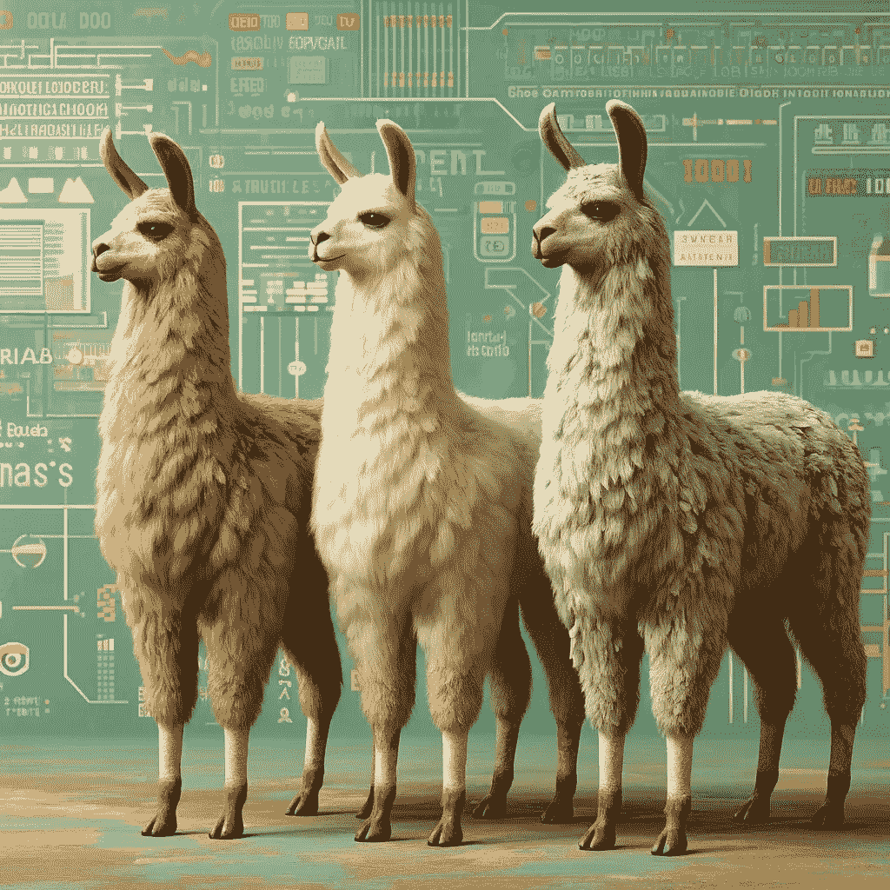

# 使用 Llama3 模型进行关系抽取

> 原文：[`towardsdatascience.com/relation-extraction-with-llama3-models-f8bc41858b9e?source=collection_archive---------0-----------------------#2024-04-26`](https://towardsdatascience.com/relation-extraction-with-llama3-models-f8bc41858b9e?source=collection_archive---------0-----------------------#2024-04-26)

## *通过微调 Llama3-8B 并使用 Llama3-70B 创建的合成数据集增强关系抽取*

[](https://medium.com/@silviaonofrei?source=post_page---byline--f8bc41858b9e--------------------------------)[](https://towardsdatascience.com/?source=post_page---byline--f8bc41858b9e--------------------------------) [Silvia Onofrei](https://medium.com/@silviaonofrei?source=post_page---byline--f8bc41858b9e--------------------------------)

·发表于[Towards Data Science](https://towardsdatascience.com/?source=post_page---byline--f8bc41858b9e--------------------------------) ·12 分钟阅读·2024 年 4 月 26 日

--



由 DALL-E 生成。

# 前提

关系抽取（RE）是从非结构化文本中提取关系的任务，用于识别不同命名实体之间的连接。这一任务通常与命名实体识别（NER）一起进行，是自然语言处理流水线中的一个重要步骤。随着大型语言模型（LLMs）的兴起，传统的监督方法——通过标注实体跨度并分类实体之间（如果有的话）的关系——在 LLM 驱动的方法下得到了增强或完全替代[[1](https://arxiv.org/pdf/2305.05003.pdf)]。

Llama3 是生成式 AI 领域最近发布的主要版本[[2](https://ai.meta.com/blog/meta-llama-3/)]。基础模型有两种规格，分别为 8B 和 70B，预计很快会发布 400B 版本。这些模型可在 HuggingFace 平台上使用，详情请见[[3](https://huggingface.co/blog/llama3)]。70B 版本为 Meta 的全新聊天网站[Meta.ai](http://Meta.ai)提供支持，展现出与 ChatGPT 相当的性能。8B 模型在同类中表现优异。Llama3 的架构与 Llama2 相似，性能提升主要得益于数据升级。该模型配备了升级版的分词器和扩展的上下文窗口。虽然被标记为开源，但仅发布了很小一部分数据。总体来说，这是一个非常优秀的模型，我迫不及待想尝试一下。

Llama3–70B 能够产生惊人的结果，但由于其规模庞大，它在本地系统上使用起来不切实际，成本高昂且难以操作。因此，为了充分利用其能力，我们让 Llama3–70B 教导较小的 Llama3–8B 如何从非结构化文本中进行关系抽取。

具体来说，在 Llama3–70B 的帮助下，我们构建了一个针对关系抽取的有监督微调数据集。然后，我们使用该数据集对 Llama3–8B 进行微调，以增强其关系抽取能力。

为了复现与本博客相关的[Google Colab Notebook](https://github.com/SolanaO/Blogs_Content/blob/master/llama3_re/Llama3_RE_Inference_SFT.ipynb)中的代码，你将需要：

+   HuggingFace 凭证（用于保存微调后的模型，可选）和 Llama3 访问权限，可以通过按照模型卡中的指示获取；

+   一个免费的[GroqCloud](https://console.groq.com)账户（你可以使用 Google 账户登录）和相应的 API 密钥。

# 工作空间设置

对于这个项目，我使用了一台配备 A100 GPU 和高内存设置的 Google Colab Pro。

我们首先安装所有需要的库：

```py
!pip install -q groq
!pip install -U accelerate bitsandbytes datasets evaluate 
!pip install -U peft transformers trl 
```

我很高兴地注意到，整个设置从一开始就能够顺利运行，没有出现任何依赖问题，也无需从源代码安装`transformers`，尽管该模型是新的。

我们还需要授权 Google Colab 访问 Google Drive 和文件，并设置工作目录：

```py
# For Google Colab settings
from google.colab import userdata, drive

# This will prompt for authorization
drive.mount('/content/drive')

# Set the working directory
%cd '/content/drive/MyDrive/postedBlogs/llama3RE'
```

对于那些希望将模型上传到 HuggingFace Hub 的人，我们需要上传 Hub 凭证。在我的情况下，这些凭证存储在 Google Colab 的机密中，可以通过左侧的密钥按钮访问。此步骤为可选。

```py
# For Hugging Face Hub setting
from huggingface_hub import login

# Upload the HuggingFace token (should have WRITE access) from Colab secrets
HF = userdata.get('HF')

# This is needed to upload the model to HuggingFace
login(token=HF,add_to_git_credential=True)
```

我还添加了一些路径变量，以简化文件访问：

```py
# Create a path variable for the data folder
data_path = '/content/drive/MyDrive/postedBlogs/llama3RE/datas/'

# Full fine-tuning dataset
sft_dataset_file = f'{data_path}sft_train_data.json'

# Data collected from the the mini-test
mini_data_path = f'{data_path}mini_data.json'

# Test data containing all three outputs
all_tests_data = f'{data_path}all_tests.json'

# The adjusted training dataset
train_data_path = f'{data_path}sft_train_data.json'

# Create a path variable for the SFT model to be saved locally
sft_model_path = '/content/drive/MyDrive/llama3RE/Llama3_RE/'
```

现在我们的工作空间已经设置好，我们可以进入第一步，即为关系抽取任务构建一个合成数据集。

# 创建用于关系抽取的合成数据集，采用 Llama3–70B

有几个关系抽取数据集可供使用，其中最著名的是[CoNLL04](https://paperswithcode.com/dataset/conll04)数据集。此外，还有一些优秀的数据集，如 HuggingFace 上的[web_nlg](https://huggingface.co/datasets/web_nlg#dataset-card-for-webnlg)和 AllenAI 开发的[SciREX](https://github.com/allenai/SciREX?tab=readme-ov-file)。然而，这些数据集中的大多数都带有限制性许可证。

受到`web_nlg`数据集格式的启发，我们将构建我们自己的数据集。如果我们计划对一个在我们数据集上训练的模型进行微调，这种方法将特别有用。首先，我们需要收集一批短句子来进行关系抽取任务。我们可以通过多种方式来编纂这个语料库。

## 收集句子集合

我们将使用[databricks-dolly-15k](https://huggingface.co/datasets/databricks/databricks-dolly-15k)，这是一个由 Databricks 员工在 2023 年生成的开源数据集。该数据集设计用于监督微调，并包括四个特征：指令、上下文、响应和类别。分析了这八个类别后，我决定保留`information_extraction`类别中的上下文的第一句话。数据解析步骤如下：

```py
from datasets import load_dataset

# Load the dataset
dataset = load_dataset("databricks/databricks-dolly-15k")

# Choose the desired category from the dataset
ie_category = [e for e in dataset["train"] if e["category"]=="information_extraction"]

# Retain only the context from each instance
ie_context = [e["context"] for e in ie_category]

# Split the text into sentences (at the period) and keep the first sentence
reduced_context = [text.split('.')[0] + '.' for text in ie_context]

# Retain sequences of specified lengths only (use character length)
sampler = [e for e in reduced_context if 30 < len(e) < 170]
```

选择过程产生了一个包含 1,041 个句子的数据集。鉴于这是一个小型项目，我没有精心挑选句子，因此一些样本可能不太适合我们的任务。在一个用于生产的项目中，我会仔细选择最合适的句子。然而，出于这个项目的目的，这个数据集已经足够了。

## 格式化数据

我们首先需要创建一个系统消息，定义输入提示并指示模型如何生成答案：

```py
system_message = """You are an experienced annontator. 
Extract all entities and the relations between them from the following text. 
Write the answer as a triple entity1|relationship|entitity2\. 
Do not add anything else.
Example Text: Alice is from France.
Answer: Alice|is from|France.
"""
```

由于这是一个实验阶段，我对模型的要求保持最低限度。我测试了几个其他的提示，包括一些要求以 CoNLL 格式输出的提示，其中实体会被分类，模型的表现相当不错。然而，出于简便考虑，我们暂时还是从基础做起。

我们还需要将数据转换为对话格式：

```py
messages = [[
    {"role": "system","content": f"{system_message}"},
    {"role": "user", "content": e}] for e in sampler]
```

## Groq 客户端和 API

Llama3 几天前刚发布，API 选项的可用性仍然有限。虽然 Llama3–70B 提供了一个聊天接口，但这个项目需要一个 API，能够用几行代码处理我的 1,000 个句子。我找到了这个很棒的[YouTube 视频](https://www.youtube.com/watch?v=ySwJT3Z1MFI)，它解释了如何免费使用 GroqCloud API。更多细节请参考视频。

提个提醒：你需要登录并从[GroqCloud](https://console.groq.com/playground)网站获取一个免费的 API 密钥。我的 API 密钥已经保存在 Google Colab 的密钥中。我们从初始化 Groq 客户端开始：

```py
import os
from groq import Groq

gclient = Groq(
    api_key=userdata.get("GROQ"),
)
```

接下来，我们需要定义几个辅助函数，使我们能够有效地与[Meta.ai](http://meta.ai/)聊天接口互动（这些函数改编自[YouTube 视频](https://www.youtube.com/watch?v=ySwJT3Z1MFI)）：

```py
import time
from tqdm import tqdm

def process_data(prompt):

    """Send one request and retrieve model's generation."""

    chat_completion = gclient.chat.completions.create(
        messages=prompt, # input prompt to send to the model
        model="llama3-70b-8192", # according to GroqCloud labeling
        temperature=0.5, # controls diversity
        max_tokens=128, # max number tokens to generate
        top_p=1, # proportion of likelihood weighted options to consider
        stop=None, # string that signals to stop generating
        stream=False, # if set partial messages are sent
    )
    return chat_completion.choices[0].message.content

def send_messages(messages):

    """Process messages in batches with a pause between batches."""

   batch_size = 10
    answers = []

    for i in tqdm(range(0, len(messages), batch_size)): # batches of size 10

        batch = messages[i:i+10]  # get the next batch of messages

        for message in batch:
            output = process_data(message)
            answers.append(output)

        if i + 10 < len(messages):  # check if there are batches left
            time.sleep(10)  # wait for 10 seconds

    return answers
```

第一个函数`process_data()`作为 Groq 客户端聊天完成函数的封装器。第二个函数`send_messages()`将数据分批处理。如果你在 Groq Playground 页面点击设置链接，你会找到一个指向[Limits](https://console.groq.com/settings/limits)的链接，里面详细列出了我们可以使用免费 API 的条件，包括请求次数和生成的 token 的上限。为了避免超出这些限制，我在每批 10 条消息后加入了 10 秒的延迟，虽然在我的情况下这并非严格必要。你可能会想尝试调整这些设置。

现在剩下的任务是生成我们的关系抽取数据，并将其与初始数据集进行整合：

```py
# Data generation with Llama3-70B
answers = send_messages(messages)

# Combine input data with the generated dataset
combined_dataset = [{'text': user, 'gold_re': output} for user, output in zip(sampler, answers)]
```

# 评估 Llama3–8B 的关系抽取能力

在开始微调模型之前，评估模型在多个样本上的表现非常重要，以确定是否真的需要微调。

## 构建测试数据集

我们将从我们刚刚构建的数据集中选择 20 个样本，并将它们分开用于测试。其余的数据集将用于微调。

```py
import random
random.seed(17)

# Select 20 random entries
mini_data = random.sample(combined_dataset, 20)

# Build conversational format
parsed_mini_data = [[{'role': 'system', 'content': system_message},
                     {'role': 'user', 'content': e['text']}] for e in mini_data]

# Create the training set
train_data = [item for item in combined_dataset if item not in mini_data]
```

我们将使用 GroqCloud API 和上述定义的工具，指定 `model=llama3-8b-8192`，其余的函数保持不变。在这种情况下，我们可以直接处理我们的较小数据集，而不必担心超出 API 限制。

这是一个示例输出，提供了原始的 `text`，Llama3-70B 生成的 `gold_re` 和 Llama3-8B 生成的 `test_re`。

```py
{'text': 'Long before any knowledge of electricity existed, people were aware of shocks from electric fish.',
 'gold_re': 'people|were aware of|shocks\nshocks|from|electric fish\nelectric fish|had|electricity',
 'test_re': 'electric fish|were aware of|shocks'}
```

关于完整的测试数据集，请参阅 [Google Colab 笔记本。](https://github.com/SolanaO/Blogs_Content/blob/master/llama3_re/Llama3_RE_Inference_SFT.ipynb)

仅从这个例子来看，Llama3–8B 在关系抽取能力上可能需要一些改进。让我们着手提升这一点。

# Llama3–8B 的监督微调

我们将使用一整套技术来辅助，包括 QLoRA 和 Flash Attention。我在这里不会深入讨论选择超参数的具体细节，但如果你有兴趣深入了解，可以参考这些很棒的文献 [[4](https://magazine.sebastianraschka.com/p/practical-tips-for-finetuning-llms)] 和 [[5](https://www.philschmid.de/fine-tune-llms-in-2024-with-trl)]。

A100 GPU 支持 Flash Attention 和 bfloat16，拥有约 40GB 的内存，足以满足我们对微调的需求。

## **准备 SFT 数据集**

我们首先将数据集解析为对话格式，包括系统消息、输入文本和期望的答案，这些答案来自 Llama3–70B 生成的内容。然后我们将其保存为 HuggingFace 数据集：

```py
def create_conversation(sample):
    return {
        "messages": [
            {"role": "system","content": system_message},
            {"role": "user", "content": sample["text"]},
            {"role": "assistant", "content": sample["gold_re"]}
        ]
    }

from datasets import load_dataset, Dataset

train_dataset = Dataset.from_list(train_data)

# Transform to conversational format
train_dataset = train_dataset.map(create_conversation,
                      remove_columns=train_dataset.features,
                      batched=False)
```

## 选择模型

```py
model_id  =  "meta-llama/Meta-Llama-3-8B"
```

## 加载分词器

```py
from transformers import AutoTokenizer

# Tokenizer
tokenizer = AutoTokenizer.from_pretrained(model_id,
                                          use_fast=True,
                                          trust_remote_code=True)

tokenizer.pad_token = tokenizer.eos_token
tokenizer.pad_token_id =  tokenizer.eos_token_id
tokenizer.padding_side = 'left'

# Set a maximum length
tokenizer.model_max_length = 512
```

## 选择量化参数

```py
from transformers import BitsAndBytesConfig

bnb_config = BitsAndBytesConfig(
    load_in_4bit=True,
    bnb_4bit_use_double_quant=True,
    bnb_4bit_quant_type="nf4",
    bnb_4bit_compute_dtype=torch.bfloat16
)
```

## 加载模型

```py
from transformers import AutoModelForCausalLM
from peft import prepare_model_for_kbit_training
from trl import setup_chat_format

device_map = {"": torch.cuda.current_device()} if torch.cuda.is_available() else None

model = AutoModelForCausalLM.from_pretrained(
    model_id,
    device_map=device_map,
    attn_implementation="flash_attention_2",
    quantization_config=bnb_config
)

model, tokenizer = setup_chat_format(model, tokenizer)
model = prepare_model_for_kbit_training(model)
```

## LoRA 配置

```py
from peft import LoraConfig

# According to Sebastian Raschka findings
peft_config = LoraConfig(
        lora_alpha=128, #32
        lora_dropout=0.05,
        r=256,  #16
        bias="none",
        target_modules=["q_proj", "o_proj", "gate_proj", "up_proj", 
          "down_proj", "k_proj", "v_proj"],
        task_type="CAUSAL_LM",
)
```

当针对所有线性层时，最佳结果可得到。如果内存限制是一个问题，选择更标准的值，如 alpha=32 和 rank=16，可以带来好处，因为这些设置会大幅减少参数量。

## 训练参数

```py
from transformers import TrainingArguments

# Adapted from  Phil Schmid blogpost
args = TrainingArguments(
    output_dir=sft_model_path,              # directory to save the model and repository id
    num_train_epochs=2,                     # number of training epochs
    per_device_train_batch_size=4,          # batch size per device during training
    gradient_accumulation_steps=2,          # number of steps before performing a backward/update pass
    gradient_checkpointing=True,            # use gradient checkpointing to save memory, use in distributed training
    optim="adamw_8bit",                     # choose paged_adamw_8bit if not enough memory
    logging_steps=10,                       # log every 10 steps
    save_strategy="epoch",                  # save checkpoint every epoch
    learning_rate=2e-4,                     # learning rate, based on QLoRA paper
    bf16=True,                              # use bfloat16 precision
    tf32=True,                              # use tf32 precision
    max_grad_norm=0.3,                      # max gradient norm based on QLoRA paper
    warmup_ratio=0.03,                      # warmup ratio based on QLoRA paper
    lr_scheduler_type="constant",           # use constant learning rate scheduler
    push_to_hub=True,                       # push model to Hugging Face hub
    hub_model_id="llama3-8b-sft-qlora-re",
    report_to="tensorboard",               # report metrics to tensorboard
    )
```

如果你选择将模型保存到本地，可以省略最后三个参数。你还可能需要调整 `per_device_batch_size` 和 `gradient_accumulation_steps`，以防止内存溢出（OOM）错误。

## 初始化训练器并训练模型

```py
from trl import SFTTrainer

trainer = SFTTrainer(
    model=model,
    args=args,
    train_dataset=sft_dataset,
    peft_config=peft_config,
    max_seq_length=512,
    tokenizer=tokenizer,
    packing=False, # True if the dataset is large
    dataset_kwargs={
        "add_special_tokens": False,  # the template adds the special tokens
        "append_concat_token": False, # no need to add additional separator token
    }
)

trainer.train()
trainer.save_model()
```

训练过程，包括模型保存，大约花费了 10 分钟。

让我们清理内存，为推理测试做准备。如果你使用的是内存较小的 GPU，并遇到 CUDA 内存溢出（OOM）错误，可能需要重启运行时环境。

```py
import torch
import gc
del model
del tokenizer
gc.collect()
torch.cuda.empty_cache()
```

# 使用 SFT 模型进行推理

在最后一步中，我们将以半精度加载基础模型以及 Peft 适配器。对于此测试，我选择不将模型与适配器合并。

```py
from peft import AutoPeftModelForCausalLM
from transformers import AutoTokenizer, pipeline
import torch

# HF model
peft_model_id = "solanaO/llama3-8b-sft-qlora-re"

# Load Model with PEFT adapter
model = AutoPeftModelForCausalLM.from_pretrained(
  peft_model_id,
  device_map="auto",
  torch_dtype=torch.float16,
  offload_buffers=True
)
```

接下来，我们加载分词器：

```py
okenizer = AutoTokenizer.from_pretrained(peft_model_id)

tokenizer.pad_token = tokenizer.eos_token
tokenizer.pad_token_id =  tokenizer.eos_token_id
```

我们构建了文本生成流水线：

```py
pipe = pipeline("text-generation", model=model, tokenizer=tokenizer)
```

我们加载测试数据集，该数据集由我们之前预留的 20 个样本组成，并将数据格式化为对话风格。然而，这次我们省略了助手消息，并将其格式化为 Hugging Face 数据集：

```py
def create_input_prompt(sample):
    return {
        "messages": [
            {"role": "system","content": system_message},
            {"role": "user", "content": sample["text"]},
        ]
    }

from datasets import Dataset

test_dataset = Dataset.from_list(mini_data)

# Transform to conversational format
test_dataset = test_dataset.map(create_input_prompt,
                      remove_columns=test_dataset.features,
                      batched=False)
```

## 单一样本测试

让我们使用 SFT Llama3–8B 生成关系提取输出，并将其与之前两个输出在单一实例上的结果进行比较：

```py
 Generate the input prompt
prompt = pipe.tokenizer.apply_chat_template(test_dataset[2]["messages"][:2],
                                            tokenize=False,
                                            add_generation_prompt=True)
# Generate the output
outputs = pipe(prompt,
              max_new_tokens=128,
              do_sample=False,
              temperature=0.1,
              top_k=50,
              top_p=0.1,
              )
# Display the results
print(f"Question: {test_dataset[2]['messages'][1]['content']}\n")
print(f"Gold-RE: {test_sampler[2]['gold_re']}\n")
print(f"LLama3-8B-RE: {test_sampler[2]['test_re']}\n")
print(f"SFT-Llama3-8B-RE: {outputs[0]['generated_text'][len(prompt):].strip()}")
```

我们得到了以下结果：

```py
Question: Long before any knowledge of electricity existed, people were aware of shocks from electric fish.

Gold-RE: people|were aware of|shocks
    shocks|from|electric fish
    electric fish|had|electricity

LLama3-8B-RE: electric fish|were aware of|shocks

SFT-Llama3-8B-RE: people|were aware of|shocks
         shocks|from|electric fish
```

在这个示例中，我们观察到 Llama3–8B 在关系提取能力上的显著提升，尽管微调数据集既不特别干净，也不算非常大，但结果仍然令人印象深刻。

关于 20 个样本数据集的完整结果，请参考 [Google Colab notebook](https://github.com/SolanaO/Blogs_Content/blob/master/llama3_re/Llama3_RE_Inference_SFT.ipynb)。请注意，由于我们以半精度加载模型，推理测试需要更长时间。

# 结论

总结，通过利用 Llama3–70B 和现有数据集，我们成功地创建了一个合成数据集，并用于微调 Llama3–8B 以完成特定任务。这个过程不仅让我们熟悉了 Llama3，也使我们能够应用 Hugging Face 的简单技巧。我们观察到，使用 Llama3 与 Llama2 的体验非常相似，显著的改进包括更高质量的输出和更有效的分词器。

对于那些希望进一步拓展边界的人来说，可以考虑挑战模型完成更复杂的任务，例如分类实体和关系，并利用这些分类来构建知识图谱。

# 参考文献

1.  Somin Wadhwa, Silvio Amir, Byron C. Wallace, 在大型语言模型时代重新审视关系提取，[arXiv.2305.05003](https://arxiv.org/pdf/2305.05003.pdf)（2023 年）。

1.  Meta，介绍 Meta Llama 3：迄今为止最强大的公开可用 LLM，2024 年 4 月 18 日 ([link)](https://ai.meta.com/blog/meta-llama-3/)。

1.  Philipp Schmid, Omar Sanseviero, Pedro Cuenca, Youndes Belkada, Leandro von Werra，[欢迎 Llama 3 —— Meta 的新开放 LLM](https://huggingface.co/blog/llama3)，2024 年 4 月 18 日。

1.  Sebastian Raschka，[使用 LoRA（低秩适配）微调 LLM 的实用技巧](https://magazine.sebastianraschka.com/p/practical-tips-for-finetuning-llms)，Ahead of AI，2023 年 11 月 19 日。

1.  Philipp Schmid，[如何在 2024 年使用 Hugging Face 微调 LLM](https://www.philschmid.de/fine-tune-llms-in-2024-with-trl)，2024 年 1 月 22 日。

# 数据集

[databricks-dolly-15K](https://huggingface.co/datasets/databricks/databricks-dolly-15k) 在 Hugging Face 平台（CC BY-SA 3.0）

# 完整代码与处理后的数据

[Github Repo](https://github.com/SolanaO/Blogs_Content/tree/master/llama3_re)
