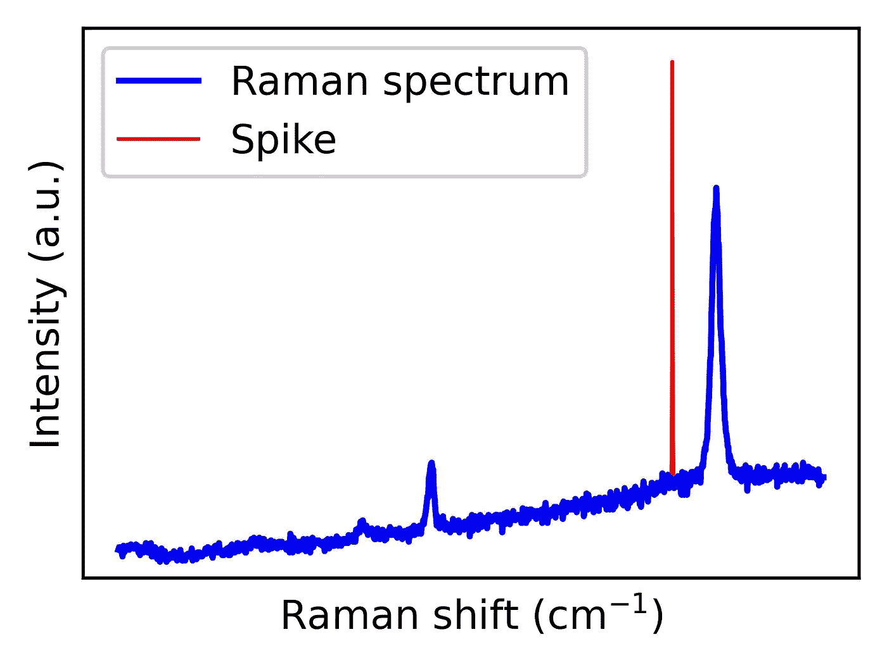
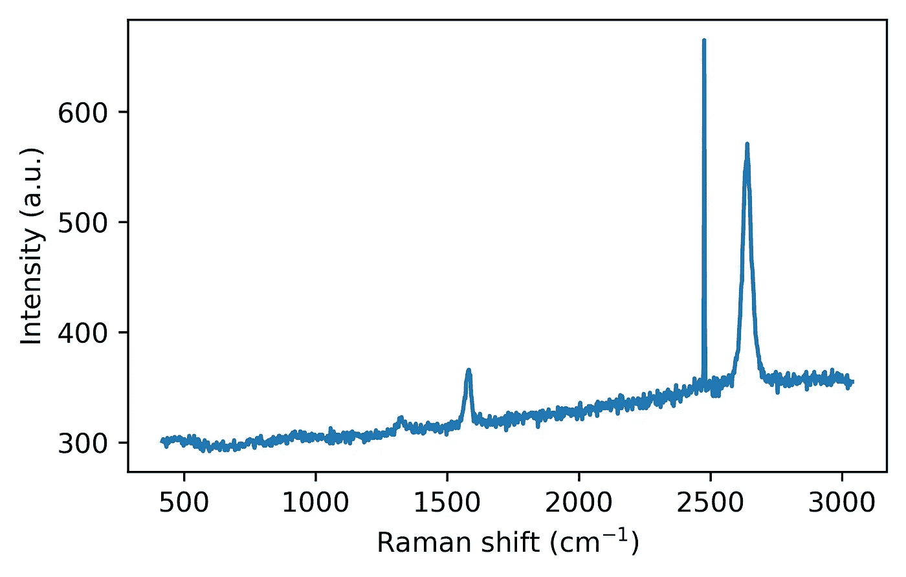
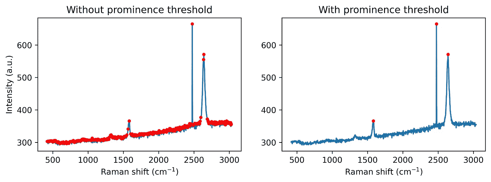
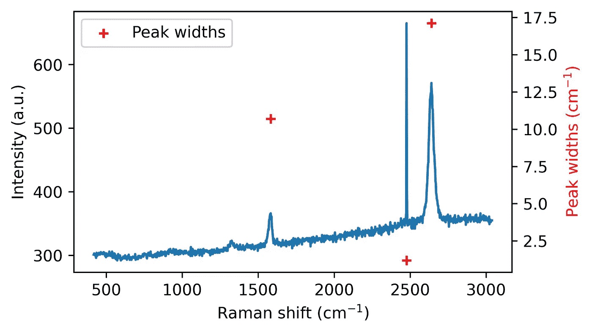
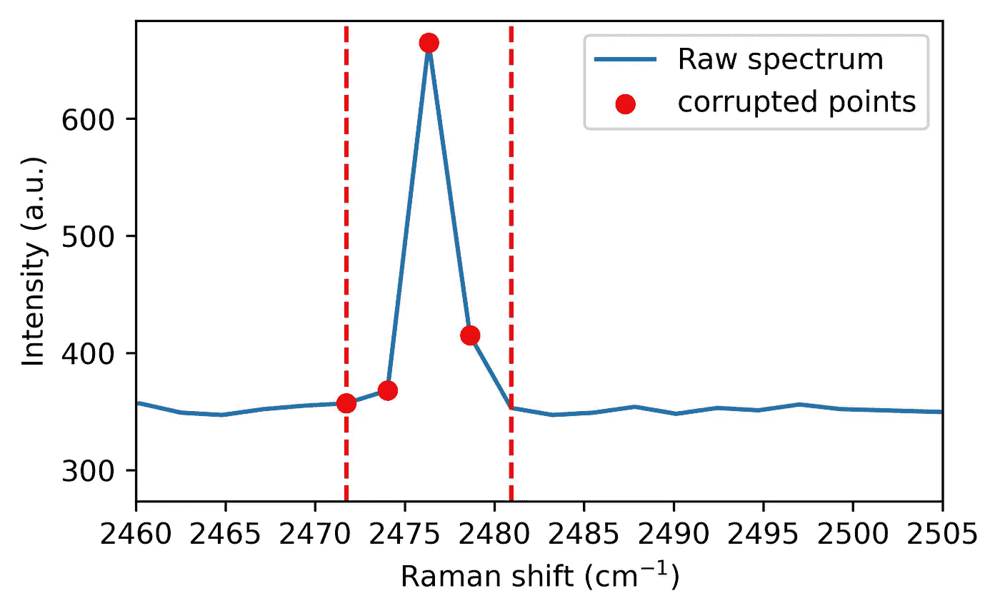
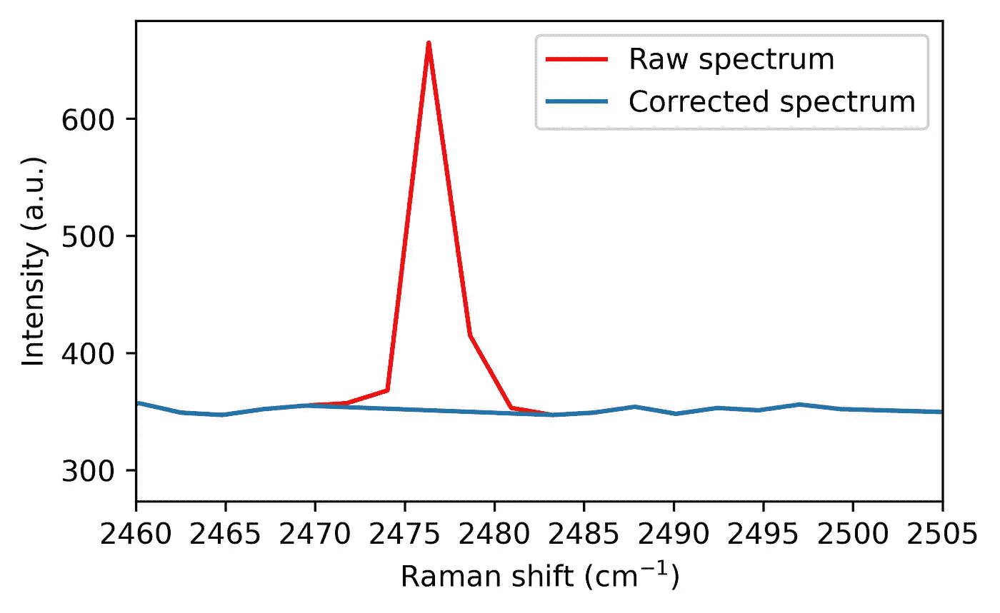
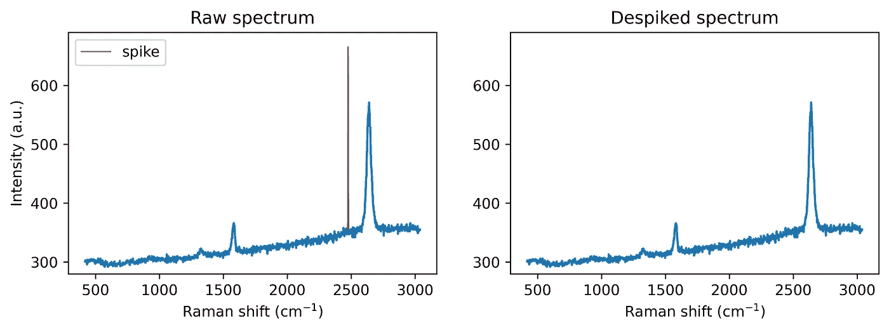

# 使用 Python 去除拉曼光谱中的尖峰：一步步指南

> 原文：[`towardsdatascience.com/removing-spikes-from-raman-spectra-a-step-by-step-guide-with-python-b6fd90e8ea77?source=collection_archive---------4-----------------------#2024-11-06`](https://towardsdatascience.com/removing-spikes-from-raman-spectra-a-step-by-step-guide-with-python-b6fd90e8ea77?source=collection_archive---------4-----------------------#2024-11-06)

## 查找、移除并用插值值替换尖峰

[](https://medium.com/@nicopez?source=post_page---byline--b6fd90e8ea77--------------------------------)[](https://towardsdatascience.com/?source=post_page---byline--b6fd90e8ea77--------------------------------) [尼古拉斯·可卡博士](https://medium.com/@nicopez?source=post_page---byline--b6fd90e8ea77--------------------------------)

·发表于[Towards Data Science](https://towardsdatascience.com/?source=post_page---byline--b6fd90e8ea77--------------------------------) ·7 分钟阅读·2024 年 11 月 6 日

--

本教程是系列文章的一部分，系列文章题为[使用 Python 进行拉曼光谱的数据科学](https://towardsdatascience.com/data-science-for-raman-spectroscopy-a-practical-example-e81c56cf25f)，该系列在[Towards Data Science](https://towardsdatascience.com/)上发布。它基于在《Analytica Chimica Acta》期刊上发布的[这篇文章](https://doi.org/10.1016/j.aca.2024.342312)。通过跟随本教程，您将为您的数据分析工具包添加一项宝贵工具——一种已经在公开研究中使用的有效方法，用于清理拉曼光谱。



去除石墨烯拉曼光谱中的尖峰。图片由作者提供。

# **简介**

尖峰去除是拉曼数据预处理中的一个重要步骤。尖峰是由宇宙射线撞击探测器引起的，它们表现为强烈、狭窄的峰值，可能会扭曲分析结果。这些能量爆发撞击电荷耦合设备（CCD）摄像头，产生尖锐、高强度的峰值，如果不加以修正，可能会干扰进一步的处理步骤，如归一化、光谱搜索或多元数据分析。因此，清除这些伪影是一个优先事项。本教程将介绍一种实用的算法，用于去除拉曼光谱中的尖峰。我们将使用 Python，逐步演示一种用户友好、可定制的尖峰检测与修正方法，确保拉曼数据的准确性和可靠性。

图 1 展示了一个含有峰值的石墨烯拉曼光谱示例。石墨烯的卓越物理特性——如其电导率和热导率——使其成为一个备受研究的材料。其拉曼光谱包含反映结构特征的峰值，揭示有关掺杂、应变和晶界的信息。因此，拉曼光谱技术广泛用于表征石墨烯。然而，为了充分利用这一工具，必须事先去除峰值。



图 1\. 含峰值的石墨烯拉曼光谱。生成此图的代码如下所示。图片来自作者。

```py
import numpy as np
# Load data directly into a numpy array
data = np.loadtxt(spiked_spectrum.asc, delimiter=',', skiprows=1)

# Extract Raman shift from the first column (index)
ramanshift = data[:, 0]

# Extract intensity from the second column (index 1in Python)
intensity = data[:, 1]

# Plot the data
import matplotlib.pyplot as plt
fig = plt.figure(figsize = (5,3))
plt.plot(ramanshift, intensity)
plt.xlabel('Raman shift (cm$^{-1}$)')
plt.ylabel('Intensity (a.u.)')
plt.show()
```

# 峰值移除算法

这里提出的峰值移除算法包含四个主要步骤：

**1\. 峰值寻找**

**2\. 峰值检测**

**3\. 峰值标记**

**4\. 光谱校正**

让我们来看一下包含 Python 代码片段的不同步骤：

**1\. 峰值寻找：** 首先，算法通过检查局部最大值，设置最小突出度阈值来识别显著的峰值。添加突出度阈值有助于排除由噪声生成的小峰值，因为我们并不打算修正所有噪声。请参见下图进行对比。

```py
from scipy.signal import find_peaks
# Find the peaks in the spectrum (with and without prominence threshold)
peaks_wo_p, _ = find_peaks(intensity) # Peaks found without a prominence threshold
peaks_w_p, _ = find_peaks(intensity, prominence = 20) # Peaks found without a prominence threshold

fig, ax = plt.subplots(1, 2, figsize = (10,3))
ax[0].plot(ramanshift, intensity, zorder=0, label='Raw spectrum')
ax[0].scatter(ramanshift[peaks_wo_p], intensity[peaks_wo_p], marker ='.', color = 'red',label='Found peaks')
ax[1].plot(ramanshift, intensity, zorder=0, label='Raw spectrum')
ax[1].scatter(ramanshift[peaks_w_p], intensity[peaks_w_p], marker ='.', color = 'red',label='Found peaks')
plt.show()
```



第 1 步：在光谱中找到峰值。图片来自作者。

**2\. 峰值检测：** 接下来，根据峰值的特征窄宽度进行标记。这一点可能有助于大型光谱数据集的自动化。如果我们知道光谱中存在的拉曼带的宽度，我们可以选择低于该值的阈值。例如，在我们的系统分辨率下，我们不预期出现宽度小于 10 cm-1 的石墨烯拉曼带。

```py
from scipy.signal import peak_widths
widths = peak_widths(intensity, peaks_w_p)[0]

fig, ax = plt.subplots(figsize = (5,3))
ax.plot(ramanshift, intensity, zorder=0, label='Raw spectrum')
ax2 = ax.twinx()
ax2.scatter(ramanshift[peaks_w_p], widths, marker ='+', color = 'red',label='Peak widths')
plt.show()
```



第 2 步：寻找峰值的宽度。图片来自作者。

**3\. 峰值标记** 接下来，任何受峰值影响的数据点都会被标记，标记范围是根据峰值的突出程度计算的，从而有效地隔离损坏的像素。换句话说，我们选择必须修正的窗口。

```py
# Let's set the parameters:
width_param_rel = 0.8
width_threshold = 10 # Estimation of the width of the narrowest Raman band

# Calculation of the range where the spectral points are asumed to be corrupted
widths_ext_a = peak_widths(intensity, peaks_w_p, rel_height=width_param_rel)[2]
widths_ext_b = peak_widths(intensity, peaks_w_p, rel_height=width_param_rel)[3]

# Create a vector where spikes will be flag: no spike = 0, spike = 1.
spikes = np.zeros(len(intensity))

# Flagging the area previously defined if the peak is considered a spike (width below width_threshold)
for a, width, ext_a, ext_b in zip(range(len(widths)), widths, widths_ext_a, widths_ext_b):
    if width < width_threshold:
        spikes[int(ext_a) - 1: int(ext_b) + 2] = 1 

fig = plt.figure(figsize = (5,3))
plt.plot(ramanshift, intensity, zorder=0,label='Raw spectrum')
a=1
plt.scatter(ramanshift[int(widths_ext_a[a])-1 : int(widths_ext_b[a])+1], 
            intensity[int(widths_ext_a[a])-1 : int(widths_ext_b[a])+1], 
            color ='red', label = 'corrupted points')
plt.axvline(x = ramanshift[int(widths_ext_a[a]) -1], linestyle = '--', color = 'red')
plt.axvline(x = ramanshift[int(widths_ext_b[a]) + 1], linestyle = '--', color = 'red')  
plt.show()
```



第 3 步：标记损坏的箱体。图片来自作者。

**4\. 光谱校正** 最后，这些点通过插值方法与邻近值进行修正，保持光谱的完整性，以便进行后续分析。

```py
from scipy import interpolate
# Let's set the parameter:
moving_average_window = 10

intensity_out = intensity.copy()

# Interpolation of corrupted points
for i, spike in enumerate(spikes):
    if spike != 0: # If we have an spike in position i
        window = np.arange(i - moving_average_window, i + moving_average_window + 1) # we select 2 ma + 1 points around our spike
        window_exclude_spikes = window[spikes[window] == 0] # From such interval, we choose the ones which are not spikes
        interpolator = interpolate.interp1d(window_exclude_spikes, intensity[window_exclude_spikes], kind='linear') # We use the not corrupted points around the spike to calculate the interpolation
        intensity_out[i] = interpolator(i) # The corrupted point is exchanged by the interpolated value.

fig = plt.figure(figsize = (5,3))
plt.plot(ramanshift, intensity, zorder=0, color ='red',label='Raw spectrum')
plt.plot(ramanshift, intensity_out, zorder=0, label='Corrected spectrum')
plt.show()
```



第 4 步：光谱校正。图片来自作者。

# Python 中的完整峰值移除功能

所有这些代码片段可以汇总成一个单独的函数。该函数被设计为根据特定的数据需求进行定制，具有调整突出度和宽度的参数：

```py
import numpy as np
from scipy.signal import find_peaks, peak_widths, peak_prominences
from scipy import interpolate

def spike_removal(y, 
                  width_threshold, 
                  prominence_threshold=None, 
                  moving_average_window=10, 
                  width_param_rel=0.8, 
                  interp_type='linear'):
    """
    Detects and replaces spikes in the input spectrum with interpolated values. Algorithm first 
    published by N. Coca-Lopez in Analytica Chimica Acta. https://doi.org/10.1016/j.aca.2024.342312

    Parameters:
    y (numpy.ndarray): Input spectrum intensity.
    width_threshold (float): Threshold for peak width.
    prominence_threshold (float): Threshold for peak prominence.
    moving_average_window (int): Number of points in moving average window.
    width_param_rel (float): Relative height parameter for peak width.
    tipo: type of interpolation (linear, quadratic, cubic)

    Returns:
    numpy.ndarray: Signal with spikes replaced by interpolated values.
    """

    # First, we find all peaks showing a prominence above prominence_threshold on the spectra
    peaks, _ = find_peaks(y, prominence=prominence_threshold)

    # Create a vector where spikes will be flag: no spike = 0, spike = 1.
    spikes = np.zeros(len(y))

    # Calculation of the widths of the found peaks
    widths = peak_widths(y, peaks)[0]

    # Calculation of the range where the spectral points are asumed to be corrupted
    widths_ext_a = peak_widths(y, peaks, rel_height=width_param_rel)[2]
    widths_ext_b = peak_widths(y, peaks, rel_height=width_param_rel)[3]

    # Flagging the area previously defined if the peak is considered a spike (width below width_threshold)
    for a, width, ext_a, ext_b in zip(range(len(widths)), widths, widths_ext_a, widths_ext_b):
        if width < width_threshold:
            spikes[int(ext_a) - 1: int(ext_b) + 2] = 1 

    y_out = y.copy()

    # Interpolation of corrupted points
    for i, spike in enumerate(spikes):
        if spike != 0: # If we have an spike in position i
            window = np.arange(i - moving_average_window, i + moving_average_window + 1) # we select 2 ma + 1 points around our spike
            window_exclude_spikes = window[spikes[window] == 0] # From such interval, we choose the ones which are not spikes
            interpolator = interpolate.interp1d(window_exclude_spikes, y[window_exclude_spikes], kind=interp_type) # We use the not corrupted points around the spike to calculate the interpolation
            y_out[i] = interpolator(i) # The corrupted point is exchanged by the interpolated value.

    return y_out
```

然后，带有该算法的函数可以应用于带有峰值的石墨烯光谱，如下所示：

```py
intensity_despiked = spike_removal(intensity, 
                                     width_threshold = 3, 
                                     prominence_threshold = 20, 
                                     moving_average_window=10, 
                                     width_param_rel=0.8, 
                                     interp_type='linear')

fig, ax = plt.subplots(1, 2, figsize = (2*5,3))
ax[0].plot(ramanshift, intensity, label = 'spike', color ='red', linewidth = 0.9)
ax[0].plot(ramanshift, intensity_despiked)
ax[1].plot(ramanshift, intensity_despiked)
plt.show()
```



拉曼光谱中峰值移除的示例。图片来自作者。

使用这种去除尖峰的方法，你可以确保你的拉曼光谱干净可靠，最小化伪影，同时不丢失重要的光谱细节。该方法非常适合自动化，尤其是在已知预期的最小峰宽的情况下，使其非常适合大规模光谱数据集和高通量分析。

希望你喜欢这个教程。如果有任何问题，或者想分享你自己的拉曼数据挑战，欢迎在评论中留言——我很想听听这个算法如何帮助你的项目！

准备好尝试一下吗？你可以在[这里](https://github.com/nicocopez/pyspikes/blob/main/Tutorial%20to%20remove%20spikes%20from%20Raman%20spectra%20-%20A%20step%20by%20step%20guide.ipynb)下载 Jupyter Notebook。如果你觉得这对你有帮助，请记得引用[原始工作](https://doi.org/10.1016/j.aca.2024.342312)，这对我会有很大帮助！:)
