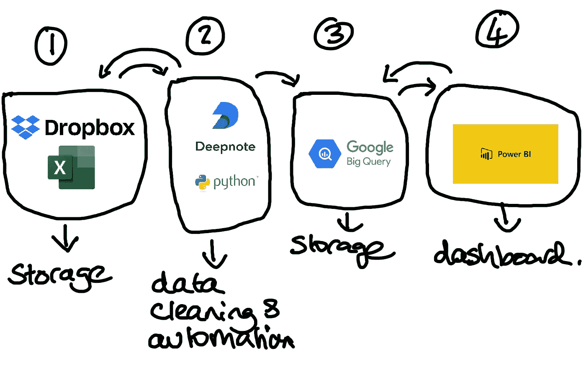
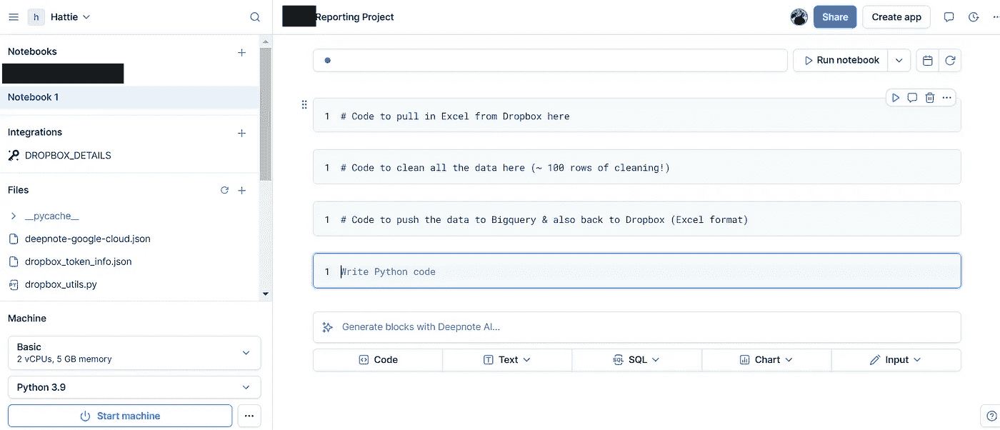
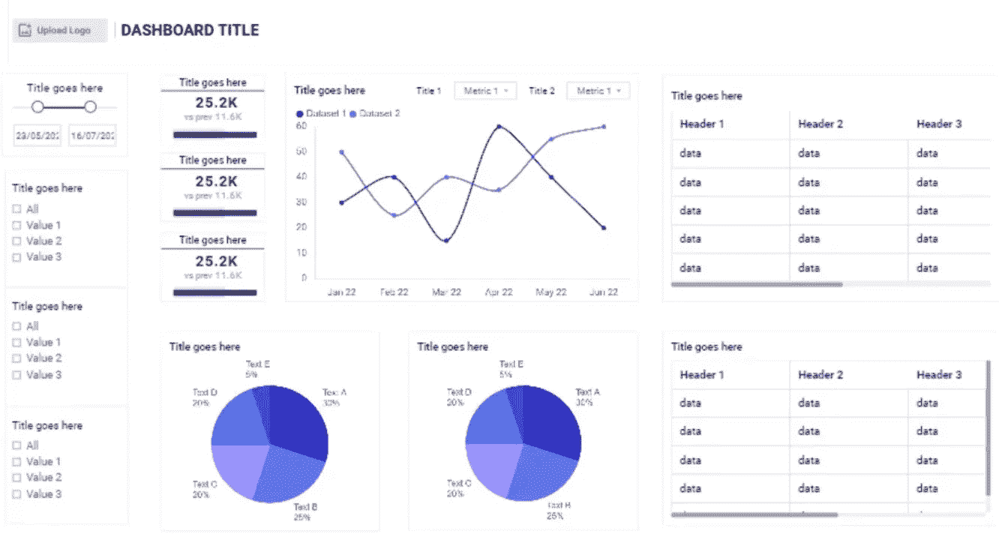

# 在 Excel 中进行报告可能正在比您想象的还要更多地损害您的业务——以下是如何修复它...

> 原文：[`towardsdatascience.com/reporting-in-excel-could-be-costing-your-business-more-than-you-think-heres-how-to-fix-it-aa40c0020131?source=collection_archive---------8-----------------------#2024-11-12`](https://towardsdatascience.com/reporting-in-excel-could-be-costing-your-business-more-than-you-think-heres-how-to-fix-it-aa40c0020131?source=collection_archive---------8-----------------------#2024-11-12)

## 了解如何节省时间，消除昂贵的数据错误，并让您的团队专注于推动真正商业增长的洞察。

 [Hattie Biddlecombe](https://datagatorsolutions.medium.com/?source=post_page---byline--aa40c0020131--------------------------------)

·发表于[Towards Data Science](https://towardsdatascience.com/?source=post_page---byline--aa40c0020131--------------------------------) ·阅读时间 6 分钟·2024 年 11 月 12 日

--

*免责声明：我与本文提到的任何工具无关；我分享它们是因为我发现它们在处理当前任务时非常有效。*

最近，我与两家机构合作，它们都寻求一个类似的、简单的解决方案：

> 自动化他们的月度和季度报告流程，并为客户展示视觉效果良好的数据仪表板。

两家机构都在应对类似的数据挑战，这让我认为这些问题在许多机构中可能是普遍存在的。这促使我写下这篇博客，旨在分享有用的见解并提供切实可行的解决方案。

# 以下是这些机构在报告过程中面临的主要挑战

## 1\. 这些机构花费了过多的时间将报告编制到 Excel 中

报告有时需要花费*几天*时间才能完成。一家机构需要从多个全球市场收集报告，而另一家则依赖于跨部门的几名员工来更新并发送来自他们系统的数据。如果有人休年假，该数据点就会在报告中被标记为“待确认”。

## 2\. 尝试进行更深层次的分析证明是一个挑战

***Excel 的稳定性和可扩展性问题：***

两家代理商都在处理大量数据，而正如我们许多人都知道的那样，Excel 在这种工作负载下往往会出现卡顿或崩溃。Excel 在创建数据透视表时频繁卡顿和崩溃，使得深入分析变得非常繁琐。团队常常不得不强制重启 Excel，有时还会面临丢失工作的风险。

***Excel 可视化的局限性***

Excel 提供的可视化范围相对有限，这使得数据的多样化和有洞察力的呈现变得更加困难。虽然简单的可视化通常是最终展示的最佳选择，但在探索阶段，更先进的可视化工具能够从多个角度分析数据并揭示更深层次的见解。

与更先进的工具相比，Excel 提供的可视化交互性有限，而后者为数据探索提供了更流畅和动态的体验。例如，在像 Power BI 这样的工具中，你可以点击某个视觉元素中的区域，所有相关的图表（例如销售趋势、客户群体、或产品类别）会立即更新，显示与该选择相关的数据。这种交互性对于发现更深层次的见解和理解数据变化背后的因素至关重要。

***深入分析的重要性***

深入分析对于每月做出最有影响力的决策至关重要。它是区分标准报告和真正出色报告的关键，标准报告仅展示了数字的增减，而真正出色的报告能够提出前瞻性解决方案、制定创新策略，并发现未开发的机会。通过在这一层次的分析上投资时间，你不仅解决了眼前的关注点，还将自己定位为客户长期增长的关键合作伙伴。

## 3\. 在 Excel 之外花费过多时间和资源来创建视觉上吸引人的图表

由于 Excel 的可视化效果往往显得有些笨拙，其中一家公司每个月都会将精美、品牌化的图表设计外包给设计师。就像大多数设计项目一样，这涉及了很多关于这些新图表应如何呈现的反复讨论。

## 4\. 数据技能差距导致了不准确的报告

报告由一个缺乏必要经验的人管理，这个人并没有完全理解 Excel 的一些独特之处，可以理解，因为这并不是他们的核心职责。因此，两家代理商都在不知情的情况下报告了错误的数字。例如，尽管“收入”列设置为“货币”格式，但像“USD123”和“123”（带空格）这样的条目被排除在总数之外，因为 Excel 没有将其识别为有效的货币值。虽然 Excel 确实提供了数据验证功能，用于限制条目为小数或整数，但必须手动应用，许多用户对此并不知情。在我看来，Excel 应该默认标记这些不一致之处。

# 那么，代理商的报告问题的解决方案是什么呢？

***这个例子来自其中一个客户，因为他们的案例更为全面：***

图片来源：作者自有

[**Dropbox**](https://www.dropbox.com/) **/ Excel:**

该机构的主要 Excel 文件包含多个标签页，存储在 Dropbox 中，以便团队成员能够全球访问。

**2\. Python in** [**Deepnote**](https://deepnote.com/)**:**

这是我花费大部分时间的地方，我在 Deepnote 笔记本中使用 Python 彻底清理数据，然后每月自动化这个过程。下面是一个 Deepnote Python 笔记本的快照。我在单元格中概述了我提取、清理和推送数据的步骤：

图片来源：Deepnote

**3\.** [**BigQuery**](https://cloud.google.com/bigquery/docs/bigquery-web-ui)

对于两个机构，我确保将清理过的数据存储在数据库中，并且将数据推送回 Excel 文件中的 Dropbox，供那些希望以 Excel 格式访问数据的人使用。将数据存储在数据库中提供了几个关键优势，包括：

**a. 安全性：** 高级功能如基于用户的权限、加密和审计跟踪，确保敏感数据受到保护，且访问权限严格控制。由于 Power BI 不允许对某些用户隐藏敏感列，因此我在 BigQuery 中创建了相关视图来管理隐私，控制哪些数据在仪表板级别暴露。

**b. 速度：** 即使多个用户同时通过仪表板访问数据，查询也能快速运行。

**c. 可扩展性：** 随着数据量的增长，数据库将无缝处理这些数据，避免了两个机构在使用 Excel 时遇到的上述问题。

# 快进到今天：自动化报告和仪表板如何改变了这些机构的工作流程

**节省大量时间**

他们的月度和季度报告现在可以在几分钟内自动刷新，消除了曾经花费大量时间和精力手动整理数据的过程。即使有人在年假期间，流程也能顺利运行，不会中断。团队们不再依赖我的输入，使整个系统变得完全自给自足🎉。

图片来源：Midjourney

**非常满意的客户**

两个机构都对结果感到非常兴奋，使用了“惊人”和“我痴迷”这样的词汇来形容他们客户的新仪表板（抱歉，我有点自夸，但有时候就是得这么做）。虽然我不能分享实际的仪表板，但这里有一个非常接近其中之一的模拟图：

图片来源：[Mokkup.ai](https://www.mokkup.ai/)

**用户已获得更深层次分析的能力**

仪表板提供了先进的、相互连接的可视化图表，能够进行更深层次的分析。完全可共享的仪表板使团队可以获得更详细的、针对行业和团队的见解，赋能每个人做出更明智的决策。

**数据准确**

关键是，现在的数字准确无误，摆脱了 Excel 常见的怪癖和限制。

**无需外包设计师或依赖第三方工具**

现在，令人惊艳的品牌化可视化可以直接在 PowerBI 中创建，并轻松嵌入到 PowerPoint 中，从而不再需要设计师或外部可视化工具。

**现在各机构对数据的潜力有了更深的了解**

和我所有的客户一样，我花时间向他们讲解 Excel、Power BI 和 Python 的全部潜力。通过与他们的团队共同工作，我帮助弥合了数据技能的差距，指出了 Excel 的一些怪癖，同时介绍了 Python 和笔记本的强大功能，以揭示更深层次的见解。

**总之**，Excel 是一个非常出色的工具，但也有其局限性。就像一辆可靠的汽车，它大多数时候可以带你到达目的地。但是当路况变得更加复杂时，有时候你需要一辆更强大的车辆才能继续前进。

截至 2023 年 8 月，尽管 Excel 现在可以集成 Python，但它仍然有一些限制，您可以在[这里](https://www.xlwings.org/blog/my-thoughts-on-python-in-excel)了解更多。依我看，通过 Python 笔记本与 Excel 合作，进行分析和数据清理要高效得多。

*想了解您的企业如何受益于类似的自动化和仪表板吗？随时联系我们：* [*https://www.datagatorsolutions.com/*](https://www.datagatorsolutions.com/)
