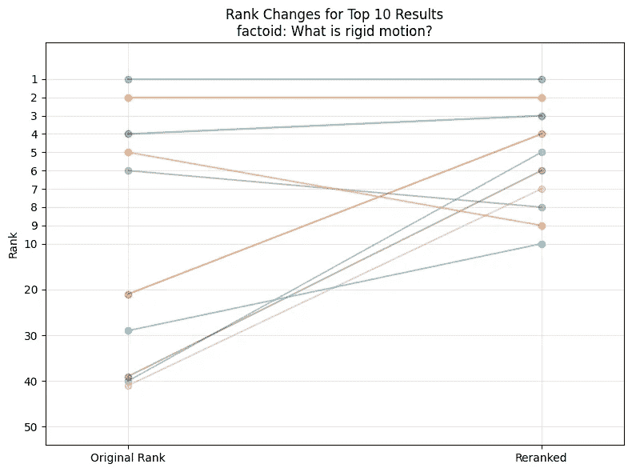
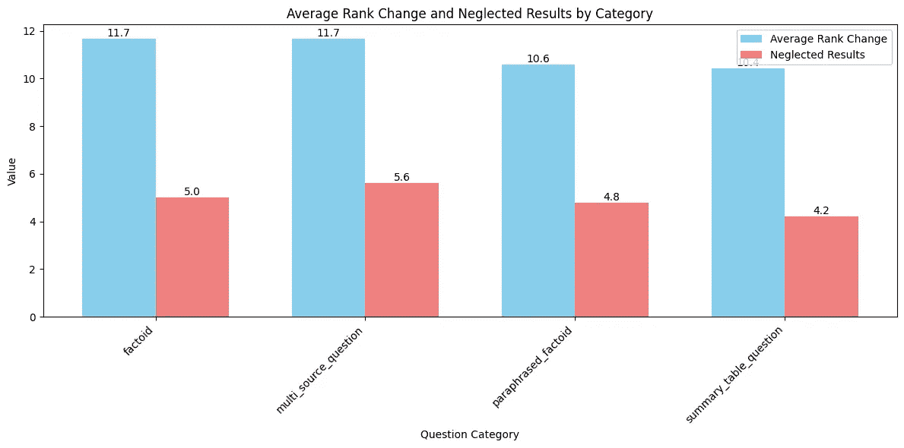
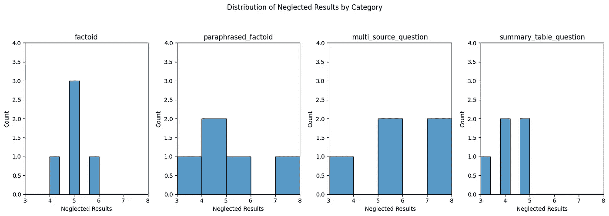
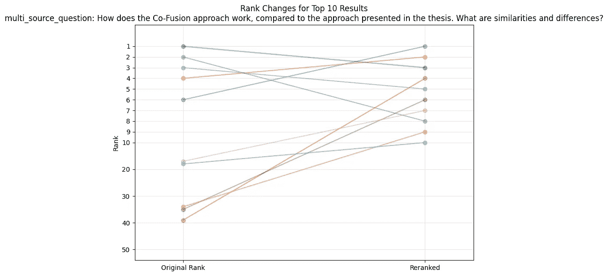
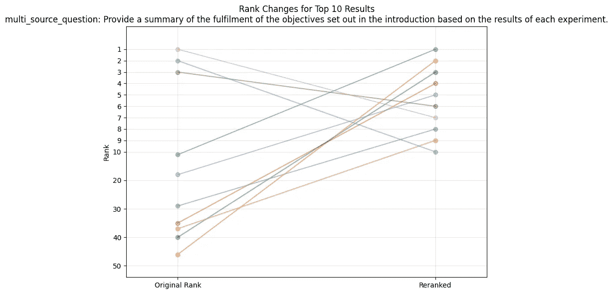

# 使用 Huggingface Transformers 进行 RAG 管道中检索优化的重排序

> 原文：[`towardsdatascience.com/reranking-using-huggingface-transformers-for-optimizing-retrieval-in-rag-pipelines-fbfc6288c91f?source=collection_archive---------5-----------------------#2024-11-08`](https://towardsdatascience.com/reranking-using-huggingface-transformers-for-optimizing-retrieval-in-rag-pipelines-fbfc6288c91f?source=collection_archive---------5-----------------------#2024-11-08)

## 理解重排序何时能产生显著的影响

[](https://medium.com/@daniel-klitzke?source=post_page---byline--fbfc6288c91f--------------------------------)[](https://towardsdatascience.com/?source=post_page---byline--fbfc6288c91f--------------------------------) [Daniel Klitzke](https://medium.com/@daniel-klitzke?source=post_page---byline--fbfc6288c91f--------------------------------)

·发表于[Towards Data Science](https://towardsdatascience.com/?source=post_page---byline--fbfc6288c91f--------------------------------) ·阅读时间：8 分钟·2024 年 11 月 8 日

--



可视化重排序结果，针对用户查询“什么是刚性运动？”原始排序在左侧，新排序在右侧。（图片由作者制作）

在这篇文章中，我将展示如何使用[**Huggingface Transformers**](https://github.com/huggingface/transformers)和[**Sentence Transformers**](https://github.com/UKPLab/sentence-transformers)库，通过使用**重排序**模型来提升你的 RAG 管道。具体来说，我们将进行以下操作：

1.  使用简单的原始 RAG 管道建立一个**基准**。

1.  使用 Huggingface Transformers 库集成一个简单的**重排序模型**。

1.  评估在什么情况下**重排序模型**显著提高了上下文质量，以便更好地理解其好处。

为了实现这一点，我将提供指向[Github](https://github.com/Renumics/reranking-blogpost/blob/main/reranker_test.ipynb)的相应代码链接。

# 什么是重排序？

在深入评估之前，我想简要介绍一下**什么是重排序器**。重排序器通常按照以下方式应用：

1.  在 RAG 管道的检索步骤中，使用简单的基于嵌入的检索方法来获取**初始候选集**。

1.  Reranker 用于**重新排序结果**，以提供更适合用户查询的新结果顺序。

但是，为什么重新排序模型的结果会与我已经相当强大的嵌入模型不同呢？为什么我不在早期阶段利用重新排序模型的语义理解呢？这个问题很复杂，但一些关键点是，例如我们这里使用的 bge-重新排序模型本质上是**同时处理查询和文档**的交叉编码方法，因此可以显式地建模查询-文档交互。另一个主要区别是，重新排序模型是**以监督方式训练**的，目标是预测**相关性分数**，这些分数是通过人工标注获得的。这在实际中的意义将在后续的评估部分中展示。

# 我们的基线

对于我们的基线，我们选择最简单的 RAG 流水线，并专注于检索部分。具体来说，我们：

1.  选择一个大型 PDF 文档。我选择了我的硕士论文，但你也可以选择任何你喜欢的文档。

1.  从 PDF 中提取文本，并将其拆分为大约 10 个句子一组的均等块。

1.  为我们的文本块创建嵌入，并将其插入向量数据库，这里使用的是 LanceDB。

> *有关这一部分的详细信息，请查看我们的[Github](https://github.com/Renumics/reranking-blogpost/blob/main/reranker_test.ipynb)笔记本。*

完成这些步骤后，简单的**语义搜索**就可以通过两行代码实现，具体如下：

```py
query_embedding = model.encode([query])[0]
results = table.search(query_embedding).limit(INITIAL_RESULTS).to_pandas()
```

这里的查询将是用户提供的查询，例如问题“什么是形状完成？”此时的限制是要检索的结果数量。在正常的 RAG 流水线中，检索到的结果将直接作为**上下文提供给 LLM**，后者将综合生成答案。在许多情况下，这也是完全有效的，但在本文中，我们希望探索重新排序的好处。

# 实现重新排序

使用像[Huggingface Transformers](https://github.com/huggingface/transformers)这样的库，使用**重新排序模型**非常简单。为了使用重新排序来改进我们的“RAG 流水线”，我们扩展了我们的方法，如下所示：

1.  如前所述，通过标准的嵌入模型简单地检索**初始结果数量**。但是我们将结果的数量从 10 增加到大约 50。

1.  在检索到这个较大数量的初始源之后，我们应用一个重新排序模型来**重新排序这些源**。这是通过计算每个查询-源对的相关性分数来完成的。

1.  对于**答案生成**，我们通常会使用新的前 x 个结果。（在我们的案例中，我们使用前 10 个）

这段代码看起来也非常简单，可以通过几行代码实现：

```py
# Instantiate the reranker
from transformers import AutoModelForSequenceClassification, AutoTokenizer

reranker_tokenizer = AutoTokenizer.from_pretrained('BAAI/bge-reranker-v2-m3')
reranker_model = AutoModelForSequenceClassification.from_pretrained('BAAI/bge-reranker-v2-m3').to("mps")
reranker_model.eval()

# results = ... put code to query your vector database here...
# Note that in our case the results are a dataframe containing the text
# in the "chunk" column.

# Perform a reranking
# Form query-chunk-pairs
pairs = [[query, row['chunk']] for _, row in results.iterrows()]

# Calculate relevance scores
with torch.no_grad():
    inputs = reranker_tokenizer(pairs, padding=True, truncation=True, return_tensors='pt', max_length=512).to("mps")
    scores = reranker_model(**inputs, return_dict=True).logits.view(-1,).float()

# Add scores to the results DataFrame
results['rerank_score'] = scores.tolist()

# Sort results by rerank score and add new rank
reranked_results = results.sort_values('rerank_score', ascending=False).reset_index(drop=True)
```

> 再次，为了查看完整的代码以了解上下文，请查看[Github](https://github.com/Renumics/reranking-blogpost/blob/main/reranker_test.ipynb)

如你所见，主要的机制是简单地为模型提供**查询和潜在相关文本的对**。它输出一个**相关性评分**，然后我们可以用它来重新排序结果列表。但是这值得吗？在什么情况下值得额外的推理时间？

# 评估重新排序器

为了评估我们的系统，我们需要定义一些测试查询。在我的案例中，我选择了以下问题类别：

1.  **事实性问题**，例如“什么是刚体运动？”

    这些通常应该在文档中有一个特定的来源，并且表述方式应该使得它们可以通过文本搜索轻松找到。

1.  **改写的事实性问题**，比如“某些点云分类方法的架构中，是什么机制使它们对点的顺序不变？”

    如你所见，这些问题在提到某些术语时较为笼统，例如它们需要识别点云分类与 PointNet 架构之间的关系。

1.  **多源问题**，例如“Co-Fusion 方法与论文中提出的方法相比是如何工作的？它们的相似之处和不同之处是什么？”

    这些问题需要检索多个来源，这些来源应该列出或彼此比较。

1.  **摘要或表格问题**，例如“手部分割实验中使用的网络和参数大小是多少？”

    这些问题针对的是文本和表格形式的摘要，例如用于模型结果比较的表格。它们的目的是测试重新排序器是否能更好地识别出检索文档中的摘要部分是否有用。

由于我比较懒，所以每个类别只定义了 5 个问题，以便获得一个粗略的印象，并评估了带有和不带有重新排序的检索上下文。我选择的评估标准包括：

1.  重新排序是否**增加了重要信息**到上下文中。

1.  重新排序是否**减少了上下文的冗余**。

1.  重新排序是否将最相关的结果放在列表的更高位置（**更好的优先级排序**）。

1.  …

那结果怎么样呢？



平均排名变化概览以及最初被忽略的结果（那些不在前 10 名中的结果）。(图片由作者制作)

即使在概述中，我们也可以看到，不同类别的**问题之间有显著差异**，特别是对于多源问题类别，似乎有很多重新排序的操作。当我们更仔细地查看度量的分布时，这一点得到了进一步确认。



被忽略的结果按问题类别的分布。(图片由作者制作)

特别是对于这个类别中的 5 个问题中的 3 个，几乎所有进入最终前 10 名的结果都通过重新排序步骤得到了提升。现在的问题是找出为什么会这样。因此，我们关注两个最受重新排序（积极）影响的查询。

> 问题 1：“Co-Fusion 方法如何运作，与论文中提出的方法有何比较？有哪些相似性和差异？”



前 10 个来源的重新排序结果及其之前的位置。（图像由作者创建）

这里的第一印象是，针对这个查询的重新排序器确实产生了两个主要效果。它将第 6 位的段落优先排为最相关的结果。此外，它还将一些低排名的结果提取到前 10 名中。当我们进一步检查这些段落时，我们发现了以下情况：

1.  重新排序器成功提取出一个高度相关的段落，描述了 SLAM 方法**与**论文中的方法的不同之处。

1.  重新排序器还成功地包含了一个段落，该段落**提到了 Co-Fusion**，作为一种能够处理动态物体的 SLAM 方法，并且包括了关于局限性的讨论。

一般来说，这里出现的主要模式是，重新排序器能够**捕捉到语气中的细微差别**。具体来说，像“SLAM 方法与论文中提出的方法密切相关，但……”这种表述，配合对 Co-Fusion 的稀疏提及，将比使用标准嵌入模型时排名更高。这可能是因为嵌入模型很可能**无法捕捉到**Co-Fusion 是一个 SLAM 方法，而文本中的主导模式是关于 SLAM 的通用信息。因此，重新排序器可以为我们提供两件事情：

1.  **专注于细节**而不是关注平均语义内容。

1.  **更加关注用户意图**，以比较某些方法与论文中的方法。

> 问题 2：“根据每个实验的结果，提供关于引言中设定目标的完成情况的总结。”



前 10 个来源的重新排序结果及其之前的位置。（图像由作者创建）

此外，我们还意识到，许多低排名的来源通过重新排序步骤被拉入了前 10 名。所以让我们再调查一下为什么会这样：

1.  重新排序器再次成功捕捉到了问题的**细微意图**，并将包含“it was thus suspected...”这一表述的段落重新排序为高度相关的内容，这确实是因为后续内容描述了假设是否有效，以及该方法是否能够利用这些假设。

1.  重新排序器为我们提供了许多表述模糊的实验结果，这些结果还包括了一些关于机器学习训练结果的表格概览，可能是**理解这些部分的总结性特征**。

# 结论

实现重新排序并不是一项难事，像 Huggingface Transformers 这样的包提供了 **易于使用的接口**，可以将它们集成到你的 RAG 管道中，而主要的 RAG 框架如 [llama-index](https://github.com/run-llama/llama_index) 和 [langchain](https://github.com/langchain-ai/langchain) 已经开箱即用地支持它们。此外，还有基于 **API 的重新排序器**，例如 [Cohere](https://cohere.com/rerank) 提供的，你可以在你的应用中使用它。

从我们的评估中，我们还发现，重新排序器对于以下任务特别有用：

+   **捕捉隐藏在一个内容块中的细微语义**，这些语义可能是不同的或加密的。例如，在内容块中仅提及一次与某个概念相关的方法（如 SLAM 和 Co-Fusion）。

+   **捕捉用户意图**，例如，将某种方法与论文中的方法进行比较。然后，重新排序器可以专注于那些暗示有比较正在进行的表达，而不是其他语义。

我相信还有更多的应用场景，但对于这些数据和我们的测试问题，这些是最主要的模式，我认为它们清晰地展示了经过监督训练的重新排序器相比仅使用嵌入模型所能提供的优势。
