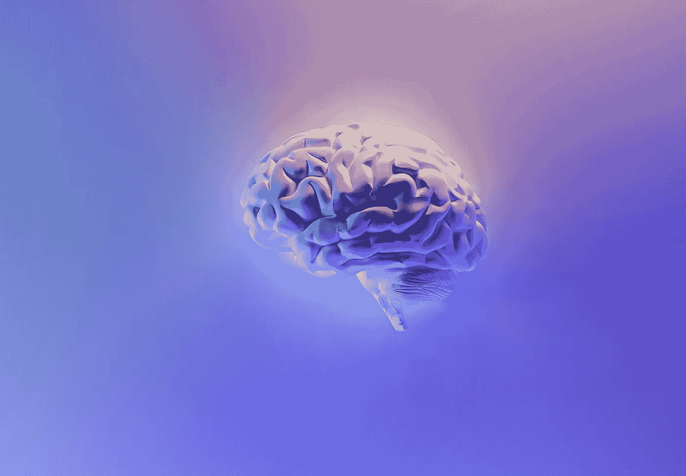

# 重新思考 LLM 基准：衡量超越训练数据的真正推理能力

> 原文：[`towardsdatascience.com/rethinking-llm-benchmarks-measuring-true-reasoning-beyond-training-data-f3fa82dbf5da?source=collection_archive---------12-----------------------#2024-11-07`](https://towardsdatascience.com/rethinking-llm-benchmarks-measuring-true-reasoning-beyond-training-data-f3fa82dbf5da?source=collection_archive---------12-----------------------#2024-11-07)

## Apple 的新 LLM 基准，GSM-Symbolic

 [Maxime Jabarian](https://medium.com/@maximejabarian?source=post_page---byline--f3fa82dbf5da--------------------------------)

·发表于 [Towards Data Science](https://towardsdatascience.com/?source=post_page---byline--f3fa82dbf5da--------------------------------) ·5 分钟阅读·2024 年 11 月 7 日

--

[来源](https://unsplash.com/fr/photos/plume-de-paon-bleu-et-vert-58Z17lnVS4U)

欢迎来到对大语言模型（LLM）推理能力的探索，我们将讨论一个重要问题：**像 GPT、Llama、Mistral 和 Gemma 这样的模型，是否真的能够推理，还是仅仅是巧妙的模式匹配器？** 随着每一次新版本的发布，我们看到这些模型的基准分数不断提高，常常给人一种它们即将具备真正问题解决能力的印象。但**Apple**发布的一项新研究，*“*[*GSM-Symbolic: Understanding the Limitations of Mathematical Reasoning in Large Language Models*](https://arxiv.org/pdf/2410.05229)*”*提供了一个现实检查——它的发现可能会改变我们对这些能力的看法。

如果您不是会员，[**请点击这里**](https://medium.com/towards-data-science/rethinking-llm-benchmarks-measuring-true-reasoning-beyond-training-data-f3fa82dbf5da?sk=e32ce944b1aee8739895a62e2ae92e98)**.**

作为一名拥有近两年经验的 LLM 工程师，我将分享我对这个话题的看法，包括为什么 LLM 必须超越记忆模式，提供真正的推理能力。我们还将分析 **GSM-Symbolic** 研究中的关键发现，该研究揭示了这些模型在数学推理方面仍然存在的差距。最后，我将思考这对将 LLM 应用到现实世界中的意义，在那里，我们真正需要的是**真正的推理能力**——而不仅仅是看起来很出色的回答。

# 为什么 LLM 推理很重要？
