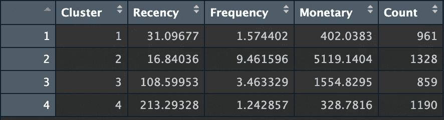

# RFM 细分：释放客户洞察

> 原文：[`towardsdatascience.com/rfm-segmentation-unleashing-customer-insights-da58deae4eb9?source=collection_archive---------3-----------------------#2024-07-02`](https://towardsdatascience.com/rfm-segmentation-unleashing-customer-insights-da58deae4eb9?source=collection_archive---------3-----------------------#2024-07-02)

## 使用 RFM 细分将客户数据转化为可操作的洞察

[](https://vitorihaldijiran.medium.com/?source=post_page---byline--da58deae4eb9--------------------------------)[](https://towardsdatascience.com/?source=post_page---byline--da58deae4eb9--------------------------------) [Vito Rihaldijiran](https://vitorihaldijiran.medium.com/?source=post_page---byline--da58deae4eb9--------------------------------)

·发表于[Towards Data Science](https://towardsdatascience.com/?source=post_page---byline--da58deae4eb9--------------------------------) ·阅读时间 8 分钟·2024 年 7 月 2 日

--


封面图片由作者在 DALL-E 中生成

# 第一部分：RFM 细分

当我们谈到客户细分时，方法各不相同。其实，这取决于我们的目标，但客户细分的主要目的是**根据客户的相似性将其分到不同的群体中**。在实际应用中，这种方法将帮助企业根据细分信息，针对市场细分制定量身定制的营销策略。

RFM 细分是客户细分的一个例子。**RFM 代表最近购买、购买频率**和**货币价值**。由于其简洁而强大的方法，这种技术在商业领域中广泛应用。根据其缩写，我们可以定义 RFM 中的每个指标如下：

+   **最近购买 (R)**：客户最后一次购买是什么时候？最近购买过的客户更倾向于再次购买，而那些有一段时间没有购买的客户则不太可能再购买。

+   **频率 (F)**：客户购买的频率是多少？购买频率较高的客户被认为更加忠诚和有价值。

+   **货币价值 (M)**：客户花费了多少钱？我们看重花费更多钱的客户，因为他们对我们的业务更有价值。

RFM 细分的工作流程相对简单。首先，我们收集客户在选定期间内的交易数据。请确保我们已知道客户何时交易，客户在每笔交易中购买了多少数量的特定产品，以及客户花费了多少钱。之后，我们将进行评分。我们有许多可用的阈值可以考虑，但不如我们选择一个 1 到 5 的评分范围来评估每个指标——其中 1 代表最低分，5 代表最高分。在最后一步中，我们将三个评分结合起来，创建客户细分。例如，拥有最高 RFM 分数（在最近度、频率和货币值方面均为 5）的客户被视为忠诚客户，而 RFM 分数最低的客户（在最近度、频率和货币值方面均为 1）则被视为流失客户。

在文章的后续部分，我们将利用一种流行的无监督学习技术**K-Means**进行 RFM 细分。

# 第二部分：实际示例

在这个实际示例中，我们无需收集数据，因为我们已经拥有数据集。我们将使用来自[UCI 机器学习库](https://archive.ics.uci.edu/)的**在线零售 II 数据集**。该数据集采用**CC BY 4.0** 许可，并且可以用于商业用途。您可以通过此[链接](https://archive.ics.uci.edu/dataset/502/online+retail+ii)免费访问数据集。


图 1：作者提供的在线零售 II 数据集

数据集包含了关于客户在在线零售业务中交易的所有信息，例如**发票日期**、**数量**和**价格**。数据集中有两个文件，但在本示例中我们将使用**“2010-2011 年”**版本。现在，让我们开始编写代码。

**步骤 1：数据准备**

第一步是进行数据准备。我们按照以下步骤进行：

```py
# Load libraries
library(readxl) # To read excel files in R
library(dplyr) # For data manipulation purpose
library(lubridate) # To work with dates and times
library(tidyr) # For data manipulation (use in drop_na)
library(cluster) # For K-Means clustering
library(factoextra) # For data visualization in the context of clustering
library(ggplot2) # For data visualization

# Load the data
data <- read_excel("online_retail_II.xlsx", sheet = "Year 2010-2011")

# Remove missing Customer IDs
data <- data %>% drop_na(`Customer ID`)

# Remove negative or zero quantities and prices
data <- data %>% filter(Quantity > 0, Price > 0)

# Calculate the Monetary value
data <- data %>% mutate(TotalPrice = Quantity * Price)

# Define the reference date for Recency calculation
reference_date <- as.Date("2011-12-09")
```

数据准备过程至关重要，因为细分将参考我们在此步骤中处理的数据。在加载库和数据后，我们执行以下步骤：

+   **去除缺失的客户 ID：** 确保每笔交易都有有效的客户 ID 对于准确的客户细分至关重要。

+   **去除负数或零数量和价格：** 数量或价格为负数或零在 RFM 分析中没有意义，因为它们可能表示退货或错误。

+   **计算货币价值：** 我们通过将数量和价格相乘来计算货币价值。稍后我们将对指标进行分组，其中一项按客户 ID 以货币值表示。

+   **定义参考日期：** 这对于确定最近度值非常重要。检查数据集后，我们知道“2011-12-09”是数据集中最接近的日期，因此将其设为参考日期。参考日期用于计算自每个客户上次交易以来经过了多少天。

经过此步骤后，数据将如下所示：


图 2：作者绘制的数据准备后的数据集

**步骤 2：计算并缩放 RFM 指标**

在此步骤中，我们将在聚类部分之前计算并缩放每个指标。我们按如下方式进行：

```py
# Calculate RFM metrics
rfm <- data %>%
  group_by(`Customer ID`) %>%
  summarise(
    Recency = as.numeric(reference_date - max(as.Date(InvoiceDate))),
    Frequency = n_distinct(Invoice),
    Monetary = sum(TotalPrice)
  )

# Assign scores from 1 to 5 for each RFM metric
rfm <- rfm %>%
  mutate(
    R_Score = ntile(Recency, 5),
    F_Score = ntile(Frequency, 5),
    M_Score = ntile(Monetary, 5)
  )

# Scale the RFM scores
rfm_scaled <- rfm %>%
  select(R_Score, F_Score, M_Score) %>%
  scale()
```

我们将此步骤分为三部分：

+   **计算 RFM 指标：** 我们创建了一个新的数据集，称为**RFM**。我们首先通过 CustomerID 进行分组，这样每个客户的后续计算都是单独进行的。然后，我们计算每个指标。我们通过将参考日期与每个客户的最新交易日期相减来计算**最近性（Recency）**，通过计算每个客户唯一发票的数量来计算**频率（Frequency）**，并通过对每个客户所有交易的总价进行求和来计算**金额（Monetary）**。

+   **分配 1 到 5 的分数：** 评分有助于将客户按 RFM 从高到低分类，其中 5 为最高，1 为最低。

+   **缩放分数：** 然后，我们对每个指标的分数进行缩放。此缩放确保每个 RFM 分数对聚类过程的贡献相等，避免由于不同范围或单位而导致某一指标的主导地位。

在完成此步骤后，RFM 数据集中的结果将如下所示：


图 3：作者绘制的 RFM 打分

缩放后的数据集将如下所示：


图 4：作者绘制的缩放后的 RFM 数据集

**步骤 3：K-Means 聚类**

现在我们来到了最后一步——K-Means 聚类。我们通过以下方式进行：

```py
# Determine the optimal number of clusters using the Elbow method
fviz_nbclust(rfm_scaled, kmeans, method = "wss")

# Perform K-means clustering
set.seed(123)
kmeans_result <- kmeans(rfm_scaled, centers = 4, nstart = 25)

# Add cluster assignment to the original RFM data
rfm <- rfm %>% mutate(Cluster = kmeans_result$cluster)

# Visualize the clusters
fviz_cluster(kmeans_result, data = rfm_scaled, 
             geom = "point",
             ellipse.type = "convex",
             palette = "jco",
             ggtheme = theme_minimal(),
             main = "Online Retail RFM Segmentation",
             pointsize = 3) +
  theme(
    plot.title = element_text(size = 15, face = "bold"),
    axis.title.x = element_blank(),  
    axis.title.y = element_blank(),  
    axis.text = element_blank(),     
    axis.ticks = element_blank(),    
    legend.title = element_text(size = 12, face = "bold"),
    legend.text = element_text(size = 10)
  )
```

此步骤的第一部分是确定**使用肘部法则的最佳聚类数**。该方法是**wss**（即“聚类内平方和”），用于衡量聚类的紧凑性。该方法通过选择 wss 开始快速减少的点来确定聚类数，并形成一个“肘部”。肘部在**4**处减少。


图 5：作者绘制的肘部法则实现

下一部分是进行聚类。我们指定 4 为聚类数，25 为初始聚类中心的随机集，并根据最低的聚类内平方和选择最佳的聚类中心。然后，将其添加到**RFM**数据集中。聚类的可视化如下所示：


图 6：作者绘制的聚类可视化

请注意，图中聚类的大小与每个聚类中的客户数量没有直接关系。可视化显示的是每个聚类中数据点的分布，基于的是缩放后的 RFM 分数（R_Score, F_Score, M_Score），而不是客户的数量。

# 第三部分：总结

运行此代码后，RFM 分段的总结如下：

```py
# Summary of each cluster
rfm_summary <- rfm %>%
  group_by(Cluster) %>%
  summarise(
    Recency = mean(Recency),
    Frequency = mean(Frequency),
    Monetary = mean(Monetary),
    Count = n()
  )
```



图 7：作者绘制的 RFM 分段总结

从总结中，我们可以从每个集群中生成见解。建议会有很大的不同。然而，如果我是一个在线零售业务的数据科学家，我会想到以下几点：

+   **集群 1：** 他们最近刚刚购买了商品——通常是在一个月左右前——表明他们近期有参与。这一客户群体的特点是购买不频繁，总消费金额相对较小，平均每人购买 1 至 2 次。基于这些发现实施客户保持活动可能会非常有效。考虑到他们最近的参与，可以采取跟进邮件或个性化优惠的忠诚度计划等策略，鼓励重复购买。这为我们提供了一个机会，建议他们购买与之前商品互补的其他产品，从而提高该组客户的平均订单金额和整体消费。

+   **集群 2：** 该组客户大约在两周前刚刚完成购买，并且展现出频繁的购买习惯和显著的消费金额。被视为顶级客户，值得 VIP 待遇：优质的客户服务、专享优惠和提前体验新商品的机会。利用他们的满意度，我们可以提供带有奖金和折扣的推荐计划，鼓励他们向家人和朋友推荐，从而可能扩大我们的客户群并增加整体销售额。

+   **集群 3：** 该细分群体的客户在过去三个月内一直不活跃，尽管他们的购买频率和金额属于中等水平。为了重新吸引这些客户，我们应考虑推出重激活活动。发送带有特别折扣的挽回邮件，或者展示新到商品，可能会吸引他们回归。此外，收集反馈以揭示他们近期未购买的原因，并解决他们可能存在的问题或担忧，可以显著提升他们未来的购物体验，并重新点燃他们的兴趣。

+   **集群 4：** 该组客户的购买时间最长为七个月，表明存在较长的沉默期。他们的购买频率和金额最低，容易流失。在这种情况下，必须实施专门针对沉默客户的策略。发送重要的基于优惠的重激活邮件或个性化激励通常能有效促使这些客户回归。此外，进行退出调查有助于识别他们不活跃的原因，从而优化产品和服务，更好地满足客户需求并重新激发他们的兴趣。

恭喜！你已经学会了如何使用 K-Means 进行 RFM 细分，现在轮到你用自己的数据集进行相同的操作了。
