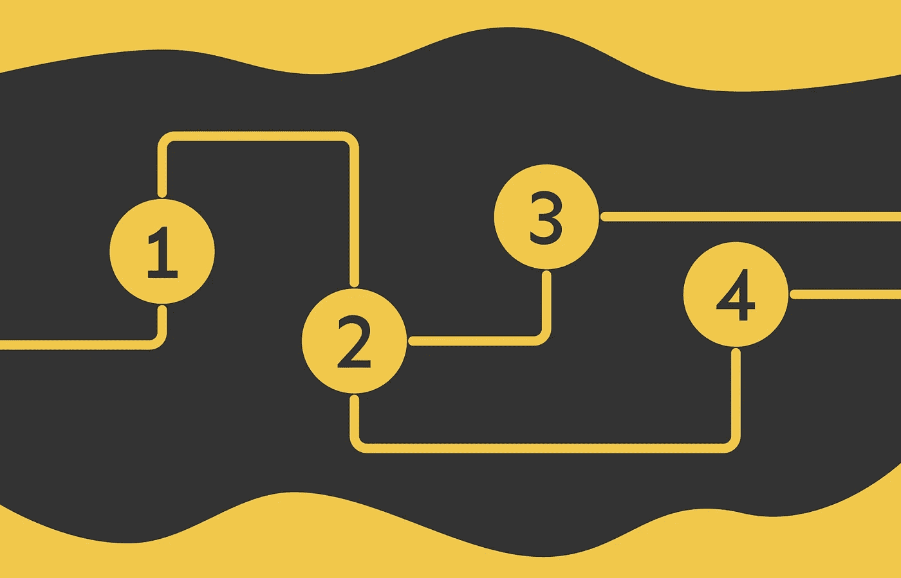

# 成为数据科学家的路线图，第一部分：数学

> 原文：[`towardsdatascience.com/roadmap-to-becoming-a-data-scientist-part-1-maths-2dc9beb69b27?source=collection_archive---------1-----------------------#2024-11-27`](https://towardsdatascience.com/roadmap-to-becoming-a-data-scientist-part-1-maths-2dc9beb69b27?source=collection_archive---------1-----------------------#2024-11-27)

## **识别有志成为数据科学家的基础数学技能**

 [Vyacheslav Efimov](https://medium.com/@slavahead?source=post_page---byline--2dc9beb69b27--------------------------------)

·发布于[Towards Data Science](https://towardsdatascience.com/?source=post_page---byline--2dc9beb69b27--------------------------------) ·11 分钟阅读·2024 年 11 月 27 日

--

# 介绍

数据科学无疑是当今最迷人的领域之一。随着大约十年前机器学习的重大突破，数据科学在科技圈内的流行度急剧上升。每年，我们都见证着越来越强大的工具的诞生，这些工具曾经看似不可思议。像*Transformer 架构*、*ChatGPT*、*检索增强生成（RAG）*框架，以及最先进的*计算机视觉模型*——包括*GANs*——这些创新对我们的世界产生了深远的影响。

然而，面对工具的多样性和围绕人工智能的持续热潮，初学者可能会感到不知所措——尤其是当你试图确定在数据科学领域的职业生涯中，应该优先掌握哪些技能。此外，这一领域要求非常高，需要极大的专注和毅力。

在本文中，我将呈现一份详细的路线图，概述在开始数据科学之旅时需要关注的数学领域。

> 本文将重点讨论进入数据科学领域所需的数学技能。是否选择这条道路作为你的职业发展方向，将取决于你的背景及其他因素……
