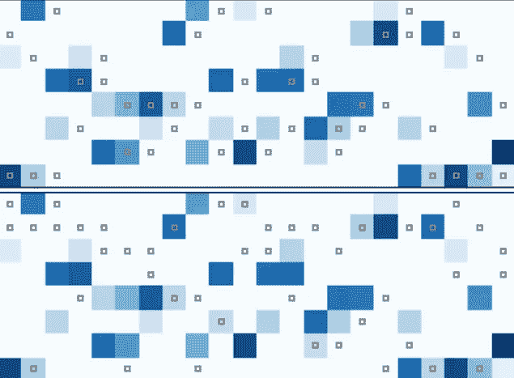

# 在消费级硬件上运行 Mixtral-8x7B 并进行专家卸载

> 原文：[`towardsdatascience.com/run-mixtral-8x7b-on-consumer-hardware-with-expert-offloading-bd3ada394688?source=collection_archive---------1-----------------------#2024-01-11`](https://towardsdatascience.com/run-mixtral-8x7b-on-consumer-hardware-with-expert-offloading-bd3ada394688?source=collection_archive---------1-----------------------#2024-01-11)

## 寻找内存使用和推理速度之间的最佳平衡

 [Benjamin Marie](https://medium.com/@bnjmn_marie?source=post_page---byline--bd3ada394688--------------------------------)

·发表于[Towards Data Science](https://towardsdatascience.com/?source=post_page---byline--bd3ada394688--------------------------------) ·阅读时长 8 分钟·2024 年 1 月 11 日

--

Mixtral-8x7B 专家子网络的激活模式 — [来源](https://arxiv.org/pdf/2312.17238.pdf) (CC-BY)

虽然 Mixtral-8x7B 是最优秀的开源大型语言模型（LLM）之一，但它也是一个庞大的模型，拥有 46.7 亿个参数。即使将模型量化到 4 位，它也无法完全加载到消费级 GPU 中（例如，具有 24GB VRAM 的 RTX 3090 也不足够）。

Mixtral-8x7B 是一个[专家混合模型（MoE）](https://kaitchup.substack.com/p/mixtral-8x7b-understanding-and-running)，由 8 个每个拥有 60 亿参数的专家子网络组成。

由于在解码过程中只有 8 个专家中的 2 个是有效的，剩余的 6 个专家可以被移动或*卸载*到另一个设备，例如 CPU RAM，以释放一些 GPU VRAM。在实际操作中，这种卸载是复杂的。

选择激活哪个专家是一个在推理时针对每个输入标记和每一层模型所做的决定。像[Accelerate 的 device_map](https://kaitchup.substack.com/p/device-map-avoid-out-of-memory-errors-when-running-large-language-models-af7de5076f9d)那样简单地将部分模型转移到 CPU RAM，会在 CPU 和 GPU 之间产生通信瓶颈。

[Mixtral-offloading](https://github.com/dvmazur/mixtral-offloading)（MIT 许可）是一个提出更高效解决方案的项目，旨在减少 VRAM 的消耗，同时保持合理的推理速度。
