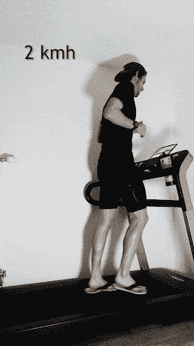

# 使用计算机视觉评估跑步效率：与埃利乌德·基普乔格的对比分析

> 原文：[`towardsdatascience.com/running-efficiency-with-computer-vision-a-comparative-analysis-with-eliud-kipchoge-736eb80c574f?source=collection_archive---------3-----------------------#2024-03-28`](https://towardsdatascience.com/running-efficiency-with-computer-vision-a-comparative-analysis-with-eliud-kipchoge-736eb80c574f?source=collection_archive---------3-----------------------#2024-03-28)

## **如何通过计算机视觉提高你的跑步效率？**

 [Dr. Christoph Mittendorf](https://medium.com/@ch.mittendorf?source=post_page---byline--736eb80c574f--------------------------------)

·发表于[Towards Data Science](https://towardsdatascience.com/?source=post_page---byline--736eb80c574f--------------------------------) ·14 分钟阅读·2024 年 3 月 28 日

--

图片来自 Unsplash / Nicolas Hoizey

**简短总结**：我进行了一个实验——通过不同类型的鞋子来实现***埃利乌德·基普乔格的跑步效率***。令人惊讶的是——事实证明，**人字拖不适合跑步**，而**碳纤维跑鞋简直太棒了！**

作者图片：穿人字拖跑步

**摘要**

跑步效率——即以最小的能量消耗覆盖指定的距离——是运动表现中的一个关键因素。

传统的跑步效率评估方法主要依赖于主观评估或侵入性的生理测量——因此，往往限制了其适用性和客观性。本实验引入了一种使用人工智能评估跑步效率的现代方法。换句话说，我正在使用计算机视觉（CV）技术来评估跑步效率。我采用了 TensorFlow 中的 MoveNet 模型，从埃利乌德·基普乔格等专业跑者的视频中提取了 17 个关键点。埃利乌德是马拉松跑步的**伟大运动员（GOAT）**，以其卓越的效率闻名。通过分析这些关键点，可以得出…
