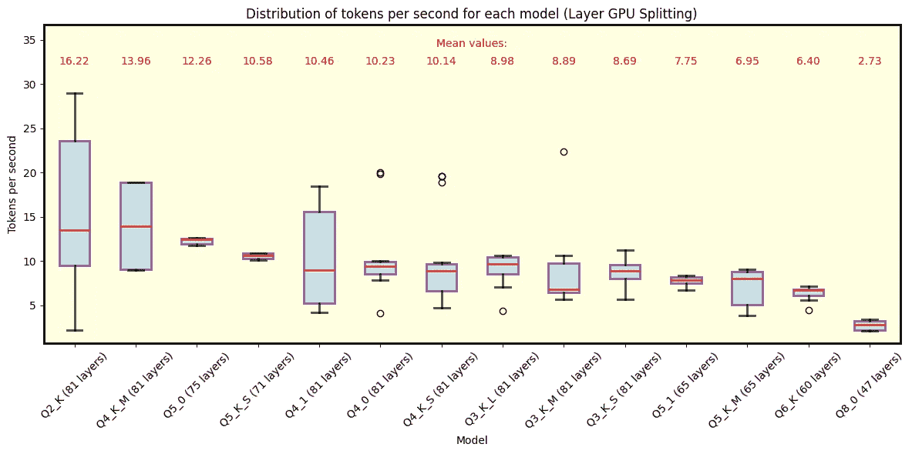
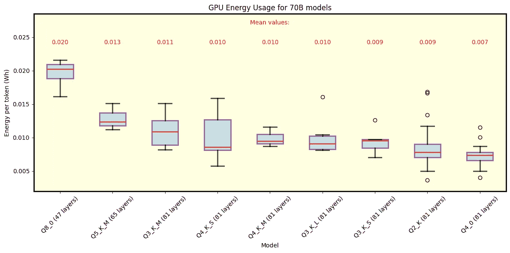
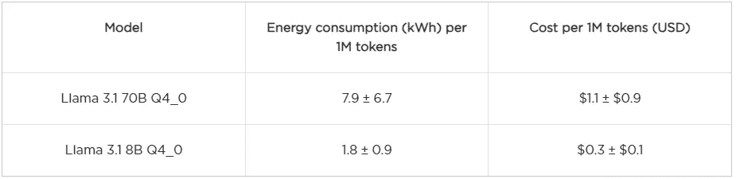

# 私人运行大型语言模型

> 原文：[`towardsdatascience.com/running-large-language-models-privately-a-comparison-of-frameworks-models-and-costs-ac33cfe3a462?source=collection_archive---------0-----------------------#2024-10-30`](https://towardsdatascience.com/running-large-language-models-privately-a-comparison-of-frameworks-models-and-costs-ac33cfe3a462?source=collection_archive---------0-----------------------#2024-10-30)

## 框架、模型与成本比较

 [Robert Corwin](https://medium.com/@robert.corwin?source=post_page---byline--ac33cfe3a462--------------------------------)

·发布于[Towards Data Science](https://towardsdatascience.com/?source=post_page---byline--ac33cfe3a462--------------------------------) ·15 分钟阅读·2024 年 10 月 30 日

--

Robert Corwin，首席执行官，奥斯汀人工智能公司

David Davalos，机器学习工程师，奥斯汀人工智能公司

2024 年 10 月 24 日

*大型语言模型（LLM）迅速改变了技术格局，但安全问题依然存在，尤其是将私人数据发送给外部第三方。在这篇博客文章中，我们深入探讨了将 Llama 模型本地和私人部署的选项，也就是说，在个人计算机上运行。我们成功在本地运行了 Llama 3.1，并调查了不同版本和框架下的速度、功耗以及整体性能等关键方面。无论你是技术专家，还是仅仅对相关内容感到好奇，你都会从本地 LLM 部署中获得一些见解。对于快速概览，不懂技术的读者可以跳过详细内容，查看总结表格，而具备技术背景的读者可能会更喜欢深入了解具体工具及其性能。*

*除非另有说明，否则所有图片均由作者提供。作者和奥斯汀人工智能公司（其雇主）与本文提到的任何工具或使用的工具没有任何关系。*

# 关键点

**运行 LLM：** LLM 模型可以通过社区中广泛使用的工具和框架下载并在私人服务器上运行。虽然运行最强大的模型需要相当昂贵的硬件，但较小的模型可以在笔记本电脑或台式计算机上运行。

**隐私与可定制性：** 在私人服务器上运行 LLM 可以提供更高的隐私保护，并对模型设置和使用政策拥有更大的控制权。

**模型大小：** 开源 Llama 模型有多种尺寸。例如，Llama 3.1 提供 8 亿、70 亿和 405 亿参数版本。 “参数”大致定义为网络中某个节点上的权重。更多的参数会增加模型性能，但也会增加内存和磁盘的占用。

**量化：** 量化通过将权重“舍入”到更少的有效数字，从而节省内存和磁盘空间——这以牺牲精度为代价。鉴于 LLM 中参数的庞大数量，量化对于减少内存使用和加速执行非常有价值。

**成本：** 本地实现，通过参考 GPU 能耗，展示了与基于云的解决方案相比的成本效益。

# 隐私和可靠性作为动机

在我们之前的[文章](https://www.austinai.io/blog/the-revolutions-behind-chatgpt-and-llms)中，我们探讨了 LLM 背后的关键概念，以及如何利用**Langchain**等框架创建定制化的聊天机器人或工具（见**图 1**）。在这样的方案中，虽然可以通过使用合成数据或混淆来保护数据，但我们仍然需要将数据发送给第三方，而且无法控制模型的任何变化、政策或甚至可用性。一个解决方案是直接在私有服务器上运行 LLM（见**图 2**）。这种方式可以确保完全的隐私，并减少对外部服务提供商的依赖。

实现私有化 LLM 时的关注点包括成本、电力消耗和速度。在本次实验中，我们通过改变 1.框架（工具）和 2.量化程度，运行 LLama 3.1，并比较框架的易用性、运行时的速度表现以及电力消耗。理解这些权衡对任何希望在保持数据和资源控制的同时，充分发挥 AI 潜力的人来说都至关重要。

**图 1** 展示一个典型的后端设置示意图，用于聊天机器人或工具，其中 ChatGPT（或类似模型）作为自然语言处理引擎运行。此设置依赖于提示工程来自定义响应。

**图 2** 完全私有的后端配置示意图，所有组件，包括大型语言模型，均托管在安全服务器上，从而确保完全的控制和隐私。

# 量化与 GGUF 文件

在深入探讨我们所探索的工具之前，首先让我们讨论一下量化和*GGUF*格式。

量化是一种通过将权重和偏差从高精度浮动点值转换为低精度表示来减少模型大小的技术。考虑到 LLM 拥有庞大的参数量，这种方法对它们特别有利。例如，Llama 3.1 的最大版本包含惊人的 4050 亿个参数。量化可以显著减少内存使用和执行时间，使这些模型在各种设备上运行时更高效。有关量化类型的深入解释和命名法，请查看这个[很好的介绍](https://huggingface.co/docs/hub/en/gguf)。概念性概述也可以在[这里](https://www.maartengrootendorst.com/blog/quantization/)找到。

[*GGUF*格式](https://github.com/ggerganov/ggml/blob/master/docs/gguf.md)用于存储 LLM 模型，并且最近因分发和运行量化模型而受到广泛欢迎。它经过优化，能够快速加载、读取和保存。与仅存储张量的格式不同，GGUF 还以标准化方式存储模型元数据，使得框架更容易支持此格式，甚至将其作为标准格式采用。

# 分析的工具和模型

我们探索了四个工具来本地运行 Llama 模型：

+   [HuggingFace 的 transformers 库](https://huggingface.co/docs/transformers/en/index)和[Hub](https://huggingface.co/docs/hub/en/index)

+   [vLLM](https://docs.vllm.ai/en/latest/)

+   [llama.cpp](https://github.com/ggerganov/llama.cpp)

+   [Ollama](https://ollama.com/)

我们的主要关注点是 llama.cpp 和 Ollama，因为这些工具允许我们直接、迅速且高效地部署模型。具体来说，我们探索了它们的速度、能源成本和整体性能。对于模型，我们主要分析了量化后的 8B 和 70B 版本的 Llama 3.1，因为它们在合理的时间范围内运行。

# 初步印象与安装

## HuggingFace

HuggingFace 的 transformers 库和 Hub 在社区中广为人知并被广泛使用。它们提供了多种模型和工具，使其成为许多开发者的热门选择。一旦环境配置好并安装了 Python，它的安装通常不会导致大问题。最终，HuggingFace 的最大优势在于它的在线 Hub，允许轻松访问来自许多不同提供者的量化模型。另一方面，直接使用 transformers 库加载模型，尤其是量化模型，还是相当棘手的。默认情况下，该库似乎会直接对模型进行反量化，占用了大量的 RAM，导致在本地服务器上运行时变得不可行。

尽管 Hugging Face [支持 4 位和 8 位](https://huggingface.co/docs/transformers/en/main_classes/quantization)量化与去量化，并且使用 [*bitsandbytes*](https://github.com/bitsandbytes-foundation/bitsandbytes)，我们的初步印象是，仍然需要进一步优化。高效推理可能并不是它的主要重点。尽管如此，Hugging Face 提供了出色的文档、庞大的社区以及强大的模型训练框架。

## vLLM

类似于 Hugging Face，vLLM 可以在正确配置的 Python 环境中轻松安装。然而，对 GGUF 文件的支持仍然处于高度实验阶段。尽管我们能够快速设置运行 8B 模型，但超出这个规模的扩展却证明是具有挑战性的，尽管有着出色的文档支持。

总体而言，我们认为 vLLM 具有很大的潜力。然而，我们最终选择了 llama.cpp 和 Ollama 框架，因为它们在兼容性和效率上更为直接。公平地说，这里本可以进行更深入的调查，但考虑到我们在其他库中取得的即时成功，我们选择专注于它们。

## Ollama

我们认为 Ollama 非常棒。我们的初步印象是，它是一个适合用户本地推理 Llama 模型的工具，具有即插即用的易用性。[为 Mac 和 Linux 用户安装它](https://ollama.com/download)非常简单，Windows 版本目前处于预览阶段。Ollama 会自动检测硬件，并在 CPU 和 GPU 之间无缝管理模型卸载。它还具备自己的模型库，自动下载模型并支持 GGUF 文件。尽管其速度略逊于 llama.cpp，但即便在仅配有 CPU 的系统和笔记本电脑上也能良好运行。

快速入门：安装后，运行 `ollama run llama3.1:latest` 将直接从命令行加载最新的 8B 模型进行对话模式。

一个缺点是，定制模型在某些情况下可能有些不切实际，尤其是在高级开发中。例如，即使是调整温度，也需要创建一个新的聊天机器人实例，而这个实例又需要加载一个已安装的模型。虽然这只是一个小小的不便，但它确实有助于在一个文件中设置定制化的聊天机器人 —— 包括其他参数和角色。总体而言，我们认为 Ollama 是一个有效的本地工具，模仿了云服务的一些关键功能。

值得注意的是，Ollama 作为服务运行，至少在 Linux 系统上，它提供了方便且简单的命令来监控当前运行的模型以及它们被卸载到何处，并且可以在需要时立即停止这些模型。社区面临的一个挑战是配置某些方面，例如模型存储位置，这需要具备一定的 Linux 系统技术知识。虽然这对最终用户可能不会构成问题，但它可能会稍微影响该工具在高级开发中的实用性。

## llama.cpp

在这次分析中，llama.cpp 成为了我们最喜爱的工具。正如它的 [仓库](https://github.com/ggerganov/llama.cpp/blob/master/README.md) 中所述，它旨在通过最小的配置运行大规模语言模型，并提供领先的性能。像 Ollama 一样，它支持在 CPU 和 GPU 之间卸载模型，尽管这不是开箱即用的功能。要启用 GPU 支持，您必须使用适当的标志进行编译——具体来说是 `GGML_CUDA=on`。我们建议使用最新版本的 CUDA 工具包，因为旧版本可能不兼容。

该工具可以通过从仓库拉取并编译作为独立工具安装，这为运行模型提供了一个方便的命令行客户端。例如，您可以执行 `llama-cli -p 'you are a useful assistant' -m Meta-Llama-3-8B-Instruct.Q8_0.gguf -cnv`。这里，最后一个标志可以直接从命令行启用对话模式。llama-cli 提供了各种定制选项，例如调整上下文大小、重复惩罚和温度，它还支持 GPU 卸载选项。

类似于 Ollama，llama.cpp 也提供了 Python 绑定，可以通过 `pip install llama-cpp-python` 安装。这个 Python 库允许进行显著的定制，使得开发者可以轻松地根据特定客户需求调整模型。然而，正如独立版本一样，Python 绑定也需要使用适当的标志进行编译，以启用 GPU 支持。

一个小缺点是该工具尚不支持自动的 CPU-GPU 卸载。相反，用户需要手动指定将多少层卸载到 GPU 上，剩余的部分由 CPU 处理。虽然这需要一些微调，但这一步骤直接且易于管理。

对于拥有多个 GPU 的环境（如我们所使用的），llama.cpp 提供了两种分割模式：*行模式*和*层模式*。在行模式下，一个 GPU 处理小型张量和中间结果，而在层模式下，层被划分到多个 GPU 上。在我们的测试中，这两种模式提供了相似的性能（请参见下面的分析）。

# 我们的分析

► *从现在起，结果仅涉及 llama.cpp 和 Ollama。*

我们使用 Ollama 和 llama.cpp 对 70B 和 8B Llama 3.1 模型的速度和功耗进行了分析。具体来说，我们研究了在 [Quant Factory](https://huggingface.co/collections/QuantFactory/llama-31-66a36c08cd3aa07108e10dfe) 中提供的各种量化方式下，每个模型每个 token 的速度和功耗。

为了进行此分析，我们开发了一个小型应用程序，在选择工具后评估模型。在推理过程中，我们记录了诸如速度（每秒令牌数）、生成的总令牌数、温度、GPU 上加载的层数以及响应的质量评分等指标。此外，我们还测量了模型执行期间 GPU 的功耗。使用了一个脚本，通过`nvidia-smi`在每生成一个令牌后立即监测 GPU 的功耗。推理结束后，我们根据这些读数计算了平均功耗。由于我们专注于能够完全适应 GPU 内存的模型，因此只测量了 GPU 的功耗。

此外，为了确保不同输出大小的情况，实验使用了多种提示语，因此数据涵盖了各种场景。

# 硬件和软件配置

我们使用了一台相当不错的服务器，具备以下特点：

+   CPU: AMD Ryzen Threadripper PRO 7965WX 24 核心 @ 48x 5.362GHz。

+   GPU: **2x** NVIDIA GeForce RTX 4090。

+   RAM: 515276MiB-

+   操作系统：Pop 22.04 jammy。

+   内核：x86_64 Linux 6.9.3–76060903-generic。

这套配置的零售成本大约为 15,000 美元。我们选择了这样的配置，因为它是一台不错的服务器，虽然无法与配备 8 个以上 GPU 的专用高端 AI 服务器相比，但它仍然非常实用，并且能够代表我们许多客户可能选择的配置。我们发现许多客户在一开始不愿意投资高端服务器，而这套配置在成本和性能之间达到了良好的折衷。

# 速度

首先让我们关注速度。下面，我们展示了几个[箱形图](https://en.wikipedia.org/wiki/Box_plot)，这些箱形图展示了不同量化方式下的速度数据。每个模型的名称以其量化级别开头；例如，“Q4”表示 4 位量化。再次强调，较低的量化级别会更多地进行舍入，减小模型的大小和质量，但提高速度。

► *技术问题 1（箱形图的提醒）：箱形图展示了中位数、第一个和第三个四分位数，以及最小值和最大值。图中的胡须延伸到不被视为离群值的最极端数据点，而离群值会单独绘制。离群值被定义为落在 Q1 − 1.5 × IQR 和 Q3 + 1.5 × IQR 之外的数据点，其中 Q1 和 Q3 分别表示第一个和第三个四分位数。四分位距（IQR）计算公式为 IQR = Q3 − Q1。*

## llama.cpp

以下是针对 llama.cpp 的图表。**图 3**显示了在[QuantFactory](https://huggingface.co/QuantFactory/Meta-Llama-3-70B-Instruct-GGUF-v2)中可用的所有 70B 参数的 Llama 3.1 模型的结果，而**图 4**则展示了一些 8B 参数的模型，您可以在[这里](https://huggingface.co/QuantFactory/Meta-Llama-3-8B-Instruct-GGUF-v2)找到这些模型。70B 模型可以将最多 81 层卸载到 GPU 上，而 8B 模型最多可卸载 33 层。对于 70B，Q5 量化及更细的量化方式无法完全卸载所有层。每种量化类型后面括号内包含了卸载到 GPU 上的层数。如预期，粗量化类型提供了最佳的速度性能。由于行分割模式的表现相似，这里我们专注于层分割模式。

**图 3** 在 llama.cpp 中使用层分割模式运行的 Llama 3.1 模型，参数为 70B。如预期，粗量化提供了最佳的速度。卸载到 GPU 上的层数在每种量化类型旁边的括号中显示。使用 Q5 及更细量化的模型无法完全适配 VRAM。

**图 4** 在 llama.cpp 中使用层分割模式运行的 Llama 3.1 模型，参数为 8B。在这种情况下，所有量化类型下模型均能适应 GPU 内存，粗量化类型提供了最快的速度。请注意，高速事件为离群值，而总体趋势则在 Q2_K 的情况下约为每秒 20 个 token。

## 关键观察

+   在推理过程中，我们观察到了一些高速事件（尤其是在 8B Q2_K 情况下），这时收集数据并理解其分布非常关键，因为这些事件实际上是相当罕见的。

+   如预期，粗量化类型提供了最佳的速度性能。这是因为模型大小被缩减，从而实现了更快的执行速度。

+   关于 70B 模型未能完全适配 VRAM 的结果必须谨慎解读，因为使用 CPU 可能会造成瓶颈。因此，在这些情况下报告的速度可能不是模型性能的最佳表现。

## Ollama

我们对 Ollama 进行了相同的分析。**图 5**显示了 Ollama 自动下载的默认 Llama 3.1 和 3.2 模型的结果。除了 405B 模型外，所有模型都可以适配 GPU 内存。

**图 5** 在 Ollama 下运行的 Llama 3.1 和 3.2 模型。这些是使用 Ollama 时的默认模型。所有 3.1 模型——特别是 405B、70B 和 8B（标记为“latest”）——使用 Q4_0 量化，而 3.2 模型使用 Q8_0（1B）和 Q4_K_M（3B）量化。

## 关键观察

+   我们可以比较 Ollama 和 llama.cpp 中的 70B Q4_0 模型，Ollama 的速度略慢。

+   同样，8B Q4_0 模型在 Ollama 下的运行速度较其在 llama.cpp 中的对应模型慢，且差异更加明显——llama.cpp 平均每秒处理多出约五个 token。

# 已分析框架总结

► 在讨论功耗和租用性之前，让我们总结一下迄今为止分析的框架。

# 功耗与租用性

该分析对于将所有层加载到 GPU 内存中的模型尤为相关，因为我们只测量了两块 RTX 4090 显卡的功耗。然而，需要注意的是，测试中使用的 CPU 具有[TDP 350 W](https://www.techpowerup.com/cpu-specs/ryzen-threadripper-pro-7995wx.c3301)，这提供了其在最大负载下的功耗估计。如果整个模型被加载到 GPU 上，CPU 的功耗可能接近空闲状态。

为了估算每个 token 的能耗，我们使用以下参数：*每秒 token 数*（NT）和*两块 GPU 的功率消耗*（P），单位为瓦特。通过计算 P/NT，我们得到每个 token 的能耗，单位为瓦秒。将其除以 3600，得到每个 token 的能耗，单位为 Wh，这通常是更常用的参考单位。

## llama.cpp

以下是 llama.cpp 的结果。**图 6**展示了 70B 模型的能耗，而**图 7**则侧重于 8B 模型。这些图表展示了每种量化方式的能耗数据，图例中显示了平均值。

**图 6** 在 llama.cpp 下，针对 70B 参数的 Llama 3.1 模型的各种量化方式，每个 token 的能耗。展示了行分割和层分割模式。结果仅适用于将所有 81 层加载到 GPU 内存中的模型。

**图 7** 在 llama.cpp 下，针对 8B 参数的 Llama 3.1 模型的各种量化方式，每个 token 的能耗。展示了行分割和层分割模式。所有模型的平均能耗相似。

## Ollama

我们还分析了 Ollama 的能耗。**图 8**展示了 Llama 3.1 8B（Q4_0 量化）和 Llama 3.2 1B 与 3B（分别为 Q8_0 和 Q4_K_M 量化）的结果。**图 9**展示了 70B 和 405B 模型的单独能耗，二者均采用 Q4_0 量化。

**图 8** 在 Ollama 下，Llama 3.1 8B（Q4_0 量化）和 Llama 3.2 1B 与 3B 模型（分别为 Q8_0 和 Q4_K_M 量化）的每个 token 能耗。

**图 9** Llama 3.1 70B（左）和 Llama 3.1 405B（右）每个 token 的能耗，二者均在 Ollama 下使用 Q4_0 量化。

# 成本总结

我们不会逐个讨论每个模型，而是将重点放在 llama.cpp 和 Ollama 之间可比的模型，以及 llama.cpp 下使用 Q2_K 量化的模型，因为它是这里探索的最粗糙量化方式。为了更好地了解成本，我们在下表中展示了每百万生成 token（1M）的能耗估算和美元成本。该成本是根据德克萨斯州的平均电价计算的，电价为每千瓦时$0.14，具体参考此[来源](https://bkvenergy.com/blog/average-electricity-bill-texas/)。作为参考，当前[GPT-4o 的定价](https://openai.com/api/pricing/)至少为每百万 token $5 USD，而 GPT-o mini 则为每百万 token $0.3 USD。

# llama.cpp

# Ollama

# 关键观察

+   使用 Llama 3.1 70B 模型与 Q4_0 时，llama.cpp 与 Ollama 之间的能耗差异不大。

+   对于 8B 模型，llama.cpp 的能耗高于 Ollama。

+   请注意，这里所展示的成本可以看作是运行模型的“基本成本”的下限。其他成本，如操作、维护、设备成本和利润，并未包含在此分析中。

+   估算结果表明，相较于云服务，在私人服务器上运行 LLM（大型语言模型）可能更具成本效益。特别是，Llama 8B 与 GPT-45o mini 以及 Llama 70B 与 GPT-4o 模型的比较，在合适的情况下似乎是一个潜在的好选择。

► *技术问题 2（成本估算）：* 对于大多数模型，每百万个 token 的能耗估算（及其变异性）通过“中位数 ± 四分位距（IQR）”的方式给出，其中 IQR 代表四分位距。只有对于 Llama 3.1 8B Q4_0 模型，我们采用“均值 ± 标准差（STD）”的方式，其中 STD 代表标准差。这些选择并非随意作出的；除了 Llama 3.1 8B Q4_0 模型外，所有模型都存在异常值，使得中位数和 IQR 在这些情况下是更为稳健的估算器。此外，这些选择还有助于防止成本出现负值。在大多数情况下，当两种方法得出相同的中心趋势时，它们提供的结果非常相似。

# 最终结论

图片来自 Meta AI

对不同模型和工具的速度与功耗分析仅仅是更广泛图景的一部分。我们观察到，轻量级或高度量化的模型通常在可靠性上表现不佳；随着聊天历史的增加或任务变得重复，幻觉现象变得更为频繁。这并不意外——较小的模型无法捕捉到较大模型的复杂性。为了解决这些限制，像重复惩罚和温度调整等设置可以改善输出。另一方面，像 70B 这样的大型模型始终保持强劲的性能，并且幻觉现象极少。然而，由于即便是最大的模型也不完全没有不准确性，负责任和可信赖的使用往往需要将这些模型与额外的工具（如 LangChain 和向量数据库）结合使用。尽管我们在这里没有探索特定任务的表现，但这些整合对于减少幻觉现象和增强模型可靠性至关重要。

总之，将大型语言模型（LLMs）部署在私有服务器上，可以为大型语言模型作为服务（LLMs as a service）提供一个具有成本优势和定制化机会的竞争性替代方案。私有服务器和基于服务的选项各有其优点，在*Austin Ai*，**我们专注于实现符合您需求的解决方案**，无论是利用私有服务器、云服务还是混合方案。
