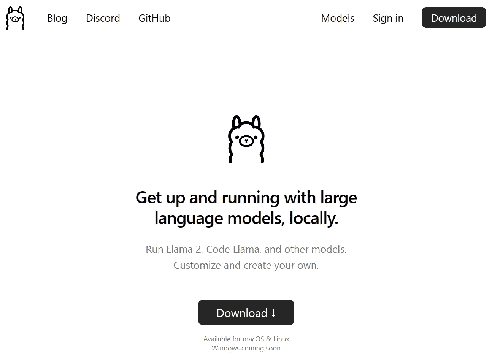
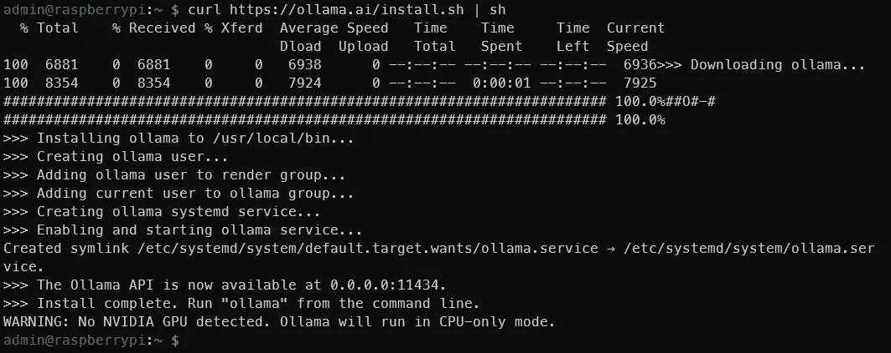
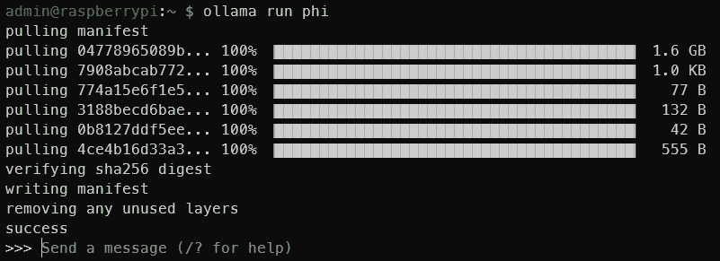
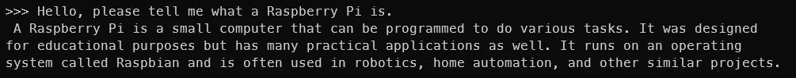
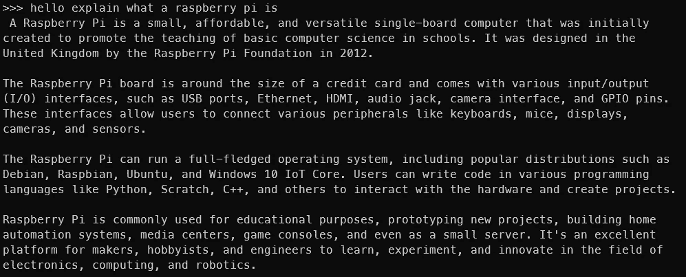
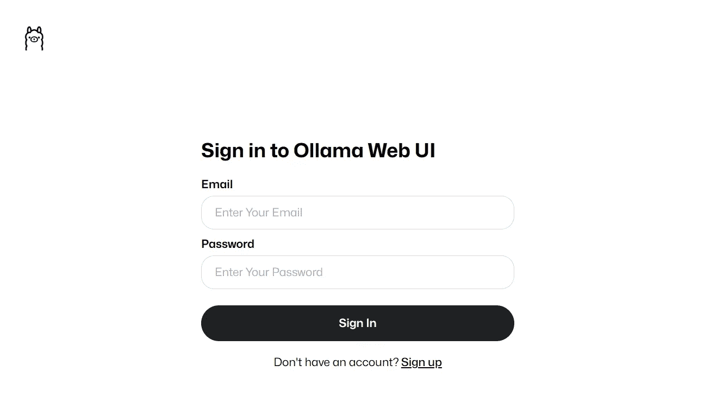
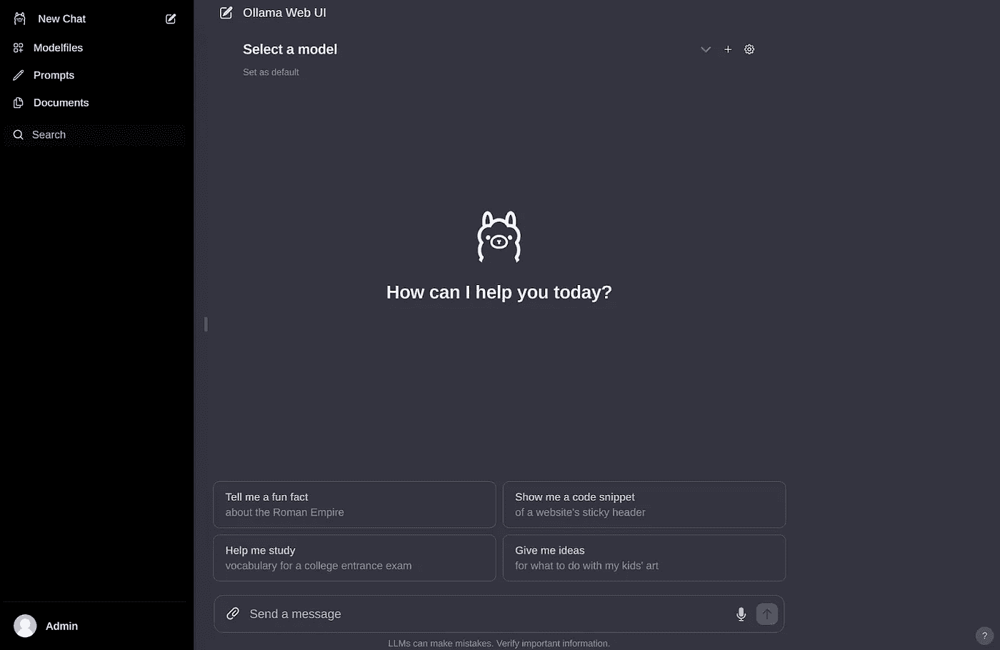
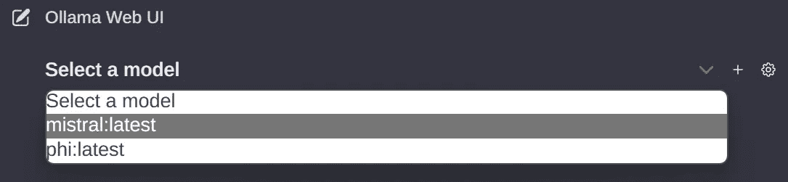
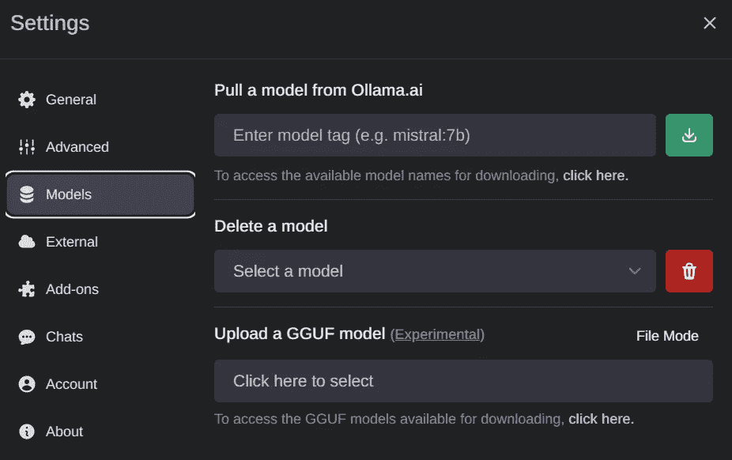
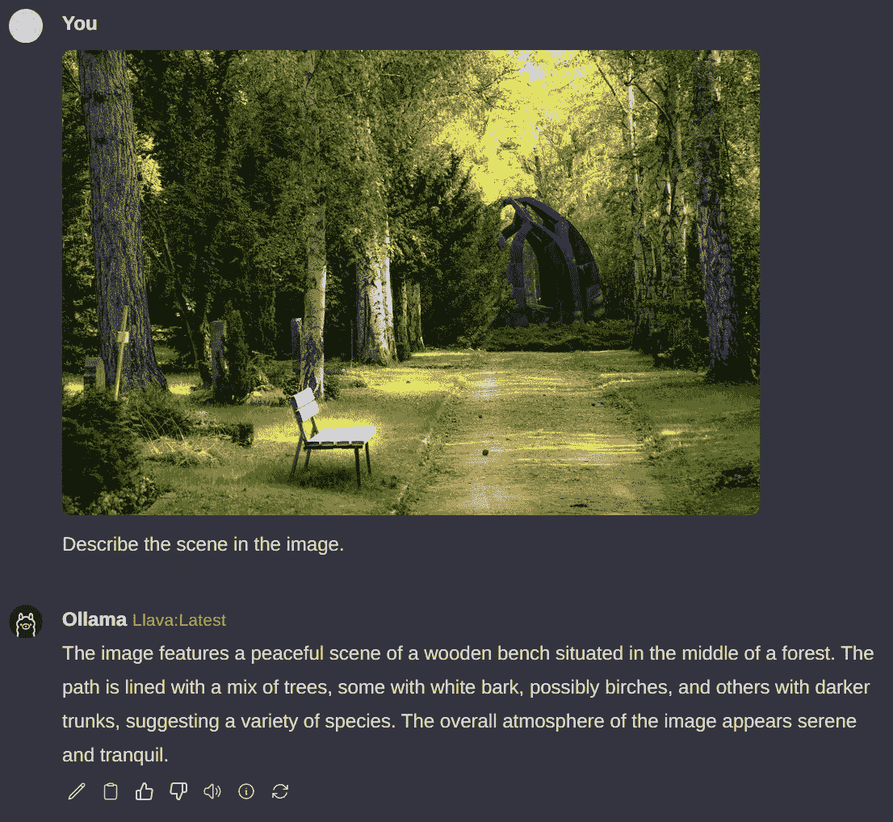

# 在树莓派上运行本地 LLM 和 VLM

> 原文：[`towardsdatascience.com/running-local-llms-and-vlms-on-the-raspberry-pi-57bd0059c41a?source=collection_archive---------0-----------------------#2024-01-14`](https://towardsdatascience.com/running-local-llms-and-vlms-on-the-raspberry-pi-57bd0059c41a?source=collection_archive---------0-----------------------#2024-01-14)

## **在树莓派上使用 Ollama 本地运行 Phi-2、Mistral 和 LLaVA 等模型**

[](https://medium.com/@pyesonekyaw?source=post_page---byline--57bd0059c41a--------------------------------)[](https://towardsdatascience.com/?source=post_page---byline--57bd0059c41a--------------------------------) [Pye Sone Kyaw](https://medium.com/@pyesonekyaw?source=post_page---byline--57bd0059c41a--------------------------------)

·发布于 [Towards Data Science](https://towardsdatascience.com/?source=post_page---byline--57bd0059c41a--------------------------------) ·阅读时长 7 分钟·2024 年 1 月 14 日

--


使用 Ollama 在树莓派上托管 LLM 和 VLM — 来源：作者

有没有想过在自己的设备上运行自己的大语言模型（LLM）或视觉语言模型（VLM）？你可能有过这样的想法，但从零开始设置环境、下载合适的模型权重、以及设备是否能承载模型的疑虑，可能让你有些犹豫。

让我们再进一步。想象一下，在一个不大于信用卡大小的设备上操作你自己的 LLM 或 VLM——一台树莓派。难以想象？一点也不。我是在写这篇文章，所以它绝对是可能的。

## **可能，没错。但你为什么要这么做呢？**

目前，边缘的 LLM 似乎有些不可思议。但这个特定的小众用例应该随着时间的推移而成熟，我们肯定会看到一些很酷的边缘解决方案，通过全本地生成式 AI 解决方案在设备端部署。

这也是关于突破极限，看看什么是可能的。如果在计算能力的极端范围内可以做到，那在树莓派和强大服务器 GPU 之间的任何级别上都可以做到。

传统上，边缘 AI 与计算机视觉密切相关。探索在边缘部署 LLM 和 VLM 为这一新兴领域增添了令人兴奋的维度。

最重要的是，我只是想用我最近购买的树莓派 5 做些有趣的事情。

那么，我们如何在树莓派上实现这一切呢？使用 Ollama！

## **什么是 Ollama？**

[Ollama](https://ollama.ai/)已经成为在个人计算机上运行本地 LLM 的最佳解决方案之一，无需从头开始设置麻烦。只需几个命令，所有内容都能顺利设置。根据我的经验，它在多个设备和模型上都能完美运行，且一切都是自包含的。它甚至暴露了一个用于模型推理的 REST API，因此如果需要，你可以让它在树莓派上运行，并从其他应用程序和设备调用它。



[Ollama 官网](https://ollama.ai/)

还有[Ollama Web UI](https://github.com/ollama-webui/ollama-webui)，这是一款与 Ollama 完美兼容的美丽 AI UI/UX 界面，适合那些对命令行界面感到不安的人。可以将其视为一个本地的 ChatGPT 界面。

这两个开源软件共同提供了我认为是目前最好的本地托管 LLM 体验。

Ollama 和 Ollama Web UI 也支持像 LLaVA 这样的 VLM，这为这种边缘生成 AI 应用场景打开了更多的可能性。

## **技术要求**

你只需要以下几个条件：

+   树莓派 5（或使用 4，速度较慢）——选择 8GB RAM 版本，以便容纳 7B 模型。

+   SD 卡——最小 16GB，尺寸越大可以存储更多模型。已加载适当的操作系统，如 Raspbian Bookworm 或 Ubuntu。

+   一个互联网连接

正如我之前提到的，在树莓派上运行 Ollama 已经接近硬件的极限。理论上，任何比树莓派更强大的设备，只要运行 Linux 发行版并且具有相似的内存容量，都应该能够运行 Ollama 和本文讨论的模型。

## **1\. 安装 Ollama**

为了在树莓派上安装 Ollama，我们将避免使用 Docker 以节省资源。

在终端中运行

```py
curl https://ollama.ai/install.sh | sh
```

运行上述命令后，你应该看到类似于下图的内容。



来源：作者

如输出所示，前往 0.0.0.0:11434 验证 Ollama 是否在运行。由于我们使用的是树莓派，看到‘WARNING: No NVIDIA GPU detected. Ollama will run in CPU-only mode.’是正常的。但如果你在一个应该有 NVIDIA GPU 的设备上执行这些指令，说明出现了问题。

如遇任何问题或更新，请参考[Ollama GitHub 仓库](https://github.com/jmorganca/ollama/tree/main)。

## **2\. 通过命令行运行 LLM**

查看[官方 Ollama 模型库](https://ollama.ai/library)，获取可以通过 Ollama 运行的模型列表。在 8GB 的树莓派上，7B 以上的模型将无法运行。我们将使用 Phi-2，这是微软推出的 2.7B LLM，目前采用 MIT 许可证。

我们将使用默认的 Phi-2 模型，但你可以自由使用 [这里](https://ollama.ai/library/phi/tags) 中找到的其他标签。查看 [Phi-2 的模型页面](https://ollama.ai/library/phi)，看看如何与其互动。

在终端中运行

```py
ollama run phi
```

一旦你看到类似下面的输出，你就已经在 Raspberry Pi 上运行了一个 LLM！就是这么简单。



来源：作者



这是与 Phi-2 2.7B 的互动。显然，你不会得到相同的输出，但你能明白意思。 | 来源：作者

你可以尝试其他模型，如 Mistral、Llama-2 等，但请确保 SD 卡有足够的空间来存储模型权重。

自然，模型越大，输出就越慢。在 Phi-2 2.7B 上，我每秒大约能得到 4 个 token，但使用 Mistral 7B 时，生成速度下降到每秒大约 2 个 token。一个 token 大致等于一个单词。



这是与 Mistral 7B 的互动 | 来源：作者

现在我们已经在 Raspberry Pi 上运行了 LLM，但我们还没有完成。终端并不适合所有人。让我们也让 Ollama Web UI 运行起来吧！

## **3\. 安装和运行 Ollama Web UI**

我们将按照 [官方 Ollama Web UI GitHub 仓库](https://github.com/ollama-webui/ollama-webui) 上的说明进行安装，不使用 Docker。它建议 Node.js 至少为 >= 20.10，因此我们将遵循这个要求。它还建议 Python 至少为 3.11，但 Raspbian 操作系统已经为我们安装了这个版本。

我们首先需要安装 Node.js。在终端中运行

```py
curl -fsSL https://deb.nodesource.com/setup_20.x | sudo -E bash - &&\
sudo apt-get install -y nodejs
```

如果需要，可以将 20.x 更改为更合适的版本，以便未来的读者参考。

然后运行下面的代码块。

```py
git clone https://github.com/ollama-webui/ollama-webui.git
cd ollama-webui/

# Copying required .env file
cp -RPp example.env .env

# Building Frontend Using Node
npm i
npm run build

# Serving Frontend with the Backend
cd ./backend
pip install -r requirements.txt --break-system-packages 
sh start.sh
```

这是对 GitHub 上提供的内容的稍微修改。请注意，为了简洁起见，我们没有遵循最佳实践，比如使用虚拟环境，并且我们使用了 — break-system-packages 标志。如果遇到找不到 uvicorn 的错误，请重新启动终端会话。

如果一切顺利，你应该能够通过 Raspberry Pi 上的 [`0.0.0.0:8080`](http://0.0.0.0:8080) 访问 Ollama Web UI，或者如果你通过同一网络上的其他设备访问，可以通过 http://<Raspberry Pi 的本地地址>:8080/ 访问。



如果你看到这个，是的，它成功了 | 来源：作者

一旦你创建了一个帐户并登录，你应该会看到类似下图的界面。



来源：作者

如果你之前下载过一些模型权重，应该会在下拉菜单中看到它们。如果没有，你可以去设置中下载一个模型。



可用的模型将在此处显示 | 来源：作者



如果你想下载新模型，前往设置 > 模型以拉取模型 | 来源：作者

整个界面非常简洁直观，因此我不会详细解释它。它真的是一个做得非常好的开源项目。


这是通过 Ollama Web UI 与 Mistral 7B 的互动 | 来源：作者

## **4\. 通过 Ollama Web UI 运行 VLM**

正如我在本文开头提到的，我们还可以运行 VLM。让我们运行 LLaVA，一个流行的开源 VLM，它也恰好被 Ollama 支持。为了实现这一点，通过界面拉取“llava”以下载权重。

不幸的是，与大型语言模型（LLMs）不同，Raspberry Pi 上的图像解读设置需要相当长的时间。下面的示例处理时间大约为 6 分钟。大部分时间可能是因为图像处理部分尚未得到充分优化，但这一点在未来肯定会有所改善。令牌生成速度约为 2 个令牌/秒。



查询图像来源：Pexels

## **总结**

到目前为止，我们已经完成了本文的目标。总结一下，我们成功地使用 Ollama 和 Ollama Web UI 在 Raspberry Pi 上运行了 Phi-2、Mistral 和 LLaVA 等 LLM 和 VLM。

我完全能想象出在 Raspberry Pi（或其他小型边缘设备）上本地托管的 LLM 有很多应用场景，尤其是如果我们针对像 Phi-2 这样的模型，4 个令牌/秒的速度在某些应用场景中通过流式传输来看是可接受的。

“小型”LLM 和 VLM 领域，虽然它们被冠以“大型”的名称，显得有些矛盾，但这是一个活跃的研究领域，最近发布了不少模型。希望这一新兴趋势能够持续下去，更多高效且紧凑的模型能够继续发布！这绝对是未来几个月值得关注的内容。

**免责声明**：我与 Ollama 或 Ollama Web UI 没有任何关联。所有观点和意见均为个人观点，不代表任何组织。
