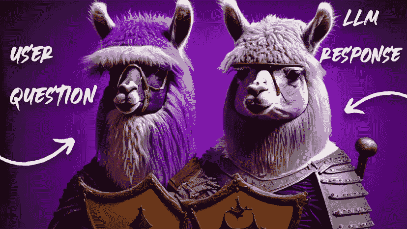

# 使用 Llama Guard 2 保护您的 LLM 聊天机器人

> 原文：[`towardsdatascience.com/safeguard-your-llm-chatbot-with-llama-guard-2-ff5f5aa0f894?source=collection_archive---------9-----------------------#2024-05-13`](https://towardsdatascience.com/safeguard-your-llm-chatbot-with-llama-guard-2-ff5f5aa0f894?source=collection_archive---------9-----------------------#2024-05-13)

## 如何将内容审查应用到您的 LLM 输入和输出，以建立更负责任的 AI 系统

 [Dr. Leon Eversberg](https://medium.com/@leoneversberg?source=post_page---byline--ff5f5aa0f894--------------------------------)

·发布于[Towards Data Science](https://towardsdatascience.com/?source=post_page---byline--ff5f5aa0f894--------------------------------) ·阅读时间 9 分钟·2024 年 5 月 13 日

--

Llama Guard。图像由作者使用 Adobe Photoshop 的 AI 图像生成工具创建。

# 介绍

责任 AI 是一个广泛的术语，自从 ChatGPT 和大型语言模型（LLMs）崛起以来，受到了更多的关注。

一般来说，这个术语意味着 AI 系统不应对人类造成伤害。就 LLMs 而言，这可能意味着例如语言模型不应产生仇恨性回应或协助用户进行非法活动。

Llama Guard 是一个基于 LLM 的聊天机器人安全保护工具，由 Meta 开发。它是 Meta 的[Purple Llama](https://llama.meta.com/purple-llama/)责任 AI 项目的一部分。

Meta 最近发布了 Llama Guard 2。这是旧版 Llama Guard 1 的更新，后者是基于 Llama 2 的。

Llama Guard 2 是一个经过训练的 LLM，充当**二元分类器**，将用户问题以及 LLM 的回应分类为**不安全或安全**。该模型**基于新的 Llama 3**，在接受 Meta 的 Llama 3 社区许可协议后，可以从 Hugging Face 自由下载[1]。
