# 利用因果图保护需求预测

> 原文：[`towardsdatascience.com/safeguarding-demand-forecasting-with-causal-graphs-591511fc8e0e?source=collection_archive---------6-----------------------#2024-06-28`](https://towardsdatascience.com/safeguarding-demand-forecasting-with-causal-graphs-591511fc8e0e?source=collection_archive---------6-----------------------#2024-06-28)

## 因果 AI，探索将因果推理融入机器学习

[](https://medium.com/@raz1470?source=post_page---byline--591511fc8e0e--------------------------------)[](https://towardsdatascience.com/?source=post_page---byline--591511fc8e0e--------------------------------) [Ryan O'Sullivan](https://medium.com/@raz1470?source=post_page---byline--591511fc8e0e--------------------------------)

·发表于 [Towards Data Science](https://towardsdatascience.com/?source=post_page---byline--591511fc8e0e--------------------------------) ·11 分钟阅读·2024 年 6 月 28 日

--


图片来自 [Boris Dunand](https://unsplash.com/@borisdunand?utm_source=medium&utm_medium=referral) 在 [Unsplash](https://unsplash.com/?utm_source=medium&utm_medium=referral)

# 这系列文章的内容是什么？

欢迎来到我的因果 AI 系列文章，在这里我们将探索将因果推理融入机器学习模型。你将会看到在不同商业背景下的一些实用应用。

在上一篇文章中，我们讨论了*利用因果 AI 强化营销组合建模*。在这篇文章中，我们将继续探讨*利用因果图保护需求预测*。

如果你错过了上一篇关于营销组合建模的文章，请在这里查看：

[](/enhancing-marketing-mix-modelling-with-causal-ai-77f638bce3a9?source=post_page-----591511fc8e0e--------------------------------) ## 利用因果 AI 强化营销组合建模

### 因果 AI，探索将因果推理融入机器学习

towardsdatascience.com

# 介绍

在这篇文章中，我们将深入探讨如何利用因果图保护需求预测（或者说任何预测应用场景）不受影响。

**以下领域将被探索：**

+   快速的预测入门。

+   什么是需求预测？

+   因果图复习。

+   因果图如何保护需求预测？

+   一个 Python 案例研究，说明因果图如何保护你的预测免受虚假相关性的影响。

完整的笔记本可以在这里找到：

[](https://github.com/raz1470/causal_ai/blob/main/notebooks/safeguarding%20demand%20forecasting%20with%20causal%20graphs.ipynb?source=post_page-----591511fc8e0e--------------------------------) [## causal_ai/notebooks/safeguarding demand forecasting with causal graphs.ipynb at main ·…

### 本项目介绍了因果 AI 及其如何推动商业价值。 - causal_ai/notebooks/safeguarding demand…

github.com](https://github.com/raz1470/causal_ai/blob/main/notebooks/safeguarding%20demand%20forecasting%20with%20causal%20graphs.ipynb?source=post_page-----591511fc8e0e--------------------------------)

# 预测

## 预测基础知识

时间序列预测是基于历史观察值预测未来值的过程。

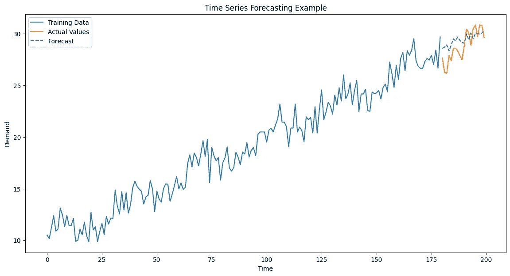

用户生成图像

为了开始，有一些术语是值得熟悉的：

1.  **自相关** — 是一个序列与其在不同时间滞后下的前期值的相关性。帮助识别是否存在趋势。

1.  **平稳** — 是指序列的统计属性（例如均值、方差）随时间保持不变。某些预测方法假设序列是平稳的。

1.  **差分** — 是将当前观察值减去前一个观察值，用以将非平稳序列转化为平稳序列。对于假设平稳性的模型，这是一个重要步骤。

1.  **季节性** — 在固定时间间隔内定期重复出现的周期（例如，每日、每周、每年）。

1.  **趋势** — 序列中的长期变化。

1.  **滞后** — 观察值与其前一个值之间的时间步数。

1.  **残差** — 预测值与实际值之间的差异。

1.  **移动平均** — 通过对固定数量的过去观察值进行平均，来平滑短期波动。

1.  **指数平滑** — 将权重应用于过去的观察值，强调最近的数值。

1.  **季节性分解** — 是将时间序列分解为季节性、趋势和残差成分的过程。

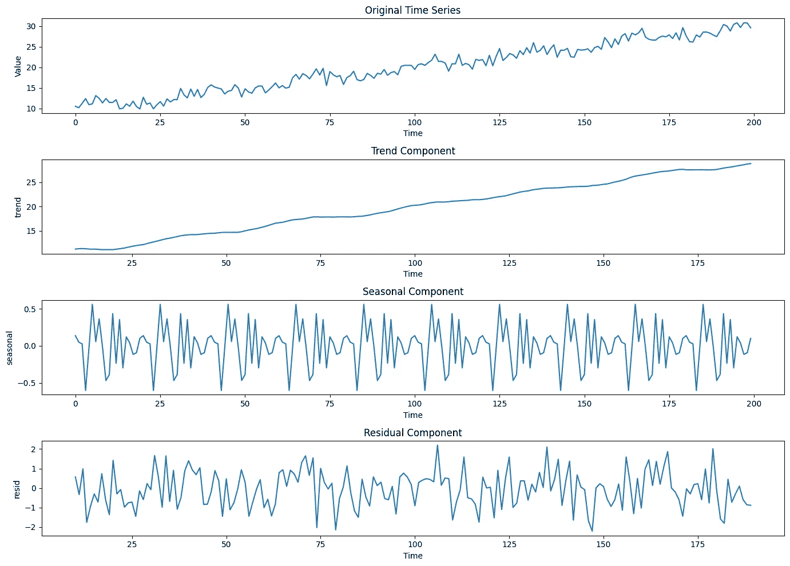

用户生成图像

有多种不同的方法可用于预测：

+   **ETS（误差、趋势、季节性）** — 一种指数平滑方法，用于建模误差、趋势和季节性成分。

+   **自回归模型（AR 模型）** — 将序列的当前值建模为其前期值的线性组合。

+   **移动平均模型（MA 模型）** — 将序列的当前值建模为过去预测误差的线性组合。

+   **自回归积分滑动平均（ARIMA 模型）** — 将 AR 和 MA 模型结合，通过差分使序列平稳。

+   **状态空间模型** — 将时间序列分解为诸如趋势和季节性等独立成分。

+   **层级模型** — 处理如地区等层次结构数据的方法。

+   **线性回归** — 使用一个或多个自变量（特征）来预测因变量（目标）。

+   **机器学习（ML）** — 使用更加灵活的算法，如提升法，来捕捉复杂的关系。

如果你想进一步了解这个话题，我强烈推荐以下资源，它被广泛认为是预测的权威指南（以下版本是免费的😀）：

[](https://otexts.com/fpp3/?source=post_page-----591511fc8e0e--------------------------------) [## 预测：原理与实践（第 3 版）

### 第 3 版

otexts.com](https://otexts.com/fpp3/?source=post_page-----591511fc8e0e--------------------------------)

在使用 Python 应用一些预测模型时，我推荐探索 Nixtla，它有广泛实现的模型列表，并且提供易于使用的 API：

[](https://github.com/Nixtla?source=post_page-----591511fc8e0e--------------------------------) [## Nixtla

### 开源时间序列生态系统。Nixtla 有 35 个可用的代码库。你可以在 GitHub 上关注他们的代码。

github.com](https://github.com/Nixtla?source=post_page-----591511fc8e0e--------------------------------)

## 需求预测

预测产品的需求非常重要。

+   它有助于管理你的库存，避免过度或不足的库存。

+   它可以保持客户满意，确保产品在客户需要时可用。

+   降低持有成本并减少浪费是成本效益高的做法。

+   对于战略规划至关重要。

保持需求预测的准确性至关重要 — 在下一部分，我们将开始思考因果图如何保障我们的预测准确性…

# 因果图

## 因果图回顾

我在我的系列文章中讨论过因果图几次，但以防你需要复习，可以查看我第一篇详细讨论因果图的文章：

[](/using-causal-graphs-to-answer-causal-questions-5fd1dd82fa90?source=post_page-----591511fc8e0e--------------------------------) ## 使用因果图回答因果问题

### 因果 AI，探索将因果推理与机器学习相结合

towardsdatascience.com

## 因果图如何保障需求预测的准确性？

以下面的图为例，假设我们想预测目标变量。我们发现有 3 个与目标变量相关的变量，因此我们将它们作为特征。为什么包含虚假的相关性会成为问题？我们包含更多特征不是能提高预测准确性吗？

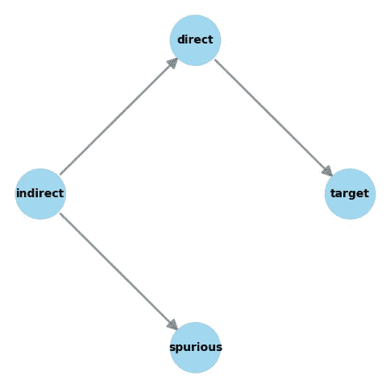

用户生成的图片

嗯，其实不是…

在需求预测中，主要问题之一是数据漂移。数据漂移本身不是问题，如果特征与目标之间的关系保持不变。但是，当关系不再保持不变时，我们的预测准确性就会下降。

但因果图如何帮助我们呢…… 这个概念是，虚假相关性更可能发生漂移，并且一旦发生漂移，它们更可能引发问题。

还不相信吗？好的，那就让我们跳入案例研究吧！

# 案例研究

## 背景

你的朋友买了一辆冰淇淋车。他们支付了大量费用给一个顾问，建立了一个需求预测模型。这个模型在最初几个月运作得非常好，但在过去几个月里，你的朋友一直在缺货冰淇淋！他们记得你的职位是“数据什么什么”并来找你寻求建议。

## 创建案例研究数据

让我先解释一下我是如何为这个案例研究创建数据的。我创建了一个简单的因果图，具有以下特征：

1.  冰淇淋销售是目标节点（X0）

1.  海滨访问是冰淇淋销售的直接原因（X1）

1.  温度是冰淇淋销售的间接原因（X2）

1.  鲨鱼攻击是一个虚假相关（X3）

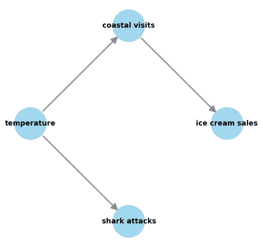

用户生成的图像

然后我使用了以下数据生成过程：

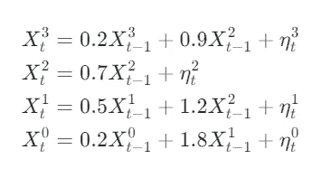

用户生成的图像

你可以看到，每个节点都受其过去值、噪声项以及直接父节点的影响。为了生成数据，我使用了来自时间序列因果分析 Python 包 Tigramite 的一个方便模块：

[](https://github.com/jakobrunge/tigramite/tree/master?source=post_page-----591511fc8e0e--------------------------------) [## GitHub - jakobrunge/tigramite: Tigramite 是一个专注于时间序列数据的因果推断 Python 包…

### Tigramite 是一个专注于时间序列数据的因果推断 Python 包。Tigramite 的文档可以在…

github.com](https://github.com/jakobrunge/tigramite/tree/master?source=post_page-----591511fc8e0e--------------------------------)

Tigramite 是一个很棒的包，但这次我不会详细介绍它，因为它值得写一篇独立的文章！在下面的部分，我们使用 structural_causal_process 模块，按照上面的数据生成过程进行操作：

```py
seed=42
np.random.seed(seed)

# create node lookup for channels
node_lookup = {0: 'ice cream sales',
               1: 'coastal visits',
               2: 'temperature',           
               3: 'shark attacks',
 }

# data generating process
def lin_f(x): 
    return x

links_coeffs = {0: [((0, -1), 0.2, lin_f), ((1, -1), 0.9, lin_f)],
                1: [((1, -1), 0.5, lin_f), ((2, -1), 1.2, lin_f)],
                2: [((2, -1), 0.7, lin_f)],
                3: [((3, -1), 0.2, lin_f), ((2, -1), 1.8, lin_f) ],      
}

# time series length
T = 1000

data, _ = toys.structural_causal_process(links_coeffs, T=T, seed=seed)
T, N = data.shape

# create var name lookup
var_names = [node_lookup[i] for i in sorted(node_lookup.keys())]

# initialize dataframe object, specify time axis and variable names
df = pp.DataFrame(data, 
                  datatime = {0:np.arange(len(data))}, 
                  var_names=var_names)
```

然后我们可以将时间序列可视化：

```py
tp.plot_timeseries(df)
plt.show()
```

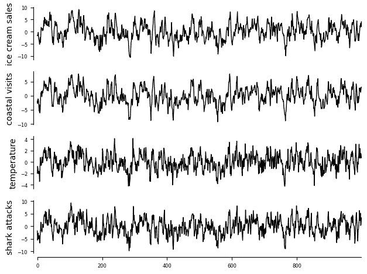

用户生成的图像

现在你已经理解了我如何创建数据，接下来我们回到下一节的案例研究！

## 理解数据生成过程

你首先要通过分析模型中使用的数据来理解数据生成过程。模型中包含了 3 个特征：

1.  海滨访问

1.  温度

1.  鲨鱼攻击

为了理解因果图，你可以使用 PCMCI（Tigramite 中有很好的实现），这是一种适合因果时间序列发现的方法。我这次不会详细介绍 PCMCI，因为它需要一篇专门的文章。不过，如果你对因果发现不太熟悉，可以参考我之前的文章来获得一个很好的入门：

[](/making-causal-discovery-work-in-real-world-business-settings-80e80c5f66b8?source=post_page-----591511fc8e0e--------------------------------) ## 使因果发现能够在现实世界的商业环境中运作

### 因果人工智能，探索将因果推理集成到机器学习中的方法

[towardsdatascience.com 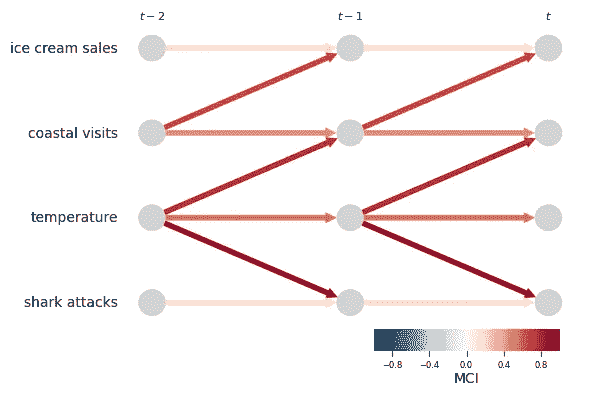

用户生成的图片

从 PCMCI 输出的因果图如上所示。以下几点显而易见：

1.  海滨访问是冰淇淋销售的直接原因

1.  温度是冰淇淋销售的间接原因

1.  鲨鱼攻击是一个虚假相关性

你质疑任何有常识的人怎么会把鲨鱼攻击作为特征！查看文档后，似乎顾问是使用 ChatGPT 获取了一个待考虑特征的列表，然后使用 autoML 训练了模型。

所以，如果 ChatGPT 和 autoML 认为鲨鱼攻击应该在模型中，难道它不会造成任何危害吗？

## 预处理案例研究数据

接下来，让我们看看如何对数据进行预处理，以使其适合这个案例研究。为了创建特征，我们需要获取每一列的滞后值（查看数据生成过程以理解为何特征需要是滞后值）：

```py
# create dataframne
df_pd = pd.DataFrame(df.values[0], columns=var_names)

# calcuate lagged values for each column
lag_periods = 1 

for col in var_names:
    df_pd[f'{col}_lag{lag_periods}'] = df_pd[col].shift(lag_periods)

# remove 1st obervations where we don't have lagged values
df_pd = df_pd.iloc[1:, :]

df_pd
```

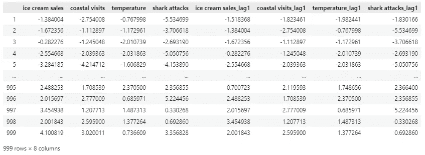

用户生成的图片

我们可以使用这些滞后特征来预测冰淇淋销售，但在此之前，让我们给虚假相关性引入一些数据漂移：

```py
# function to introduce feature drift based on indexes
def introduce_feature_drift(df, start_idx, end_idx, drift_amount):
    drift_period = (df.index >= start_idx) & (df.index <= end_idx)
    df.loc[drift_period, 'shark attacks_lag1'] += np.linspace(0, drift_amount, drift_period.sum())
    return df

# introduce feature drift
df_pd = introduce_feature_drift(df_pd, start_idx=500, end_idx=999, drift_amount=50.0)

# visualise drift
plt.figure(figsize=(12, 6))
sns.lineplot(data=df_pd[['shark attacks_lag1']])
plt.title('Feature Drift Over Time')
plt.xlabel('Index')
plt.ylabel('Value')
plt.legend(['shark attacks_lag1'])
plt.show()
```

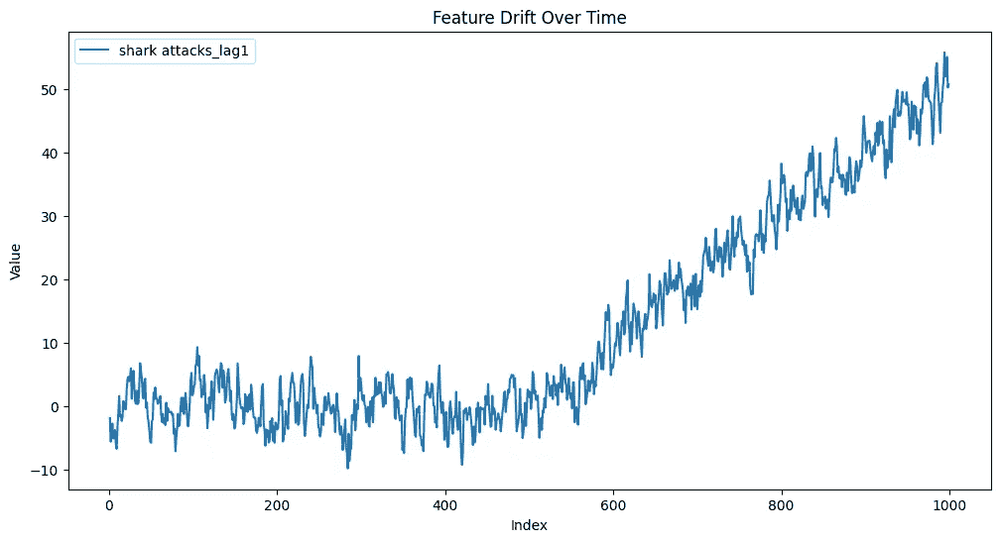

用户生成的图片

让我们回到案例研究，理解我们所看到的内容。为什么鲨鱼攻击的数量发生了变化？你做了一些研究，发现鲨鱼攻击的原因之一是冲浪人数的增加。最近几个月，冲浪的普及度大幅上升，导致了鲨鱼攻击的增加。那么，这对冰淇淋销售预测有什么影响呢？

## 模型训练

你决定使用与顾问相同的特征重新创建模型，然后仅使用直接原因：

```py
# use first 500 observations for training
df_train = df_pd.iloc[0:500, :]

# use last 100 observations for evaluation
df_test = df_pd.iloc[900:, :]

# set feature lists
X_causal_cols = ["ice cream sales_lag1", "coastal visits_lag1"]
X_spurious_cols = ["ice cream sales_lag1", "coastal visits_lag1", "temperature_lag1", "shark attacks_lag1"]

# create target, train and test sets
y_train = df_train['ice cream sales'].copy()
y_test = df_test['ice cream sales'].copy()
X_causal_train = df_train[X_causal_cols].copy()
X_causal_test = df_test[X_causal_cols].copy()
X_spurious_train = df_train[X_spurious_cols].copy()
X_spurious_test = df_test[X_spurious_cols].copy()
```

只使用直接原因训练的模型在训练集和测试集上都表现得很好。

```py
# train and validate model
model_causal = RidgeCV()
model_causal = model_causal.fit(X_causal_train, y_train)
print(f'Coefficient: {model_causal.coef_}')

yhat_causal_train = model_causal.predict(X_causal_train)
yhat_causal_test = model_causal.predict(X_causal_test)

mse_train = mean_squared_error(y_train, yhat_causal_train)
mse_test = mean_squared_error(y_test, yhat_causal_test)
print(f"Mean Squared Error train: {round(mse_train, 2)}")
print(f"Mean Squared Error test: {round(mse_test, 2)}")

r2_train = r2_score(y_train, yhat_causal_train)
r2_test = r2_score(y_test, yhat_causal_test)
print(f"R2 train: {round(r2_train, 2)}")
print(f"R2 test: {round(r2_test, 2)}")
```

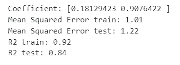

用户生成的图片

然而，当你使用所有特征训练模型时，你会发现模型在训练集上表现良好，但在测试集上却表现不佳。看起来你已经找到了问题所在！

```py
# train and validate model
model_spurious = RidgeCV()
model_spurious = model_spurious.fit(X_spurious_train, y_train)
print(f'Coefficient: {model_spurious.coef_}')

yhat_spurious_train = model_spurious.predict(X_spurious_train)
yhat_spurious_test = model_spurious.predict(X_spurious_test)

mse_train = mean_squared_error(y_train, yhat_spurious_train)
mse_test = mean_squared_error(y_test, yhat_spurious_test)
print(f"Mean Squared Error train: {round(mse_train, 2)}")
print(f"Mean Squared Error test: {round(mse_test, 2)}")

r2_train = r2_score(y_train, yhat_spurious_train)
r2_test = r2_score(y_test, yhat_spurious_test)
print(f"R2 train: {round(r2_train, 2)}")
print(f"R2 test: {round(r2_test, 2)}") 
```

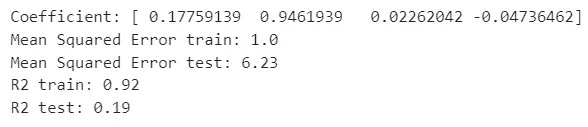

用户生成的图片

当我们比较两个模型在测试集上的预测时，我们可以看到为什么你的朋友会在冰淇淋库存上出现短缺！

```py
# combine results
df_comp = pd.DataFrame({
    'Index': np.arange(99),
    'Actual': y_test,
    'Causal prediction': yhat_causal_test,
    'Spurious prediction': yhat_spurious_test
})

# melt the DataFrame to long format for seaborn
df_melted = df_comp.melt(id_vars=['Index'], value_vars=['Actual', 'Causal prediction', 'Spurious prediction'], var_name='Series', value_name='Value')

# visualise results for test set
plt.figure(figsize=(12, 6))
sns.lineplot(data=df_melted, x='Index', y='Value', hue='Series')
plt.title('Actual vs Predicted')
plt.xlabel('Index')
plt.ylabel('Value')
plt.legend(title='Series')
plt.show()
```

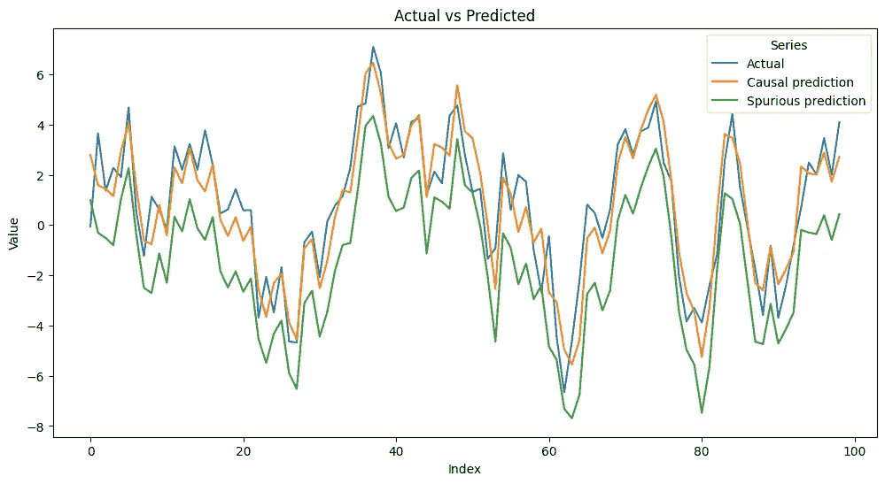

用户生成的图片

# 结语

今天，我们探讨了在预测模型中包含虚假相关性会带来多么严重的影响。最后，让我们总结一些思考：

+   本文的目的是让你开始思考如何通过理解因果图来改善你的预测。

+   我知道这个例子有点夸张（我希望常识在这种情况下能起作用！），但它希望能够说明问题。

+   另一个有趣的点是鲨鱼攻击的系数是负值。这是另一个陷阱，因为从逻辑上讲，我们本来会期望这种虚假相关性是正值。

+   中长期需求预测非常困难——你通常需要为每个特征建立一个预测模型，以便能够预测多个时间步的未来。 有趣的是，因果图（特别是结构因果模型）非常适合解决这个问题。

如果你想继续深入了解因果 AI，请关注我——在下一篇文章中，我们将探讨如何比较 CUPED 和双重机器学习如何帮助推动你的实验。
