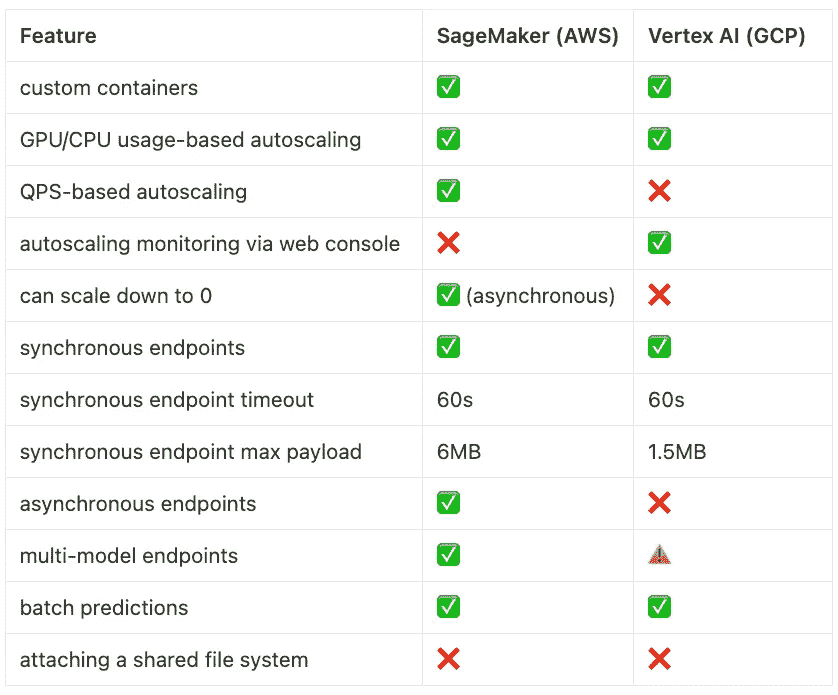

# SageMaker 与 Vertex AI 在模型推理方面的对比

> 原文：[`towardsdatascience.com/sagemaker-vs-vertex-ai-for-model-inference-ef0d503cee76?source=collection_archive---------2-----------------------#2024-06-06`](https://towardsdatascience.com/sagemaker-vs-vertex-ai-for-model-inference-ef0d503cee76?source=collection_archive---------2-----------------------#2024-06-06)

## 比较 AWS 和 GCP 在机器学习工作流中的全托管服务

 [Julia Turc](https://medium.com/@turc.raluca?source=post_page---byline--ef0d503cee76--------------------------------)

·发表于 [Towards Data Science](https://towardsdatascience.com/?source=post_page---byline--ef0d503cee76--------------------------------) ·12 分钟阅读·2024 年 6 月 6 日

--

如果你正处在产品开发的激动人心的阶段，准备将首个 AI 模型部署到生产环境中，那么不妨花点时间享受这一张白纸的自由。你即将做出的决策可能会影响公司未来的发展，或者至少会影响未来的技术债务。没有压力 :) 或者至少这是我告诉自己的话，因为我现在正开始为我们公司奠定技术基础。

在 [Storia](https://storia.ai/) ，我们构建并部署了大量 AI 模型，因此高效的模型服务至关重要。我们深入研究了两个最主要的服务，[SageMaker](https://aws.amazon.com/pm/sagemaker/) 和 [Vertex AI](https://cloud.google.com/vertex-ai?hl=en)，并在此分享我们的经验。对于我们的使用场景，我们更喜欢 SageMaker。尽管我们尽力保持公正，以便为公司做出最佳决策，但谁知道有哪些偏见在悄悄潜入呢。我曾在 Google 工作多年，我的联合创始人在 Amazon。两家公司都通过它们的初创企业项目向我们提供免费积分，去年 Amazon 还邀请我们加入了它们的 [生成性 AI 加速器](https://aws-startup-lofts.com/amer/program/accelerators/generative-ai)。

> TL;DR：SageMaker 在整体表现上占优。如果你从零开始，并且对任何一个云提供商没有偏好（因为免费积分、现有锁定或者对其工具的强烈熟悉），那就选择 SageMaker。然而，如果 GCP 已经让你深深着迷，还是留在那里吧：Vertex AI 提供了足够强有力的竞争。

来自[Unsplash](https://unsplash.com/?utm_source=medium&utm_medium=referral)的照片（左图：[Christian Wiediger](https://unsplash.com/@christianw?utm_source=medium&utm_medium=referral)，右图：[Kai Wenzel](https://unsplash.com/@kai_wenzel?utm_source=medium&utm_medium=referral)）

# 什么是 SageMaker 和 Vertex AI？

[SageMaker](https://aws.amazon.com/pm/sagemaker/)和[Vertex AI](https://cloud.google.com/vertex-ai?hl=en)是来自 AWS 和 GCP 的两项竞争服务，用于训练和部署机器学习模型。它们通过云原生组件（虚拟机、加速器和存储）来简化构建和部署 ML 模型的过程。它们的目标是防止开发者手动并反复设置在大多数机器学习工作流中常见的操作。

例如，构建训练管道需要一些通用步骤：将训练数据存储到一个存储系统中，启动一个或多个启用了加速器的虚拟机，确保它们不被 I/O 瓶颈限制（即，更多时间花费在传播梯度而不是读取训练数据上），定期进行检查点保存和评估等。

SageMaker 和 Vertex AI 使开发者仅通过配置文件或几个 bash 命令便可设置如此复杂的工作流。其结果是一个自愈系统，能够在无需大量监控的情况下完成任务。这就是为什么它们常被称为*完全托管服务*的原因。

## SageMaker 和 Vertex AI 在模型推理中的应用

在本文中，我们特别从*模型推理*的角度比较了 SageMaker 和 Vertex AI。在这里，它们的主要价值主张是确保（a）推理服务器始终保持运行，以及（b）根据传入的流量*自动扩展*。后者在今天的大型模型时代尤其重要，这些模型需要强大的加速器。由于 GPU 稀缺且价格昂贵，我们无法承受它们处于闲置状态，因此需要根据流量的多少来动态地启用或停用它们。

虽然本文重点讨论推理，但值得注意的是，这些服务涵盖了工作流的许多其他部分。特别是，除了支持模型训练外，它们还包括以笔记本为中心的功能，供数据科学家分析训练数据（参见[SageMaker Notebooks](https://aws.amazon.com/sagemaker/notebooks/)和[Vertex AI Notebooks](https://cloud.google.com/vertex-ai-notebooks?hl=en)）。

## 开发者工作流

在使用 SageMaker 或 VertexAI 进行模型部署时，开发者需要执行以下三个步骤：

1.  创建模型。

1.  配置端点。

1.  将模型部署到端点。

这些操作可以通过网页界面、特定于云平台的 CLI 或支持多种编程语言的云平台 SDK 来执行。

## 创建模型

创建模型归结为提供一个 [Docker](https://www.docker.com/) 镜像，用于一个 HTTP 服务器，响应以下请求：（1）将模型工件加载到内存中，（2）进行预测，以及（3）健康检查。除了这一契约之外，SageMaker 和 Vertex AI 对它们服务的内容相对不做限制，将模型视为需要保持运行并响应预测请求的黑盒。

SageMaker 和 Vertex AI 都提供适用于各种机器学习框架（如 PyTorch、TensorFlow、Scikit-learn 等）和内置算法的*预构建镜像*。例如，如果你只是想使用 SDXL 1.0 运行文本到图像的生成，你可以从 [Amazon Marketplace](https://aws.amazon.com/marketplace/pp/prodview-pe7wqwehghdtm?sr=0-3&ref_=beagle&applicationId=AWSMPContessa) 或 [Google Cloud’s Model Garden](https://console.cloud.google.com/vertex-ai/publishers/stability-ai/model-garden/stable-diffusion-xl-base?rapt=AEjHL4MQfisT9c5bHE515GsX5Ytk7xRpC6SOyHvaxy3NpApsXgU1UjiMuTlQX8StsIi1PG0K8kSbOXSHJNg-j6baE4RUpxhPi4Asmv2W-3Nao5_FKiafEsg&project=textify-988c3) 获取镜像。或者，它们也都支持*自定义镜像*，允许开发者编写自己的服务逻辑并定义自己的运行时环境，只要容器暴露一个包含上述三个端点的 HTTP 服务器。

## 配置端点

端点配置将模型与一组运行时约束关联起来：运行的机器和加速器类型、要消耗的资源的最小和最大数量，以及如何处理自动伸缩（监控哪个指标，以及超过什么阈值触发）。

## 部署模型

一旦这些配置完成，开发者就可以发出最终的绿灯。然后，SageMaker 和 Vertex AI 会分配所需的机器，运行容器，并调用推理服务器暴露的初始模型加载方法。之后，在容器的整个生命周期内，它们会定期进行健康检查，并在必要时重新启动容器。根据流量情况，它们会进行伸缩，以尽量减少资源消耗并最大化吞吐量。

# SageMaker 和 Vertex AI 如何比较？

> 结论：总体而言，SageMaker 更胜一筹。如果你是从零开始，并且对云服务提供商没有特别偏好（没有免费信用、现有的锁定或对工具的熟悉），就选择 SageMaker。然而，如果 GCP 已经让你深深着迷，那就留在 GCP：Vertex AI 在这场竞争中表现得相当不错。

很多时候，类似问题的答案是*“视情况而定”*。但这次情况不同。至少在模型服务的背景下，SageMaker 在大多数维度上远远领先。与 Vertex AI 相比，SageMaker 通常功能更丰富且更灵活，同时不会偏离其让机器学习工作流程*简便*的初衷。再加上 AWS 的普遍客户至上（这转化为更快的客户支持和更多的初创公司免费信用）使得 SageMaker 总体上是一个更好的选择。

也就是说，如果你的使用案例不太复杂，Vertex AI 可能足够好了。如果你有充分的理由选择 GCP（也许你已经被锁定，或者在那里有更多的免费信用），Vertex AI 可能会非常适合你。

# 自动扩展

> 与 Vertex AI 相比，SageMaker 在配置自动扩展时提供了更多的灵活性。它可以基于 QPS（每秒查询数）而非资源使用情况进行扩展。

在模型推理的背景下，自动扩展是像 SageMaker 和 Vertex AI 这样的完全托管服务的主要价值主张之一。当流量增加时，它们会分配额外的机器；当流量减少时，它们会移除不必要的实例。这在当今世界尤其重要，因为大多数模型都运行在过于昂贵的加速器上，不能让它们处于空闲状态。然而，根据流量调整分配的资源是一项复杂的任务。

## **为什么自动扩展如此困难？**

一个主要的障碍是扩展不是即时的。当需要额外的 GPU 时，系统将配置一个新的虚拟机，下载 Docker 镜像，启动容器，并下载模型工件。这可能需要 3 到 8 分钟不等，具体取决于你的部署细节。由于它无法快速响应流量波动，系统需要通过利用过去的信息提前预测流量激增。

## **SageMaker 如何在自动扩展中获胜**

SageMaker 提供三种类型的自动扩展（见[文档](https://docs.aws.amazon.com/sagemaker/latest/dg/endpoint-auto-scaling-prerequisites.html)）：(1) *目标追踪*（追踪指定的指标—如 CPU 使用率—当超出预定阈值时扩展），(2) *步进扩展*（支持基于多个追踪指标的更复杂逻辑），以及 (3) *定时扩展*（允许你硬编码特定时间段，当你预期流量增加时使用）。

推荐的方法是*目标追踪*：你可以从[Amazon CloudWatch](https://aws.amazon.com/pm/cloudwatch/)中选择任何一个指标（甚至可以定义一个自定义指标！），以及应触发扩展的值。有一些指标反映了资源的利用率（例如 CPU / GPU 内存或周期），也有一些指标衡量流量（例如`InvocationsPerInstance`或`ApproximateBacklogSizePerInstance`）。

相比之下，Vertex AI 提供的控制选项要少得多（请参见[文档](https://cloud.google.com/vertex-ai/docs/general/deployment#scaling)）。唯一的选项是目标追踪，仅限于[两个指标](https://cloud.google.com/vertex-ai/docs/reference/rest/v1/DedicatedResources#autoscalingmetricspec)：CPU 利用率和 GPU 占用周期。需要注意的是，没有直接反映流量的指标。当你的模型不能并发处理多个请求时（即不支持批处理或多线程），这会非常不方便。在这种情况下，CPU 或 GPU 处于两种模式之一：要么是 *0% 利用率*（没有请求），要么是固定的 *x% 利用率*（一个或多个请求）。在这种二元现实中，CPU 或 GPU 的使用率并不能反映真实的负载，也不是一个好的扩展触发器。你的唯一选择是在利用率介于 *0%* 和 *x%* 之间时进行扩展，且有一个额外的复杂性，即 *x* 是依赖于加速器的：如果你从 NVIDIA T4 切换到 A100，你需要手动调整阈值。

增添一些戏剧性的是，Vertex AI 无法扩展到零实例（[见问题](https://issuetracker.google.com/issues/206042974)）；至少需要保持一台机器在运行。然而，SageMaker 允许完全移除其[异步端点](https://docs.aws.amazon.com/sagemaker/latest/dg/async-inference.html)的所有实例（下一节将进一步讨论此问题）。

也许 GCP 唯一的优势是它允许你在其 Web 控制台中轻松跟踪自动扩展行为，而 AWS 在其 Web 门户上完全没有提供相关信息（你只能通过 bash 命令循环来监控它）。

# 同步预测与异步预测

> SageMaker 支持同步调用（会阻塞，直到预测完成）和异步调用（会立即返回一个 URL，预测结果准备好后可以通过该 URL 获取）。而 Vertex AI 仅支持前者。

默认情况下，SageMaker 和 Vertex AI 的端点都是 *同步的* —— 调用者会被阻塞，直到预测完成。虽然这种客户端/服务器通信模型是最容易理解的，但当模型存在高延迟时可能会不方便。这两个服务都将在 60 秒后超时：如果单次模型调用超过此时间，SageMaker / Vertex AI 会返回一个 *超时* 响应。需要注意的是，这包括等待时间。假设客户端同时发出两个请求，每个请求需要 45 秒来解决。如果你的模型不支持并行处理（例如通过批处理），那么第二个请求会超时（因为它需要 90 秒来解决）。

为了绕过这个问题，SageMaker 支持 [*异步端点*](https://docs.aws.amazon.com/sagemaker/latest/dg/async-inference.html) —— 它们会立即通过 S3 URL 响应客户端；当模型输出完成时，将被放置在该位置。客户端需要轮询 S3 位置，直到该结果可用。由于请求被放入一个（尽力而为的）FIFO 队列，超时时间被延长至 15 分钟（而不是 60 秒）。不幸的是，Vertex AI 不支持异步端点；如果不希望请求在 60 秒后被丢弃，您需要实现自己的排队和重试逻辑。

请注意，SageMaker 和 Vertex AI 都支持 *批量预测*，它们是异步的。这些预测不适合实时流量，而是适合批处理作业（即对整个数据集进行离线预测）。

# 多模型端点（MMEs）

> SageMaker 完全支持共享资源的多模型端点。Vertex AI 的多模型端点仅共享 URL，并不会带来任何成本节省。

有时候你需要部署的不止一个模型。也许你有一个完整的管道，每个步骤都需要不同的模型，比如 [基于语言的图像编辑](https://pytorch.org/blog/amazon-sagemaker-w-torchserve/)。或者，也许你有一组独立的模型，并且它们的使用遵循幂律分布（其中 2-3 个模型经常被使用，而长尾部分则偶尔使用）。为每个模型分配一台专用机器可能会变得过于昂贵。为此，SageMaker 提供了 [*多模型端点*](https://docs.aws.amazon.com/sagemaker/latest/dg/multi-model-endpoints.html)，它们在模型之间共享同一个容器和资源。这些模型不需要全部装入内存；SageMaker 可以根据当前请求的模型动态调入调出。这样做的折衷是偶尔的冷启动（即，如果请求的模型不在内存中，客户端将不得不等待，直到 SageMaker 调入该模型）。当你有一组很少使用的模型时，这种情况是可以接受的。

SageMaker 多模型端点的一个限制是它要求所有模型使用相同的框架（如 PyTorch、Tensorflow 等）。然而，[多容器端点](https://docs.aws.amazon.com/sagemaker/latest/dg/multi-container-endpoints.html)缓解了这一限制。

尽管 Vertex AI 正式允许你将多个模型部署到一个端点（参见[文档](https://cloud.google.com/vertex-ai/docs/general/deployment#models-endpoint)），但资源实际上是与模型相关联的，而不是与端点相关联的。因此，你无法像在 AWS 上那样共享资源来降低成本，但你可以方便地将流量从模型 v1 平滑过渡到模型 v2，而无需更改端点 URL。真正的资源共享仅适用于使用预构建容器的 TensorFlow 模型，这有些限制（参见[文档](https://cloud.google.com/vertex-ai/docs/predictions/model-co-hosting)）。

# 配额和 GPU 可用性

> 在配额和加速器可用性方面，两个提供商各有其独特之处，但它们面临着相同的根本挑战：GPU 成本昂贵。

+   在 GCP 上，你可以获得（并为此付费）一个 A100 GPU。但 AWS 强制要求你一次租用 8 个（这可能会根据你的需求显得有些过剩）。这种情况仅适用于 A100 GPU，并不适用于低层次的 GPU；你可以自由请求任何其他类型的单个 GPU。

+   在 GCP 内，VM 的配额可以用于 Vertex AI。换句话说，你只需要请求一次那个热门的 A100 GPU。然而，AWS 会将 EC2 和 SageMaker 的配额分别管理（了解更多关于[AWS 服务配额](https://docs.aws.amazon.com/general/latest/gr/aws_service_limits.html)的信息），所以一定要确保请求正确服务的配额。

+   尽管我们可以从两家提供商处获得专门的客户支持（GCP 通过他们的[初创企业计划](https://cloud.google.com/startup/?hl=en)，AWS 通过他们的[生成式 AI 加速器](https://aws-startup-lofts.com/amer/program/accelerators/generative-ai)），但 AWS 的代表通常响应更快，这也意味着配额请求会更快解决。

# 限制

在前面的部分中，我们讨论了两种服务彼此之间的限制。然而，两者之间也存在一些共同的限制：

1.  **负载限制**。这两种服务的模型响应负载都有最大大小限制：Vertex AI 公共端点为 1.5 MB，SageMaker 同步端点为 6 MB，异步端点为 1 GB（[source 1](https://cloud.google.com/vertex-ai/docs/predictions/get-online-predictions)，[source 2](https://docs.aws.amazon.com/sagemaker/latest/dg/hosting-faqs.html)）。

1.  **超时**。预测请求最终会被两种服务丢弃：Vertex AI 的超时为 60 秒，SageMaker 的同步端点为 60 秒，SageMaker 的异步端点为 15 分钟（[source 1](https://cloud.google.com/vertex-ai/docs/predictions/get-online-predictions)，[source 2](https://docs.aws.amazon.com/sagemaker/latest/dg/hosting-faqs.html)）。

1.  **缩减到 0**。Vertex AI 和同步的 SageMaker 端点不支持此功能，但 SageMaker 的异步端点支持。

1.  **附加共享文件系统**。SageMaker 和 Vertex AI 都不允许挂载外部文件存储系统（AWS 中的[EFS](https://aws.amazon.com/efs/)或[FSx](https://aws.amazon.com/fsx/)以及 GCP 中的[Filestore](https://cloud.google.com/filestore?hl=en)）。这对于存储和共享跨服务器副本的模型工件，或实现像[这个](https://cloud.google.com/blog/products/containers-kubernetes/stable-diffusion-containers-on-gke)这样的技巧以节省 Docker 镜像空间（并减少启动时间）可能很有用。需要注意的是，它们确实支持访问常规对象存储（S3 和 GCS）。

# 总结

已经说了很多，这里有一个简洁的表格，将所有内容压缩在一起：

图片由作者提供。✅ = 支持，❌ = 不支持，⚠️ = 有限支持。

# 替代方案

SageMaker 和 Vertex 是最受欢迎的模型服务解决方案，能够满足大多数用例。如果你对其中任何一个不满意，那么你可能需要做一些自我反思。你是想要更多的灵活性吗？你是想要以牺牲更多灵活性为代价的简化吗？还是你只是想要通过减少冷启动来降低成本？

如果你渴望灵活性，那么可能无法避免使用[Kubernetes](https://kubernetes.io/)——亚马逊的[EKS](https://aws.amazon.com/eks/)和谷歌的[GKE](https://cloud.google.com/kubernetes-engine?hl=en)是托管的 Kubernetes 服务，可能是一个不错的起点。额外的优势是 Kubernetes 是与云平台无关的，因此你可以在 AWS / GCP / Azure 上重复使用相同的配置，配合像[Terraform](https://www.terraform.io/)这样的基础设施自动化工具。

相比之下，如果你追求简便，有一些服务如[Replicate](https://replicate.com/)、[Baseten](https://www.baseten.co/)、[Modal](https://modal.com/)或[Mystic](https://www.mystic.ai/)，它们比 SageMaker 和 Vertex 多了一层抽象。它们有不同的权衡；例如，Replicate 让你在实验阶段极其容易地创建模型端点，但在冷启动方面存在显著的困难。

# 联系方式

*如果你正在考虑高效的模型服务，我们很想听听你的意见！你可以在 Twitter 上找到我* [*@juliarturc*](https://x.com/juliarturc) *或在* [*LinkedIn*](https://www.linkedin.com/in/iulia-raluca-turc/) *联系我。*

# 深入阅读

+   [官方 SageMaker 文档](https://docs.aws.amazon.com/sagemaker/)

+   [官方 Vertex AI 文档](https://cloud.google.com/vertex-ai/docs/predictions/overview)

+   [使用 Amazon SageMaker 多模型端点与 TorchServe 加速 GPU 上的 AI 模型，节省多达 75%的推理成本](https://pytorch.org/blog/amazon-sagemaker-w-torchserve/)

+   [使用 Google Vertex AI 服务机器学习模型](https://medium.com/google-cloud/serving-machine-learning-models-with-google-vertex-ai-5d9644ededa3)

+   [通过 Google Kubernetes Engine (GKE) 将 Stable Diffusion 启动时间提高 4 倍](https://cloud.google.com/blog/products/containers-kubernetes/stable-diffusion-containers-on-gke)
