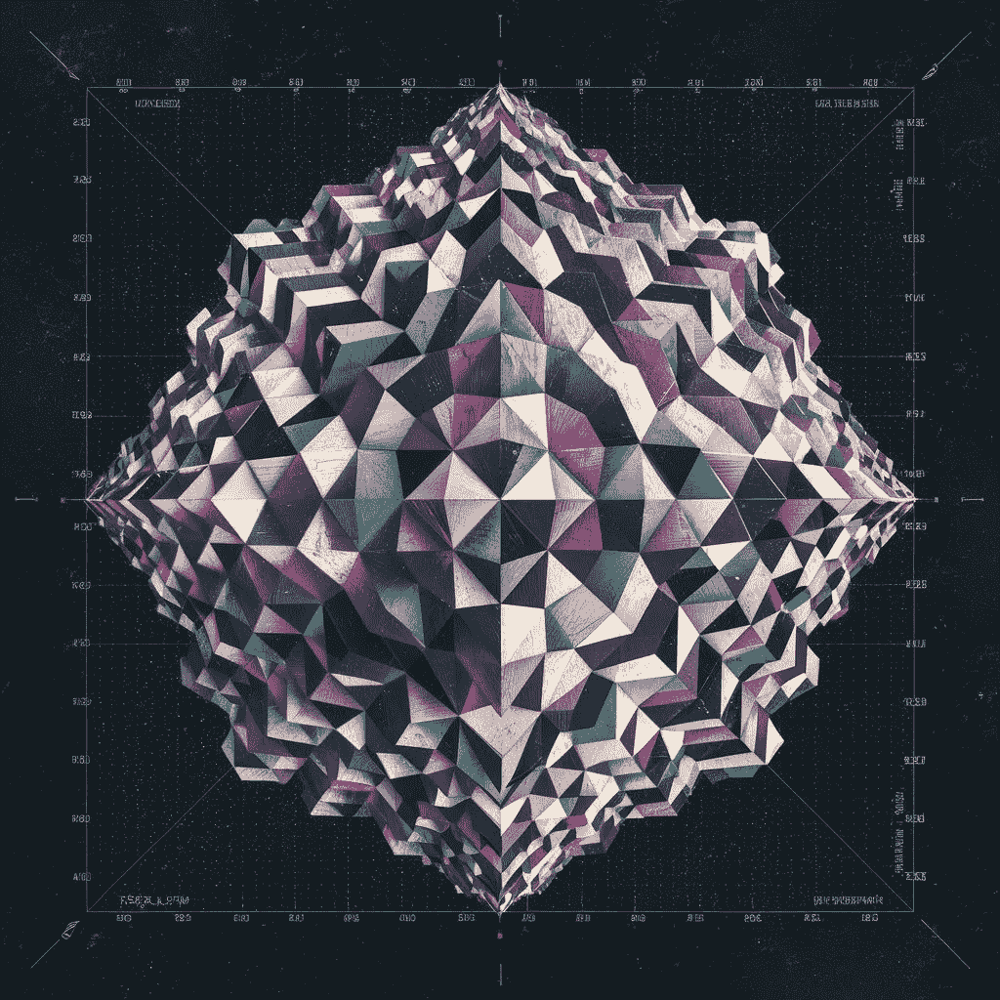

# 从多变量分布中采样：从统计模型到生成模型

> 原文：[`towardsdatascience.com/sampling-from-multivariate-distributions-from-statistical-to-generative-modeling-0177e55a9061?source=collection_archive---------9-----------------------#2024-07-15`](https://towardsdatascience.com/sampling-from-multivariate-distributions-from-statistical-to-generative-modeling-0177e55a9061?source=collection_archive---------9-----------------------#2024-07-15)

## 连接经典统计方法和前沿生成式人工智能模型，用于从多变量分布中采样

 [Wencong Yang, PhD](https://medium.com/@yangwconion?source=post_page---byline--0177e55a9061--------------------------------)

·发布于 [Towards Data Science](https://towardsdatascience.com/?source=post_page---byline--0177e55a9061--------------------------------) ·阅读时长：8 分钟·2024 年 7 月 15 日

--

来源：[Ideogram](https://ideogram.ai/).

# 背景

从多变量分布中采样合成数据对于理解数据之间的相互依赖、促进统计推断以及量化数据分析中的不确定性至关重要。这一过程在金融、工程、医学、环境科学和社会科学中得到了广泛应用。该过程涉及使用数学模型拟合数据的结构，并根据拟合的分布生成新的样本。联合多变量分布的建模在统计学领域已有悠久历史。在简单的情况下，数据可以通过使用预定义的统计分布进行建模，这些分布具有明确的数学描述，例如多元高斯分布和 Copula 函数——这两种是经典的统计方法。然而，随着数据维度和依赖关系的复杂性增加，传统方法已经无法满足需求。同时，现代生成式人工智能技术，如生成对抗网络（GANs）和扩散模型，展示了其潜力。
