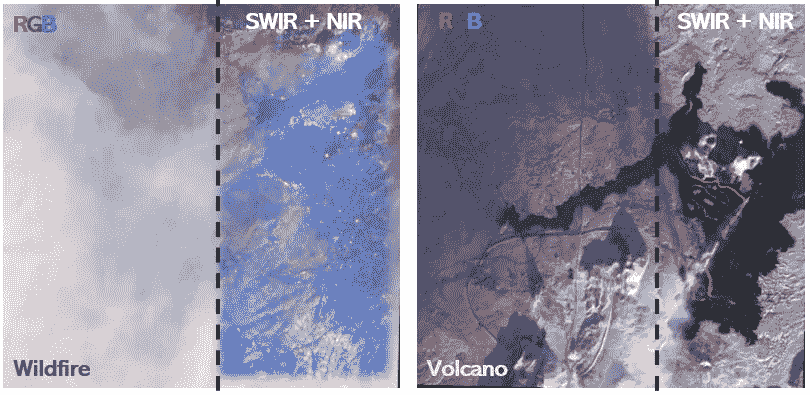

# 卫星如何看见不可见的熔岩流和活跃的野火？（Python）

> 原文：[`towardsdatascience.com/satellites-can-see-invisible-lava-flows-and-active-wildires-but-how-python-371915464d1c?source=collection_archive---------5-----------------------#2024-02-20`](https://towardsdatascience.com/satellites-can-see-invisible-lava-flows-and-active-wildires-but-how-python-371915464d1c?source=collection_archive---------5-----------------------#2024-02-20)

## 可视化捕捉到的卫星图像，显示火山和野火的不同光谱带

 [Mahyar Aboutalebi, Ph.D. 🎓](https://medium.com/@mahyar.aboutalebi?source=post_page---byline--371915464d1c--------------------------------)

·发表于 [Towards Data Science](https://towardsdatascience.com/?source=post_page---byline--371915464d1c--------------------------------) ·14 分钟阅读·2024 年 2 月 20 日

--

作者使用不同光谱带可视化捕捉到的卫星图像，显示火山和野火的情况

# 目录

1.  **🌟 介绍**

1.  **🔍 Sentinel-2（光谱带）**

1.  🌐 **下载 Sentinel-2 图像**

1.  ⚙️ **处理 Sentinel-2 图像（裁剪和重采样）**

1.  🌋 **Sentinel-2 图像可视化（火山）**

1.  🔥 **Sentinel-2 图像可视化（野火）**

1.  **📄 结论**

1.  **📚 参考文献**

## **🌟 介绍**

如你所知，我们的眼睛只能看到可见光区域（蓝色、绿色和红色光谱带）。然而，当光线照射到物体上并反射时，它包含了其他光谱区域的信息，例如红外线。红外光可以有效穿透并通过浓密的气体，如烟雾，从而提供烟雾下的清晰视图。然而，我们的眼睛无法看到红外区域的物体，不像某些动物（如蛇）能够在视觉中看到一部分红外线。过去几十年，红外传感器技术有了显著的进展……
