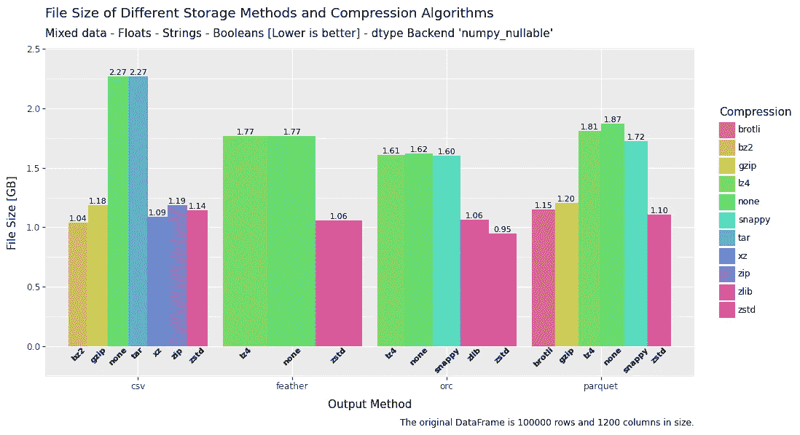

# 高效快速保存 Pandas DataFrame — Parquet 与 Feather 与 ORC 与 CSV

> 原文：[`towardsdatascience.com/saving-pandas-dataframes-efficiently-and-quickly-parquet-vs-feather-vs-orc-vs-csv-26051cc98f2e?source=collection_archive---------4-----------------------#2024-11-27`](https://towardsdatascience.com/saving-pandas-dataframes-efficiently-and-quickly-parquet-vs-feather-vs-orc-vs-csv-26051cc98f2e?source=collection_archive---------4-----------------------#2024-11-27)

## 优化

## 速度、内存、大小和便利性。哪种存储方法最好？

 [Mike Clayton](https://medium.com/@maclayton?source=post_page---byline--26051cc98f2e--------------------------------)

·发布于 [Towards Data Science](https://towardsdatascience.com/?source=post_page---byline--26051cc98f2e--------------------------------) ·阅读时间 13 分钟·2024 年 11 月 27 日

--

混合数据的输出文件大小 — 图片来源：作者

**随着数据量的不断增加，必然需要高效且快速地存储和重新加载这些数据。**

**CSV 格式长期以来一直是首选的存储格式。然而，现有的替代方案要好得多，它们专门设计用于直接处理表格数据的存储和高效重新加载。**

**那么，如果你仍然使用 CSV 格式来存储数据表，你到底会损失多少？你应该考虑哪种替代方案？**

# 介绍

当谈到存储表格数据时，理想的情况是：

+   快速写入

+   快速读取

+   低内存使用

+   低存储需求

+   压缩的好选择

一个仅读取部分数据而不加载整个数据集的选项，也是上述内容的一个很好的补充。

因此，上述列出的内容将成为测试一些更广泛使用的存储方法的基础。
