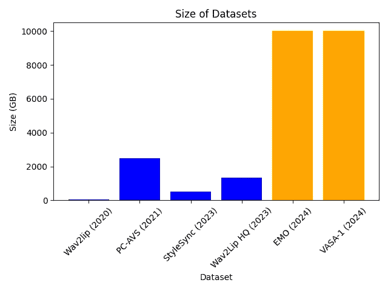
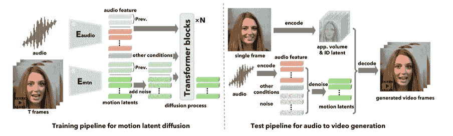
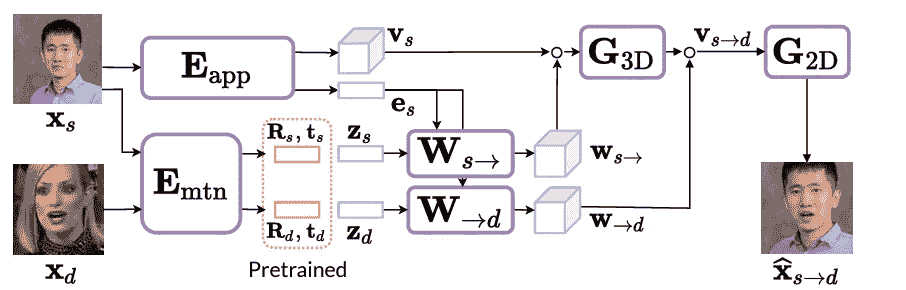
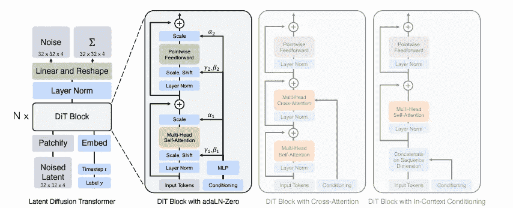
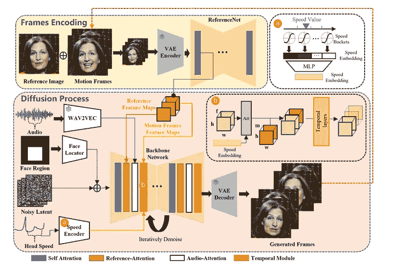
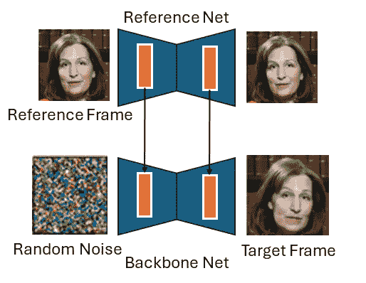
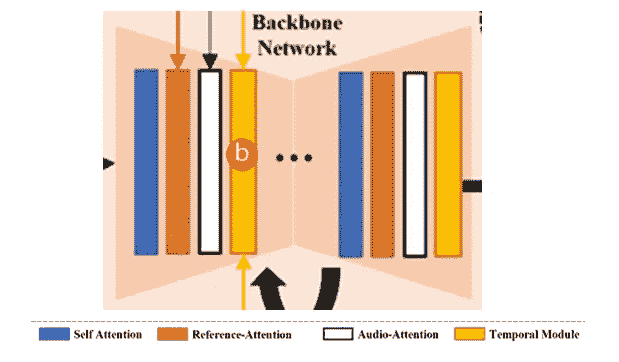
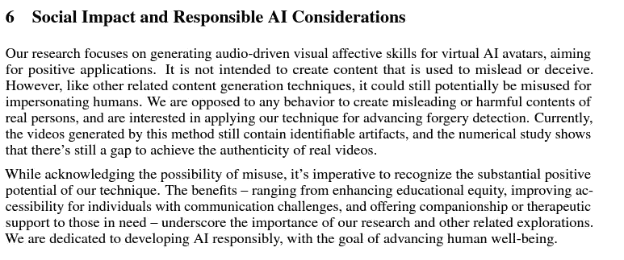

# 唇动同步仅需规模数据？

> 原文：[`towardsdatascience.com/scale-is-all-you-need-for-lip-sync-0c571423f60f?source=collection_archive---------5-----------------------#2024-06-07`](https://towardsdatascience.com/scale-is-all-you-need-for-lip-sync-0c571423f60f?source=collection_archive---------5-----------------------#2024-06-07)

## 阿里巴巴的 EMO 和微软的 VASA-1 简直太强大了。让我们来拆解它们是如何工作的。

 [Jack Saunders](https://medium.com/@jacksaunders909?source=post_page---byline--0c571423f60f--------------------------------)

·发布于[Towards Data Science](https://towardsdatascience.com/?source=post_page---byline--0c571423f60f--------------------------------) ·11 分钟阅读·2024 年 6 月 7 日

--

AI 研究的进展正在以指数级速度加快，这已经不是什么秘密。过去几年中，一个最大的趋势是使用变换器模型来利用大规模数据集。看起来这个趋势终于到达了唇动同步模型领域。[阿里巴巴的 EMO 发布](https://github.com/HumanAIGC/EMO?tab=readme-ov-file)为此树立了先例（我的意思是，看看那些请求发布代码的 200 多个 GitHub 问题）。但是，随着[微软的 VASA-1 上个月发布](https://www.microsoft.com/en-us/research/project/vasa-1/)，这个门槛被进一步提高了。

来自[VASA-1](https://www.microsoft.com/en-us/research/project/vasa-1/)和 EMO 的演示视频。所有图片的版权归各自作者所有。

它们受到了很多关注，但到目前为止，没有人讨论过它们的具体做法。从表面上看，它们几乎是完全相同的作品（有意为之）。两者都使用单一图像，并通过音频来动画化它。两者都使用扩散模型，并且都通过规模的利用来产生惊人的效果。但实际上，背后有一些不同之处。本文将简要探讨这些模型如何运作。我们还将探讨这些论文的伦理考虑，鉴于它们显然存在被滥用的潜力。

# 数据

一个模型的好坏，取决于它训练所使用的数据。或者更简洁地说，垃圾进，垃圾出。大多数现有的唇动同步论文使用了一到两个相对较小的数据集。我们讨论的这两篇论文在这方面绝对超越了所有竞争对手。让我们来看看它们使用了什么。阿里巴巴在 EMO 中提到：

> 我们从互联网收集了大约 250 小时的谈话头像视频，并使用 HDTF [34]和 VFHQ [31]数据集对我们的模型进行了补充训练。

至于他们所说的额外 250 小时收集的数据具体意味着什么，目前还不清楚。然而，HDTF 和 VFHQ 是公开可用的数据集，所以我们可以进一步分析它们。[HDTF](https://github.com/MRzzm/HDTF)包含了 300 个受试者的 16 小时 720 到 1080p 的视频数据。[VFHQ](https://liangbinxie.github.io/projects/vfhq/)没有明确提到数据集的小时数，但它有 15,000 个视频片段，数据量为 1.2TB。如果我们假设每个视频片段平均至少有 10 秒钟，那么这相当于增加了 40 小时的数据。这意味着 EMO 使用了至少 300 小时的数据。对于 VASA-1，微软表示：

> 该模型在 VoxCeleb2 [13]和我们收集的另一个高分辨率谈话视频数据集上进行训练，该数据集包含大约 3.5K 个受试者。

再次强调，作者对于数据集的大部分内容保持保密。[VoxCeleb2](https://www.robots.ox.ac.uk/~vgg/data/voxceleb/vox2.html)是公开的。通过查看相关论文，我们可以看到它包含 2442 小时的数据（这不是笔误），跨越 6000 个受试者，尽管其分辨率低于我们提到的其他数据集（360 到 720p）。这大约是 2TB。微软使用了一个包含 3.5k 个额外受试者的数据集，我怀疑这些受试者的质量更高，使得模型能够生成高质量的视频。如果我们假设这些视频至少是 1080p，并且其中一些是 4k 分辨率，且与 VoxCeleb2 的数据集时长相似，那么我们可以预期另有 5 到 10TB 的数据。

**接下来，我将做一些有根据的猜测：**阿里巴巴可能使用了 300 小时的高质量视频（1080p 或更高），而微软使用了大约 2500 小时的低质量视频，可能还使用了 100 到 1000 小时的非常高质量视频。如果我们尝试估算数据集的存储空间大小，我们发现**EMO 和 VASA-1 每个使用大约 10TB 的面部视频数据来训练他们的模型**。以下是一些比较，查看下表：

几个最先进的谈话头像生成模型的数据集大小估算比较。图像来自我。(CC-BY)

# 模型

这两个模型都利用扩散和变换器来处理海量数据集。然而，它们在工作原理上有一些关键差异。

# VASA-1

我们可以将 VASA-1 分解为两个组成部分。一个是图像生成模型，它接收一些面部表情和姿势的潜在表示，并生成一个视频帧。另一个是从音频输入生成这些潜在姿势和表情向量的模型。图像生成模型

VASA-1 模型图。左侧显示音频到潜在向量的生成，右侧显示图像生成模型。[VASA-1 论文中的图示](https://www.microsoft.com/en-us/research/project/vasa-1/)。 (CC-BY)

## 图像生成模型

VASA-1 在很大程度上依赖于面部的 3D 体积表示，建立在三星之前的工作[MegaPortraits](https://arxiv.org/abs/2207.07621)的基础上。这里的想法是首先估计源面部的 3D 表示，使用预测的源姿态对其进行变形，使用源和目标表情的知识对表情进行编辑，并在这个规范空间中完成编辑后，使用目标姿态将其重新变形。

MegaPortraits 方法的模型图。v 是面部的体积表示，e 是身份的描述符，R 和 t 是姿态（旋转和位移），z 是面部表情编码。[来自 MegaPortraits 论文。](https://arxiv.org/pdf/2207.07621)（CC-BY）

更详细地说，这个过程如下：

+   获取源图像（上图中的男子）并预测一个简单的 1D 向量，代表此人。

+   同时预测一个 4D 张量（宽度、高度、深度、RGB），作为该人物的体积表示。

+   预测源图像和驱动图像（上面的女人）的姿态和面部表情。**请注意，只有姿态估计是预训练的，其他所有内容都是从零开始训练的。**

+   使用神经网络创建两个变形场。一个使用我们对其身份、姿态和面部表情的估计，将男子的体积表示转换到规范空间**（这只是意味着正面、表情中立）**。另一个使用对女性姿态和表情的估计，以及男子的身份，将他的规范 3D 面部转换为具有姿态的 3D 面部。

+   将有姿态的人脸“渲染”回 2D 图像。

有关他们是如何具体实现这一点的，即如何将图像投影到 3D 空间，如何实现变形以及如何从 3D 体积中生成 2D 图像，请参阅[MegaPortraits 论文。](https://arxiv.org/abs/2207.07621)

目前，我们可以将这个高度复杂的过程简化为：想象一个模型，以某种方式编码源输入，然后获取姿态和表情的参数，基于这些生成图像。

## 音频到潜在空间生成

现在，我们有了一种从一系列表情和姿态潜在编码生成视频的方法。然而，与 MegaPortraits 不同，我们不希望通过他人的表情来控制我们的视频。相反，我们希望仅通过音频来控制。为此，我们需要构建一个生成模型，输入音频，输出潜在向量。这个模型需要能够处理大量数据，具备同步口型功能，并且能够生成多样化且逼真的头部动作。进入扩散 transformer。如果你对这些模型不熟悉，我不怪你，这里有很多进展需要跟上。我可以推荐以下文章：

 ## 扩散 Transformer 解释

### 探索将 transformers 引入图像生成中的架构

towardsdatascience.com

简而言之，扩散变压器（DiTs）将传统的 UNET 替换为图像扩散模型中的变压器。这种切换使得能够在具有任何结构的数据上进行学习，得益于标记化，并且已知它在大数据集上扩展得非常好。例如，[OpenAI 的 SORA](https://openai.com/index/sora/)模型被认为是一个扩散变压器。

DiT 模型架构来自于[可扩展的扩散模型与变压器](https://arxiv.org/pdf/2212.09748)

这个过程的想法是从与潜在向量形状相同的随机噪声开始，逐步去噪以生成有意义的向量。然后，这个过程可以根据额外的信号进行条件化。对于我们的目的来说，这些信号包括音频，通过[Wav2Vec2](https://huggingface.co/docs/transformers/en/model_doc/wav2vec2)提取成特征向量（详细了解可以参考[FaceFormer](https://evelynfan.github.io/audio2face/)）。还使用了其他信号。我们不会详细讨论，但它们包括眼睛凝视方向和情绪。为了确保时间稳定性，先前生成的运动潜在编码也被用作条件信号。

# EMO

来自[EMO 论文的模型图](https://humanaigc.github.io/emote-portrait-alive/)（CC-BY）

EMO 在其生成过程中采用了稍微不同的方法，尽管它仍然依赖于扩散模型的核心。模型图看起来有些拥挤，因此我认为最好将其分解成更小的部分。

## 使用 Stable Diffusion

首先需要注意的是，EMO 大量使用了预训练的 Stable Diffusion 1.5 模型。目前，在视觉领域有一个明显的趋势，即在此模型基础上进行构建。在上面的图示中，参考网络和骨干网络都是 SD1.5 UNET 架构的实例，并且是用这些权重进行初始化的。虽然细节不多，但可以推测 VAE 的编码器和解码器也是来自 Stable Diffusion。VAE 组件被冻结，这意味着 EMO 模型中执行的所有操作都是在该 VAE 的潜在空间中完成的。使用相同的架构和相同的初始权重非常有用，因为它允许从一个网络中轻松提取中间层的激活，并将其用于另一个网络（它们在两个网络中大致表示相同的内容）。

## 第一阶段的训练

第一阶段的目标是获得一个单图像模型，能够根据该人物的参考帧生成一个新颖的图像。这是通过使用扩散模型来实现的。可以使用一个基本的扩散模型来生成人物的随机图像。在第一阶段，我们希望以某种方式将生成过程与身份条件化。作者实现这一点的方法是，通过使用参考网对人物的参考图像进行编码，并将每一层的激活信息引入到进行扩散的主干网络中。请参见下方的（画得很差的）示意图。

第一阶段简化版的基本示意图。图像由我制作。（CC-BY）

> 在这一阶段，我们已经有了一个模型，能够根据某个人的单张图片生成随机的帧。现在，我们需要以某种方式对其进行控制。

## 训练第二阶段

我们希望使用两个信号来控制生成的帧：运动和音频。音频部分较容易解释，因此我将首先讲解这一部分。

EMO 的主干网络放大图。来自[EMO 论文](https://humanaigc.github.io/emote-portrait-alive/)。 (CC-BY)

+   **音频：** 和 VASA-1 一样，音频以 wav2vec2 特征的形式进行编码。这些特征通过交叉注意力机制被融入主干网络中。这种交叉注意力替代了 Stable Diffusion 1.5 模型中已经存在的文本提示交叉注意力。

+   **运动：** 通过运动帧添加运动信息，在预测时间 t 的帧时，前 n 帧提供了运动的上下文。运动帧与参考帧以相同的方式进行编码。参考网的中间特征激活用于条件化主干模型。这些运动参考激活的引入是通过一个专门设计的交叉注意力层完成的，来自[AnimateDiff](https://animatediff.github.io/)。从这些 n 帧中，下一帧 f 会通过扩散模型进行预测。

除此之外，还使用了两个其他组件。一个提供了一个掩码，掩码是通过对训练视频中的所有边界框取并集得到的。这个掩码定义了视频中可以被修改的区域。另一个是添加了一个速度条件。姿势速度被划分为几个桶（例如：慢速、中速、快速），并也包含在内。这使得我们能够在推理时指定运动的速度。

## 推理

现在模型能够接受以下内容并生成一组新的帧：

+   参考帧

+   之前的 n 帧

+   音频

+   头部运动速度

+   可以被改变的像素边界框

对于第一帧，虽然没有明确说明，但我假设参考帧会被重复，并作为最后 n 帧传递。在这一点之后，模型是自回归的，输出将作为前一帧输入。

# 伦理讨论

这些工作的伦理影响当然非常重要。它们只需要一张图片就能创造出非常真实的合成内容。这很容易被用来歪曲他人形象。鉴于近期关于[OpenAI 未经 Scarlett Johansen 同意使用听起来非常像她声音的事件](https://edition.cnn.com/2024/05/22/tech/openai-scarlett-johansson-lawsuit-sam-altman/index.html)，这一问题尤为相关。两组的处理方式截然不同。

## **EMO**

EMO 论文中的讨论非常欠缺。该论文没有讨论伦理影响或提出任何防止滥用的方法。项目页面仅写道：

> “该项目仅用于学术研究和效果展示”

这似乎是一次非常弱的尝试。此外，阿里巴巴还提供了一个 GitHub 仓库，可能会公开代码。考虑这样做的利弊是很重要的，[正如我们在上一篇文章中讨论的那样。](https://medium.com/towards-data-science/should-deepfakes-be-open-sourced-87d7644a0765) 总体来看，EMO 的作者并没有对伦理问题给予太多考虑。

## **VASA-1**

VASA-1 的作者采取了更全面的方法来防止滥用。他们在论文中专门有一节讨论此问题，强调了深伪检测中的潜在应用以及正面效益。

来自 VASA-1 的伦理部分。图片取自[arxiv 预印本](https://arxiv.org/pdf/2404.10667)。

除此之外，他们还包含了一项相当有趣的声明：

> *注意：本页上的所有人像图像都是由 StyleGAN2 或 DALL·E-3 生成的虚拟、非真实身份（蒙娜丽莎除外）。我们正在探索虚拟互动角色的视觉情感技能生成，而非模仿任何现实世界中的人物。这仅仅是一个研究示范，并没有产品或 API 发布计划。*

这种方法实际上是微软在一些论文中开始采用的。他们只使用合成人物来创建合成视频，并且不公开任何模型。这样做可以防止可能的滥用，因为没有编辑任何真实人物。然而，这也引发了一个问题：创造此类视频的能力集中在具有基础设施训练这些模型的大型科技公司手中。

## 进一步分析

在我看来，这项工作开启了一系列新的伦理问题。虽然以前可以创建假视频，但通常需要几分钟的数据来训练模型。这在很大程度上将潜在的受害者限制为已经创造大量视频的人。尽管这为制造政治虚假信息提供了可能，但这些限制帮助抑制了一些其他应用。例如，如果某人创建了大量视频，就可以通过分析其常见内容（他们通常谈论什么，持有什么观点等）来辨别出不符合其风格的视频。如果只使用一张图片，这变得更加困难。而且，任何人都可能成为这些模型的受害者。即使是一个拥有个人头像的社交媒体账户，也足够作为建立个人模型的数据。

此外，作为一种不同类型的“深度伪造”，目前对如何检测这些模型的研究并不多。以前可能有效的用于捕捉视频深度伪造模型的方法将变得不可靠。

> 我们需要确保这些模型带来的危害得到限制。微软通过限制访问权限并仅使用合成人物的做法在短期内有所帮助。但从长远来看，我们需要对这些模型的应用进行强有力的监管，并且需要可靠的方法来检测它们生成的内容。

# 结论

VASA-1 和 EMO 都是非常出色的论文。它们都利用扩散模型和大规模数据集，从音频和一张单独的图片生成极高质量的视频。有几点关键内容让我印象深刻：

+   这不完全是“规模就是一切”的情况。两个模型都使用了巧妙的技巧（VASA-1 使用 MegaPortiats，EMO 使用参考和主干网络）。然而，似乎确实存在**“规模是你需要的东西”**的情况。

+   **扩散是王道。** 这两个模型，以及大多数最先进的视觉生成模型，都使用了扩散方法。看起来变分自编码器（VAE）和生成对抗网络（GAN）几乎已经完全过时。

+   嘴唇同步模型的领域可能很快就会成为大公司的专属。如果趋势继续下去，**学术界将无法建立能够与之竞争的模型**。
