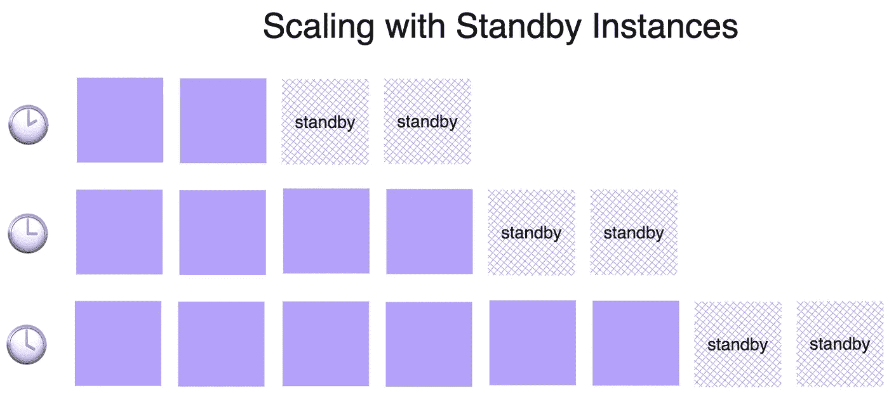
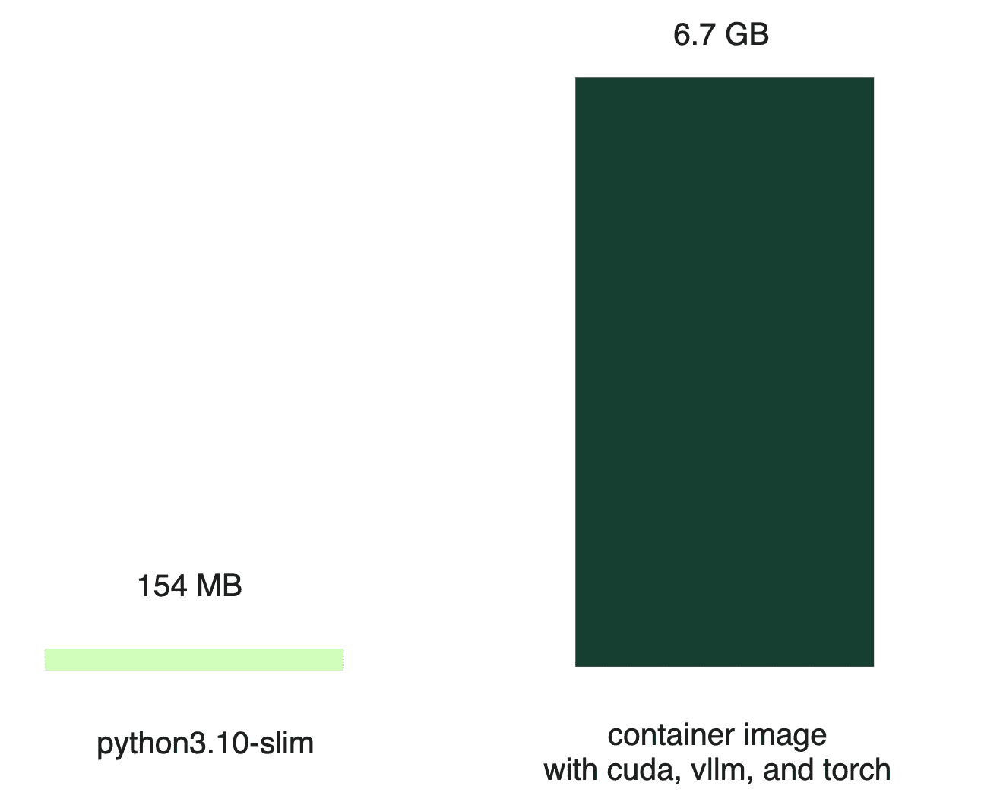
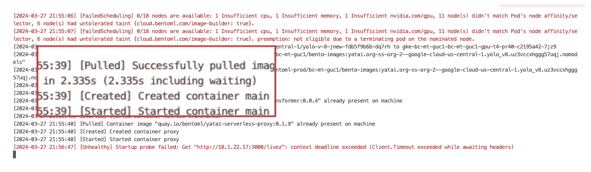
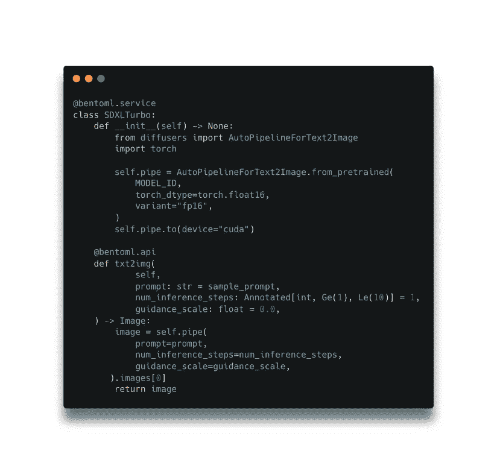
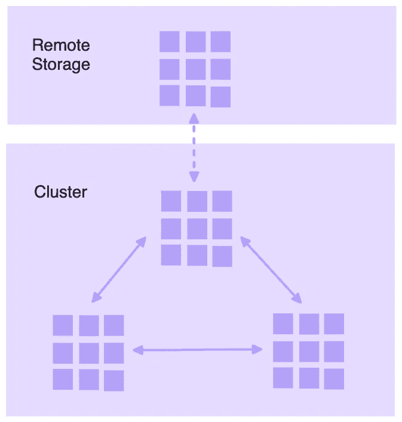
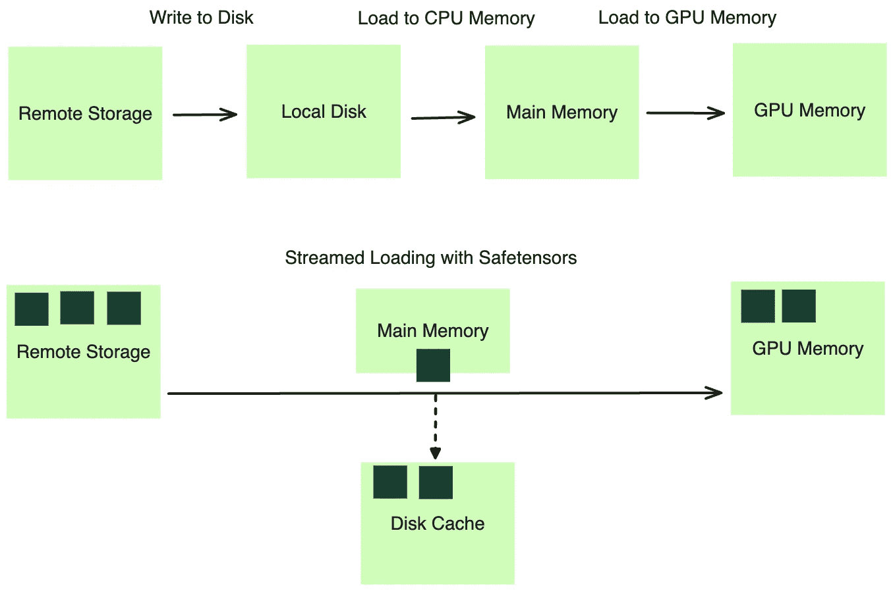
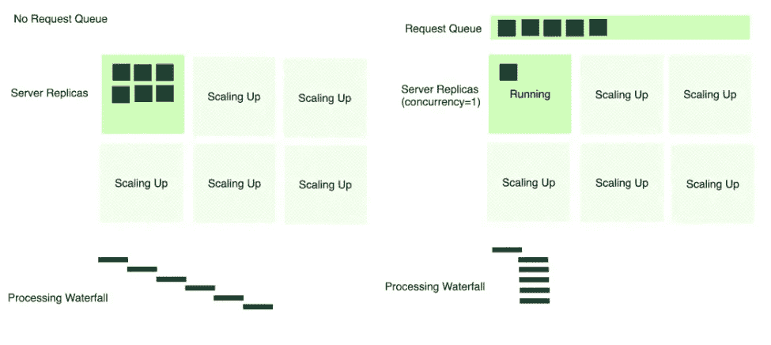
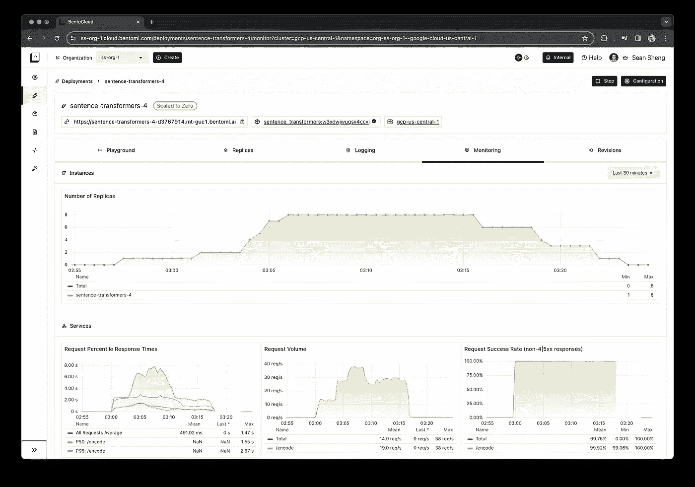

# 像您所期望的那样扩展 AI 模型

> 原文：[`towardsdatascience.com/scaling-ai-models-like-you-mean-it-3afa56c1e14b?source=collection_archive---------5-----------------------#2024-04-10`](https://towardsdatascience.com/scaling-ai-models-like-you-mean-it-3afa56c1e14b?source=collection_archive---------5-----------------------#2024-04-10)

## 克服在生产环境中扩展开源 AI 模型挑战的策略

[](https://medium.com/@ssheng?source=post_page---byline--3afa56c1e14b--------------------------------)[](https://towardsdatascience.com/?source=post_page---byline--3afa56c1e14b--------------------------------) [Sean Sheng](https://medium.com/@ssheng?source=post_page---byline--3afa56c1e14b--------------------------------)

·发布于 [Towards Data Science](https://towardsdatascience.com/?source=post_page---byline--3afa56c1e14b--------------------------------) ·11 分钟阅读·2024 年 4 月 10 日

--

如果你正在阅读这篇文章，可能不需要我再介绍部署开源模型的优势。在过去几年里，我们已经见证了开源模型在数量和质量上的惊人增长。

+   像 Hugging Face 这样的平台使得各种模型的访问变得更加民主化，包括大型语言模型（LLMs）和扩散模型，这使得开发者能够自由高效地进行创新。

+   开发者享有更大的自主性，因为他们可以自由地微调和组合不同的模型，从而推动创新方法的出现，比如检索增强生成（RAG）和创建先进的智能体。

+   从经济角度来看，开源模型提供了可观的成本节省，使得使用较小、专用的模型成为可能，这些模型相较于像 GPT-4 这样的通用模型更加节省预算。

开源模型呈现出一种有吸引力的解决方案，但下一个难题是什么呢？与使用像 OpenAI 这样的模型端点不同，后者的模型是 API 背后的可扩展黑箱，部署自己的开源模型则引入了扩展问题。确保你的模型能够有效扩展以应对生产流量，并在流量激增期间保持无缝体验，至关重要。此外，合理管理成本也很重要，这样你只需为实际使用的部分付费，避免在月底遇到财务上的意外。

# 真正的方向：面向 GPU 的无服务器函数

有趣的是，这听起来像是现代无服务器架构（如 AWS Lambda）已经解决的挑战——这是一个已经存在近十年的解决方案。然而，当涉及到 AI 模型部署时，情况并非完全如此。

无服务器函数在 AI 部署中的局限性是多方面的。

+   **没有 GPU 支持**。像 AWS Lambda 这样的平台不支持 GPU。这不仅仅是一个技术疏漏，而是由于架构和实际考虑所致。

+   **GPU 无法轻松共享**。虽然 GPU 作为设备具有高度并行性，但它在同时处理不同模型的多个推理任务时，灵活性不如其他技术。

+   **GPU 昂贵**。GPU 在模型推理任务中表现出色，但维护成本高昂，尤其是在不被持续使用的情况下。

接下来，让我们来看看我们的扩展历程以及我们在过程中学到的重要经验。

# 冷启动问题

在我们开始扩展工作之前，首先面临的是臭名昭著的“冷启动”问题。这个问题在三个不同的阶段表现出来：


冷启动问题的分析。图像来源：作者。

1.  **云资源配置**：这一阶段涉及云提供商为我们分配实例并将其整合进集群所需的时间。这个过程差异很大，通常从 30 秒到几分钟不等，有时甚至会延长到几个小时，特别是对于需求量大的实例，如 Nvidia A100 和 H100 GPU。

1.  **容器镜像拉取**：与简单的 Python 作业镜像不同，AI 模型服务镜像非常复杂，因其依赖关系和所需的自定义库。尽管云提供商宣称拥有多吉比特的网络带宽，但我们的经验表明，下载速度往往远低于这一标准，镜像拉取时间大约为 3 分钟。

1.  **模型加载**。所需时间主要取决于模型的大小，像 LLM 和扩散模型这样的大型模型由于拥有数十亿个参数，需要显著更长的时间。例如，加载一个 5GB 的模型（如 Stable Diffusion 2）可能需要大约 1.3 分钟，前提是网络带宽为 1Gbps，而更大的模型如 Llama 13B 和 Mixtral 8x7B 则分别需要 3.5 分钟和 12.5 分钟。

冷启动问题的每个阶段都需要采取特定的策略来最小化延迟。在接下来的章节中，我们将更详细地探讨每个阶段，分享我们的策略和解决方案。

## 云资源配置

与无服务器 CPU 的同质化环境不同，管理多种计算实例类型在处理 GPU 时至关重要，因为每种 GPU 都针对特定的使用案例进行优化。例如，IO 密集型的 LLM 模型需要较高的 GPU 内存带宽和容量，而生成式模型则需要更强大的 GPU 计算能力。

在流量高峰期间确保可用性，通过保持所有 GPU 实例类型可能会导致不可承受的高成本。为了避免空闲实例带来的财务压力，我们实施了“备用实例”机制。我们没有为最大潜在负载做准备，而是维护了一个与增量扩展步长相匹配的计算备用实例数量。例如，如果我们一次扩展两个 GPU，我们就需要准备两个备用实例。这使我们能够在需求激增时迅速向服务队列中添加资源，显著减少等待时间，同时保持成本可控。



图片来源：作者。

在多租户环境中，多个团队或在我们的案例中，多个组织共享一个公共资源池，我们可以实现更高效的资源利用率。这个共享环境使我们能够平衡不同的资源需求，有助于提高成本效率。然而，管理多租户环境也带来了挑战，例如强制执行配额和确保网络隔离，这可能会增加集群的复杂性。

## 容器镜像拉取

无服务器 CPU 工作负载通常使用轻量级镜像，如 Python slim 镜像（约 154 MB）。相比之下，为了提供 LLM 服务的容器镜像可能要大得多（6.7 GB）；其中大部分大小来自于运行 AI 模型所需的各种依赖项。



图片来源：作者。

尽管云服务提供商宣传了高带宽网络，实际情况往往远低于预期，实际下载速度仅为承诺速度的一个小部分。

实际上，很多文件根本没有被使用。一种方式是优化容器镜像本身，但这很快证明是不可管理的。相反，我们将注意力转向按需文件拉取方法。具体来说，我们首先只下载镜像元数据，实际的远程文件则在需要时再拉取。此外，我们利用集群中的点对点网络来大幅提高拉取效率。



容器镜像元数据可以在几秒钟内拉取。图片来源：作者。

通过这些优化，我们将镜像拉取时间从几分钟减少到几秒钟。然而，大家都知道，这个测量实际上是在“作弊”，因为实际的文件并没有在此阶段被拉取。真正的文件拉取发生在服务运行时。因此，拥有一个允许在各生命周期阶段定义行为的服务框架至关重要，例如初始化和服务。在初始化阶段完成所有引导工作后，我们可以确保拉取所有文件依赖项。这样，在服务时，就不会因拉取文件而产生延迟。



启动服务框架并定义 API 的服务框架。图片来源：作者。

在上述示例中，模型加载是在`__init__`初始化生命周期中完成的，服务则在`@bentoml.api`命名的`txt2img`中进行。

## 模型加载

最初，最直接的模型加载方法是从远程存储（如 Hugging Face）中直接获取。通过使用内容分发网络（CDN）、NVMe SSD 和共享内存，我们能够消除一些瓶颈。尽管这种方法可行，但远未达到最优。

为了改善这一过程，我们考虑了使用区域内网络带宽。我们在分布式文件系统中预先加载模型，并将其分割成较小的块，允许并行下载。这大大提高了性能，但我们仍然遇到了云服务商网络带宽的瓶颈。

为此，我们进一步优化了利用集群内网络带宽的方法，通过使用点对点共享和利用本地缓存。虽然这些改进显著，但它们增加了处理过程的复杂性，我们需要将其从开发人员的操作中抽象出来。



图片来自作者。

即使采用了上述做法，我们仍然面临着一个顺序瓶颈：每个步骤完成后才能进行下一个步骤的等待问题。模型必须完全下载到持久化驱动器中，然后加载到 CPU 内存中，再加载到 GPU 内存。



图片来自作者。

我们转向了一种基于流的模型权重加载方法，利用我们现有的分布式文件缓存系统。该系统允许程序像所有文件都逻辑上存储在磁盘上一样进行操作。实际上，所需的数据是按需从远程存储中获取，从而避免了磁盘写入。通过利用像[Safetensors](https://github.com/huggingface/safetensors)这样的格式，我们可以通过内存映射（mmap）将模型权重高效加载到主内存中，然后以流式方式加载到 GPU 内存中。

此外，我们还采用了异步磁盘写入。通过这样做，我们在本地磁盘上创建了一个更快速访问的缓存层。因此，只有代码更改的新部署可以绕过较慢的远程存储获取阶段，直接从本地缓存读取模型权重。

总结来说，我们成功优化了冷启动时间，并对结果感到满意：

+   **没有云提供商延迟**，配备待命实例。

+   **更快的容器镜像拉取**，通过按需和点对点流式传输。

+   **通过分布式文件系统、点对点缓存和流式加载到 GPU 内存中，加速了模型加载**。

+   服务框架启用了**并行**图像拉取和模型加载。

# 扩展指标

接下来，我们需要确定在 GPU 上扩展 AI 模型部署的最具指示性的信号。

## 资源利用率指标

最初，我们考虑了 CPU 利用率。它直观且有一个默认的阈值，例如 80%。然而，显而易见的缺点是，CPU 度量无法捕捉 GPU 的利用情况。此外，Python 中的全局解释器锁（GIL）限制了并行性，阻止了多核实例上的高 CPU 利用率，这使得 CPU 利用率成为一个不太可行的度量。

我们还探索了 GPU 利用率作为衡量模型工作负载的更直接指标。然而，我们遇到了一个问题：工具如`nvml`报告的 GPU 利用率并未准确反映 GPU 的实际利用情况。该度量是通过一定时间段内对内核使用情况的采样来计算的，如果至少有一个内核在执行，GPU 就被认为是被利用的。这与我们的观察一致，即通过改进批处理，尽管 GPU 设备已经报告为高利用率，但通常可以实现更好的性能。

> ***注意****：根据[*NVIDIA 文档*](https://nvidia.custhelp.com/app/answers/detail/a_id/3751/~/useful-nvidia-smi-queries)*，utilization.gpu 表示“过去采样周期内，一个或多个内核在 GPU 上执行的时间百分比。采样周期可能是 1 秒到 1/6 秒，具体取决于产品。”*

基于资源的度量本质上是回顾性的，因为它们只反映在资源被消耗后才会出现的使用情况。它们也被限制在 100%，这带来了一个问题：当根据这些度量进行扩展时，调整的最大比例通常是当前利用率与所需阈值之间的比例（见下面的扩展公式）。这导致了一种保守的扩展行为，未必能准确匹配生产流量的实际需求。

```py
desiredReplicas = ceil[currentReplicas * ( currentMetricValue / desiredMetricValue )]
```

## 基于请求的度量

我们转向了基于请求的度量，作为更主动的信号，它们也不受 100%限制。

QPS 是一个被广泛认可的度量，因其简单性。然而，它在生成式 AI 中的应用，如 LLM，仍然存在疑问。QPS 的配置并不容易，并且由于每个请求的成本变化，取决于处理和生成的标记数量，使用 QPS 作为扩展度量可能会导致不准确。

另一方面，并发性被证明是反映系统实际负载的理想度量。它代表了排队或正在处理的活跃请求的数量。这个度量：

+   精确反映系统的负载。[小洛特法则](https://en.wikipedia.org/wiki/Little%27s_law)指出，QPS 乘以平均延迟等于并发性，提供了一种优雅的方式来理解 QPS 和并发性之间的关系。在实际操作中，模型服务中每个请求的平均延迟是相对未知的。然而，通过测量并发性，我们无需计算平均延迟。

+   使用扩展公式准确计算所需的副本数。允许部署直接扩展到理想规模，而无需中间步骤。

+   基于批次大小易于配置。对于不能批处理的模型，只需配置 GPU 数量，因为每个 GPU 一次只能处理一个生成任务。对于支持批处理的模型，批次大小决定了并发级别。

为了使并发有效，我们需要服务框架的支持，自动将并发作为度量标准并将其作为扩展信号提供给部署平台。我们还必须建立正确的扩展策略，以防在流量激增时过度扩展，或者在流量稀少时过早缩减。

# 请求队列

另一个我们与并发集成的重要机制是请求队列。它充当缓冲区和调度器，确保传入的请求得到高效处理，并且不会使任何单一服务器副本过载。

在没有请求队列的情况下，所有传入请求都会直接分配给服务器（如下图所示，6 个请求）。如果多个请求同时到达，而只有一个活跃的服务器副本，那么它会成为瓶颈。服务器会尝试按照先来先服务的方式处理每个请求，这通常会导致超时并影响客户端体验。



图片由作者提供。

相反，使用请求队列时，服务器按最优速率消费请求，基于为服务定义的*并发*速率处理。当额外的服务器副本扩展时，它们也会开始从队列中拉取请求。该机制防止任何单一服务器过载，并且能够更平滑、更可管理地分配请求到可用的基础设施上。

# 结论

我们在探索 AI 模型扩展解决方案的过程中经历了一次冒险，这最终使我们创造了 BentoCloud 上的扩展体验——一个囊括了我们所有学习成果的平台。

为了避免给人宣传的印象，我们将通过一张千言万语的图片来说明我们的观点。下面的监控仪表板展示了传入请求与服务器实例扩展之间的关系。

与扩展能力同样重要的是缩放的能力。当请求减少到零时，部署会相应地减少活跃实例的数量。这一能力确保了不会因未使用的资源而产生不必要的成本，使开支与实际使用情况相符。



BentoCloud 监控仪表板。图片由作者提供。

我们希望大家能从中获得的启示是，模型部署的扩展应被视为生产应用中的一个重要方面。与扩展 CPU 工作负载不同，在 GPU 上扩展模型部署面临独特的挑战，包括冷启动时间、配置扩展指标和调度请求等。在评估部署平台时，应彻底评估它们应对这些挑战的解决方案。
