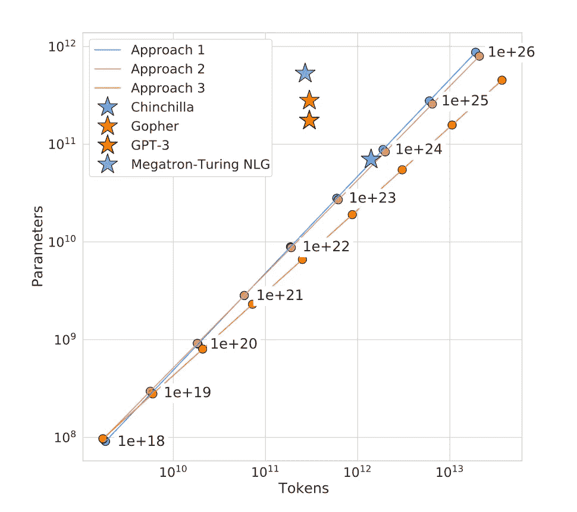

# 语言模型的规模定律

> 原文：[`towardsdatascience.com/scaling-law-of-language-models-5759de7f830c?source=collection_archive---------5-----------------------#2024-07-09`](https://towardsdatascience.com/scaling-law-of-language-models-5759de7f830c?source=collection_archive---------5-----------------------#2024-07-09)

## 语言模型如何随模型规模、训练数据和训练计算的变化而扩展

 [Mina Ghashami](https://medium.com/@mina.ghashami?source=post_page---byline--5759de7f830c--------------------------------)

·发布于 [Towards Data Science](https://towardsdatascience.com/?source=post_page---byline--5759de7f830c--------------------------------) ·阅读时间：8 分钟·2024 年 7 月 9 日

--

LLMs 的规模定律行为 — 图片来源：[1]

人工智能的世界正见证一场革命，而在这场革命的前沿，是不断增长强大的大型语言模型。从 BERT 到 GPT-3，再到 PaLM，这些人工智能巨头不断突破自然语言处理的边界。但你有没有想过，是什么推动了它们能力的飞速增长？

在这篇文章中，我们将开始一段令人着迷的旅程，深入了解语言模型规模化的核心。我们将揭示使这些模型得以成功的秘密配方——它是三种关键因素的强力结合：模型规模、训练数据和计算能力。通过理解这些因素如何相互作用和扩展，我们将获得对人工智能语言模型过去、现在和未来的宝贵洞察。

所以，让我们深入探讨并揭开推动语言模型不断突破性能和能力的新高度的规模定律之谜。

**目录**：本文包含以下几个部分：

1.  **介绍**

+   最近语言模型发展的概述

+   语言模型规模化的关键因素
