# 数据缩放解释：带有代码示例的初学者可视化指南

> 原文：[`towardsdatascience.com/scaling-numerical-data-explained-a-visual-guide-with-code-examples-for-beginners-11676cdb45cb?source=collection_archive---------3-----------------------#2024-09-06`](https://towardsdatascience.com/scaling-numerical-data-explained-a-visual-guide-with-code-examples-for-beginners-11676cdb45cb?source=collection_archive---------3-----------------------#2024-09-06)

## 数据预处理

## 将成人尺寸的数据转化为适合儿童的模型

[](https://medium.com/@samybaladram?source=post_page---byline--11676cdb45cb--------------------------------)[](https://towardsdatascience.com/?source=post_page---byline--11676cdb45cb--------------------------------) [Samy Baladram](https://medium.com/@samybaladram?source=post_page---byline--11676cdb45cb--------------------------------)

·发表于 [Towards Data Science](https://towardsdatascience.com/?source=post_page---byline--11676cdb45cb--------------------------------) ·阅读时长 10 分钟·2024 年 9 月 6 日

--

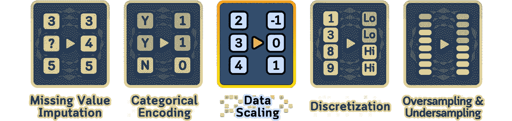

`⛳️ 更多的 [数据预处理](https://medium.com/@samybaladram/list/data-preprocessing-17a2c49b44e4) 解释： · 缺失值填充 · 分类编码 ▶ 数据缩放 · 离散化 · 过采样与欠采样 · 数据泄露与预处理`

原始数据集中的数值特征就像是在为成年人打造的世界中的成人。有些特征像摩天大楼一样高耸（比如数十亿的收入），而其他特征则几乎看不见（如 0.001 的概率）。但是我们的机器学习模型呢？它们就像孩子一样，努力理解这个成人的世界。

数据缩放（包括一些人所称的“归一化”）是将这些成人尺寸的数字转化为适合儿童的比例的过程。它的目标是创造一个公平的竞争环境，让每个特征，无论大小，都能被理解并得到适当的重视。

我们将展示五种不同的缩放技术，所有的示例都基于一个小数据集（当然，包含一些可视化）。从标准化的轻柔处理到 Box-Cox 变换的数学魔法，你将看到选择合适的缩放方法如何成为你机器学习方程式中的秘密武器。


所有可视化：作者使用 Canva Pro 创建，已优化为移动端显示；在桌面端可能会显得过大。

# 理解哪些数据需要转换

在深入讨论缩放技术之前，了解哪些类型的数据适合缩放，哪些不适合缩放是很有帮助的：

## 通常不需要缩放的数据：

1.  **分类变量**：这些通常应该进行编码，而不是缩放。这包括名义型和有序型分类数据。

1.  **二元变量**：只能取两个值（0 和 1，或 True 和 False）的特征通常不需要缩放。

1.  **计数数据**：整数计数通常按原样使用，缩放可能使它们更难理解。将它们视为分类数据。特别是对于具有非常宽范围的计数数据，可能会有一些例外。

1.  **周期性特征**：具有周期性质的数据（如星期几或月份）通常更适合使用周期性编码，而非标准的缩放技术。

## 通常需要缩放的数据：

1.  **范围广泛的连续数值特征**：可以取多个值的特征通常受益于缩放，以防它们在模型中主导其他特征。

1.  **单位不同的特征**：当你的数据集中包含不同单位度量的特征（例如米、千克、年），缩放有助于将它们置于可比较的尺度上。

1.  **具有显著不同量级的特征**：如果某些特征的值在千位范围，而其他特征在 0 到 1 之间，缩放可以帮助平衡它们对模型的影响。

1.  **百分比或比率特征**：虽然这些特征已经处于固定的尺度（通常是 0-100 或 0-1），但在与范围更大的特征一起使用时，缩放可能仍然有益。

1.  **有界连续特征**：具有已知最小值和最大值的特征通常受益于缩放，特别是当它们的范围与数据集中其他特征有显著差异时。

1.  **偏态分布**：具有高度偏态分布的特征通常受益于某些类型的缩放或转换，以使它们更加接近正态分布，从而提升模型性能。

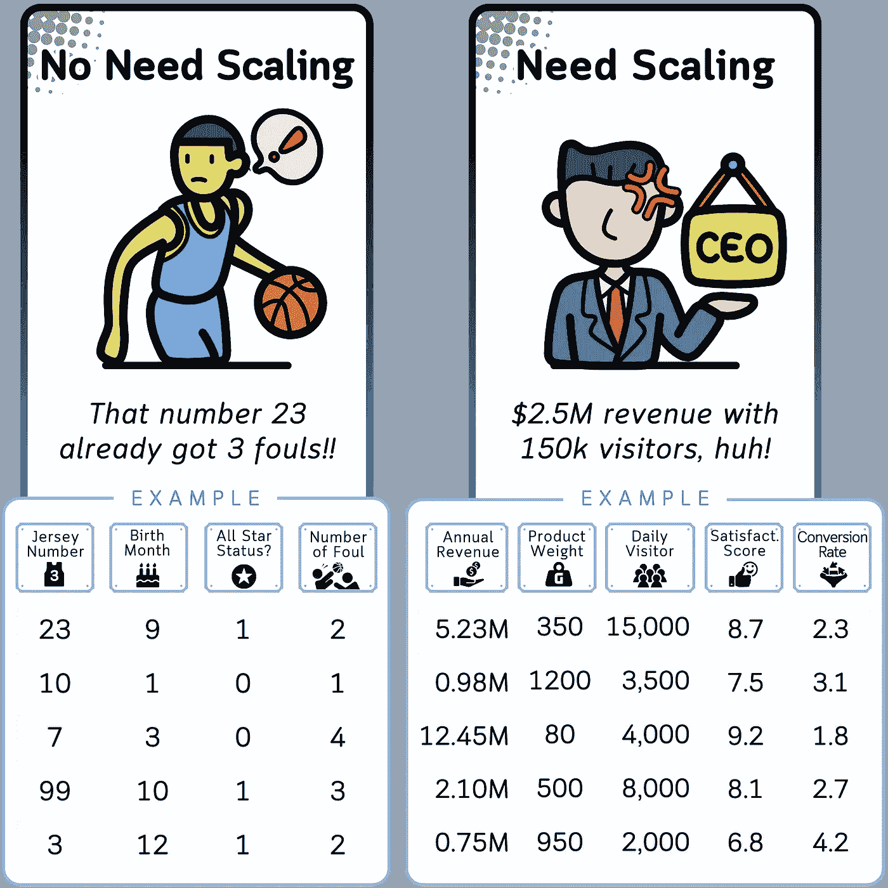

# 为什么要缩放数据？

现在，你可能会想，“为什么要进行缩放？难道我们不能让数据保持原样吗？”实际上，许多机器学习算法在所有特征处于相似尺度时表现最佳。下面是为什么需要缩放的原因：

1.  **特征重要性平衡**：未缩放的特征可能意外主导模型。例如，风速（0–50 公里/小时）可能会因为其更大的尺度，而不是因为其更重要，掩盖温度（10–35°C）。

1.  **更快的收敛**：许多机器学习中的优化算法，当特征处于相似的尺度时，会更快地收敛。

1.  **改进算法性能**：一些算法，如 K-最近邻和神经网络，明确要求数据已缩放才能表现良好。

1.  **可解释性**：在线性模型中，缩放后的系数更容易解释和比较。

1.  **避免数值不稳定**：非常大或非常小的值可能会导致某些算法中的数值不稳定。

现在我们理解了哪些数字数据需要缩放以及为何需要缩放，接下来让我们看看我们的数据集，看看如何使用五种不同的缩放方法来缩放其数值变量。它不仅仅是关于缩放——而是要正确地进行缩放。

# 数据集

在我们进入缩放技术之前，让我们先看一下我们的数据集。我们将使用来自这个虚构高尔夫俱乐部的数据。

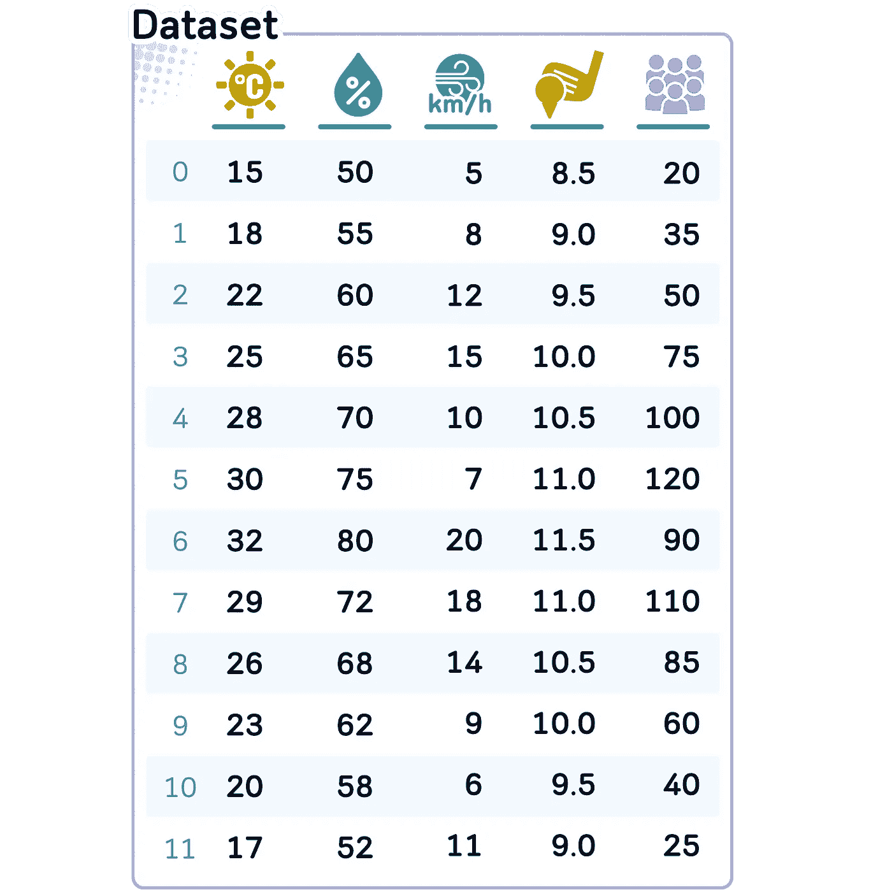

```py
import pandas as pd
import numpy as np
from sklearn.preprocessing import MinMaxScaler, StandardScaler, RobustScaler
from scipy import stats

# Read the data
data = {
    'Temperature_Celsius': [15, 18, 22, 25, 28, 30, 32, 29, 26, 23, 20, 17],
    'Humidity_Percent': [50, 55, 60, 65, 70, 75, 80, 72, 68, 62, 58, 52],
    'Wind_Speed_kmh': [5, 8, 12, 15, 10, 7, 20, 18, 14, 9, 6, 11],
    'Golfers_Count': [20, 35, 50, 75, 100, 120, 90, 110, 85, 60, 40, 25],
    'Green_Speed': [8.5, 9.0, 9.5, 10.0, 10.5, 11.0, 11.5, 11.0, 10.5, 10.0, 9.5, 9.0]
}

df = pd.DataFrame(data)
```

这个数据集非常适合我们的缩放任务，因为它包含了具有不同单位、尺度和分布的特征。

现在让我们开始了解所有的缩放方法。

# 方法 1：最小-最大缩放

最小最大缩放通过减去最小值并除以范围，将所有值转换为一个固定范围，通常在 0 到 1 之间。

**📊 常见数据类型：** 特征值范围广泛，并且希望特定范围内的值。

**🎯 目标：**

- **将特征限制在特定范围内（例如，0 到 1）。**

- 保留数据点之间的原始关系。

- 确保缩放值的可解释性。

**在我们的案例中**：我们对温度应用此方法，因为在我们的高尔夫背景下，温度有自然的最小值和最大值。它保留了温度之间的相对差异，使得 0 为最冷的一天，1 为最热的一天，0.5 为平均温度日。

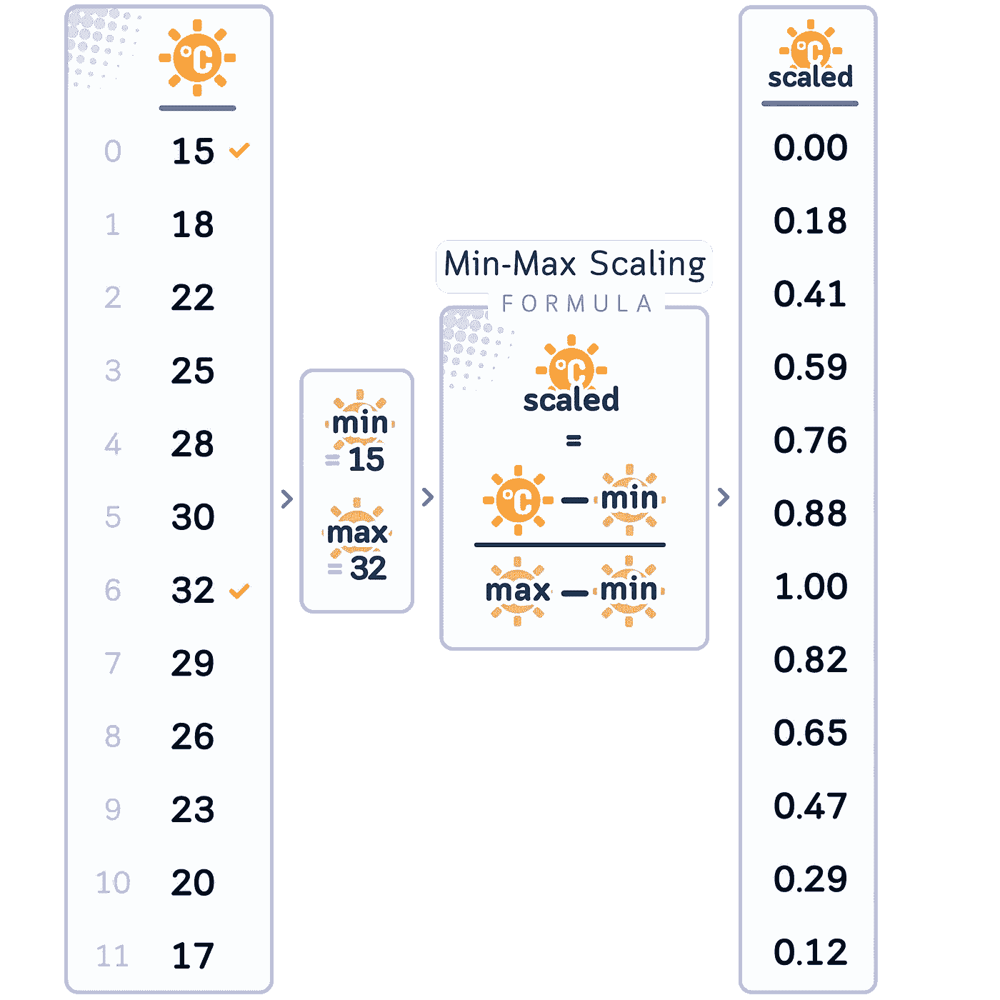

```py
# 1\. Min-Max Scaling for Temperature_Celsius
min_max_scaler = MinMaxScaler()
df['Temperature_MinMax'] = min_max_scaler.fit_transform(df[['Temperature_Celsius']])
```

# 方法 2：标准化缩放

标准化缩放将数据中心化为均值 0，并将其缩放到标准差 1，这通过减去均值并除以标准差来实现。

**📊 常见数据类型：** 具有不同尺度和分布的特征。

**🎯 目标：**

- **标准化特征，使其均值为 0，标准差为 1。**

- 确保具有不同尺度的特征在模型中有相等的贡献。

- 为对特征尺度敏感的算法准备数据（例如 SVM、KNN）。

**在我们的案例中**：我们对风速使用此方法，因为风速通常呈现近似正态分布。它允许我们通过查看与均值的标准差距离，轻松识别异常平静或风大的日子。

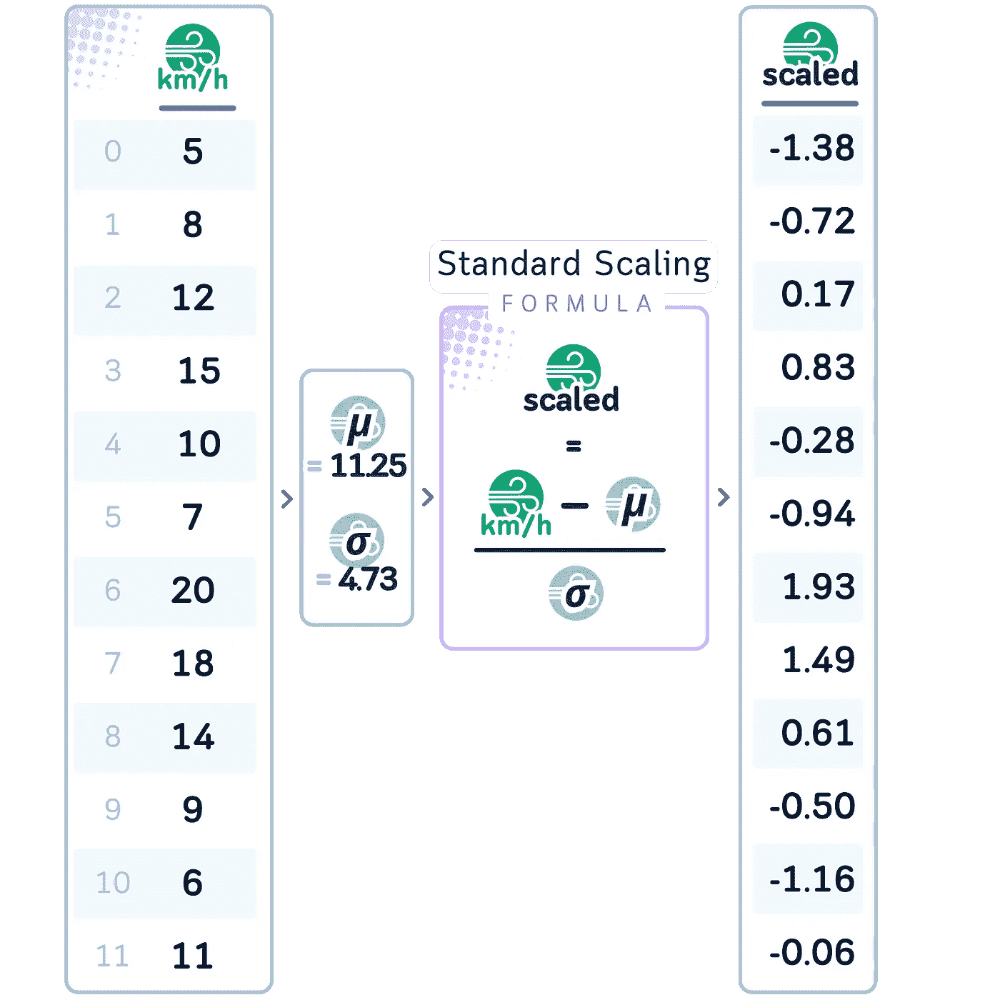

```py
# 2\. Standard Scaling for Wind_Speed_kmh
std_scaler = StandardScaler()
df['Wind_Speed_Standardized'] = std_scaler.fit_transform(df[['Wind_Speed_kmh']])
```

# 方法 3：鲁棒缩放

鲁棒缩放将数据中心化为中位数，并使用四分位间距（IQR）进行缩放。

**📊 常见数据类型：** 具有异常值或噪声数据的特征。

**🎯 目标：

-** 有效处理异常值，不会被其过度影响。

- 保持数据点的相对顺序。

- 在存在噪声数据的情况下实现稳定的缩放。

**在我们的案例中**：我们将其应用于湿度，因为湿度读数可能因极端天气条件或测量误差而出现异常值。这种缩放确保了我们的测量结果对这些异常值不那么敏感。

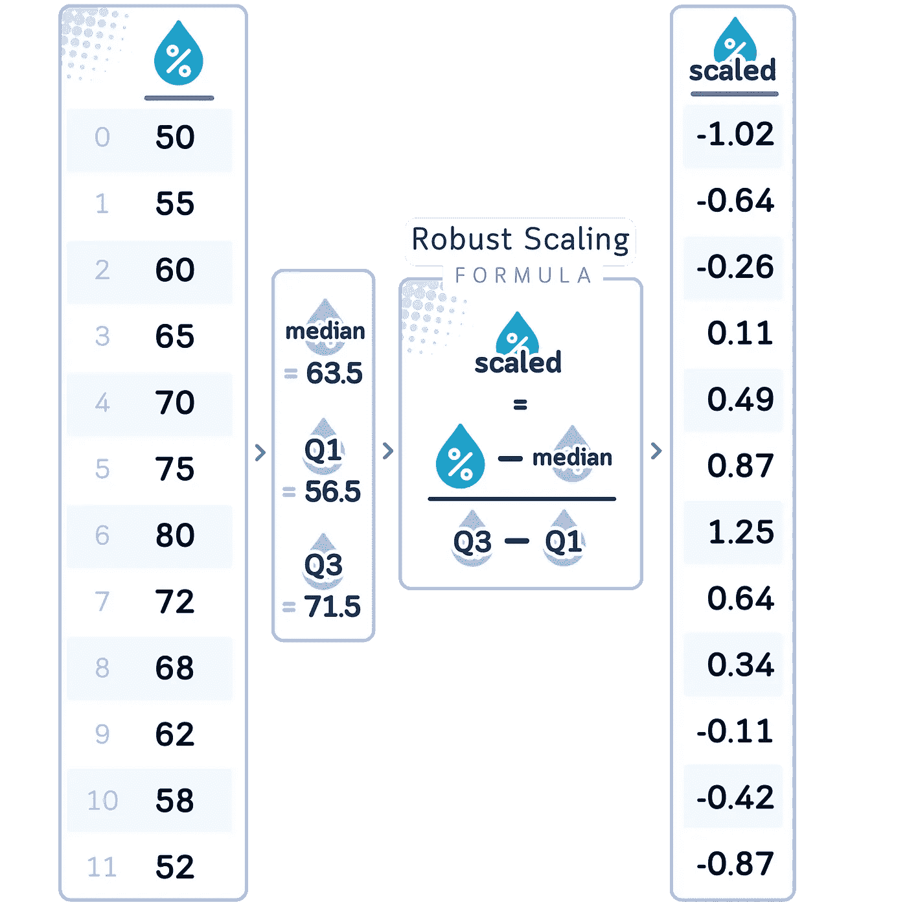

```py
# 3\. Robust Scaling for Humidity_Percent
robust_scaler = RobustScaler()
df['Humidity_Robust'] = robust_scaler.fit_transform(df[['Humidity_Percent']])
```

到目前为止，我们已经看过几种使用缩放的方法。现在，让我们探索另一种方法——使用变换来实现缩放，从常见的对数变换技术开始。

# 方法 4：对数变换

它对数据应用对数函数，压缩非常大值的尺度。

**📊 常见数据类型：**

- 右偏数据（长尾）。

- 计数数据。

- 具有乘法关系的数据。

**🎯 目标：

-** 解决右偏性并规范化分布。

- 稳定特征范围内的方差。

- 提高具有这些特征的数据的模型表现。

**在我们的案例中**：我们将其应用于高尔夫球员数量，因为计数数据通常呈现右偏分布。它使得 10 和 20 名球员之间的差异比 100 和 110 名球员之间的差异更为显著，这与这些差异在现实世界中的影响相符。

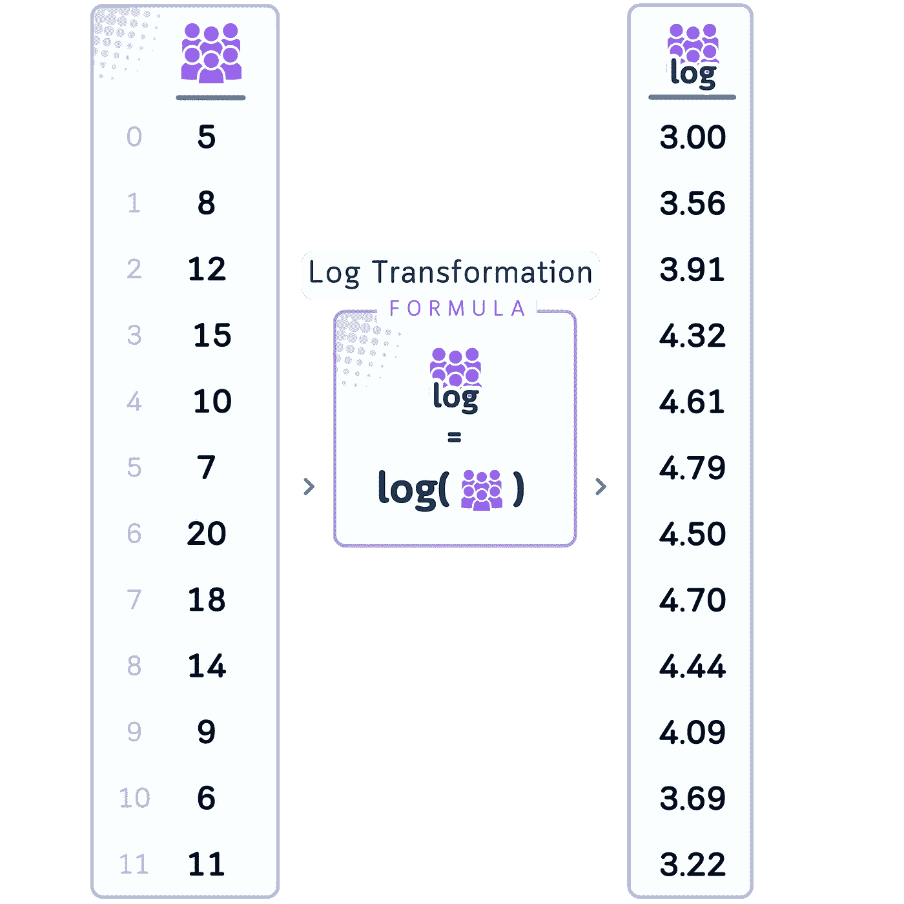

```py
# 4\. Log Transformation for Golfers_Count
df['Golfers_Log'] = np.log1p(df['Golfers_Count'])
```

# 方法 5：Box-Cox 变换

这是一种幂变换族（包括对数变换作为特殊情况），旨在通过应用具有参数λ（λ）的幂变换来规范化数据分布，从而优化以达到所需的正态性。

**常见数据类型：** 需要规范化以接近正态分布的特征。

**🎯 目标：

-** 规范化特征的分布。

- 提高假设数据符合正态分布的模型的表现。

- 稳定方差并可能增强线性关系。

**在我们的案例中**：我们将其应用于绿色速度，因为它可能具有复杂的分布，无法通过更简单的方法进行规范化。这使得数据可以引导我们找到最合适的变换，可能改善其与其他变量的关系。

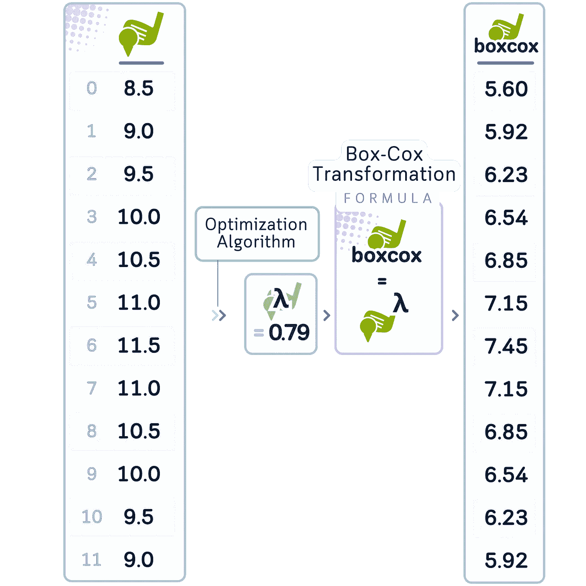

```py
# 5\. Box-Cox Transformation for Green_Speed
df['Green_Speed_BoxCox'], lambda_param = stats.boxcox(df['Green_Speed'])
```

在进行变换后，通常还会进一步进行缩放，使其符合某种分布（如正态分布）。我们可以对这两个已经变换过的列进行此操作。

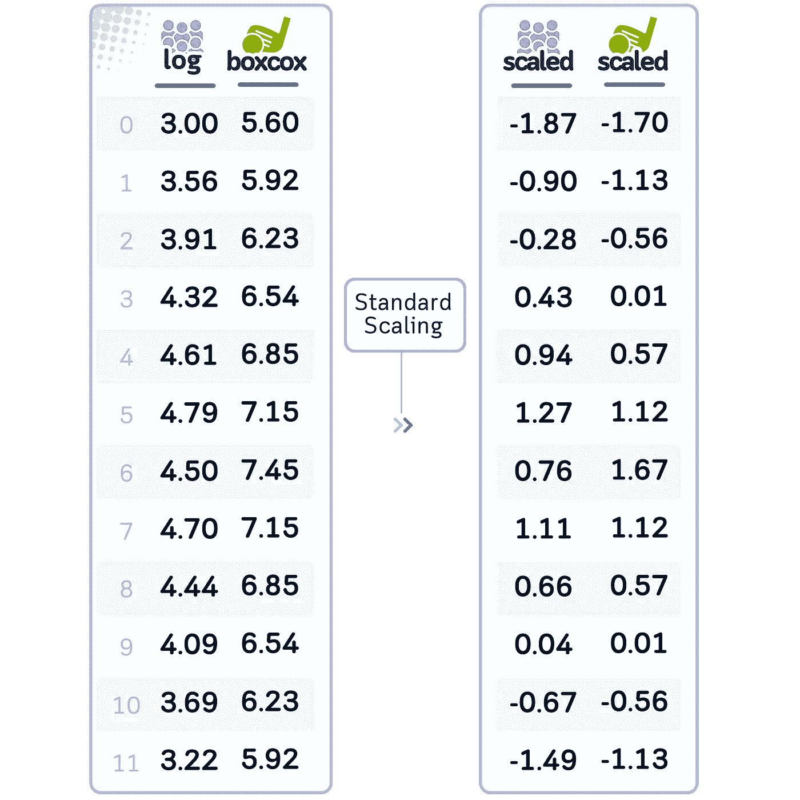

```py
 df['Golfers_Count_Log'] = np.log1p(df['Golfers_Count']) 
df['Golfers_Count_Log_std'] = standard_scaler.fit_transform(df[['Golfers_Count_Log']])

box_cox_transformer = PowerTransformer(method='box-cox') # By default already has standardizing
df['Green_Speed_BoxCox'] = box_cox_transformer.fit_transform(df[['Green_Speed']])print("\nBox-Cox lambda parameter:", lambda_param)
print("\nBox-Cox lambda parameter:", lambda_param)
```

# **结论：缩放的力量**

所以，情况就是这样。五种不同的缩放技术，都应用到了我们的高尔夫球场数据集上。现在，所有的数值特征都已转化，准备好用于机器学习模型。

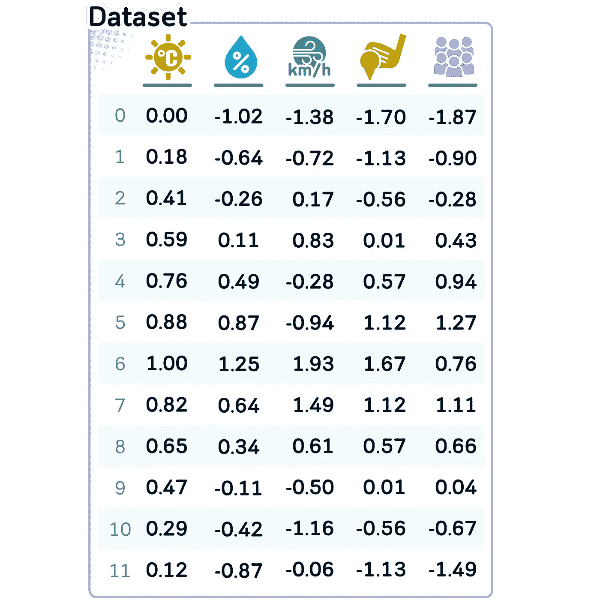

这里是每种方法及其应用的快速回顾：

+   **Min-Max 缩放**：应用于温度，将数值标准化到 0–1 范围内，以便更好地进行模型解释。

+   **标准缩放**：用于风速，将分布标准化，以减少极端值的影响。

+   **鲁棒缩放**：应用于湿度，以处理潜在的异常值，并减少它们对模型性能的影响。

+   **对数变换**：用于高尔夫球手数量，规范右偏的计数数据，并提高模型的稳定性。

+   **Box-Cox 变换**：应用于绿色速度，使分布更接近正态分布，这通常是机器学习算法所要求的。

每种缩放方法都有其特定的目的，并根据数据的性质和机器学习算法的要求进行选择。通过应用这些技术，我们已经为不同的机器学习模型准备了数值特征，可能会提高其性能和可靠性。

# 🌟 数值数据缩放，代码总结

```py
import pandas as pd
import numpy as np
from sklearn.preprocessing import MinMaxScaler, StandardScaler, RobustScaler, PowerTransformer

# Read the data
data = {
    'Temperature_Celsius': [15, 18, 22, 25, 28, 30, 32, 29, 26, 23, 20, 17],
    'Humidity_Percent': [50, 55, 60, 65, 70, 75, 80, 72, 68, 62, 58, 52],
    'Wind_Speed_kmh': [5, 8, 12, 15, 10, 7, 20, 18, 14, 9, 6, 11],
    'Golfers_Count': [20, 35, 50, 75, 100, 120, 90, 110, 85, 60, 40, 25],
    'Green_Speed': [8.5, 9.0, 9.5, 10.0, 10.5, 11.0, 11.5, 11.0, 10.5, 10.0, 9.5, 9.0]
}

df = pd.DataFrame(data)

# 1\. Min-Max Scaling for Temperature_Celsius
min_max_scaler = MinMaxScaler()
df['Temperature_MinMax'] = min_max_scaler.fit_transform(df[['Temperature_Celsius']])

# 2\. Standard Scaling for Wind_Speed_kmh
std_scaler = StandardScaler()
df['Wind_Speed_Standardized'] = std_scaler.fit_transform(df[['Wind_Speed_kmh']])

# 3\. Robust Scaling for Humidity_Percent
robust_scaler = RobustScaler()
df['Humidity_Robust'] = robust_scaler.fit_transform(df[['Humidity_Percent']])

# 4\. Log Transformation for Golfers_Count
df['Golfers_Log'] = np.log1p(df['Golfers_Count'])
df['Golfers_Log_std'] = standard_scaler.fit_transform(df[['Golfers_Log']])

# 5\. Box-Cox Transformation for Green_Speed
box_cox_transformer = PowerTransformer(method='box-cox') # By default already has standardizing
df['Green_Speed_BoxCox'] = box_cox_transformer.fit_transform(df[['Green_Speed']])

# Display the results
transformed_data = df[[
    'Temperature_MinMax', 
    'Humidity_Robust', 
    'Wind_Speed_Standardized',
    'Green_Speed_BoxCox',
    'Golfers_Log_std', 
]]

transformed_data = transformed_data.round(2)
print(transformed_data)
```

## ⚠️ 澄清“缩放”、“标准化”和“变换”

由于这些术语在数据科学中经常被不一致地使用，下面我来澄清一下它们之间的区别：

1.  **缩放**：这是一个更广泛的术语，指改变数值范围。它包括像以下的技术：

    - Min-Max 缩放（将数据缩放到一个固定的范围，通常是 0–1）

    - 标准缩放（将数据缩放到均值为 0，标准差为 1）

1.  **标准化**：在严格的统计意义上，通常是指将不同量表上测得的数值调整到统一的量表，通常是为了使特征具有正态分布的性质。常见的技术包括：

    - Z-score 标准化（与标准缩放相同）

    - 对数标准化

    - Box-Cox 变换

1.  **变换**：这是一个广义的术语，指任何应用于改变数据集数值或分布的数学操作。它包括缩放和标准化，以及其他操作，如：

    - 幂变换（例如平方根、立方根）

    - 对数变换

    - 指数变换

但实际上：

- 有些人专门用“标准化”来指代缩放到[0,1]区间（Min-Max 缩放）。

- 其他人几乎将“标准化”和“缩放”互换使用。

- “变换”有时与“缩放”和“标准化”互换使用，但它实际上是一个更一般的术语。

鉴于这种重叠和不一致的使用，出于简化考虑，我决定在面向初学者的文章中使用“缩放”一词。与其纠结于术语争论，不如专注于每种技术的作用。

## 进一步阅读

要详细了解[MinMaxScaler](https://scikit-learn.org/stable/modules/generated/sklearn.preprocessing.MinMaxScaler.html)、[StandardScaler](https://scikit-learn.org/stable/modules/generated/sklearn.preprocessing.StandardScaler.html)、[RobustScaler](https://scikit-learn.org/stable/modules/generated/sklearn.preprocessing.RobustScaler.html)及其在 scikit-learn 中的实现，读者可以参考官方文档[1]，其中提供了关于其使用和参数的详细信息。

## 技术环境

本文使用的是 Python 3.7 和 scikit-learn 1.5。尽管讨论的概念通常适用，但具体的代码实现可能会因不同版本而略有不同。

## 关于插图

除非另有说明，所有图片均由作者创作，结合了 Canva Pro 的授权设计元素。

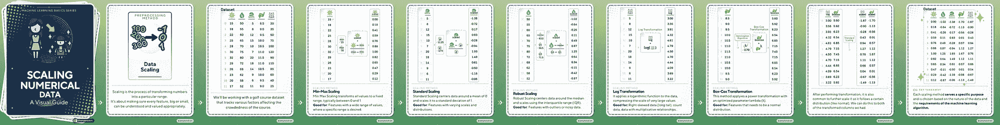

要查看简洁的视觉总结，请访问[该 Instagram 帖子](https://www.instagram.com/p/C_kb6TQSrgY/)。

# 参考文献

[1] F. Pedregosa 等人，[Scikit-learn：Python 中的机器学习](https://www.jmlr.org/papers/volume12/pedregosa11a/pedregosa11a.pdf)，《机器学习研究杂志》，第 12 卷，第 2825–2830 页，2011 年。

𝙎𝙚𝙚 𝙢𝙤𝙧𝙚 𝘿𝙖𝙩𝙖 𝙋𝙧𝙚𝙥𝙧𝙤𝙘𝙚𝙨𝙨𝙞𝙣𝙜 𝙢𝙚𝙩𝙝𝙤𝙙𝙨 𝙝𝙚𝙧𝙚:


[Samy Baladram](https://medium.com/@samybaladram?source=post_page-----11676cdb45cb--------------------------------)

## 数据预处理

[查看列表](https://medium.com/@samybaladram/list/data-preprocessing-17a2c49b44e4?source=post_page-----11676cdb45cb--------------------------------)6 篇故事

𝙔𝙤𝙪 𝙢𝙞𝙜𝙝𝙩 𝙖𝙡𝙨𝙤 𝙡𝙞𝙠𝙚:


[Samy Baladram](https://medium.com/@samybaladram?source=post_page-----11676cdb45cb--------------------------------)

## 分类算法

[查看列表](https://medium.com/@samybaladram/list/classification-algorithms-b3586f0a772c?source=post_page-----11676cdb45cb--------------------------------)8 个故事！[](../Images/f95c1a80b88fe6220b18cd3b2a83a30d.png)

[Samy Baladram](https://medium.com/@samybaladram?source=post_page-----11676cdb45cb--------------------------------)

## 回归算法

[查看列表](https://medium.com/@samybaladram/list/regression-algorithms-b0b6959f1b39?source=post_page-----11676cdb45cb--------------------------------)5 个故事！一只戴着小辫子和粉色帽子的卡通玩偶。这个“假人”玩偶，以其简单的设计和心形图案的衬衫，直观地代表了机器学习中的虚拟回归器概念。就像这个玩具般的形象是一个简化的、静态的人物表示，虚拟回归器是作为基线的基本模型，用于更复杂的分析。
