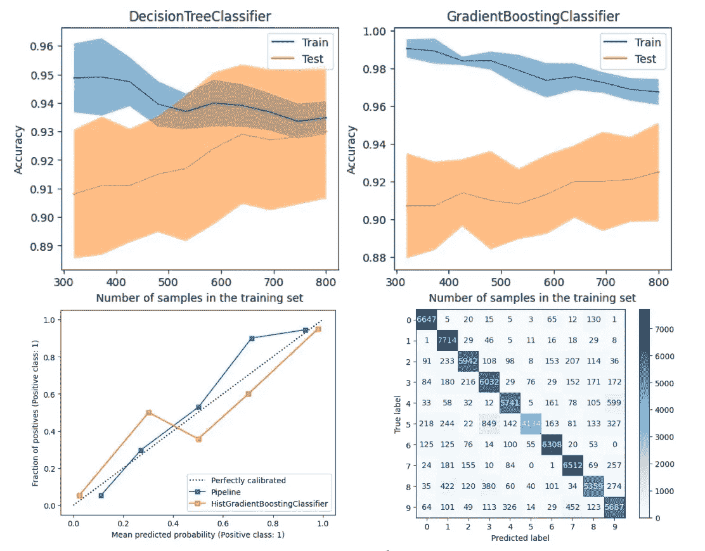
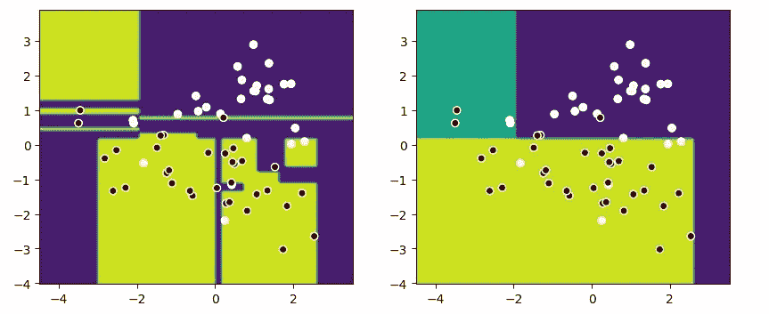

# Scikit-learn 可视化指南：让模型“开口说话”

> 原文：[`towardsdatascience.com/scikit-learn-visualization-guide-making-models-speak-6ee32a3c5c04?source=collection_archive---------0-----------------------#2024-03-21`](https://towardsdatascience.com/scikit-learn-visualization-guide-making-models-speak-6ee32a3c5c04?source=collection_archive---------0-----------------------#2024-03-21)

## 使用 Display API 替代复杂的 Matplotlib 代码

 [Peng Qian](https://qtalen.medium.com/?source=post_page---byline--6ee32a3c5c04--------------------------------)

·发表于 [Towards Data Science](https://towardsdatascience.com/?source=post_page---byline--6ee32a3c5c04--------------------------------) ·8 分钟阅读·2024 年 3 月 21 日

--

Scikit-learn 可视化指南：让模型“开口说话”。图片来自作者

# 引言

在机器学习的旅程中，使用可视化来解释模型和训练模型一样重要。

一张好的图表可以以易于理解的方式展示模型的行为。以下是一个示例：

两种不同泛化性能的决策边界。图片来自作者

这张图清楚地表明，对于相同的数据集，右侧的模型更擅长泛化。

大多数机器学习书籍倾向于使用原始的 Matplotlib 代码进行可视化，这会导致以下问题：

1.  你必须学习很多关于如何使用 Matplotlib 绘图的知识。

1.  绘图代码填满了你的笔记本，导致难以阅读。

1.  有时你需要第三方库，这在商业环境中并不理想。

好消息！Scikit-learn 现在提供了 `Display` 类，允许我们使用 `from_estimator` 和 `from_predictions` 等方法，使得在不同情况下绘制图表变得更加简单。
