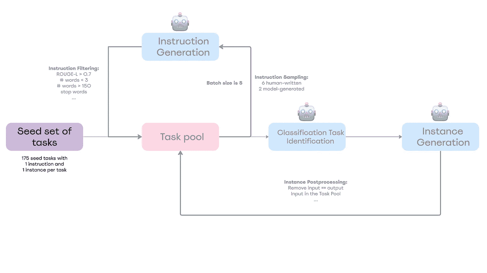
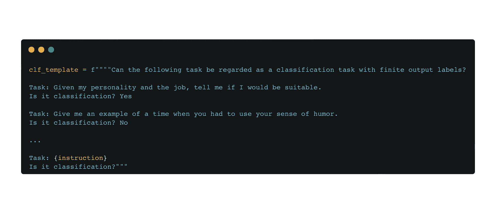
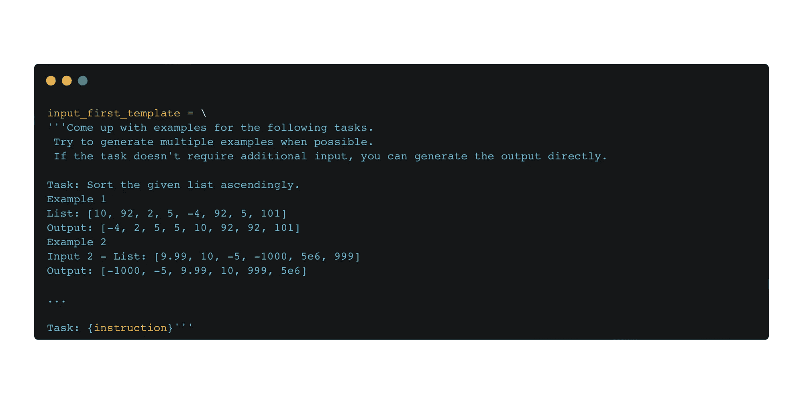

# Self-Instruct 框架，解释

> 原文：[`towardsdatascience.com/self-instruct-framework-explained-16bce90f4683?source=collection_archive---------10-----------------------#2024-03-05`](https://towardsdatascience.com/self-instruct-framework-explained-16bce90f4683?source=collection_archive---------10-----------------------#2024-03-05)

## 或者说，如何“消除”人工标注者

 [Tsiu-zhen-tsin Dmitrii](https://medium.com/@dmitry.tsyuzhentsin?source=post_page---byline--16bce90f4683--------------------------------)

·发布于[Towards Data Science](https://towardsdatascience.com/?source=post_page---byline--16bce90f4683--------------------------------) ·10 分钟阅读·2024 年 3 月 5 日

--

图像由 DALL·E 生成

# 动机

InstructGPT 的高级概述，包括人工标注输出和监督学习及奖励模型训练的排名 | 来源：[Training language models to follow instructions with human feedback](https://arxiv.org/pdf/2203.02155).

随着大语言模型（LLMs）彻底改变我们的生活，指令调优 LLMs 的增长面临着显著挑战：对大量、多样且高质量数据集的迫切需求。传统方法，如使用人工标注者生成数据集——这也是 InstructGPT（上图）采用的策略——面临着高成本、有限的多样性、创造性和一致性挑战。为了应对这些局限性，Self-Instruct 框架²应运而生。其核心理念简单而强大：让语言模型（LM）生成训练数据，从而实现更具成本效益、多样性和创造性的数据集。

因此，在本文中，我将引导你逐步了解框架的各个方面，展示所有细节，以便你在阅读后能够自己重现这些结果 :)

❗ 本文从代码的角度提供了所有步骤，因此请随时访问原始的[GitHub 仓库](https://github.com/yizhongw/self-instruct#) 。❗

# Self-Instruct 框架

Self-Instruct 框架的高级概述

该方法相对简单明了：

+   **步骤 0** — 定义指令数据：

    — 将高质量且多样的人工编写任务作为（指令，实例）元组添加到任务池中，涵盖不同领域；

+   **步骤 1 —** 指令生成：  

    — 从任务池中采样 8 个指令（6 个人工编写和 2 个模型生成）；  

    — 以少量示例的方式将自举生成的指令插入到提示中，并要求语言模型生成更多指令；  

    — 基于 ROUGE 指标（评估文本输出与参考文本之间相似度的一种方法）和一些启发式方法（稍后会详细说明）过滤生成的指令；  

    — 重复步骤 1，直到达到一定数量的指令；  

+   **步骤 2 —** 分类任务识别：  

    — 对于任务池中每个生成的指令，我们需要通过少量示例的方式识别其类型（分类任务或非分类任务）；  

+   **步骤 3 —** 实例生成：  

    — 给定指令和任务类型，生成实例（输入和输出），并根据启发式方法过滤它们；  

+   **步骤 4** — 微调语言模型以遵循指令：  

    — 利用生成的任务来微调预训练模型。  

Voilà，这就是 Self-Instruct 的工作原理，但关键在于细节，所以让我们深入了解每一个步骤！  

## 步骤 0 — 定义指令数据  

  

步骤 0  

让我们首先理解“任务种子”的初始内容：它包含 175 个种子任务（25 个分类任务和 150 个非分类任务），每个任务有**一个**指令和**一个**实例，覆盖不同领域。每个任务都有一个 id、名称、指令、实例（**输入和输出**）和一个 is_classification 二进制标志，用来识别任务是否具有有限的输出标签空间。  

这里有一些带有空输入字段和非空输入字段的分类和非分类任务示例：  

  

分类任务的非空输入示例

  

非分类任务的空输入示例  

因此，我们可以看到在第一个示例中，输入字段如何澄清并为更一般的指令提供上下文，而在第二个示例中，只要指令已经自包含，我们就不需要输入字段。此外，第一个示例是分类任务 —— 我们可以通过从有限的空间中分配一些标签来回答它，而对于第二个示例，我们则无法做到这一点。  

这一步是**至关重要**的，只要我们通过数据格式在数据集中鼓励任务多样性，并展示解决各种任务的正确方法。  

只要我们定义好指令格式，就将它们添加到任务池中，储存我们的最终数据集。  

## 步骤 1 — 指令生成  

  

步骤 1  

**采样与提示**  

通过向任务池添加人工编写的种子任务集，我们可以开始指令生成。为此，我们需要从任务池中采样 8 个指令（6 个人工编写和 2 个机器生成），并将它们编码为以下提示：  

  

提示生成新指令  

然而，在一开始，我们并没有任何机器生成的指令。因此，我们只需在提示中将其替换为空字符串。

生成后，我们从语言模型的响应中提取指令（通过正则表达式），过滤掉它们，并将过滤后的指令添加到任务池中：

指令生成步骤的伪代码

我们重复指令生成步骤，直到生成一定数量的机器生成指令（在步骤开始时指定的数量）。

**过滤**

为了获得一个多样化的数据集，我们需要定义某些指令是否会被添加到任务池中，最简单的方法是通过一组启发式选择的规则，例如：

+   过滤掉过短或过长的指令；

+   根据不适合语言模型的关键词（如图片、图表、文件、图示等）进行过滤；

+   过滤掉那些以标点符号开头的指令；

+   过滤掉那些以非英语字符开头的指令；

+   当其 ROUGE-L 相似度与任何现有指令的相似度大于 0.7 时，过滤掉这些指令；

## 第二步 — 分类任务识别

第二步

Self-Instruct 的作者注意到，根据不同的指令，语言模型可能会对某一个标签产生偏向，特别是在分类任务中。因此，为了消除这种偏向，我们需要通过少量示例提示对每个指令进行分类：

用于分类任务是否为分类任务或非分类任务的提示（此模板中使用了 12 个分类指令和 19 个非分类指令）

## 第三步 — 实例生成

第三步

在识别了指令类型后，我们最终可以生成输入和输出，考虑到我们有两种类型的指令（分类或非分类）。怎么做呢？**少量示例提示！**

对于非分类指令，我们要求模型首先生成输入，然后生成输出（**先输入法**），但对于分类任务，我们要求模型先生成输出（类别标签），然后基于输出生成输入（**先输出法**）。与第 0 步相比，我们不限制每个指令生成的实例数量。

用于实例生成的输入优先法提示

用于输出优先法实例生成的提示

生成后，我们提取实例并进行格式化（使用正则表达式）；格式化后，我们通过一些规则进行过滤，例如：

+   如果输入和输出相同，

+   如果实例已经在任务池中，

+   如果输出为空，

+   这些通常是生成不完整的指令，如果输入或输出以冒号结尾；

还有一些其他的启发式方法。最后，我们得到了以下示例，其中包含 1 条指令和 1 个实例：

实例生成示例

这就是 Self-Instruct 的主要思想！

## 步骤 4——对语言模型进行微调以遵循指令

完成所有前述步骤后，我们可以采用一个预训练的语言模型，并对其在生成的数据集上进行指令微调，从而获得更好的指标。

# 克服挑战

在文章的开头，我提到了一些“指令微调”语言模型面临的挑战；现在，让我们看看 Self-Instruct 如何帮助克服这些挑战。

## 数量

在仅有 175 个初始人工编写的任务的帮助下，生成了 52K 条指令和 82K 个实例：

来源：[Self-Instruct: Aligning Language Models with Self-Generated Instructions](https://arxiv.org/pdf/2212.10560)

## 多样性

为了调查生成数据集的多样性，《Self-Instruct》的作者使用了伯克利神经解析器（Berkley Neural Parser）来解析指令，然后提取与根词最接近的动词及其第一个直接名词对象。在 52K 条指令中，有 26K 条具有动词-名词格式，但另外 26K 条指令具有更复杂的结构（例如，“判断这条推文是否包含政治内容。”）或被构造为问题（例如，“以下哪些陈述是正确的？”）。

在生成的指令中，最常见的前 20 个根动词（内圈）及其前 4 个直接名词对象（外圈）| 来源：[Self-Instruct: Aligning Language Models with Self-Generated Instructions](https://arxiv.org/pdf/2212.10560)

## 质量

为了证明 Self-Instruct 能够生成高质量的任务，随机选择了 200 条生成的指令，并为每条指令抽取 1 个实例，然后框架的作者对这些任务进行了评估，得出了以下结果：

来源：[Self-Instruct: Aligning Language Models with Self-Generated Instructions](https://arxiv.org/pdf/2212.10560)

如我们所见，92%的任务描述了有效的任务，且 54%的任务包含了所有有效字段（考虑到我们生成了 52K 个任务，至少 26K 个将代表高质量数据，这是非常棒的！）

## **成本**

Self-Instruct 框架也带来了显著的成本优势。任务生成的初始阶段（步骤 1-3）仅需 600 美元，而最后一步使用 GPT-3 模型进行微调的成本为 338 美元。我们在查看结果时，必须记住这一点！

# 结果

Self-Instruct 如何提高在 SuperNI（**超级自然指令**）数据集上的 ROUGE-L 指标？为此，我们可以比较以下几种情况的结果：1) 没有任何指令微调的预训练语言模型（普通语言模型），2) 指令微调的模型（没有 SuperNI 的指令微调），以及 3) 在 SuperNI 数据集上训练的指令微调模型（有 SuperNI 的指令微调）：

来自 SuperNI 的***未见***任务的评估结果 | 来源：[Self-Instruct: Aligning Language Models with Self-Generated Instructions](https://arxiv.org/pdf/2212.10560)

正如我们所见，使用 Self-Instruct 在数据集（1）上展示了比原始模型高出 33%的绝对改进；同时，它还表明，使用该框架在微调 SuperNI 数据集（3）后，也能略微提高指标。

此外，如果我们创建一个新的（=未见的）数据集，包含 252 条指令和每条指令 1 个实例，并评估一系列指令调优版本，可以看到以下结果：

GPT3 模型及其指令调优版本，在我们 252 条用户导向的指令上经过人类专家评估的表现 | 来源：[Self-Instruct: Aligning Language Models with Self-Generated Instructions](https://arxiv.org/pdf/2212.10560)

GPT3 + Self-Instruct 与其他指令调优版本相比，表现出了令人印象深刻的结果，但与 InstructGPT（OpenAI 之前发布的 LLM）版本相比，仍有提升空间。

# 增强功能

Self-Instruct 背后的理念简单直接，但同时也非常有说服力，因此让我们看看如何在不同的场景中使用它。

## 斯坦福 Alpaca³

2023 年，斯坦福大学的 Alpaca LLM 因其低廉的成本、易得性以及开发成本不到 600 美元而引起了极大的关注，同时，它结合了 LLaMA 和 Self-Instruct 的理念。

Alpaca 的高层概述 | 来源：[Alpaca: A Strong, Replicable Instruction-Following Model](https://crfm.stanford.edu/2023/03/13/alpaca.html)

Alpaca 版本的 Self-Instruct 略有修改：

+   第一步（指令生成）：应用了更为激进的批量解码，即一次生成 20 条指令

+   第二步（分类任务）：此步骤完全被排除

+   第三步（实例生成）：每条指令仅生成一个实例

最终，斯坦福大学的研究人员通过在 Self-Instruct 中的设置取得了显著的改进，并且进行了盲对比测试，比较了 text-davinci-003（InstructGPT-003）和 Alpaca 7B：在 90 对 89 的比较中，Alpaca 战胜了 text-davinci-003。

## 自奖励语言模型⁴

来源：[Self-Rewarding Language Models](https://arxiv.org/pdf/2401.10020)

在 2024 年，Self-Instruct 是一种在更复杂的设置中使用的实用框架，比如 Meta 的自奖励语言模型中。如同 Self-Instruct 一样，最初我们有一组人工编写的任务；然后我们生成新的指令 {xᵢ} 并提示模型 Mₜ 生成输出 {yᵢ¹, …, yᵢᵏ}，接着生成奖励 {rᵢ¹, …, rᵢᵏ} — 这就是通过自指令过程在 InstructGPT 中“消除”人工标注员的方式。Self-Rewarding 模型的最后一个步骤是指令跟随训练——在这个步骤中，我们构造偏好对并通过 DPO 训练 Mₜ₊₁ —— 下一代模型。因此，我们可以反复执行这个过程，以丰富数据集并改善初始的预训练模型。

# 探索局限性

虽然 Self-Instruct 提供了一种创新的自主管理数据集生成的方法，但它对大型预训练模型的依赖引入了潜在的局限性。

## 数据质量

尽管在生成合成数据方面展现了令人印象深刻的能力，但质量——在“克服挑战”部分标注为 54%的有效性——仍然是一个关注点。这凸显了一个关键问题：预训练模型中固有的偏差可能在生成的数据集中复制，甚至放大。

## 尾现象

指令的频率各不相同：一些指令被频繁请求，而另一些则较为罕见。然而，管理这些不常见的请求至关重要，因为它们揭示了 LLM 在处理不常见和创意任务时的脆弱性。

# 结论

总结来说，Self-Instruct 框架代表了在开发指令调优语言模型方面的一个进步，提供了一种创新的解决方案来应对数据集生成的挑战。使 LLM 能够自主生成多样化且高质量的数据，显著降低了对人工标注员的依赖，从而减少了成本。

除非另有说明，所有图像均由作者提供，灵感来自 [Self-Instruct](https://arxiv.org/pdf/2212.10560) :)

# **参考文献：**

[1] Ouyang, Long 等. “[训练语言模型跟随指令并获得人类反馈](https://arxiv.org/pdf/2203.02155)”。 *神经信息处理系统进展* 35 (2022): 27730–27744

[2] Wang, Y., Kordi, Y., Mishra, S., Liu, A., Smith, N.A., Khashabi, D. 和 Hajishirzi, H., 2022\. [Self-Instruct：使语言模型与自生成指令对齐](https://arxiv.org/pdf/2212.10560)。 *arXiv 预印本 arXiv:2212.10560*。

[3] Taori, R., Gulrajani, I., Zhang, T., Dubois, Y., Li, X., Guestrin, C., Liang, P. 和 Hashimoto, T.B., 2023\. [斯坦福 Alpaca：一种指令跟随的 Llama 模型](https://crfm.stanford.edu/2023/03/13/alpaca.html)。

[4] Yuan, W., Pang, R.Y., Cho, K., Sukhbaatar, S., Xu, J. 和 Weston, J., 2024\. [自奖励语言模型](https://arxiv.org/pdf/2401.10020)。 *arXiv 预印本 arXiv:2401.10020*。
