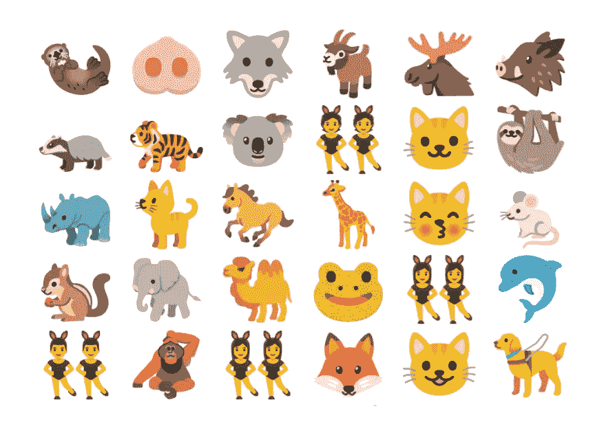
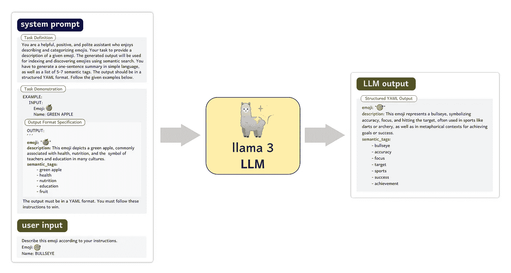
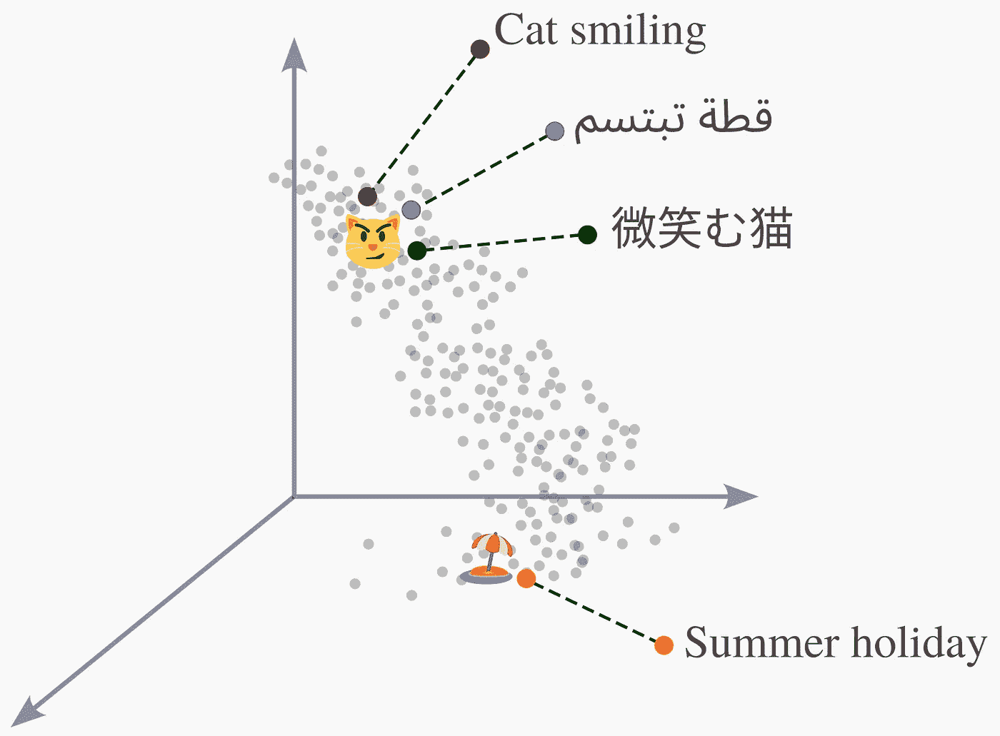

# 使用 AI 😊🌍🚀开发一个支持 50 多种语言的表情符号语义搜索引擎

> 原文：[`towardsdatascience.com/semantic-search-for-emojis-in-50-languages-using-ai-f85a36a86f21?source=collection_archive---------7-----------------------#2024-07-17`](https://towardsdatascience.com/semantic-search-for-emojis-in-50-languages-using-ai-f85a36a86f21?source=collection_archive---------7-----------------------#2024-07-17)

## 使用 Python 和开源 NLP 库开发一个 AI 驱动的表情符号语义搜索引擎

[](https://medium.com/@badr.alabsi?source=post_page---byline--f85a36a86f21--------------------------------)[](https://towardsdatascience.com/?source=post_page---byline--f85a36a86f21--------------------------------) [Badr Alabsi, 博士](https://medium.com/@badr.alabsi?source=post_page---byline--f85a36a86f21--------------------------------)

·发表于[Towards Data Science](https://towardsdatascience.com/?source=post_page---byline--f85a36a86f21--------------------------------) ·阅读时长 12 分钟·2024 年 7 月 17 日

--



如果你常用社交媒体，如 Twitter 或 LinkedIn，你可能注意到表情符号在非正式和正式的文本交流中被创造性地使用。例如，*火箭* 🚀 表情符号常在 LinkedIn 上表示高远的抱负和雄心壮志，而*靶心* 🎯 表情符号则用于表示目标达成。尽管表情符号的创造性使用日益增长，但大多数社交媒体平台缺乏帮助用户选择合适表情符号以有效传达信息的工具。因此，我决定投入时间开发一个名为 Emojeez 💎的项目，它是一个 AI 驱动的表情符号搜索和检索引擎。你可以通过这个有趣的互动[演示](https://emojeez.streamlit.app/)体验 Emojeez 💎。

在这篇文章中，我将讨论我的经验，并解释我如何运用先进的**自然语言处理**（NLP）技术开发一个**语义搜索引擎**用于表情符号。具体来说，我将展示一个基于嵌入的语义搜索案例，并按以下步骤进行讲解

1.  如何使用**大语言模型** 🦜生成语义丰富的表情符号描述

1.  如何使用 Hugging Face 🤗 **Transformers**进行多语言嵌入

1.  如何集成**Qdrant** 🧑🏻‍🚀向量数据库以执行高效的语义搜索

我已将该项目的完整代码上传至[GitHub](https://github.com/badrex/emojeez)。

# 灵感💡

每一个新想法通常都始于一闪而过的灵感。对我来说，这个灵感来自 Luciano Ramalho 的书《*流畅的 Python*》。这是一本非常棒的书，强烈推荐给所有喜欢编写真正 Pythonic 代码的人。在书的第四章，Luciano 展示了如何通过查询 Unicode 标准中的字符名称来搜索 Unicode 字符。他创建了一个 Python 工具，它能够处理像“cat smiling”这样的查询，检索所有名称中同时包含“cat”和“smiling”的 Unicode 字符。对于“cat smiling”这个查询，该工具可以检索到三个表情符号：😻、😺 和 😸。很酷，对吧？

从那里开始，我开始思考如何利用现代人工智能技术来构建一个更好的表情符号搜索工具。所谓的“更好”，我设想的是一个不仅覆盖更多表情符号，还能支持多语言用户查询的搜索引擎，超越英语。

# 关键词搜索的局限性 😓

如果你是表情符号爱好者，你一定知道，😻、😺 和 😸 不是唯一的笑脸猫表情符号。确实有些猫咪表情符号是缺失的，特别是 😸 和 😹。这是关键词搜索算法的一个已知限制，关键词搜索依赖于字符串匹配来检索相关项目。关键词搜索或**词汇搜索**算法，在信息检索领域被认为**精确度高**，但**召回率低**。高精度意味着检索到的项目通常与用户查询匹配得很好。另一方面，低召回率意味着算法可能不会检索到所有相关项目。在许多情况下，较低的召回率是由于字符串匹配造成的。例如，表情符号 😹 的名字中没有“smiling”（微笑）——*带着喜悦的泪水的猫*。因此，如果我们搜索“猫”和“微笑”这两个词，它就无法被检索到。

词汇搜索的另一个问题是，它通常是**语言特定的**。在 Luciano 的《流畅的 Python》例子中，你无法使用其他语言的查询来查找表情符号，因为所有 Unicode 字符，包括表情符号，都是用英语命名的。为了支持其他语言，我们需要先通过机器翻译将每个查询转换成英语。这会增加更多的复杂性，并且可能并不适用于所有语言。

不过，嘿，已经是 2024 年了，人工智能取得了长足的进步。现在我们已经有了应对这些限制的解决方案。在本文的其余部分，我将向你展示如何实现。

# 基于嵌入的语义搜索 ✨

近年来，随着深度神经网络在自然语言处理（NLP）领域的普及，出现了一种新的搜索范式。在这种范式中，搜索算法不再关注构成搜索数据库或查询的字符串。相反，它基于文本的数值表示进行操作，这些表示被称为**向量嵌入**。在基于嵌入的搜索算法中，无论是文本文档还是视觉图像，搜索项首先会被转换为向量空间中的数据点，以便**语义相关**的项彼此接近。嵌入技术使我们能够基于表情符号描述的意义而非名称中的关键词执行相似性搜索。由于它们基于**语义相似性**而非关键词相似性来检索项，基于嵌入的搜索算法被称为语义搜索。

使用语义搜索进行表情符号检索解决了两个问题：

1.  我们可以超越关键词匹配，利用表情符号描述与用户查询之间的语义相似性。这提高了检索到的表情符号的覆盖率，从而提高了召回率。

1.  如果我们将表情符号表示为**多语言嵌入**空间中的数据点，我们就可以支持用英语以外的语言编写的用户查询，而无需翻译成英语。这是不是很酷？让我们来看看 👀

# 第一步：使用 LLM 生成丰富的表情符号描述 🦜

如果你使用社交媒体，你可能知道很多表情符号几乎从未按字面意思使用。例如，🍆和🍑很少表示*茄子*和*桃子*。社交媒体用户在给表情符号赋予超越字面意义的含义时非常有创意。这种创意限制了 Unicode 标准中表情符号名称的表达性。一个显著的例子是🌈表情符号，它在 Unicode 名称中简单地被描述为*彩虹*，然而它通常在与多样性、和平和 LGBTQ+社区相关的语境中使用。

为了构建一个有用的搜索引擎，我们需要为每个表情符号生成一个丰富的语义描述，定义该表情符号代表什么以及它象征什么。鉴于当前 Unicode 标准中有超过 5000 个表情符号，手动完成这一任务是不可行的。幸运的是，我们可以利用**大型语言模型**（LLM）来帮助我们为每个表情符号生成元数据。由于 LLM 是基于整个互联网进行训练的，它们很可能已经见识过每个表情符号在不同语境中的使用方式。

对于这项任务，我使用了🦙 [**Llama 3**](https://huggingface.co/meta-llama/Meta-Llama-3-8B-Instruct)大型语言模型（LLM）为每个表情符号生成元数据。我编写了一个提示，定义了任务和 LLM 需要执行的操作。如下面的图所示，LLM 为*靶心*🎯表情符号生成了丰富的语义描述。这些描述相比于 Unicode 名称，更适合进行语义搜索。我将 LLM 生成的描述发布为 Hugging Face [数据集](https://huggingface.co/datasets/badrex/llm-emoji-dataset)。



使用 Llama 3 LLM 生成表情符号的丰富语义描述。

# 第 2 步：使用句子变换器将表情符号表示为嵌入 🔄

现在，我们拥有了每个表情符号在 Unicode 标准中的丰富语义描述，下一步是将每个表情符号表示为一个向量嵌入，位于一个多维空间中，该空间捕捉了表情符号描述的含义。为此任务，我使用了基于**BERT**架构的多语言变换器，并针对 50 种语言的句子相似性进行了微调。您可以在 Hugging Face 🤗库中的模型[卡片](https://huggingface.co/sentence-transformers/paraphrase-multilingual-MiniLM-L12-v2)上查看支持的语言。

到目前为止，我只讨论了由 LLM 生成的表情符号描述的嵌入，这些描述是英文的。但是，我们如何支持英文以外的语言呢？

好的，接下来就是多语言变换器的魔力所在。通过嵌入空间本身启用了多语言支持。这意味着我们可以用任何 50 种支持的语言输入用户查询，并根据它们的英文描述将查询与表情符号匹配。多语言句子编码器（或嵌入模型）将语义相似的文本短语映射到其嵌入空间中的相邻点。让我通过以下插图来展示我的意思。



这是一个多语言嵌入空间的视觉示意图，其中句子和短语根据其语义相似性在几何上组织，无论文本语言如何。图中的阿拉伯语和中文文本是“Cat smiling”短语的字面翻译。

在上面的图中，我们看到语义相似的短语最终成为嵌入空间中相邻的数据点，即使它们是用不同的语言表达的。多语言句子变换器使**跨语言搜索**应用成为可能，因此用户查询和索引的搜索项不必使用相同的语言。

# 第 3 步：集成 Qdrant 的向量数据库 🧑🏻‍🚀

一旦我们将表情符号表示为向量嵌入，下一步就是在这些嵌入上构建索引，以便进行高效的搜索操作。为此，我选择了使用**Qdrant**，这是一个开源的向量相似性搜索引擎，提供高性能的搜索功能。

为此任务设置 Qdrant 非常简单，下面是代码片段（您还可以查看这个 Jupyter [Notebook](https://github.com/badrex/emojeez/blob/main/notebooks/emoji_search_notebook.ipynb)）。

```py
# Load the emoji dictionary from a pickle file
with open(file_path, 'rb') as file:
    emoji_dict: Dict[str, Dict[str, Any]] = pickle.load(file)

# Setup the Qdrant client and populate the database
vector_DB_client = QdrantClient(":memory:")

embedding_dict = {
    emoji: np.array(metadata['embedding']) 
    for emoji, metadata in emoji_dict.items()
}

# Remove the embeddings from the dictionary so it can be used 
# as payload in Qdrant
for emoji in list(emoji_dict):
    del emoji_dict[emoji]['embedding']

embedding_dim: int = next(iter(embedding_dict.values())).shape[0]

# Create a new collection in Qdrant
vector_DB_client.create_collection(
    collection_name="EMOJIS",
    vectors_config=models.VectorParams(
        size=embedding_dim, 
        distance=models.Distance.COSINE
    ),
)

# Upload vectors to the collection
vector_DB_client.upload_points( 
    collection_name="EMOJIS",
    points=[
        models.PointStruct(
            id=idx, 
            vector=embedding_dict[emoji].tolist(),
            payload=emoji_dict[emoji]
        )
        for idx, emoji in enumerate(emoji_dict)
    ],
)
```

现在，搜索索引*vector_DB_client*已准备好接受查询。我们需要做的就是将用户查询转换为向量嵌入，使用与我们嵌入表情符号描述时相同的嵌入模型。这个过程可以通过下面的函数完成。

```py
def retrieve_relevant_emojis(
        embedding_model: SentenceTransformer,
        vector_DB_client: QdrantClient,
        query: str, 
        num_to_retrieve: int) -> List[str]:
    """
    Return emojis relevant to the query using sentence encoder and Qdrant. 
    """

    # Embed the query
    query_vector = embedding_model.encode(query).tolist()

    hits = vector_DB_client.search(
        collection_name="EMOJIS",
        query_vector=query_vector,
        limit=num_to_retrieve,
    )

    return hits
```

为了进一步展示检索到的表情符号、它们与查询的相似度分数以及它们的 Unicode 名称，我编写了以下辅助函数。

```py
def show_top_10(query: str) -> None:
    """
    Show emojis that are most relevant to the query.
    """
    emojis = retrieve_relevant_emojis(
        sentence_encoder, 
        vector_DB_clinet, 
        query, 
        num_to_retrieve=10
    )

    for i, hit in enumerate(emojis, start=1):

        emoji_char = hit.payload['Emoji']
        score = hit.score

        space = len(emoji_char) + 3

        unicode_desc = ' '.join(
           em.demojize(emoji_char).split('_')
        ).upper()

        print(f"{i:<3} {emoji_char:<{space}}", end='')
        print(f"{score:<7.3f}", end= '')
        print(f"{unicode_desc[1:-1]:<55}")
```

现在一切都准备好了，我们可以看几个例子。还记得 Luciano 书中的“猫咪微笑”查询吗？让我们看看语义搜索与关键词搜索有何不同。

```py
>>> show_top_10('cat smiling')
1   😼   0.651  CAT WITH WRY SMILE                                     
2   😸   0.643  GRINNING CAT WITH SMILING EYES                         
3   😹   0.611  CAT WITH TEARS OF JOY                                  
4   😻   0.603  SMILING CAT WITH HEART-EYES                            
5   😺   0.596  GRINNING CAT                                           
6   🐱   0.522  CAT FACE                                               
7   🐈   0.513  CAT                                                    
8   🐈‍⬛   0.495  BLACK CAT                                              
9   😽   0.468  KISSING CAT                                            
10  🐆   0.452  LEOPARD
```

太棒了！不仅仅是像 😸、😺 和 😻 这样的猫咪表情符号被关键词搜索检索到，语义搜索还检索出了微笑的猫咪表情符号 😼、😹、🐱 和 😽。这展示了我之前提到的更高召回率或更广泛的检索覆盖面。的确，更多的猫咪总是更好！

# 语义搜索的真正力量 🪄

前面的“猫咪微笑”示例展示了基于嵌入的语义搜索如何能够检索到更广泛、更有意义的项目，从而改善整体的搜索体验。然而，我认为这个例子并没有真正展示语义搜索的强大功能。

想象一下你在寻找某样东西，但你不知道它的名字。例如，拿 🧿 这个物品来说。你知道它在英语中叫什么吗？我当时是完全不知道。但我对它还是有些了解。在中东和中亚文化中，🧿 被认为能够保护人们免受“恶眼”的伤害。所以，我知道它的作用，但不知道它的名字。

让我们通过描述“防止恶眼”来尝试用搜索引擎找到 🧿 这个表情符号。

```py
>>> show_top_10('protect from evil eye')
1   🧿   0.409  NAZAR AMULET                                           
2   👓   0.405  GLASSES                                                
3   🥽   0.387  GOGGLES                                                
4   👁   0.383  EYE                                                    
5   🦹🏻   0.382  SUPERVILLAIN LIGHT SKIN TONE                           
6   👀   0.374  EYES                                                   
7   🦹🏿   0.370  SUPERVILLAIN DARK SKIN TONE                            
8   🛡️   0.369  SHIELD                                                 
9   🦹🏼   0.366  SUPERVILLAIN MEDIUM-LIGHT SKIN TONE                    
10  🦹🏻‍♂   0.364  MAN SUPERVILLAIN LIGHT SKIN TONE 
```

结果出来了！原来 🧿 其实叫做 *Nazar Amulet*（纳扎护符）。我学到了一些新知识 😄

# 超越英语 🌍 🌏 🌎

我特别希望这个搜索引擎有一个功能，那就是它能够支持尽可能多的语言，除了英语之外。到目前为止，我们还没有测试过这个功能。让我们通过将“防止恶眼”的短语翻译成其他语言并逐一作为查询来测试其多语言能力。以下是一些语言的结果。

# 阿拉伯语

```py
>>> show_top_10('يحمي من العين الشريرة') # Arabic
1   🧿   0.442  NAZAR AMULET                                           
2   👓   0.430  GLASSES                                                
3   👁   0.414  EYE                                                    
4   🥽   0.403  GOGGLES                                                
5   👀   0.403  EYES                                                   
6   🦹🏻   0.398  SUPERVILLAIN LIGHT SKIN TONE                           
7   🙈   0.394  SEE-NO-EVIL MONKEY                                     
8   🫣   0.387  FACE WITH PEEKING EYE                                  
9   🧛🏻   0.385  VAMPIRE LIGHT SKIN TONE                                
10  🦹🏼   0.383  SUPERVILLAIN MEDIUM-LIGHT SKIN TONE
```

# 德语

```py
>>> show_top_10('Vor dem bösen Blick schützen') # Deutsch 
1   😷   0.369  FACE WITH MEDICAL MASK                                 
2   🫣   0.364  FACE WITH PEEKING EYE                                  
3   🛡️   0.360  SHIELD                                                 
4   🙈   0.359  SEE-NO-EVIL MONKEY                                     
5   👀   0.353  EYES                                                   
6   🙉   0.350  HEAR-NO-EVIL MONKEY                                    
7   👁   0.346  EYE                                                    
8   🧿   0.345  NAZAR AMULET                                           
9   💂🏿‍♀️   0.345  WOMAN GUARD DARK SKIN TONE                             
10  💂🏿‍♀   0.345  WOMAN GUARD DARK SKIN TONE
```

# 希腊语

```py
>>> show_top_10('Προστατέψτε από το κακό μάτι') #Greek
1   👓   0.497  GLASSES                                                
2   🥽   0.484  GOGGLES                                                
3   👁   0.452  EYE                                                    
4   🕶️   0.430  SUNGLASSES                                             
5   🕶   0.430  SUNGLASSES                                             
6   👀   0.429  EYES                                                   
7   👁️   0.415  EYE                                                    
8   🧿   0.411  NAZAR AMULET                                           
9   🫣   0.404  FACE WITH PEEKING EYE                                  
10  😷   0.391  FACE WITH MEDICAL MASK
```

# 保加利亚语

```py
>>> show_top_10('Защитете от лошото око') # Bulgarian
1   👓   0.475  GLASSES                                                
2   🥽   0.452  GOGGLES                                                
3   👁   0.448  EYE                                                    
4   👀   0.418  EYES                                                   
5   👁️   0.412  EYE                                                    
6   🫣   0.397  FACE WITH PEEKING EYE                                  
7   🕶️   0.387  SUNGLASSES                                             
8   🕶   0.387  SUNGLASSES                                             
9   😝   0.375  SQUINTING FACE WITH TONGUE                             
10  🧿   0.373  NAZAR AMULET
```

# 中文

```py
>>> show_top_10('防止邪眼') # Chinese
1   👓   0.425  GLASSES                                                
2   🥽   0.397  GOGGLES                                                
3   👁   0.392  EYE                                                    
4   🧿   0.383  NAZAR AMULET                                           
5   👀   0.380  EYES                                                   
6   🙈   0.370  SEE-NO-EVIL MONKEY                                     
7   😷   0.369  FACE WITH MEDICAL MASK                                 
8   🕶️   0.363  SUNGLASSES                                             
9   🕶   0.363  SUNGLASSES                                             
10  🫣   0.360  FACE WITH PEEKING EYE
```

# 日语

```py
>>> show_top_10('邪眼から守る') # Japanese 
1   🙈   0.379  SEE-NO-EVIL MONKEY                                     
2   🧿   0.379  NAZAR AMULET                                           
3   🙉   0.370  HEAR-NO-EVIL MONKEY                                    
4   😷   0.363  FACE WITH MEDICAL MASK                                 
5   🙊   0.363  SPEAK-NO-EVIL MONKEY                                   
6   🫣   0.355  FACE WITH PEEKING EYE                                  
7   🛡️   0.355  SHIELD                                                 
8   👁   0.351  EYE                                                    
9   🦹🏼   0.350  SUPERVILLAIN MEDIUM-LIGHT SKIN TONE                    
10  👓   0.350  GLASSES
```

对于阿拉伯语、德语、希腊语、保加利亚语、中文和日语等如此多样的语言，🧿 表情符号总是出现在前十名中！这真是太吸引人了，因为这些语言拥有不同的语言特征和书写系统，这要归功于我们强大的多语言 🤗 句子变换器。

# 人工智能的局限性 🙈

最后我要提到的是，任何技术，无论多么先进，都不完美。语义搜索对于提高信息检索系统的召回率非常有帮助。这意味着即使查询和搜索索引中的项目之间没有关键词重叠，我们也能检索到更多相关的项目。然而，这也以牺牲精确度为代价。记住在🧿表情符号示例中的情况，在某些语言中，我们想要找到的表情符号没有出现在前五个结果中。对于这个应用来说，这并不是一个大问题，因为即使它排在第 50 位，我们快速浏览表情符号找到所需的一个也不需要太多认知负担。但在其他情况中，比如搜索长文档，用户可能没有耐心，也没有资源浏览数十篇文档。在构建搜索引擎时，开发人员需要考虑用户的认知能力以及资源限制。我为 Emojeez 💎搜索引擎做出的某些设计选择可能在其他应用中效果并不理想。

还有一点需要提到的是，已知 AI 模型会从训练数据中学习到**社会文化偏见**。大量文献研究表明，现代语言技术如何能够放大**性别刻板印象**并对**少数群体**不公。因此，我们需要意识到这些问题，并在将 AI 应用于现实世界时尽力解决它们。如果你在 Emojeez 💎中发现了此类不良偏见和不公行为，请告诉我，我会尽力处理。

# 结论

在 Emojeez 💎项目的开发过程中，我经历了一段迷人的旅程，学到了很多关于如何利用现代 AI 和自然语言处理技术来解决传统关键词搜索的局限性。通过利用大语言模型来丰富表情符号的元数据、多语言转换模型来创建语义嵌入，以及使用 Qdrant 进行高效的向量搜索，我成功创建了一个使表情符号搜索更加有趣且在 50 多种语言中可访问的搜索引擎。虽然这个项目主要聚焦于表情符号搜索，但其底层技术在多模态搜索和推荐系统中也有潜在应用。

对于精通英语以外语言的读者，我特别希望听到你们的反馈。Emojeez 💎在英语和你的母语中表现是否同样出色？你是否注意到在质量或准确性上的差异？请试试看，告诉我你的想法。你的见解对我来说非常宝贵。

感谢阅读，我希望你能像我在构建 Emojeez 💎时一样享受探索它的乐趣。

祝你愉快地搜索表情符号！📆😊🌍🚀

*注意：除非另有说明，所有图片均由作者创作。*
